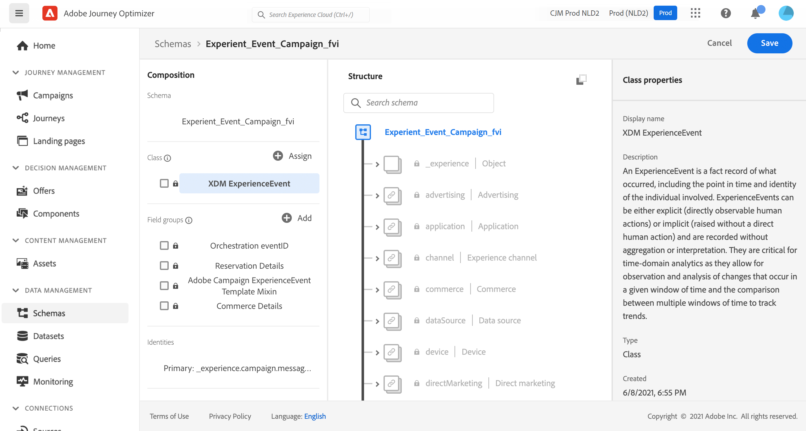

# Over ExperienceEvent-schema&#39;s voor [!DNL Journey Optimizer] -gebeurtenissen {#about-experienceevent-schemas}

[!DNL Journey Optimizer] -gebeurtenissen zijn XDM Experience Events die via Streaming Ingestie naar Adobe Experience Platform worden verzonden.

Daarom is een belangrijke voorwaarde voor het instellen van gebeurtenissen voor [!DNL Journey Optimizer] dat u bekend bent met het Adobe Experience Platform Experience Data Model (of XDM) en hoe u XDM Experience Event-schema&#39;s kunt samenstellen en hoe u XDM-gegevens kunt streamen naar Adobe Experience Platform.

>[!CAUTION]
>
>Opzoekingen naar ervaringsgebeurtenissen in reisomstandigheden worden niet meer ondersteund. Zoek hier naar alternatieve best practices. Neem contact op met uw Adobe-vertegenwoordiger als u een kwestie hebt die aanleiding geeft tot het gebruik van een reis en die nog steeds zoekopdrachten voor Experience Events nodig heeft en die niet door de vermelde alternatieven kan worden ondersteund. Wij helpen u bij het bereiken van uw doel.
>
>De toegang tot de context vanaf het begin van een reis wordt niet beïnvloed.

## Schemavereisten voor [!DNL Journey Optimizer] gebeurtenissen  {#schema-requirements}

De eerste stap bij het instellen van een gebeurtenis voor [!DNL Journey Optimizer] is ervoor te zorgen dat u een XDM-schema hebt gedefinieerd om de gebeurtenis te vertegenwoordigen, en een dataset die is gemaakt om instanties van de gebeurtenis op Adobe Experience Platform op te nemen. Het hebben van een dataset voor uw gebeurtenissen is niet strikt noodzakelijk, maar het verzenden van de gebeurtenissen naar een specifieke dataset zal u toestaan om de de gebeurtenisgeschiedenis van gebruikers voor toekomstige verwijzing en analyse te handhaven, zodat is het altijd een goed idee. Als u nog geen geschikt schema en een geschikte dataset voor uw gebeurtenis hebt, kunnen beide taken in de Webinterface van Adobe Experience Platform worden gedaan.

Elk XDM-schema dat voor [!DNL Journey Optimizer] -gebeurtenissen wordt gebruikt, moet aan de volgende vereisten voldoen:

* Het schema moet van de klasse XDM ExperienceEvent zijn.

  

* Voor systeem-geproduceerde gebeurtenissen, moet het schema de Orchestration eventID gebiedsgroep omvatten. [!DNL Journey Optimizer] gebruikt dit veld om gebeurtenissen te identificeren die tijdens reizen worden gebruikt.

  

* Declareer een identiteitsveld voor het identificeren van afzonderlijke profielen in de gebeurtenis. Als er geen identiteit is opgegeven, kan een identiteitskaart worden gebruikt. Dit wordt niet aanbevolen.

  

* Als u deze gegevens voor profiel beschikbaar wilt hebben, merk het schema en de dataset voor profiel. [Meer informatie](../data/lookup-aep-data.md)

  

  

* U kunt gegevensvelden vrij gebruiken om andere contextgegevens vast te leggen die u met de gebeurtenis wilt opnemen, zoals informatie over de gebruiker, het apparaat waaruit de gebeurtenis is gegenereerd, de locatie of andere betekenisvolle omstandigheden die met de gebeurtenis verband houden.

  

  

<!--
## Leverage schema relationships{#leverage_schema_relationships}

Adobe Experience Platform allows you to define relationships between schemas in order to use one dataset as a lookup table for another. 

Let's say your brand data model has a schema capturing purchases. You also have a schema for the product catalog. You can capture the product ID in the purchase schema and use a relationship to look up more complete product details from the product catalog. This allows you to create an audience for all customers who bought a laptop, for example, without having to explicitly list out all laptop IDs or capture every single product details in transactional systems.

To define a relationship, you need to have a dedicated field in the source schema, in this case the product ID field in the purchase schema. This field needs to reference the product ID field in the destination schema. The source and destination tables must be enabled for profiles and the destination schema must have that common field defined as its primary identity. 

Here is the product catalog schema enabled for profile with the product ID defined as the primary identity. 

Here is the purchase schema with the relationship defined on the product ID field.

>[!NOTE]
>
>Learn more about schema relationships in the [Experience Platform documentation](https://experienceleague.adobe.com/docs/platform-learn/tutorials/schemas/configure-relationships-between-schemas.html?lang=nl-NL).

In Journey Optimizer, you can then leverage all the fields from the linked tables:

* when configuring a business or unitary event, [Read more](../event/experience-event-schema.md#unitary_event_configuration) 
* when using conditions in a journey, [Read more](../event/experience-event-schema.md#journey_conditions_using_event_context) 
* in message personalization, [Read more](../event/experience-event-schema.md#message_personalization) 
* in custom action personalization, [Read more](../event/experience-event-schema.md#custom_action_personalization_with_journey_event_context) 

### Arrays{#relationships_limitations}

You can define a schema relationship on an array of strings, for example, a list of product IDs.

You can also define a schema relationship with an attribute inside of an array of objects, for example a list of purchase information (product ID, product name, price, discount). The lookup values will be available in journeys (conditions, custom actions, etc.) and message personalization. 

### Event configuration{#unitary_event_configuration}

The linked schema fields are available in unitary and business event configuration:

* when browsing through the event schema fields in the event configuration screen.
* when defining a condition for system-generated events.

The linked fields are not available:

* in the event key formula
* in event id condition (rule-based events)

To learn how to configure a unitary event, refer to this [page](../event/about-creating.md).

### Journey conditions using event context{#journey_conditions_using_event_context}

You can use data from a lookup table linked to an event used in a journey for condition building (expression editor).

Add a condition in a journey, edit the expression and unfold the event node in the expression editor. 

To learn how to define journey conditions, refer to this [page](../building-journeys/condition-activity.md).

### Message personalization{#message_personalization}

The linked fields are available when personalizing a message. The related fields are displayed in the context passed from the journey to the message.

To learn how to personalize a message with contextual journey information, refer to this [page](../personalization/personalization-use-case.md).

### Custom action personalization with journey event context{#custom_action_personalization_with_journey_event_context}

The linked fields are available when configuring the action parameters of a journey custom action activity. 

To learn how to use custom actions, refer to this [page](../building-journeys/using-custom-actions.md).
-->
