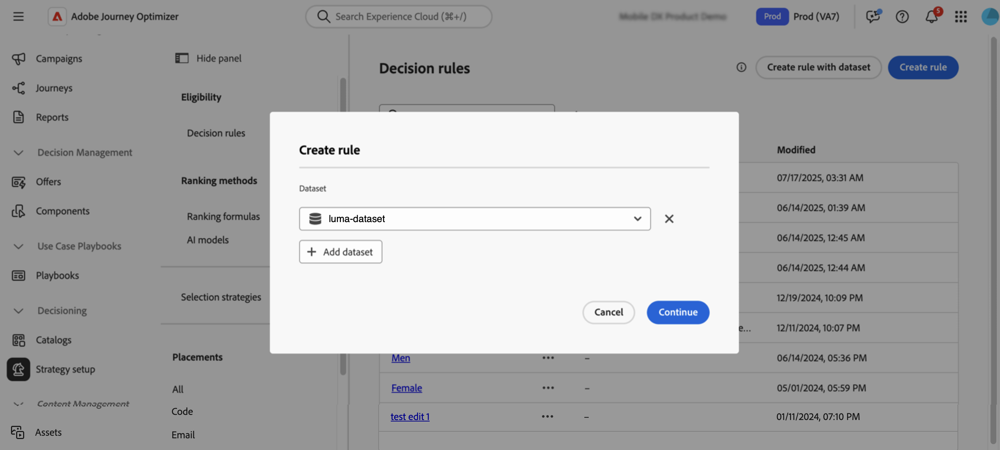

# Adobe Experience Platform-gegevens gebruiken voor besluitvorming {#aep-data}

>[!CONTEXTUALHELP]
>id="ajo_exd_catalogs_dataset"
>title="Opzoeken gegevensset"
>abstract="Als u kenmerken van Adobe Experience Platform wilt gebruiken voor besluitvorming, moet u een toewijzing maken om te definiëren hoe de Adobe Experience Platform-gegevensset wordt gekoppeld aan gegevens in [!DNL Journey Optimizer] ."

>[!CONTEXTUALHELP]
>id="ajo_exd_catalogs_dataset_create"
>title="Opzoeken gegevensset"
>abstract="Selecteer de dataset met de attributen u onder alle datasets van Adobe Experience Platform nodig hebt die voor raadpleging zijn toegelaten, dan selecteer een kaartsleutel (b.v., vluchtaantal of klant identiteitskaart) die in zowel de attributen van het besluitvormingspunt als de dataset bestaat."

>[!CONTEXTUALHELP]
>id="ajo_exd_rules_dataset_lookup"
>title="Gegevensset opzoeken"
>abstract="Selecteer de Adobe Experience Platform-gegevensset met de kenmerken die u nodig hebt. Als de dataset niet in de lijst toont, zorg ervoor u het voor raadpleging hebt toegelaten en u hebt een afbeelding van de datasetraadpleging gecreeerd."

>[!CONTEXTUALHELP]
>id="ajo_exd_formula_dataset_lookup"
>title="Gegevensset opzoeken"
>abstract="Gebruik [!DNL Adobe Experience Platform] datasetkenmerken om de waarderingslogica dynamisch aan te passen aan de omstandigheden in de praktijk. Klik op **[!UICONTROL Add dataset]** om de Adobe Experience Platform-gegevensset te selecteren met de kenmerken die u nodig hebt. Als de dataset niet in de lijst toont, zorg ervoor u het voor raadpleging hebt toegelaten en u hebt een afbeelding van de datasetraadpleging gecreeerd."

>[!CONTEXTUALHELP]
>id="ajo_exd_item_capping_dataset"
>title="Gegevensset toevoegen"
>abstract="Gebruik [!DNL Adobe Experience Platform] -gegevenssetkenmerken om afdekkende criteria te definiëren op basis van dynamische, externe kenmerken. Klik op **[!UICONTROL Add dataset]** om de Adobe Experience Platform-gegevensset te selecteren met de kenmerken die u nodig hebt. Als de dataset niet in de lijst toont, zorg ervoor u het voor raadpleging hebt toegelaten en u hebt een afbeelding van de datasetraadpleging gecreeerd."

Met [!DNL Journey Optimizer] kunt u gegevens van [!DNL Adobe Experience Platform] gebruiken voor besluitvorming. Dit staat u toe om de definitie van uw beslissingsattributen tot extra gegevens in datasets voor bulkupdates uit te breiden die periodiek veranderen zonder het moeten manueel de attributen één voor één bijwerken. Bijvoorbeeld beschikbaarheid, wachttijden, enz.

>[!AVAILABILITY]
>
>Deze functie is momenteel beschikbaar voor alle klanten als een beperkte beschikbaarheidsrelease.

## Afbeeldingen en beperkingen {#guardrails}

* **Gesteunde kanalen** - de raadpleging van de Dataset met besluit werkt momenteel voor de Acties van de Douane E-mail en van de Reis. <!--Support for code-based experience channels is coming soon.-->
* **gebruik van Attributen** - de functionaliteit van de datasetraadpleging voor besluit breidt de definities van het besluitvormingspunt met extra attributen uit — het breidt geen attributen tot profielen uit
* Limieten voor opzoeken: [!DNL Journey Optimizer] ondersteunt maximaal 1.000 opzoekopdrachten per beslissingsbeleid.

## Vereisten

### Gegevenssets inschakelen voor opzoeken

Alvorens te beginnen, moeten de datasets nodig voor besluit eerst voor raadpleging worden toegelaten. Volg de stappen in deze sectie worden gedetailleerd: [&#x200B; de gegevens van Adobe Experience Platform van het Gebruik &#x200B;](../data/lookup-aep-data.md).

### Toewijzingen maken

Als u kenmerken van Adobe Experience Platform wilt gebruiken voor besluitvorming, moet u een toewijzing maken om te definiëren hoe de Adobe Experience Platform-gegevensset wordt gekoppeld aan gegevens in [!DNL Journey Optimizer] . Voer hiertoe de volgende stappen uit:

1. Navigeer naar **[!UICONTROL Catalogs]** / **[!UICONTROL Dataset lookup]** en klik vervolgens op **[!UICONTROL Create]** .

   

1. Configureer de toewijzing:

   1. Klik op **[!UICONTROL Select dataset]** om alle Adobe Experience Platform-gegevenssets weer te geven die zijn ingeschakeld voor opzoeken. Selecteer de dataset met de attributen u wenst.

   1. Klik op **[!UICONTROL Select key]** om een verbindingssleutel te kiezen (bijvoorbeeld een vluchtnummer of de klant-id) die in zowel de kenmerken van het beslissingspunt als de gegevensset bestaat.

   

1. Klik op **[!UICONTROL Save]**.

## Adobe Experience Platform-gegevens gebruiken {#leverage-aep-data}

Zodra een dataset voor raadpleging wordt toegelaten en de afbeeldingen zijn gecreeerd, kunt u de gegevens gebruiken om uw besluitvormingslogica met externe gegevens te verrijken. Dit is vooral nuttig voor attributen die vaak veranderen, zoals productbeschikbaarheid, of prijs in real time.

Kenmerken van Adobe Experience Platform-gegevenssets kunnen worden gebruikt in twee delen van besluitvormingslogica:

* **de regels van het Besluit**: Bepaal of een besluitvormingspunt verkiesbaar is om te worden getoond.
* **Rangschikkende formules**: Prioriteit besluitvormingspunten die op externe gegevens worden gebaseerd.
* **Afschilderende regels**: De externe gegevens van het gebruik om de drempel voor het afschilderen van regels te berekenen.

In de volgende secties wordt uitgelegd hoe u in deze context Adobe Experience Platform-gegevens kunt gebruiken.

### Besluitvormingsregels {#rules}

Door Adobe Experience Platform-gegevens in besluitvormingsregels te gebruiken, kunt u geschiktheidscriteria definiëren op basis van dynamische, externe kenmerken, zodat beslissingsitems alleen worden weergegeven wanneer dat relevant is.

Een online retailer wil bijvoorbeeld productaanbevelingen promoten op basis van de lokale winkelvoorraad. Een product mag alleen voor een aanbeveling in aanmerking komen als het op de dichtstbijzijnde locatie in voorraad is. Een dataset met dagelijkse inventarisupdates wordt geüpload naar Adobe Experience Platform. De regellogica controleert of de `inventory_count` voor een bepaald product groter is dan 0 voor de voorkeurswinkel van de klant. Zo ja, dan is de beslissingspost subsidiabel.

Voer de volgende stappen uit om Adobe Experience Platform-gegevens te gebruiken voor besluitvormingsregels:

1. Ga naar **[!UICONTROL Strategy setup]** / **[!UICONTROL Decision rules]** en selecteer **[!UICONTROL Create rule with dataset]** .

   

1. Klik op **[!UICONTROL Add dataset]** en selecteer vervolgens de gegevensset met de kenmerken die u nodig hebt.

   

1. Klik op **[!UICONTROL Continue]**. U kunt nu de gegevenssetkenmerken openen in het menu **[!UICONTROL Dataset Lookup]** en deze gebruiken in uw regelvoorwaarden. [&#x200B; Leer hoe te om een besluitvormingsregel &#x200B;](../experience-decisioning/rules.md#create) tot stand te brengen

   

### Beoordelingsformule {#ranking-formulas}

De rangschikkingsformules bepalen de prioriteit van besluitvormingspunten. Met de gegevenssetkenmerken van [!DNL Adobe Experience Platform] kunt u de waarderingslogica dynamisch aanpassen aan de omstandigheden in de praktijk.

Stel bijvoorbeeld dat een luchtvaartmaatschappij een rangschikkingsformule gebruikt om upgradeaanbiedingen prioriteit te geven. Als een klant een hoge loyaliteitsrij heeft en de huidige zetelbeschikbaarheid laag is (die op een dataset wordt gebaseerd die uurs wordt bijgewerkt), worden zij hogere prioriteit gegeven. De dataset bevat velden zoals `flight_number` , `available_seats` en `loyalty_score` .

Voer de volgende stappen uit om Adobe Experience Platform-gegevens te gebruiken in rangschikkingsformules:

1. Een waarderingsformule maken of bewerken.

1. Klik in de sectie **[!UICONTROL Dataset lookup]** op **[!UICONTROL Add dataset]** .

1. Selecteer de juiste gegevensset.

   

   >[!NOTE]
   >
   >Als de dataset u zoekt niet in de lijst toont, zorg ervoor u het voor raadpleging hebt toegelaten en u hebt een afbeelding van de datasetraadpleging gecreeerd. Voor meer details, verwijs naar de [&#x200B; sectie van Eerste vereisten &#x200B;](#prerequisites).

1. Gebruik de datasetgebieden om uw het rangschikken formule zoals gebruikelijk te bouwen. [&#x200B; Leer hoe te om een het rangschikken formule &#x200B;](ranking/ranking-formulas.md#create-ranking-formula) tot stand te brengen

   

### Afdekregels {#capping-rules}

De begrenzingsregels worden gebruikt als beperkingen om het maximumaantal tijden te bepalen een besluitpunt kan worden voorgesteld. Als u Adobe Experience Platform-gegevens gebruikt in de uitlijningsregels, kunt u uitlijningscriteria definiëren op basis van dynamische, externe kenmerken. Dit wordt gedaan door een uitdrukking in uw het in kaart brengen regel te gebruiken om de gewenste het in kaart brengen drempel te berekenen.

Een retailer wil bijvoorbeeld een aanbieding beperken op basis van real-time productvoorraad. In plaats van een vaste drempel van 500 in te stellen, gebruiken ze een expressie die verwijst naar het `inventory_count` -veld in een Adobe Experience Platform-gegevensset. Indien uit de dataset blijkt dat er nog 275 posten in voorraad zijn, zal de aanbieding slechts tot dat aantal worden geleverd.

>[!NOTE]
>
>De het in kaart brengen van regel **uitdrukkingen** zijn momenteel beschikbaar als Beperkt vermogen van de Beschikbaarheid aan alle gebruikers, en worden gesteund slechts voor het **[!UICONTROL In total]** afschilderende type.

Ga als volgt te werk als u Adobe Experience Platform-gegevens wilt gebruiken in expressies met toewijzingsregels:

1. Maak of bewerk een beslissingsitem.

1. Wanneer u de geschiktheid van items definieert, klikt u op **[!UICONTROL Add dataset]** en selecteert u de gewenste gegevensset.

   

   >[!NOTE]
   >
   >Als de dataset u zoekt niet in de lijst toont, zorg ervoor u het voor raadpleging hebt toegelaten en u hebt een afbeelding van de datasetraadpleging gecreeerd. Voor meer details, verwijs naar de [&#x200B; sectie van Eerste vereisten &#x200B;](#prerequisites).

1. Selecteer het type **[!UICONTROL In total]** capapping en schakel vervolgens de optie **[!UICONTROL Expression]** in.

   

   >[!NOTE]
   >
   >Als de dataset u zoekt niet in de lijst toont, zorg ervoor u het voor raadpleging hebt toegelaten en u hebt een afbeelding van de datasetraadpleging gecreeerd. Voor meer details, verwijs naar de [&#x200B; sectie van Eerste vereisten &#x200B;](#prerequisites).

1. Bewerk de expressie en gebruik de gegevenssetvelden om uw expressie te maken.

   

1. Voltooi zoals gebruikelijk de configuratie van uw het maximum- en regelbeslissingspunt. [&#x200B; Leer hoe te om het begrenzen van regels te plaatsen &#x200B;](../experience-decisioning/items.md#capping)
