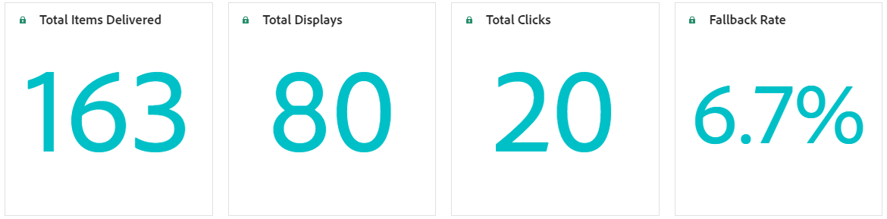

# Verslag over het besluit {#decisioning-report}

## Beslissingsrapportage {#campaigns}

Zodra de reizen of de campagnes met selectiestrategieën live zijn, kunt u tot specifieke rapporten toegang hebben om de Belangrijkste Indicatoren van de Prestaties van het Besluit (KPIs) te controleren.

<!--Once code-based experiences are live, you can access dedicated reports to monitor Key Performance Indicators (KPIs) as an all-encompassing dashboard, delivering an analysis of essential metrics associated with your campaign.

This encompasses details related to the decision items performances and how users interacted with them. [Learn how to work with Code-based experience reports](../reports/campaign-global-report-cja-code.md)-->

U kunt tot details ook toegang hebben met betrekking tot de prestaties van besluitvormingspunten en hoe de gebruikers met hen interactie hebben gehad, leverend een analyse van essentiële metriek verbonden aan uw campagne.

Leer hoe te met op code-gebaseerde ervaringsrapporten over Beslissing in [&#x200B; te werken deze sectie &#x200B;](../reports/campaign-global-report-cja-code.md#decisioning-reporting).

## Rapportering in Customer Journey Analytics {#cja}

Als u met Customer Journey Analytics werkt, kunt u aangepaste rapporteringsdashboards voor uw op code-gebaseerde campagnes tot stand brengen die Beslissing gebruiken.

De belangrijkste stappen worden hieronder weergegeven. De gedetailleerde informatie over hoe te met Customer Journey Analytics te werken is beschikbaar in de [&#x200B; documentatie van Customer Journey Analytics &#x200B;](https://experienceleague.adobe.com/nl/docs/analytics-platform/using/cja-landing){target="_blank"}.

1. Creeer en vorm a **verbinding** in Customer Journey Analytics. Dit staat u toe om met de dataset te verbinden u rapporten voor wilt. [&#x200B; leer hoe te om een verbinding &#x200B;](https://experienceleague.adobe.com/nl/docs/analytics-platform/using/cja-connections/create-connection){target="_blank"} tot stand te brengen

1. Creeer a **gegevensmening** en associeer het aan de eerder gemaakte verbinding. Kies op het tabblad **[!UICONTROL Components]** de relevante schemavelden die u wilt weergeven in de rapportage. Voor Beslissing, zorg ervoor u **propositioninteract** en **propositiondisplay** gebieden omvat. [&#x200B; leer hoe te om gegevensmeningen tot stand te brengen en te vormen &#x200B;](https://experienceleague.adobe.com/nl/docs/analytics-platform/using/cja-dataviews/create-dataview){target="_blank"}

1. Combineer gegevenscomponenten, lijsten en visualisaties in **werkruimteprojecten** om rapporten voor uw op code-gebaseerde campagne tot stand te brengen en te delen. [&#x200B; Leer hoe te om werkruimteprojecten &#x200B;](https://experienceleague.adobe.com/nl/docs/analytics-platform/using/cja-workspace/build-workspace-project/create-projects){target="_blank"} tot stand te brengen
