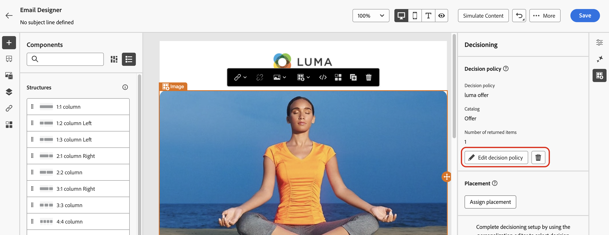

# Beslissingsbeleid maken {#create-decision}

>[!CONTEXTUALHELP]
>id="ajo_code_based_item_number"
>title="Het aantal items definiëren dat moet worden geretourneerd"
>abstract="Selecteer het aantal beslissingsitems dat u wilt retourneren. Als u bijvoorbeeld 2 selecteert, worden de beste twee in aanmerking komende aanbiedingen voor de huidige configuratie weergegeven."

>[!CONTEXTUALHELP]
>id="ajo_code_based_fallback"
>title="Een fallback selecteren"
>abstract="Een reservepunt toont aan de gebruiker wanneer geen van de selectiestrategieën die voor dat besluitvormingsbeleid worden bepaald worden gekwalificeerd."

>[!CONTEXTUALHELP]
>id="ajo_code_based_strategy"
>title="Wat is een strategie?"
>abstract="De volgorde van de selectiestrategie bepaalt welke strategie eerst wordt geëvalueerd. Er is ten minste één strategie nodig. Beslissingsonderdelen in gecombineerde strategieën worden samen geëvalueerd."
>additional-url="https://experienceleague.adobe.com/en/docs/journey-optimizer/using/decisioning/offer-decisioning/get-started-decision/starting-offer-decisioning" text="Strategieën maken"

Om de beste dynamische aanbieding en ervaring aan uw klanten voor te stellen, voeg een besluitvormingsbeleid aan uw inhoud in een campagne of reis dan vormen de punten om terug te keren en de selectiestrategie aan gebruik. Hiervoor voert u de volgende stappen uit:

1. [Een beslissingsbeleid toevoegen](#add)
1. [ vorm het besluitvormingsbeleid ](#configure) - voeg een naam toe en specificeer het aantal punten voor het e-mailkanaal terug te keren.
1. [ opstelling een strategieopeenvolging ](#strategy) - selecteer de punten met het besluitvormingsbeleid terug te keren.
1. [ Uitgezochte reserveaanbiedingen ](#fallback) (facultatief) - selecteer punten om te tonen als geen punten of selectiestrategieën worden gekwalificeerd.
1. [ Overzicht en sparen ](#review) de selectiestrategie
1. [ wijs een plaatsing ](#placement) toe (E-mailkanaal)

>[!AVAILABILITY]
>
>Het beleid van het besluit is beschikbaar aan alle klanten voor de **op code-Gebaseerde Ervaring**, **Push bericht** en de kanalen van SMS.
>
>Beslissing voor het e-mailkanaal is beschikbaar in Beperkte Beschikbaarheid. Neem contact op met uw Adobe-vertegenwoordiger als u toegang wilt aanvragen. Leer meer over [ beschikbaarheidslabels ](../rn/releases.md#availability-labels).

## Een beslissingsbeleid toevoegen {#add}

Om een besluitvormingsbeleid in uw bericht toe te voegen, open een reis of een campagne, en selecteer a [ kanaalactie ](../building-journeys/journeys-message.md).

Bewerk de inhoud van het bericht en blader op de onderstaande tabbladen naar meer informatie over hoe u het beslissingsbeleid kunt toevoegen op basis van het geselecteerde kanaal.

>[!BEGINTABS]

>[!TAB  op code-gebaseerde Ervaring ]

Voor code-gebaseerde ervaringen, kunt u een nieuw besluitvormingsbeleid toevoegen gebruikend of de **coderedacteur**, of het **Beslissende** menu beschikbaar in de eigenschappenruit.

+++Een beslissingsbeleid toevoegen vanuit de code-editor

1. Open de code-editor met de knop **[!UICONTROL Edit code]** .

1. Navigeer naar het menu **[!UICONTROL Decision policy]** en klik op de knop **[!UICONTROL Add decision policy]** .

   

+++

+++Een beslissingsbeleid toevoegen vanuit het menu Beslissing

1. Klik op het pictogram  in het deelvenster Eigenschappen om het menu **[!UICONTROL Decisioning]** te openen.

1. Klik op de knop **[!UICONTROL Add decision policy]**.

   

+++

>[!TAB  E-mail ]

1. Schakel de optie **[!UICONTROL Enable decisioning]** in.

   

   >[!IMPORTANT]
   >
   >Als u beslissingen toestaat, wordt bestaande e-mailinhoud gewist. Als u uw e-mail al hebt ontworpen, moet u uw inhoud vooraf opslaan als een sjabloon.

1. Voeg een nieuw besluitvormingsbeleid toe, gebruikend of de **verpersoonlijkingsredacteur** of het **Beslissende** menu beschikbaar in de E-mailontwerper.

   +++Een beslissingsbeleid toevoegen vanuit de Personalization-editor

   1. Open de verpersoonlijkingseditor met behulp van het pictogram  dat beschikbaar is in het veld voor de onderwerpregel of in een veld in de hoofdtekst van de e-mail waar u verpersoonlijking kunt toevoegen.

   1. Navigeer naar het menu **[!UICONTROL Decision policies]** en klik op de knop **[!UICONTROL Add decision policy]** .

      

   +++

   +++Een beslissingsbeleid toevoegen vanuit het menu Beslissing

   1. Open de E-mail Designer en selecteer een onderdeel in de e-mailstructuur.

   1. Klik op het pictogram  in het deelvenster Eigenschappen om het menu **[!UICONTROL Decisioning]** te openen.

   1. Klik op de knop **[!UICONTROL Add new policy]**.

      

   >[!NOTE]
   >
   >Met **[!UICONTROL Reuse decision output]** kunt u een beslissingsbeleid opnieuw gebruiken dat al in deze e-mail is gemaakt.

>[!TAB  SMS ]

Voor SMS, kunt u een nieuw besluitvormingsbeleid toevoegen gebruikend of de **verpersoonlijkingsredacteur**, of het **Beslissende** menu beschikbaar in de eigenschappenruit.

+++Voeg een besluitbeleid van de verpersoonlijkingsredacteur toe

1. Open de verpersoonlijkingseditor met het pictogram  .
1. Navigeer naar het menu **[!UICONTROL Decision policies]** en klik op de knop **[!UICONTROL Add decision policy]** .

   

+++

+++Een beslissingsbeleid toevoegen vanuit het menu Beslissing

1. Klik op het pictogram  in het deelvenster Eigenschappen om het menu **[!UICONTROL Decisioning]** te openen.

1. Klik op de knop **[!UICONTROL Add decision policy]**.

   

>[!TAB  Push bericht ]

Voor de Duw berichten, kunt u een nieuw besluitvormingsbeleid toevoegen gebruikend of de **verpersoonlijkingsredacteur**, of het **Beslissende** menu beschikbaar in de eigenschappenruit.

+++Voeg een besluitbeleid van de verpersoonlijkingsredacteur toe

1. Open de verpersoonlijkingseditor met het pictogram  .
1. Navigeer naar het menu **[!UICONTROL Decision policies]** en klik op de knop **[!UICONTROL Add decision policy]** .

   

+++

+++Een beslissingsbeleid toevoegen vanuit het menu Beslissing

1. Klik op het pictogram  in het deelvenster Eigenschappen om het menu **[!UICONTROL Decisioning]** te openen.

1. Klik op de knop **[!UICONTROL Add decision policy]**.

   

>[!IMPORTANT]
>
>Voor het bepalen van de ervaring met pushmeldingen is een specifieke versie van de Mobile SDK vereist. Alvorens deze eigenschap uit te voeren, controleer de [ versienota&#39;s ](https://developer.adobe.com/client-sdks/home/release-notes/){target="_blank"} om de vereiste versie te identificeren en u te verzekeren dienovereenkomstig hebt bevorderd. U kunt alle beschikbare versies van SDK voor uw platform in [ ook bekijken deze sectie ](https://developer.adobe.com/client-sdks/home/current-sdk-versions/){target="_blank"}.

>[!ENDTABS]

## Het beslissingsbeleid configureren {#configure}

Nadat u een nieuw besluitvormingsbeleid in uw inhoud hebt toegevoegd, opent het scherm van de configuratiescherm van het beslissingsbeleid. Voer de volgende stappen uit om het beslissingsbeleid te configureren:

1. Geef een naam op voor het beslissingsbeleid en selecteer een catalogus (die momenteel is beperkt tot de standaardcatalogus **[!UICONTROL Offers]** ).

   

1. In het veld **[!UICONTROL Number of items]** kunt u het aantal besluitvormingsitems definiëren dat moet worden geretourneerd met het beslissingsbeleid. Als u bijvoorbeeld 2 selecteert, worden de beste twee in aanmerking komende aanbiedingen voor de huidige configuratie weergegeven.

   >[!NOTE]
   >
   >Deze optie is alleen beschikbaar voor de e-mail- en op code gebaseerde ervaringskanalen. Voor alle andere kanalen, slechts kan 1 besluitpunt per actie worden teruggekeerd.

   Als u meerdere items voor het e-mailkanaal wilt retourneren, moet u het beslissingsbeleid toevoegen binnen een component **[!UICONTROL Repeat Grid]** . Vouw de onderstaande sectie uit voor meer informatie:

   +++Meerdere beslissingsobjecten in e-mails retourneren

   1. Sleep een component **[!UICONTROL Repeat Grid]** in de e-mail en configureer deze naar wens in het deelvenster **[!UICONTROL Settings]** .

      

   1. Klik op het pictogram **[!UICONTROL Decisioning]** op de canvaswerkbalk of open het deelvenster **[!UICONTROL Decisioning]** en selecteer **[!UICONTROL Add decision policy]** .

   1. Geef het aantal items op dat in het veld **[!UICONTROL Number of items]** moet worden geretourneerd en configureer vervolgens het beslissingsbeleid zoals hieronder beschreven. Het maximumaantal items dat u kunt selecteren, wordt beperkt door het aantal tegels dat is gedefinieerd in de component **[!UICONTROL Repeat grid]** .

   

   +++

1. Klik op **[!UICONTROL Next]**.

## Een strategiereeks instellen {#strategy}

In de sectie **[!UICONTROL Strategy sequence]** kunt u de beslissingsitems selecteren en selectiestrategieën instellen die in het besluitvormingsbeleid worden weergegeven.

1. Klik op **[!UICONTROL Add]** en kies het type object dat u in het beleid wilt opnemen:

   

   * **[!UICONTROL Selection strategy]** - Beslissingsstrategieën maken gebruik van collecties die verband houden met geschiktheidsbeperkingen en rangordemethoden om te bepalen welke items moeten worden weergegeven. U kunt een of meerdere bestaande selectiestappen selecteren of een nieuwe strategie maken met de knop **[!UICONTROL Create selection strategy]** . [ Leer hoe te om selectiestrategieën ](selection-strategies.md) tot stand te brengen

   * **[!UICONTROL Decision item]** - Selecteer enkele-beslissingsitems zonder een selectiestrategie te moeten doorlopen. U kunt slechts één beslissingsitem tegelijk selecteren. Alle voorwaarden die voor het onderdeel zijn ingesteld, zijn van toepassing.

   >[!NOTE]
   >
   >Een beslissingsbeleid ondersteunt maximaal 10 selectiestrategieën en besluitvormingselementen samen. [ leer meer over het Beslissen van gidsen &amp; beperkingen ](gs-experience-decisioning.md#guardrails)

1. Wanneer het toevoegen van verscheidene besluitvormingspunten en/of strategieën, zullen zij in een specifieke orde worden geëvalueerd. Het eerste object dat aan de reeks is toegevoegd, wordt eerst geëvalueerd, enzovoort. Als u de standaardvolgorde wilt wijzigen, sleept u de objecten en/of de groepen en zet u deze neer om ze naar wens opnieuw te rangschikken. Vouw de onderstaande sectie uit voor meer informatie.

   +++De evaluatievolgorde in een beslissingsbeleid beheren

   Nadat u besluitvormingspunten en selectiestrategieën aan uw beleid hebt toegevoegd, kunt u hun volgorde rangschikken om hun evaluatievolgorde te bepalen en kunt u selectiestrategieën combineren om deze samen te evalueren.

   De **opeenvolgende orde** waarin de punten en de strategieën zullen worden geëvalueerd wordt vermeld met aantallen links van elk voorwerp of groep voorwerpen. Als u de positie van een selectiestrategie (of een groep strategieën) binnen de reeks wilt verplaatsen, sleept u deze naar een andere positie.

   

   >[!NOTE]
   >
   >Alleen selectiestrategieën kunnen binnen een reeks worden gesleept en neergezet. Als u de positie van een beslissingsitem wilt wijzigen, moet u het item verwijderen en opnieuw toevoegen met de knop **[!UICONTROL Add]** nadat u de andere items hebt toegevoegd die u eerder wilt evalueren.

   U kunt **** veelvoudige selectiestrategieën in groepen ook combineren zodat worden zij samen en niet afzonderlijk geëvalueerd. Klik hiertoe op de knop **`+`** onder een selectiestrategie om deze te combineren met een andere. U kunt een selectiestrategie ook naar een andere slepen om de twee strategieën in een groep te groeperen.

   >[!NOTE]
   >
   >Beslissingsonderdelen kunnen niet worden gegroepeerd met andere onderdelen of selectiestrategieën.

   Meerdere strategieën en de groepering daarvan bepalen de prioriteit van de strategieën en de rangorde van de in aanmerking komende aanbiedingen. De eerste strategie heeft de hoogste prioriteit en de strategieën in dezelfde groep hebben dezelfde prioriteit.

   U hebt bijvoorbeeld twee verzamelingen, één in strategie A en één in strategie B. Het verzoek is om terugzending van twee besluitvormingselementen. Laten we zeggen dat er twee in aanmerking komende aanbiedingen zijn van strategie A en drie in aanmerking komende aanbiedingen van strategie B.

   * Als de twee strategie **niet wordt gecombineerd** of in opeenvolgende orde (1 en 2), zullen de hoogste twee in aanmerking komende aanbiedingen van de eerste strategie in de eerste rij zijn teruggekeerd. Als er niet twee in aanmerking komende aanbiedingen voor de eerste strategie zijn, zal de beslissingsmotor op één na de volgende strategie volgen om te vinden hoeveel aanbiedingen nog nodig zijn, en zal uiteindelijk een terugslag teruggeven indien nodig.

     

   * Als de twee inzamelingen **tezelfdertijd** worden geëvalueerd, aangezien er twee in aanmerking komende aanbiedingen van strategie A en drie in aanmerking komende aanbiedingen van strategie B zijn, zullen de vijf aanbiedingen allen worden stapel samen gebaseerd op de waarde die door de respectieve rangschikkingsmethodes wordt bepaald. Er wordt om twee aanbiedingen verzocht, zodat de twee belangrijkste in aanmerking komende aanbiedingen van deze vijf aanbiedingen worden teruggegeven.

     

   **Voorbeeld met veelvoudige strategieën**

   Laten we nu een voorbeeld bekijken waarbij meerdere strategieën verdeeld zijn in verschillende groepen. U hebt drie strategieën gedefinieerd. Strategie 1 en Strategie 2 zijn in groep 1 samengevoegd en strategie 3 is onafhankelijk (groep 2). De in aanmerking komende aanbiedingen voor elke strategie en hun prioriteit (gebruikt bij de beoordeling van de rangorde) zijn als volgt:

   * Groep 1:
      * Strategie 1 - (Aanbieding 1, Aanbieding 2, Aanbieding 3) - Prioriteit 1
      * Strategie 2 - (Aanbieding 3, Aanbieding 4, Aanbieding 5) - Prioriteit 1

   * Groep 2:
      * Strategie 3 - (aanbod 5, aanbod 6) - Prioriteit 0

   De belangrijkste prioritaire strategische aanbiedingen worden eerst geëvalueerd en aan de gerangschikte biedingenlijst toegevoegd.

   * **Herhaling 1:**

     Aanbiedingen voor strategie 1 en strategie 2 worden samen geëvalueerd (Aanbieding 1, Aanbieding 2, Aanbieding 3, Aanbieding 4, Aanbieding 5). Laten we zeggen dat het resultaat:

     Aanbieding 1 - 10
Voorstel 2 - 20
Aanbieding 3 - 30 van strategie 1, 45 van strategie 2. Het hoogste van beide wordt in overweging genomen, dus er wordt rekening gehouden met 45.
Voorstel 4 - 40
Voorstel 5 - 50

     De gerangschikte voorstellen zijn nu als volgt: Voorstel 5, voorstel 3, voorstel 4, voorstel 2, voorstel 1.

   * **Herhaling 2:**

     Aanbiedingen voor strategie 3 worden geëvalueerd (voorstel 5, voorstel 6). Laten we zeggen dat het resultaat:

      * Voorstel 5 - Wordt niet geëvalueerd omdat dit al in het bovenstaande resultaat voorkomt.
      * Voorstel 6 - 60

     De gerangschikte voorstellen zijn nu als volgt: Voorstel 5, voorstel 3, voorstel 4, voorstel 2, voorstel 1, voorstel 6.

   +++

1. Klik op **[!UICONTROL Next]** als uw selectiestrategie gereed is.

## Extra voorstellen toevoegen {#fallback}

Nadat u de keuze hebt gemaakt voor de keuze van de onderdelen en/of de selectiestrategieën, kunt u terugvalvoorstellen toevoegen om weer te geven als geen van de bovenstaande items of selectiestrategieën gekwalificeerd zijn.

U kunt elk item in de lijst selecteren, waarin alle beslissingsitems worden weergegeven die in de huidige sandbox zijn gemaakt. Als geen selectiestrategie wordt gekwalificeerd, wordt fallback getoond aan de gebruiker ongeacht de data en de geschiktheidsbeperking die op het geselecteerde punt <!--nor frequency capping when available - TO CLARIFY--> wordt toegepast.

>[!NOTE]
> Back-ups zijn optioneel. U kunt maximaal het aantal aangevraagde objecten selecteren. Als geen verkiesbaar zijn en geen reserve wordt geplaatst, zal niets worden getoond.

## Beslissingsbeleid bekijken en opslaan {#review}

Nadat u een selectiestrategie hebt geconfigureerd en fallback-voorstellen hebt toegevoegd, klikt u op **[!UICONTROL Next]** om uw beslissingsbeleid te bekijken en op te slaan. Klik vervolgens op **[!UICONTROL Create]** om het maken van het beleid te bevestigen.

>[!IMPORTANT]
>
>Zodra een besluitvormingsbeleid wordt gecreeerd, kunnen om het even welke aangebrachte veranderingen tot 15 minuten duren om zich over alle gegevensgebieden te verspreiden, en tot 30 minuten voor Canada. Dit omvat veranderingen zoals het toevoegen van een nieuw besluitvormingspunt aan een inzameling, het veranderen van een regel in een punt, het veranderen van puntinhoud, of het bijwerken van een formule.

U kunt een besluitbeleid op elk ogenblik uitgeven of schrappen gebruikend de ellipsieknoop in de verpersoonlijkingsredacteur, of in het **[!UICONTROL Decisioning]** menu binnen de ruit van componenteneigenschappen.

>[!BEGINTABS]

>[!TAB  geef uit of schrap een beleid van de verpersoonlijkingsredacteur ]

>[!TAB  geef of schrap een beleid van het menu van Beslissing uit ]

>[!ENDTABS]

## Plaatsing toewijzen (e-mail) {#placement}

Voor e-mailberichten moet u een plaatsing definiëren voor de component die aan het beslissingsbeleid is gekoppeld. Klik hiertoe op de knop **[!UICONTROL Decisioning]** in het deelvenster Eigenschappen van component en selecteer **[!UICONTROL Assign placement]** . [ Leer hoe te met plaatsen ](../experience-decisioning/placements.md) te werken

## Volgende stappen {#next-steps}

Nu u begrijpt hoe u een beslissingsbeleid kunt maken, kunt u dit gebruiken in [!DNL Journey Optimizer] kanalen om aanbiedingen te leveren.

➡️ [ Leer hoe te om besluitvormingsbeleid in berichten te gebruiken ](../experience-decisioning/use-decision-policy.md)
