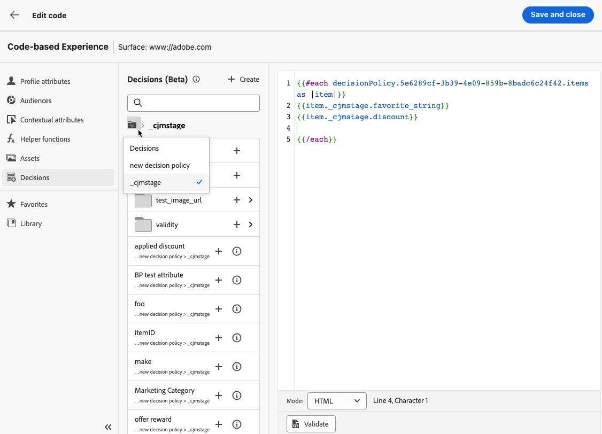

# Beslissingsbeleid maken {#create-decision}

>[!CONTEXTUALHELP]
>id="ajo_code_based_decision"
>title="Wat is een beslissing?"
>abstract="Het beslissingsbeleid maakt gebruik van de engine voor het bepalen van ervaringen om de beste inhoud te kiezen die u kunt leveren, afhankelijk van het publiek."
>additional-url="https://experienceleague.adobe.com/docs/journey-optimizer/using/offer-decisioning/get-started-decision/starting-offer-decisioning.html" text="Over het bepalen van de ervaring"

>[!BEGINSHADEBOX]

Wat u in deze documentatiehandleiding zult vinden:

* [Aan de slag met Experience Decisition](gs-experience-decisioning.md)
* Je beslissingsobjecten beheren
   * [De itemcatalogus configureren](catalogs.md)
   * [Beslissingsitems maken](items.md)
   * [Objectverzamelingen beheren](collections.md)
* Selectie van items configureren
   * [Beslissingsregels maken](rules.md)
   * [Classificatiemethoden maken](ranking.md)
* [Selectiestrategieën maken](selection-strategies.md)
* **[Beslissingsbeleid maken](create-decision.md)**

>[!ENDSHADEBOX]

Beslissingsbeleid zijn containers voor uw aanbiedingen die gebruikmaken van de ervaringsbeslissingsengine om de beste inhoud te kiezen die u kunt leveren, afhankelijk van het publiek.

>[!NOTE]
>
>In de [!DNL Journey Optimizer] gebruikersinterface, beslissingsbeleid wordt aangeduid als beslissingen<!--but they are decision policies. TBC if this note is needed-->.

## Voeg een besluitvormingsbeleid aan een code-gebaseerde campagne toe {#add-decision}

>[!CONTEXTUALHELP]
>id="ajo_code_based_item_number"
>title="Het aantal items definiëren dat moet worden geretourneerd"
>abstract="Selecteer het aantal beslissingsitems dat u wilt retourneren. Als u bijvoorbeeld 2 selecteert, worden de beste twee in aanmerking komende aanbiedingen voor het huidige oppervlak weergegeven."

>[!CONTEXTUALHELP]
>id="ajo_code_based_fallback"
>title="Een fallback selecteren"
>abstract="Een reservepunt toont aan de gebruiker wanneer geen van de selectiestrategieën die voor dat besluitvormingsbeleid worden bepaald worden gekwalificeerd."

>[!CONTEXTUALHELP]
>id="ajo_code_based_strategy"
>title="Wat is een strategie?"
>abstract="De volgorde van de selectiestrategie bepaalt welke strategie eerst wordt geëvalueerd. Er is ten minste één strategie nodig. Beslissingsonderdelen in gecombineerde strategieën worden samen geëvalueerd."
>additional-url="https://experienceleague.adobe.com/docs/journey-optimizer/using/offer-decisioning/get-started-decision/starting-offer-decisioning.html" text="Strategieën maken"
>additional-url="https://experienceleague.adobe.com/docs/journey-optimizer/using/offer-decisioning/get-started-decision/starting-offer-decisioning.html" text="Evaluatievolgorde"

Als u uw bezoekers de beste dynamische aanbieding en ervaring wilt laten zien op uw website of mobiele app, voegt u een beslissingsbeleid toe aan een op code gebaseerde campagne. Hiervoor voert u de volgende stappen uit.

1. Maak een campagne en selecteer de **[!UICONTROL Code-base experience (Beta)]** handeling. [Meer informatie](../code-based/create-code-based.md)

   >[!NOTE]
   >
   >De op code gebaseerde ervaringsfunctie is momenteel beschikbaar als een bètafunctie om alleen gebruikers te selecteren.

1. Van de [code-editor](../code-based/create-code-based.md#edit-code), selecteert u de **[!UICONTROL Decisions]** pictogram en klik **[!UICONTROL Create a decision]**.

   

1. Vul de details voor uw besluitvormingsbeleid in: voeg een naam toe en selecteer een catalogus.

   >[!NOTE]
   >
   >Momenteel alleen de standaardwaarde **[!UICONTROL Offers]** catalogus is beschikbaar.

   

1. Selecteer het aantal objecten dat je wilt retourneren. Als u bijvoorbeeld 2 selecteert, worden de beste twee in aanmerking komende aanbiedingen voor het huidige oppervlak weergegeven. Klik op **[!UICONTROL Next]**

1. Gebruik de **[!UICONTROL Add strategy]** om de selectiestrategieën voor uw beslissingsbeleid te definiëren. Elke strategie bestaat uit een aanbod dat gekoppeld is aan een toelatingsbeperking en een rangschikkingsmethode om te bepalen welke aanbiedingen moeten worden getoond. [Meer informatie](selection-strategies.md)

   

   >[!NOTE]
   >
   >Er is ten minste één strategie nodig. U kunt niet meer dan tien strategieën toevoegen.

1. Van de **[!UICONTROL Add strategy]** kunt u ook een strategie maken. De **[!UICONTROL Create selection strategy]** knop leidt u om naar de **[!UICONTROL Experience decisioning]** > **[!UICONTROL Configurations]** -menu. [Meer informatie](selection-strategies.md)

   

1. Wanneer u meerdere strategieën toevoegt, worden deze in een bepaalde volgorde geëvalueerd. De eerste strategie die aan de opeenvolging werd toegevoegd zal eerst worden geëvalueerd, etc. [Meer informatie](#evaluation-order)

   Als u de standaardvolgorde wilt wijzigen, kunt u de strategieën en/of groepen verslepen en neerzetten om ze naar wens opnieuw te rangschikken.

   

1. Voeg een fallback toe. Er wordt een fallback-item weergegeven voor de gebruiker als geen van de bovenstaande selectiestrategieën is gekwalificeerd.

   

   U kunt elk item in de lijst selecteren, waarin alle beslissingsitems worden weergegeven die in de huidige sandbox zijn gemaakt. Als er geen selectiestrategie is gekwalificeerd, wordt de fallback aan de gebruiker weergegeven, ongeacht de datums en geschiktheidsbeperking die op het geselecteerde item zijn toegepast<!--nor frequency capping when available - TO CLARIFY-->.

   >[!NOTE]
   >
   >Een fallback is optioneel. Als er geen fallback is geselecteerd en geen strategie is gekwalificeerd, wordt er niets weergegeven door [!DNL Journey Optimizer].

1. Uw selectie opslaan en klikken **[!UICONTROL Create]**. Het nieuwe besluitvormingsbeleid wordt toegevoegd onder **[!UICONTROL Decisions]**.

   

Nu het besluitvormingsbeleid wordt gecreeerd, kunt u de besluitvormingsattributen binnen uw code-gebaseerde ervaringsinhoud gebruiken. [Meer informatie](#use-decision-policy)

## Evaluatievolgorde {#evaluation-order}

Zoals hierboven is beschreven, bestaat een strategie uit een verzameling, een waarderingsmethode en subsidiabiliteitsbeperkingen.

U kunt:

* Stel de gewenste volgorde in voor de strategieën die moeten worden geëvalueerd.
* Combineer meerdere strategieën, zodat deze samen en niet afzonderlijk worden geëvalueerd.

Meerdere strategieën en de groepering daarvan bepalen de prioriteit van de strategieën en de rangorde van de in aanmerking komende aanbiedingen. De eerste strategie heeft de hoogste prioriteit en de strategieën in dezelfde groep hebben dezelfde prioriteit.

U hebt bijvoorbeeld twee verzamelingen, één in strategie A en één in strategie B. Het verzoek is om terugzending van twee besluitvormingselementen. Laten we zeggen dat er twee in aanmerking komende aanbiedingen zijn van strategie A en drie in aanmerking komende aanbiedingen van strategie B.

* Als de twee strategieën **niet gecombineerd** of in sequentiële volgorde (1 en 2) worden de twee belangrijkste in aanmerking komende aanbiedingen uit de eerste strategie in de eerste rij geretourneerd. Als er niet twee in aanmerking komende aanbiedingen voor de eerste strategie zijn, zal de beslissingsmotor op één na de volgende strategie volgen om te vinden hoeveel aanbiedingen nog nodig zijn, en zal uiteindelijk een terugslag teruggeven indien nodig.

  

* Als de twee verzamelingen **tegelijk geëvalueerd** Aangezien er twee in aanmerking komende aanbiedingen van strategie A en drie in aanmerking komende aanbiedingen van strategie B zijn, worden de vijf offertes in hun geheel samengevoegd op basis van de waarde die door de respectieve rangordemethoden wordt bepaald. Er wordt om twee aanbiedingen verzocht, zodat de twee belangrijkste in aanmerking komende aanbiedingen van deze vijf aanbiedingen worden teruggegeven.

  

+++ **Voorbeeld met meerdere strategieën**

Laten we nu een voorbeeld bekijken waarbij meerdere strategieën verdeeld zijn in verschillende groepen.

U hebt drie strategieën gedefinieerd. Strategie 1 en Strategie 2 zijn in groep 1 samengevoegd en strategie 3 is onafhankelijk (groep 2).

De in aanmerking komende aanbiedingen voor elke strategie en hun prioriteit (gebruikt bij de beoordeling van de rangorde) zijn als volgt:

* Groep 1:
   * Strategie 1 - (Aanbieding 1, Aanbieding 2, Aanbieding 3) - Prioriteit 1
   * Strategie 2 - (Aanbieding 3, Aanbieding 4, Aanbieding 5) - Prioriteit 1

* Groep 2:
   * Strategie 3 - (aanbod 5, aanbod 6) - Prioriteit 0

De belangrijkste prioritaire strategische aanbiedingen worden eerst geëvalueerd en aan de gerangschikte biedingenlijst toegevoegd.

**Herhaling 1:**

Aanbiedingen voor strategie 1 en strategie 2 worden samen geëvalueerd (Aanbieding 1, Aanbieding 2, Aanbieding 3, Aanbieding 4, Aanbieding 5). Laten we zeggen dat het resultaat:

Aanbieding 1 - 10 Aanbieding 2 - 20 Aanbieding 3 - 30 uit strategie 1, 45 uit strategie 2. Het hoogste van beide wordt in overweging genomen, dus er wordt rekening gehouden met 45.
Voorstel 4 - 40 voorstel 5 - 50

De gerangschikte voorstellen zijn nu als volgt: Voorstel 5, voorstel 3, voorstel 4, voorstel 2, voorstel 1.

**Herhaling 2:**

Aanbiedingen voor strategie 3 worden geëvalueerd (voorstel 5, voorstel 6). Laten we zeggen dat het resultaat:

* Voorstel 5 - Wordt niet geëvalueerd omdat dit al in het bovenstaande resultaat voorkomt.
* Voorstel 6 - 60

De gerangschikte voorstellen zijn nu als volgt: Voorstel 5, voorstel 3, voorstel 4, voorstel 2, voorstel 1, voorstel 6.

+++

## Het beslissingsbeleid in de code-editor gebruiken {#use-decision-policy}

Zodra gecreeerd, kan het besluitvormingsbeleid in worden gebruikt [Expression-editor](../code-based/create-code-based.md#edit-code). Hiervoor voert u de volgende stappen uit.

>[!NOTE]
>
>De op code gebaseerde ervaring gebruikt de [!DNL Journey Optimizer] De redacteur van de uitdrukking met al zijn verpersoonlijking en auteursmogelijkheden. [Meer informatie](../personalization/personalization-build-expressions.md)

1. Klik op het pictogram +. De code die overeenkomt met het beslissingsbeleid wordt toegevoegd. Nu kunt u alle beslissingskenmerken toevoegen die u in die code wilt.

   

   >[!NOTE]
   >
   >Deze opeenvolging zal het aantal tijden worden herhaald u het besluitvormingsbeleid wilt zijn teruggekeerd. Als u bijvoorbeeld 2 items wilt retourneren wanneer [het besluit](#add-decision)dezelfde volgorde wordt twee keer herhaald.

1. Klik op het beslissingsbeleid. De beslissingskenmerken worden weergegeven.

   Deze kenmerken worden opgeslagen in het dialoogvenster **[!UICONTROL Offers]** catalogusschema. Aangepaste kenmerken worden opgeslagen in het dialoogvenster **`_<imsOrg`>** map en standaardkenmerken in het dialoogvenster **`_experience`** map. [Meer informatie over het schema van de catalogus met aanbiedingen](catalogs.md)

   

1. Klik op elke map om deze uit te vouwen. Plaats de cursor van de muis op de gewenste locatie en klik op het pictogram + naast het kenmerk dat u wilt toevoegen. U kunt zoveel kenmerken aan de code toevoegen als u wilt.

   

1. Klik op het mappictogram om terug te navigeren naar de hoofdmap van het beslissingsbeleid.

   

1. U kunt ook alle andere kenmerken toevoegen die beschikbaar zijn in de expressie-editor, zoals profielkenmerken.

   
