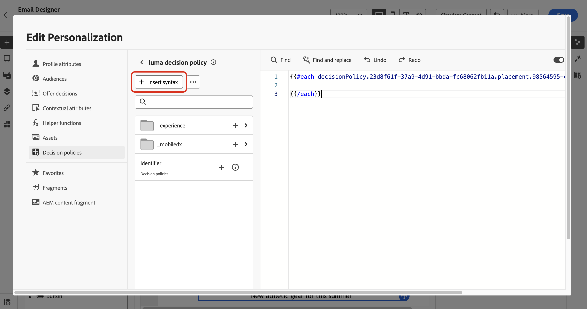

# Beslissingsbeleid maken {#create-decision}

>[!CONTEXTUALHELP]
>id="ajo_code_based_decision"
>title="Wat is een beslissing?"
>abstract="Het beslissingsbeleid bevat alle selectielogica waarmee de beslissingsengine de beste inhoud kan kiezen. Het besluitvormingsbeleid is specifiek voor de campagne. Hun doel is de beste aanbiedingen voor elk profiel te selecteren terwijl het campagneontwerp u toestaat om erop te wijzen hoe de geselecteerde besluitvormingspunten zouden moeten worden voorgesteld, met inbegrip van welke puntattributen om in het bericht worden omvat."
>additional-url="https://experienceleague.adobe.com/en/docs/journey-optimizer/using/decisioning/offer-decisioning/get-started-decision/starting-offer-decisioning" text="Informatie over beslissen"

>[!CONTEXTUALHELP]
>id="ajo_journey_decision_policy"
>title="Een beslissingsbeleid definiëren"
>abstract="Een besluitvormingsbeleid staat u toe om de beste punten van de motor van Beslissing te kiezen en hen aan het juiste publiek te leveren."
>additional-url="https://experienceleague.adobe.com/en/docs/journey-optimizer/using/decisioning/offer-decisioning/get-started-decision/starting-offer-decisioning" text="Informatie over beslissen"

>[!CONTEXTUALHELP]
>id="ajo_exd_decision_policy"
>title="Beslissingsbeleid"
>abstract="Met een beslissingsbeleid kunt u de beste items kiezen uit de beslissingsengine en leveren aan elk publiek."

>[!CONTEXTUALHELP]
>id="ajo_exd_placements"
>title="Plaatsing"
>abstract="Een plaatsing bepaalt waar de teruggekeerde punten van de besluitvormingsmotor in een bericht verschijnen. U kunt de prestaties van de verschillende locaties in de rapportage bijhouden."

>[!CONTEXTUALHELP]
>id="ajo_exd_decision_attribute"
>title="Beslissingskenmerken selecteren uit catalogus"
>abstract="Beslissingskenmerken worden opgeslagen in het schema van de catalogus. Selecteer een kenmerk dat u hier wilt gebruiken in de geselecteerde catalogus."

Beslissingsbeleid is containers voor uw aanbiedingen die de beslissingsengine gebruiken om dynamisch de beste inhoud te retourneren die voor elk publiekslid kan worden geleverd. Hun doel is de beste aanbiedingen voor elk profiel te selecteren, terwijl het campagne/reis auteursrecht u toestaat om te wijzen op hoe de geselecteerde besluitvormingspunten, met inbegrip van welke puntattributen in het bericht moeten worden omvat.

## Belangrijkste stappen {#key}

De belangrijkste stappen om besluitvormingsbeleid in uw berichten als volgt te gebruiken zijn:

1. [Een beslissingsbeleid maken in een e-mail- of code-ervaring](#add-decision)

   Opstelling een besluitvormingsbeleid in uw e-mail of code-gebaseerde ervaring door het aantal punten te kiezen om terug te keren, selectiestrategieën, reserveopties, en evaluatieorde te vormen.

1. [Het beslissingsbeleid in uw inhoud gebruiken](#use-decision-policy)

   Pas uw inhoud met de output van het besluitvormingsbeleid en attributen van de besluitvormingspunten aan u in het bericht wilt tonen.

1. [Rapportagedashboards maken](cja-reporting.md)

   Bouw aangepaste Customer Journey Analytics dashboards om prestaties te meten en inzicht te krijgen in hoe je besluitvormingsbeleid en aanbiedingen worden geleverd en waarmee je werkt.

## Afbeeldingen en beperkingen

* **Beperkte beschikbaarheid - het beleid van het Besluit in e-mail** - voor nu, is de verwezenlijking van het besluitvormingsbeleid in e-mail beschikbaar in Beperkte Beschikbaarheid. Neem contact op met uw Adobe-vertegenwoordiger voor toegang.
* **de pagina&#39;s van de Spiegel** - voor nu, geven de besluitvormingspunten niet in e-mailspiegelpagina&#39;s terug.
* **het Volgen &amp; het type van verbindingen** - om verbindingen te volgen die door besluit worden geproduceerd, bepaal hen in het schema als &quot;Beslissende Assets&quot;. Op kenmerken gebaseerde koppelingen kunnen niet worden gevolgd.
* **beleid dat van het Besluit in e-mail** negeert - u kunt geen veelvoudige besluitvormingsbeleid binnen een ouder e-mailcomponent nesten die reeds een bijbehorend besluitvormingsbeleid heeft.
* **Gedupliceerde reizen/campagnes met besluit** - als u een reis of een campagne dupliceert die een besluitvormingsbeleid omvat, verwijst de gedupliceerde versie naar de originele e-mail of op code-gebaseerde ervaring, veroorzakend fouten. Configureer het beslissingsbeleid altijd na duplicatie.
* **het beleid van de Goedkeuring** - de Updates aan toestemmingsbeleid nemen tot 48 uren om van kracht te worden. Als in een besluitvormingsbeleid wordt verwezen naar een kenmerk dat is gekoppeld aan een onlangs bijgewerkt beleid voor toestemming, worden de wijzigingen niet onmiddellijk toegepast.

  Op dezelfde manier als nieuwe profielattributen die aan een toestemmingsbeleid onderworpen zijn aan een besluitvormingsbeleid worden toegevoegd, zullen zij bruikbaar zijn, maar het toestemmingsbeleid verbonden aan hen zal niet worden afgedwongen tot de vertraging is overgegaan.

  Beleid met toestemming is alleen beschikbaar voor organisaties met de invoegtoepassing Adobe Healthcare Shield of Privacy and Security Shield.

* **AI het Rangschikken** - voor nu, wordt AI het rangschikken niet gesteund voor het E-mailkanaal in reizen met besluit.

## Een beslissingsbeleid maken in een e-mail- of code-ervaring {#add-decision}

>[!CONTEXTUALHELP]
>id="ajo_code_based_item_number"
>title="Het aantal items definiëren dat moet worden geretourneerd"
>abstract="Selecteer het aantal beslissingsitems dat u wilt retourneren. Als u bijvoorbeeld 2 selecteert, worden de beste twee in aanmerking komende aanbiedingen voor de huidige configuratie weergegeven."

>[!CONTEXTUALHELP]
>id="ajo_code_based_fallback"
>title="Een fallback selecteren"
>abstract="Een reservepunt toont aan de gebruiker wanneer geen van de selectiestrategieën die voor dat besluitvormingsbeleid worden bepaald worden gekwalificeerd."

>[!CONTEXTUALHELP]
>id="ajo_code_based_strategy"
>title="Wat is een strategie?"
>abstract="De volgorde van de selectiestrategie bepaalt welke strategie eerst wordt geëvalueerd. Er is ten minste één strategie nodig. Beslissingsonderdelen in gecombineerde strategieën worden samen geëvalueerd."
>additional-url="https://experienceleague.adobe.com/en/docs/journey-optimizer/using/decisioning/offer-decisioning/get-started-decision/starting-offer-decisioning" text="Strategieën maken"

Als u de beste dynamische aanbieding en ervaring wilt presenteren aan de ontvangers en bezoekers van uw e-mail op uw website of mobiele app, voegt u een beslissingsbeleid toe aan een e-mail of een campagne of reis op basis van code. Volg de onderstaande stappen om dit te doen.

### Beslissingsbeleid maken {#add}

1. Voeg een handeling **[!UICONTROL Email]** of **[!UICONTROL Code-base experience]** toe aan een rit of campagne.

1. Schakel **[!UICONTROL Enable decisioning]** voor e-mailberichten in het configuratiescherm in.

   

   >[!IMPORTANT]
   >
   >Als u beslissingen toestaat, wordt bestaande e-mailinhoud gewist. Als u uw e-mail al hebt ontworpen, moet u uw inhoud vooraf opslaan als een sjabloon.
   >
   >Merk op dat om het even welk die besluitvormingsbeleid binnen e-mail wordt gevormd niet in het malplaatje zal worden bewaard. Als u het malplaatje op een andere e-mail toepast, moet u het beleid opnieuw vormen.

1. Het beleid kan in e-mail en code-gebaseerde ervaringen worden gecreeerd gebruikend de verpersoonlijkingsredacteur. Ze kunnen ook worden gemaakt in e-mailberichten via een speciaal menu in de Designer-e-mail. Vouw de onderstaande secties uit voor meer informatie.

   +++Personalization Editor

   1. Open de personalisatie-editor en selecteer **[!UICONTROL Decision policy]** .
   1. Klik op de knop **[!UICONTROL Add decision policy]** om een nieuw beleid te maken.

      

   +++

   +++Menu E-mail Designer **[!UICONTROL Decisioning]**

   1. Selecteer een component, klik op het pictogram **[!UICONTROL Decisioning]** op de werkbalk of in het deelvenster Eigenschappen en selecteer vervolgens **[!UICONTROL Add new policy]** .

   1. Selecteer **[!UICONTROL Reuse decision output]** om een beslissingsbeleid opnieuw te gebruiken dat al in deze e-mail is gemaakt.

      

   +++

1. Geef een naam op en selecteer een catalogus (die momenteel is beperkt tot de standaardcatalogus **[!UICONTROL Offers]** ).

1. Selecteer het aantal items dat u wilt retourneren. Als u bijvoorbeeld 2 selecteert, worden de beste twee in aanmerking komende aanbiedingen voor de huidige configuratie weergegeven.

   

   Voor e-mailberichten kunnen alleen meerdere items worden geretourneerd in een **[!UICONTROL Repeat grid]** -inhoudscomponent. Vouw de onderstaande sectie uit voor meer informatie:

   +++ Meerdere beslissingsobjecten in e-mails retourneren

   1. Sleep een component **[!UICONTROL Repeat Grid]** naar het canvas en configureer deze naar wens met het deelvenster **[!UICONTROL Settings]** .

      

   1. Klik op het pictogram **[!UICONTROL Decisioning]** op de canvaswerkbalk of open het deelvenster **[!UICONTROL Decisioning]** en selecteer **[!UICONTROL Add decision policy]** .

   1. Geef het aantal items op dat in het veld **[!UICONTROL Number of items]** moet worden geretourneerd en configureer vervolgens het beslissingsbeleid zoals hieronder beschreven. Het maximumaantal items dat u kunt selecteren, wordt beperkt door het aantal tegels dat is gedefinieerd in de component **[!UICONTROL Repeat grid]** .

   

   +++

1. Klik op **[!UICONTROL Next]**.

### Items selecteren en selectiestrategieën {#select}

In de sectie **[!UICONTROL Strategy sequence]** kunt u de beslissingsitems en de selectiestrategieën selecteren die u met het beslissingsbeleid wilt presenteren.

1. Klik op **[!UICONTROL Add]** en kies het type object dat u in het beleid wilt opnemen:

   * **[!UICONTROL Selection strategy]**: voeg een of meerdere selectiestrategieën toe. Beslissingsstrategieën maken gebruik van collecties die verband houden met toelatingsbeperkingen en rangordemethoden om te bepalen welke items moeten worden getoond. U kunt een bestaande selectiestrategie selecteren of een nieuwe selectiestrategie maken met de knop **[!UICONTROL Create selection strategy]** . [ Leer hoe te om selectiestrategieën ](selection-strategies.md) tot stand te brengen

   * **[!UICONTROL Decision item]**: voeg enkele beslissingsitems toe die u wilt presenteren zonder dat u een selectiestrategie hoeft te doorlopen. U kunt slechts één beslissingsitem tegelijk selecteren. Alle voorwaarden die voor het onderdeel zijn ingesteld, zijn van toepassing.

   

   >[!NOTE]
   >
   >Een beslissingsbeleid ondersteunt maximaal 10 selectiestrategieën en besluitvormingselementen samen. [ leer meer over het Beslissen van gidsen &amp; beperkingen ](gs-experience-decisioning.md#guardrails)

1. Wanneer het toevoegen van verscheidene besluitvormingspunten en/of strategieën, zullen zij in een specifieke orde worden geëvalueerd. Het eerste object dat aan de reeks is toegevoegd, wordt eerst geëvalueerd, enzovoort. Als u de standaardvolgorde wilt wijzigen, sleept u de objecten en/of de groepen en zet u deze neer om ze naar wens opnieuw te rangschikken. Vouw de onderstaande sectie uit voor meer informatie.

   +++De evaluatievolgorde in een beslissingsbeleid beheren

   Nadat u besluitvormingspunten en selectiestrategieën aan uw beleid hebt toegevoegd, kunt u hun volgorde rangschikken om hun evaluatievolgorde te bepalen en kunt u selectiestrategieën combineren om deze samen te evalueren.

   De **opeenvolgende orde** waarin de punten en de strategieën zullen worden geëvalueerd wordt vermeld met aantallen links van elk voorwerp of groep voorwerpen. Als u de positie van een selectiestrategie (of een groep strategieën) binnen de reeks wilt verplaatsen, sleept u deze naar een andere positie.

   

   >[!NOTE]
   >
   >Alleen selectiestrategieën kunnen binnen een reeks worden gesleept en neergezet. Als u de positie van een beslissingsitem wilt wijzigen, moet u het item verwijderen en opnieuw toevoegen met de knop **[!UICONTROL Add]** nadat u de andere items hebt toegevoegd die u eerder wilt evalueren.

   U kunt **** veelvoudige selectiestrategieën in groepen ook combineren zodat worden zij samen en niet afzonderlijk geëvalueerd. Klik hiertoe op de knop **`+`** onder een selectiestrategie om deze te combineren met een andere. U kunt een selectiestrategie ook naar een andere slepen om de twee strategieën in een groep te groeperen.

   >[!NOTE]
   >
   >Beslissingsonderdelen kunnen niet worden gegroepeerd met andere onderdelen of selectiestrategieën.

   Meerdere strategieën en de groepering daarvan bepalen de prioriteit van de strategieën en de rangorde van de in aanmerking komende aanbiedingen. De eerste strategie heeft de hoogste prioriteit en de strategieën in dezelfde groep hebben dezelfde prioriteit.

   U hebt bijvoorbeeld twee verzamelingen, één in strategie A en één in strategie B. Het verzoek is om terugzending van twee besluitvormingselementen. Laten we zeggen dat er twee in aanmerking komende aanbiedingen zijn van strategie A en drie in aanmerking komende aanbiedingen van strategie B.

   * Als de twee strategie **niet wordt gecombineerd** of in opeenvolgende orde (1 en 2), zullen de hoogste twee in aanmerking komende aanbiedingen van de eerste strategie in de eerste rij zijn teruggekeerd. Als er niet twee in aanmerking komende aanbiedingen voor de eerste strategie zijn, zal de beslissingsmotor op één na de volgende strategie volgen om te vinden hoeveel aanbiedingen nog nodig zijn, en zal uiteindelijk een terugslag teruggeven indien nodig.

     

   * Als de twee inzamelingen **tezelfdertijd** worden geëvalueerd, aangezien er twee in aanmerking komende aanbiedingen van strategie A en drie in aanmerking komende aanbiedingen van strategie B zijn, zullen de vijf aanbiedingen allen worden stapel samen gebaseerd op de waarde die door de respectieve rangschikkingsmethodes wordt bepaald. Er wordt om twee aanbiedingen verzocht, zodat de twee belangrijkste in aanmerking komende aanbiedingen van deze vijf aanbiedingen worden teruggegeven.

     

   **Voorbeeld met veelvoudige strategieën**

   Laten we nu een voorbeeld bekijken waarbij meerdere strategieën verdeeld zijn in verschillende groepen. U hebt drie strategieën gedefinieerd. Strategie 1 en Strategie 2 zijn in groep 1 samengevoegd en strategie 3 is onafhankelijk (groep 2). De in aanmerking komende aanbiedingen voor elke strategie en hun prioriteit (gebruikt bij de beoordeling van de rangorde) zijn als volgt:

   * Groep 1:
      * Strategie 1 - (Aanbieding 1, Aanbieding 2, Aanbieding 3) - Prioriteit 1
      * Strategie 2 - (Aanbieding 3, Aanbieding 4, Aanbieding 5) - Prioriteit 1

   * Groep 2:
      * Strategie 3 - (aanbod 5, aanbod 6) - Prioriteit 0

   De belangrijkste prioritaire strategische aanbiedingen worden eerst geëvalueerd en aan de gerangschikte biedingenlijst toegevoegd.

   * **Herhaling 1:**

     Aanbiedingen voor strategie 1 en strategie 2 worden samen geëvalueerd (Aanbieding 1, Aanbieding 2, Aanbieding 3, Aanbieding 4, Aanbieding 5). Laten we zeggen dat het resultaat:

     Aanbieding 1 - 10
Voorstel 2 - 20
Aanbieding 3 - 30 van strategie 1, 45 van strategie 2. Het hoogste van beide wordt in overweging genomen, dus er wordt rekening gehouden met 45.
Voorstel 4 - 40
Voorstel 5 - 50

     De gerangschikte voorstellen zijn nu als volgt: Voorstel 5, voorstel 3, voorstel 4, voorstel 2, voorstel 1.

   * **Herhaling 2:**

     Aanbiedingen voor strategie 3 worden geëvalueerd (voorstel 5, voorstel 6). Laten we zeggen dat het resultaat:

      * Voorstel 5 - Wordt niet geëvalueerd omdat dit al in het bovenstaande resultaat voorkomt.
      * Voorstel 6 - 60

     De gerangschikte voorstellen zijn nu als volgt: Voorstel 5, voorstel 3, voorstel 4, voorstel 2, voorstel 1, voorstel 6.

   +++

1. Klikken **[!UICONTROL Next]**

### Extra voorstellen toevoegen {#fallback}

Nadat u de keuze hebt gemaakt voor de keuze van de onderdelen en/of de selectiestrategieën, kunt u terugvalvoorstellen toevoegen om weer te geven als geen van de bovenstaande items of selectiestrategieën gekwalificeerd zijn.

U kunt elk item in de lijst selecteren, waarin alle beslissingsitems worden weergegeven die in de huidige sandbox zijn gemaakt. Als geen selectiestrategie wordt gekwalificeerd, wordt fallback getoond aan de gebruiker ongeacht de data en de geschiktheidsbeperking die op het geselecteerde punt <!--nor frequency capping when available - TO CLARIFY--> wordt toegepast.


>[!NOTE]
> Back-ups zijn optioneel. U kunt maximaal het aantal aangevraagde objecten selecteren. Als geen verkiesbaar zijn en geen reserve wordt geplaatst, zal niets worden getoond.

### Beslissingsbeleid opslaan en beheren {#save}

Wanneer uw beslissingsbeleid klaar is, slaat u het op en klikt u op **[!UICONTROL Create]** .

Voor e-mailberichten moet u een plaatsing definiëren voor de component die aan het beslissingsbeleid is gekoppeld. Klik hiertoe op de knop **[!UICONTROL Decisioning]** in het deelvenster Eigenschappen van component en selecteer **[!UICONTROL Assign placement]** . [ Leer hoe te met plaatsen ](../experience-decisioning/placements.md) te werken


U kunt een besluitbeleid op elk ogenblik uitgeven of schrappen gebruikend de ellipsieknoop in de verpersoonlijkingsredacteur, of in het **[!UICONTROL Decisioning]** menu binnen de ruit van componenteneigenschappen.

>[!BEGINTABS]

>[!TAB  geef uit of schrap een beleid van de verpersoonlijkingsredacteur ]


>[!TAB  geef of schrap een beleid van de eigenschappen van de component uit ]


>[!ENDTABS]

## Beslissingsbeleid gebruiken in uw inhoud {#use-decision-policy}

Zodra gecreeerd, kunnen het besluitvormingsbeleid en de attributen verbonden aan de teruggekeerde besluitpunten in uw inhoud worden gebruikt om uw inhoud te personaliseren. Volg deze stappen om dit te doen.

### De beleidscode voor beslissingen invoegen {#insert-code}

1. Open de personalisatie-editor en open het menu **[!UICONTROL Decision policy]** .

1. Klik voor e-mailberichten op **[!UICONTROL Insert syntax]** om de code toe te voegen die overeenkomt met het beslissingsbeleid. Voor code-gebaseerde ervaringen, klik **[!UICONTROL Insert policy]**.

   +++Code voor besluitbeleid invoegen in e-mails

   

   Als er vooraf geen plaatsing aan de component is gekoppeld, selecteert u een e-mail in de lijst en klikt u op **[!UICONTROL Assign]** .

   

   +++

   +++Code voor beslissingsbeleid invoegen in een op code gebaseerde ervaring

   

   +++

   >[!NOTE]
   >
   >Als de knoop van de codetoevoeging niet toont, kan een besluitbeleid reeds voor de oudercomponent gevormd zijn.

1. De code voor het beslissingsbeleid wordt toegevoegd. Deze opeenvolging zal het aantal tijden worden herhaald u het besluitvormingsbeleid wilt zijn teruggekeerd. Bijvoorbeeld, als u verkoos om terug 2 punten terug te keren wanneer [ creërend het besluit ](#add-decision), zal de zelfde opeenvolging tweemaal worden herhaald.

### Kenmerken voor hefboomfinanciering-besluitvormingsposten {#attributes}

Nu kunt u alle beslissingskenmerken toevoegen die u in die code wilt. De beschikbare kenmerken worden opgeslagen in het schema van de catalogus van **[!UICONTROL Offers]** . De attributen van de douane worden opgeslagen in **`_<imsOrg`>** omslag en standaardattributen in de **`_experience`** omslag. [ Leer meer over het schema van de catalogus van Aanbiedingen ](catalogs.md)


>[!NOTE]
>
>Voor het volgen van het Punt van het besluitvormingsbeleid, moet de `trackingToken` attributen als volgt voor de inhoud van het besluitvormingsbeleid worden toegevoegd:
>>`trackingToken: {{item._experience.decisioning.decisionitem.trackingToken}}`

1. Klik op elke map om deze uit te vouwen. Plaats de cursor van de muis op de gewenste locatie en klik op het pictogram + naast het kenmerk dat u wilt toevoegen. U kunt zoveel kenmerken aan de code toevoegen als u wilt.

   

1. Plaats de lus `#each` tussen vierkante haakjes `[ ]` en voeg een komma vóór het sluiten `/each` toe.

   

1. U kunt ook alle andere kenmerken toevoegen die beschikbaar zijn in de verpersoonlijkingseditor, zoals profielkenmerken.

   

### Hefboomfragmenten {#fragments}

Als uw besluitvormingsbeleid besluitpunten met inbegrip van fragmenten bevat, kunt u deze fragmenten in de code van het besluitvormingsbeleid hefboomwerking. [ Leer meer op fragmenten ](../content-management/fragments.md)

>[!AVAILABILITY]
>
>Deze mogelijkheid is momenteel alleen beschikbaar voor een aantal organisaties (beperkte beschikbaarheid). Neem voor meer informatie contact op met uw Adobe-vertegenwoordiger.

Stel bijvoorbeeld dat u verschillende inhoud wilt weergeven voor verschillende modellen van mobiele apparaten. Zorg ervoor u fragmenten die aan die apparaten beantwoorden aan het besluitvormingspunt toevoegde dat u in het besluitvormingsbeleid gebruikt. [ leer hoe ](items.md#attributes).

{width=70%}

Nadat u dit hebt gedaan, kunt u een van de volgende methoden gebruiken:

>[!BEGINTABS]

>[!TAB  neemt direct de code ] op

U plakt gewoon het codeblok hieronder in de code voor het beslissingsbeleid. Vervang `variable` door de fragment-id en `placement` door de fragmentverwijzingssleutel:

```

{{fragment id = variable}}
```

>[!TAB  volg de gedetailleerde stappen ]

1. Navigeer aan **[!UICONTROL Helper functions]** en voeg **** functie ` {{variable}}` aan de coderuit toe, waar u de variabele voor uw fragment kunt verklaren.

   

1. Gebruik de **Kaart** > **krijgt** functie `` om uw uitdrukking te bouwen. De kaart is het fragment waarnaar wordt verwezen in het beslissingsitem en de tekenreeks kan het apparaatmodel zijn dat u als **[!UICONTROL Fragment reference key]** hebt ingevoerd in het beslissingsitem.

   

1. U kunt ook een contextueel kenmerk gebruiken dat deze id van het apparaatmodel zou bevatten.

   

1. Voeg de variabele toe die u als fragment-id voor het fragment hebt gekozen.

   

>[!ENDTABS]

De fragment-id en de verwijzingssleutel worden geselecteerd in de sectie **[!UICONTROL Fragments]** van het beslissingsitem.

>[!WARNING]
>
>Als de fragmentsleutel onjuist is of als de fragmentinhoud niet geldig is, zal de rendering mislukken en een fout veroorzaken in de Edge-aanroep.

#### Afbeeldingen bij gebruik van fragmenten {#fragments-guardrails}

**punt van het Besluit en contextattributen**

Kenmerken van beslissingsitems en contextafhankelijke kenmerken worden standaard niet ondersteund in [!DNL Journey Optimizer] -fragmenten. In plaats daarvan kunt u echter algemene variabelen gebruiken, zoals hieronder beschreven.

Laten wij zeggen u de *sport* variabele in uw fragment wilt gebruiken.

1. Verwijs naar deze variabele in het fragment, bijvoorbeeld:

   ```
   Elevate your practice with new {{sport}} gear!
   ```

1. Bepaal de variabele met **laat** functie binnen het blok van het besluitvormingsbeleid. In het voorbeeld hieronder, *sport* wordt bepaald met de attributen van het besluitvormingspunt:

   ```
   {#each decisionPolicy.13e1d23d-b8a7-4f71-a32e-d833c51361e0.items as |item|}}
   
   {{fragment id = get(item._experience.decisioning.offeritem.contentReferencesMap, "placement1").id }}
   {{/each}}
   ```

**de inhoudsbevestiging van het het puntfragment van het Besluit**

* Wegens de dynamische aard van deze fragmenten, wanneer gebruikt in een campagne, wordt de berichtbevestiging tijdens de verwezenlijking van de campagneinhoud overgeslagen voor fragmenten die in besluitpunten van verwijzingen worden voorzien.

* De validatie van de fragmentinhoud vindt alleen plaats tijdens het maken en publiceren van het fragment.

* In het geval van JSON-fragmenten is de geldigheid van het JSON-object niet gegarandeerd. Zorg ervoor dat de inhoud van het uitdrukkingsfragment een geldige JSON is zodat het in besluitvormingspunten kan worden gebruikt.

Tijdens runtime wordt de inhoud van de campagne (inclusief fragmentinhoud van besluitvormingsitems) gevalideerd. Als de validatie mislukt, wordt de campagne niet weergegeven.

## Slotstappen {#final-steps}

Als uw inhoud klaar is, kunt u uw campagne of reis beoordelen en publiceren:

* [Een journey publiceren](../building-journeys/publishing-the-journey.md)
* [Een campagne activeren bekijken](../campaigns/review-activate-campaign.md)
* [Een op code gebaseerde ervaring publiceren en activeren](../code-based/publish-code-based.md)

Voor code-gebaseerde ervaringen, zodra uw ontwikkelaar een API of SDK vraag om inhoud voor de oppervlakte te halen die in uw kanaalconfiguratie wordt bepaald, zullen de veranderingen op uw Web-pagina of app worden toegepast.

>[!NOTE]
>
>Momenteel kunt u geen inhoud van het gebruikersinterface in a [ code-gebaseerde ervaring ](../code-based/create-code-based.md) campagne of reis simuleren gebruikend besluiten. Een alternerende actie is beschikbaar in [ deze sectie ](../code-based/code-based-decisioning-implementations.md).

Om te zien hoe uw besluiten presteren, kunt u douane [ Customer Journey Analytics creëren die dashboards ](cja-reporting.md) rapporteert.
