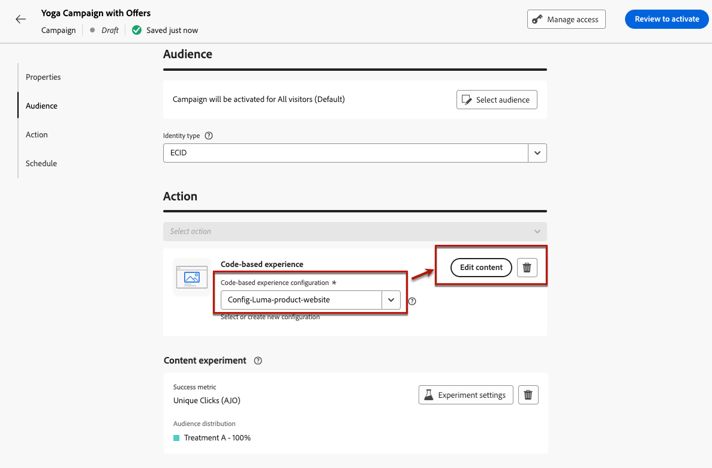

# Beslissing gebruiken in een op code gebaseerde ervaring met het experimenteren met inhoud {#experience-decisioning-uc}

In dit geval worden alle stappen beschreven die nodig zijn om Decisioning te gebruiken met het op code gebaseerde kanaal van [!DNL Journey Optimizer] .

>[!NOTE]
>
>De bestaande mogelijkheden voor het beheer van beslissingen worden niet ondersteund door het op code gebaseerde ervaringskanaal.

In dit voorbeeld bent u niet zeker of een specifieke rangschikkingsformule beter zal presteren dan de vooraf toegewezen aanbiedingsprioriteiten. Om te meten welke het beste voor uw doelpubliek presteert, creeert u een campagne gebruikend [&#x200B; experiment van de Inhoud &#x200B;](../content-management/content-experiment.md) waar u twee leveringsbehandelingen bepaalt:

* De eerste behandeling gebruikt **prioriteit** als het rangschikken methode.
* De tweede behandeling gebruikt **een formule** als het rangschikken methode.

>[!NOTE]
>
>Voor implementatiedetails op het testen en deduplicatie wanneer het gebruiken van besluit in op code-gebaseerde ervaringen, verwijs naar [&#x200B; deze pagina &#x200B;](../code-based/code-based-decisioning-implementations.md).

## Selectiestrategieën maken

Ten eerste moet u twee selectiestrategieën ontwikkelen: een met prioriteit als rangschikkingsmethode en een andere met een formule als rangschikkingsmethode.

>[!NOTE]
>
>U kunt ook losse-beslissingsitems maken zonder dat u een selectiestrategie hoeft te doorlopen. De voor elk onderdeel vastgestelde prioriteit is van toepassing.

### Een strategie maken met prioriteit

Volg de onderstaande stappen om de eerste selectiestrategie met prioriteit als rangordemethode te maken.

1. Maak een beslissingsitem. [&#x200B; leer hoe &#x200B;](items.md)

1. Stel de **[!UICONTROL Priority]** van het beslissingsitem in vergelijking met andere. Als een profiel voor meerdere items in aanmerking komt, krijgt het item met een hogere prioriteit voorrang boven andere items.

   {width="90%"}

   >[!NOTE]
   >
   >De prioriteit is een gegevenstype van gehele getallen. Alle attributen die geheelgegevenstypes zijn zouden geheelwaarden (geen decimalen) moeten bevatten.

1. Bepaal de geschiktheid van het besluitvormingspunt:

   * Bepaal publiek of regels om het punt tot specifieke profielen slechts te beperken. [Meer informatie](items.md#eligibility)

   * Stel de begrenzingsregels in om het maximumaantal keren te bepalen dat een aanbieding kan worden gepresenteerd. [Meer informatie](items.md#capping)

1. Herhaal indien nodig de bovenstaande stappen om aanvullende beslissingsitems te maken.

1. Creeer a **inzameling** waar uw besluitvormingspunt(en) zal worden omvat. [Meer informatie](collections.md)

1. Creeer a [&#x200B; selectiestrategie &#x200B;](selection-strategies.md#create-selection-strategy) en selecteer de [&#x200B; inzameling &#x200B;](collections.md) die de te overwegen aanbieding(en) bevat.

1. [&#x200B; kies de het rangschikken methode &#x200B;](#select-ranking-method) om de beste aanbieding voor elk profiel te selecteren. Selecteer in dit geval **[!UICONTROL Offer priority]** : als meerdere aanbiedingen in aanmerking komen voor deze strategie, gebruikt de engine voor besluitvorming de waarde die is ingesteld als **[!UICONTROL Priority]** in de aanbieding(en). [Meer informatie](selection-strategies.md#offer-priority)

   {width="90%"}

### Een andere strategie maken met behulp van een formule

Volg onderstaande stappen om de tweede selectiestrategie samen te stellen met een formule als waarderingsmethode te selecteren.

1. Maak een beslissingsitem. [&#x200B; leer hoe &#x200B;](items.md)

   <!--Do you need to set the same **[!UICONTROL Priority]** as for the first decision item, or it won't be considered at all?-->

1. Bepaal de geschiktheid van het besluitvormingspunt:

   * Bepaal publiek of regels om het punt tot specifieke profielen slechts te beperken. [Meer informatie](items.md#eligibility)

   * Stel de begrenzingsregels in om het maximumaantal keren te bepalen dat een aanbieding kan worden gepresenteerd. [Meer informatie](items.md#capping)

1. Herhaal indien nodig de bovenstaande stappen om aanvullende beslissingsitems te maken.

1. Creeer a **inzameling** waar uw besluitvormingspunt(en) zal worden omvat. [Meer informatie](collections.md)

1. Creeer a [&#x200B; selectiestrategie &#x200B;](selection-strategies.md#create-selection-strategy) en selecteer de [&#x200B; inzameling &#x200B;](collections.md) die de te overwegen aanbieding(en) bevat.

1. [&#x200B; kies de het rangschikken methode &#x200B;](#select-ranking-method) u wilt gebruiken om de beste aanbieding voor elk profiel te selecteren. Selecteer in dit geval **[!UICONTROL Formula]** om een specifieke berekende score te gebruiken om te bepalen welke geschikte aanbieding moet worden gedaan. [Meer informatie](selection-strategies.md#ranking-formula)

   {width="90%"}

## Een op code gebaseerde ervaringscampagne maken

<!--To present the best dynamic offer and experience to your visitors on your website or mobile app, add a decision policy to a code-based campaign.

Define two delivery treatments each containing a different decision policy.-->

Zodra u de twee selectiestrategieën vormde, creeer een code-gebaseerde ervaringscampagne waar u een verschillende behandeling voor elke strategie bepaalt, om te vergelijken welke het beste presteert.

1. Maak een campagne en selecteer de handeling **[!UICONTROL Code-base experience]** . [Meer informatie](../code-based/create-code-based.md)

1. Klik op de pagina met het campagneresamenvatting op **[!UICONTROL Create experiment]** om uw inhoudexperiment te configureren. [&#x200B; leer hoe &#x200B;](../content-management/content-experiment.md)

   {width="90%"}

1. Selecteer een op code gebaseerde configuratie in de overzichtspagina van de campagne en klik op **[!UICONTROL Edit content]** .

   {width="90%"}

1. Van het venster van de inhoudsuitgave, beginnen **Behandeling A** te personaliseren, klik **[!UICONTROL Edit code]**.

   {width="90%"}

1. Van de [&#x200B; coderedacteur &#x200B;](../code-based/create-code-based.md#edit-code), uitgezochte **[!UICONTROL Decision policy]**, klik **[!UICONTROL Add decision policy]** en vul de besluitvormingsdetails in. [Meer informatie](create-decision.md#add)

   {width="90%"}

1. Klik in de sectie **[!UICONTROL Strategy sequence]** op de knop **[!UICONTROL Add]** en kies **[!UICONTROL Selection strategy]** . [Meer informatie](create-decision.md#select)

   {width="80%"}

   >[!NOTE]
   >
   >U kunt ook **[!UICONTROL Decision item]** selecteren om afzonderlijke items toe te voegen zonder dat u een selectiestrategie hoeft te doorlopen. De voor elk onderdeel vastgestelde prioriteit is van toepassing.

1. Selecteer de eerste strategie die u hebt gemaakt, de strategie met prioriteit als waarderingsmethode.

   {width="90%"}

1. Sla de wijzigingen op en klik op **[!UICONTROL Create]** . De nieuwe beslissing wordt toegevoegd onder **[!UICONTROL Decision policy]** .

1. Klik op de knop **[!UICONTROL Insert policy]**. De code die overeenkomt met het beslissingsbeleid wordt toegevoegd. Voeg vervolgens alle kenmerken toe die u aan de code wilt toevoegen, inclusief profielkenmerken. [Meer informatie](create-decision.md#create-decision)

   {width="90%"}

1. Sla uw wijzigingen op.

1. Ga terug naar het venster van de inhoudsuitgave, selecteer + knoop om **Behandeling B** toe te voegen, het te selecteren en **[!UICONTROL Edit code]** te klikken.

   {width="90%"}

1. Herhaal stap 5 en 6 hierboven om een ander besluitvormingsbeleid tot stand te brengen en selecteer de tweede selectiestrategie die u creeerde - met de formule als rangschikkingsmethode. <!--Do you need to create exactly the same content to compare only the ranking method?-->

   {width="90%"}

1. Bewerk het gewenste beslissingsbeleid (zie de stappen 8 en 9 hierboven).

1. Sparen uw veranderingen en [&#x200B; publiceer uw code-gebaseerde-ervaringscampagne &#x200B;](../code-based/publish-code-based.md).

Na het in werking stellen van het experiment, spoor hoe uw campagnebehandelingen met het [&#x200B; experimentatiecampagnerapport &#x200B;](../reports/campaign-global-report-cja-experimentation.md) presteren.<!-- and [report on decisioning](cja-reporting.md).--> Vervolgens kunt u de resultaten van uw experiment interpreteren. [&#x200B; leer hoe &#x200B;](../content-management/get-started-experiment.md#interpret-results)

Als het resultaat overtuigend is:

* U kunt de behandeling doorvoeren met de best presterende classificatie voor al uw klanten.
* U kunt ook een nieuwe campagne maken met de selectiestrategie waarbij de best presterende waarderingsmethode wordt gerepliceerd.