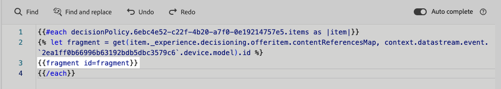

# Hefboomfragmenten in besluitvormingsbeleid {#fragments}

Als uw besluitvormingsbeleid besluitpunten met inbegrip van fragmenten bevat, kunt u deze fragmenten in de code van het besluitvormingsbeleid hefboomwerking. [ Leer meer op fragmenten ](../content-management/fragments.md)

>[!AVAILABILITY]
>
>Deze eigenschap is beschikbaar in Beperkte Beschikbaarheid voor de **op code-gebaseerde ervaring** en **e-mail** kanalen. Neem contact op met uw Adobe-vertegenwoordiger om toegang aan te vragen.

Stel bijvoorbeeld dat u verschillende inhoud wilt weergeven voor verschillende modellen van mobiele apparaten. Zorg ervoor u fragmenten die aan die apparaten beantwoorden aan het besluitvormingspunt toevoegde dat u in het besluitvormingsbeleid gebruikt. [ leer hoe ](items.md#attributes).

{width=70%}

Nadat u dit hebt gedaan, kunt u een van de volgende methoden gebruiken:

>[!BEGINTABS]

>[!TAB  neemt direct de code ] op

U plakt gewoon het codeblok hieronder in de code voor het beslissingsbeleid. Vervang `variable` door de fragment-id en `placement` door de fragmentverwijzingssleutel:

```handlebars

{{fragment id = variable}}
```

>[!TAB  volg de gedetailleerde stappen ]

1. Navigeer aan **[!UICONTROL Helper functions]** en voeg **** functie ` {{variable}}` aan de coderuit toe, waar u de variabele voor uw fragment kunt verklaren.

   

1. Gebruik de **Kaart** > **krijgt** functie `` om uw uitdrukking te bouwen. De kaart is het fragment waarnaar wordt verwezen in het beslissingsitem. De tekenreeks kan het apparaatmodel zijn dat u als **[!UICONTROL Fragment reference key]** hebt ingevoerd in het beslissingsitem.

   

1. U kunt ook een contextueel kenmerk gebruiken dat deze id van het apparaatmodel zou bevatten.

   

1. Voeg de variabele toe die u als fragment-id voor het fragment hebt gekozen.

   

>[!ENDTABS]

De fragment-id en de verwijzingssleutel worden geselecteerd in de sectie **[!UICONTROL Fragments]** van het beslissingsitem.

>[!WARNING]
>
>Als de fragmentsleutel onjuist is of als de fragmentinhoud niet geldig is, zal de rendering mislukken en een fout veroorzaken in de Edge-aanroep.

## Afbeeldingen bij gebruik van fragmenten {#fragments-guardrails}

**Simuleer inhoud en uitdrukkingsfragmenten in e-mail**

Voor het **E-mail** kanaal, de uitdrukkingsfragmenten verbonden aan een correcte vertoning van het besluitvormingspunt wanneer u **[!UICONTROL Send proof]** of wanneer de campagne wordt geactiveerd. **[!UICONTROL Simulate content]** geeft echter niet het expressiefragment van het beslissingsitem weer.

**Visuele fragmenten en besluitvormingspunten in e-mails**

U kunt geen a **[!UICONTROL Visual fragment]** aan een besluitpunt toewijzen, slechts **uitdrukkingsfragmenten** worden gesteund in deze context.

**punt van het Besluit en contextattributen**

Kenmerken van beslissingsitems en contextafhankelijke kenmerken worden standaard niet ondersteund in [!DNL Journey Optimizer] -fragmenten. In plaats daarvan kunt u echter algemene variabelen gebruiken, zoals hieronder beschreven.

Laten wij zeggen u de *sport* variabele in uw fragment wilt gebruiken.

1. Verwijs naar deze variabele in het fragment, bijvoorbeeld:

   ```text
   Elevate your practice with new {{sport}} gear!
   ```

1. Bepaal de variabele met **laat** functie binnen het blok van het besluitvormingsbeleid. In het voorbeeld hieronder, *sport* wordt bepaald met de attributen van het besluitvormingspunt:

   ```handlebars
   {#each decisionPolicy.13e1d23d-b8a7-4f71-a32e-d833c51361e0.items as |item|}}
   
   {{fragment id = get(item._experience.decisioning.offeritem.contentReferencesMap, "placement1").id }}
   {{/each}}
   ```

**de inhoudsbevestiging van het het puntfragment van het Besluit**

* Wegens de dynamische aard van deze fragmenten, wanneer gebruikt in een campagne, wordt de berichtbevestiging tijdens de verwezenlijking van de campagneinhoud overgeslagen voor fragmenten die in besluitpunten van verwijzingen worden voorzien.

* De validatie van de fragmentinhoud vindt alleen plaats tijdens het maken en publiceren van het fragment.

* Voor JSON-expressiefragmenten wordt de inhoud syntactisch gevalideerd bij het opslaan van het fragment. Validatiefouten worden weergegeven als waarschuwingen.

Tijdens runtime wordt de inhoud van de campagne (inclusief fragmentinhoud van besluitvormingsitems) gevalideerd. Als de validatie mislukt, wordt de campagne niet weergegeven.
