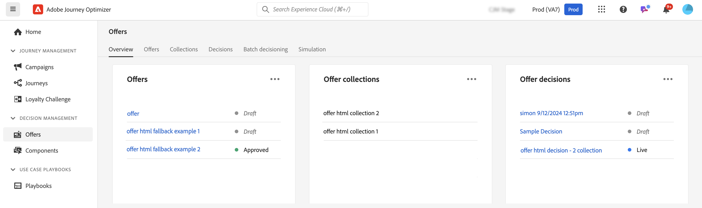

# Aan de slag met beslissingsmogelijkheden in [!DNL Journey Optimizer] {#gs-decision}

Dankzij de beslissingsmogelijkheden in [!DNL Journey Optimizer] kunt u op het juiste moment de beste aanbiedingen en persoonlijke ervaringen aan uw klanten aanbieden op alle aanraakpunten. Deze mogelijkheden vereenvoudigen personalisatie door een gecentraliseerde catalogus van marketingaanbiedingen en een geavanceerde besluitvormingsengine, die regels en rangschikkingscriteria gebruikt om de meest relevante inhoud voor elk individu te leveren.

Belangrijkste voordelen:

* Verbeterde campagneprestatie door persoonlijke aanbiedingen op meerdere kanalen te leveren,
* Verbeterde workflows: in plaats van meerdere verzendingen of campagnes te maken kunnen marketingteams de workflows verbeteren door één verzending te maken en de aanbiedingen in verschillende delen van de sjabloon te variëren,
* De controle over het aantal keren dat een aanbieding wordt getoond aan campagnes en klanten.

Momenteel biedt [!DNL Journey Optimizer] de twee hieronder beschreven kernoplossingen.

## Beslissing {#decisioning}

Ons besluitvormingskader van de volgende generatie, ontworpen om bestaande Journey Optimizer-workflows te verenigen en de basis te leggen voor het beheer van extra inhoudscatalogi. Beslissingsvoorstellen:

* Beheer van op schema gebaseerde itemcatalogus: vergroot de flexibiliteit door aangepaste metagegevens aan elke aanbieding te koppelen
* Flexibele inzamelingsregels: Eenvoudig groepsaanbiedingen voor toekomstige evaluatie op basis van verschillende criteria
* Bijgewerkt besluitvormingsbeleid en configuratie van de selectiestrategie: Herbruikbaarheid van besluitvormingscomponenten toestaan
* Experimentatiemogelijkheden: test beslissingslogica ten opzichte van andere inhoudcomponenten om de prestaties te meten

Het nemen van besluiten wordt momenteel gesteund in op code-gebaseerd ervaringskanaal.

➡️ [ worden begonnen met Beslissing ](../experience-decisioning/gs-experience-decisioning.md)

>[!NOTE]
>
>Om van besluitvormingsbeheer aan Beslissing te migreren, verwijs naar de [ migratiedocumentatie ](../experience-decisioning/migrate-to-decisioning.md) en [ gids van de Migratie API ](../experience-decisioning/decisioning-migration-api.md).

## Beslissingsbeheer {#decision-management}

Ons gevestigde kenmerk in Journey Optimizer, Beslissingsbeheer gebruikt een centrale bibliotheek van marketingaanbiedingen en een beslissingsengine die regels en beperkingen toepast op realtime klantprofielen, waarbij Adobe Experience Platform-gegevens worden gebruikt om het juiste aanbod op het juiste moment te leveren.

Beslissingsbeheer ondersteunt de volgende kanalen: E-mail, In-App-berichten, pushberichten, SMS en Direct-mail.

➡️ [ worden begonnen met het beheer van het Besluit ](../offers/get-started/starting-offer-decisioning.md)
