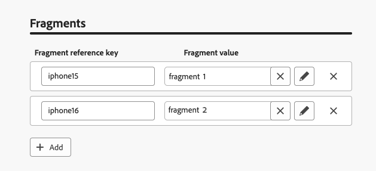
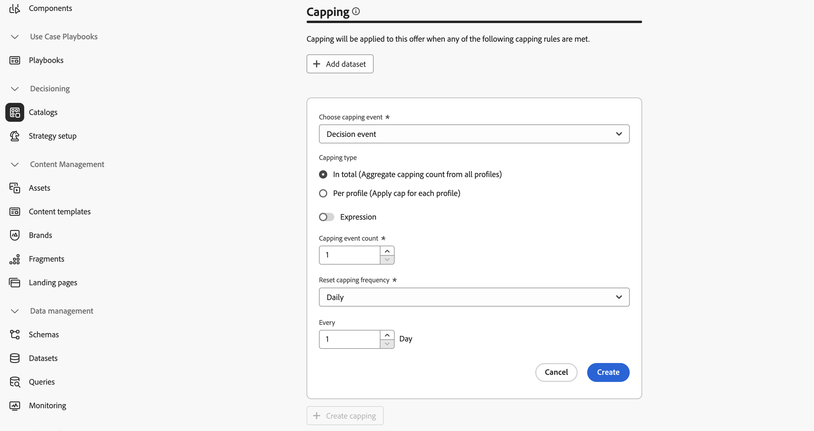

# Je eerste beslissingsobject maken {#items}

>[!CONTEXTUALHELP]
>id="ajo_exd_items"
>title="Beslissingsitems beheren"
>abstract="Met Journey Optimizer kunt u marketingaanbiedingen maken, ook wel &#39;beslissingsitems&#39; genoemd, die u kunt maken en indelen in een gecentraliseerde catalogus en verzamelingen. Momenteel worden alle gemaakte beslissingsitems geconsolideerd in één catalogus met &quot;voorstellen&quot;. Van dit scherm, kunt u tot het schema van de catalogus ook toegang hebben gebruikend **schema** knoop uitgeven en douanekenmerken voor uw besluitvormingspunten creëren."

Met Journey Optimizer kunt u marketingaanbiedingen maken, ook wel &#39;beslissingsitems&#39; genoemd, die u kunt maken en indelen in een gecentraliseerde catalogus en verzamelingen. Ze bestaan uit standaard- en aangepaste kenmerken die precies op uw behoeften zijn afgestemd. Bovendien, nemen zij profielbeperkingen op die u toestaan om te bepalen aan wie een besluitpunt kan worden getoond.

Alvorens een besluitvormingspunt tot stand te brengen, zorg ervoor u a **besluitvormingsregel** hebt gecreeerd als u voorwaarden wilt plaatsen om te bepalen aan wie het besluitpunt kan worden getoond. [ Leer hoe te om besluitvormingsregels ](rules.md) tot stand te brengen.

Als u een beslissingsitem wilt maken, navigeert u naar **[!UICONTROL Decisioning]** > **[!UICONTROL Catalogs]** en klikt u op **[!UICONTROL Create item]** . Vervolgens volgt u de stappen die in de onderstaande secties worden beschreven.

## De kenmerken van het beslissingsitem definiëren {#attributes}

>[!CONTEXTUALHELP]
>id="ajo_exd_item_priority"
>title="De prioriteit van het beslissingsitem definiëren"
>abstract="Als een profiel voor meerdere items in aanmerking komt, kan dit beslissingsitem met anderen worden vergeleken. Bij een hogere prioriteit krijgt de post voorrang boven andere."

Begin door de standaard en douanekenmerken van het besluitpunt te bepalen:

1. Geef een naam en een beschrijving op.
1. Begin- en einddatum opgeven. De beslissingsmotor zal het punt pas binnen deze data in overweging nemen.
1. Stel de **[!UICONTROL Priority]** van het beslissingsitem in vergelijking met andere als een profiel voor meerdere items in aanmerking komt. Bij een hogere prioriteit krijgt de post voorrang boven andere.

   >[!NOTE]
   >
   >De prioriteit is een gegevenstype van gehele getallen. Alle attributen die geheelgegevenstypes zijn zouden geheelwaarden (geen decimalen) moeten bevatten.

1. Het **gebied van Markeringen** staat u toe om Adobe Experience Platform Verenigde Markeringen aan uw besluitvormingspunten toe te wijzen. Op deze manier kunt u ze gemakkelijk classificeren en zoeken verbeteren. [ leer hoe te met markeringen ](../start/search-filter-categorize.md#tags) werken

1. Gebruik fragmenten om meerdere inhoud aan het beslissingsitem toe te voegen, bijvoorbeeld als u verschillende inhoud wilt weergeven voor verschillende modellen mobiele apparaten. [ Leer meer op fragmenten ](../content-management/fragments.md)

   >[!AVAILABILITY]
   >
   >Fragmenten in beslissingsitems zijn momenteel alleen beschikbaar voor een set organisaties (beperkte beschikbaarheid). Neem voor meer informatie contact op met uw Adobe-vertegenwoordiger.

   Selecteer in de sectie **[!UICONTROL Fragments]** de gepubliceerde fragmenten die u wilt gebruiken en wijs er een referentietoets aan toe. U kunt deze fragmenten vervolgens gebruiken in uw beslissingsbeleid. [ leer hoe ](create-decision.md#fragments)

   {width=70%}

   U kunt alleen gepubliceerde fragmenten selecteren en maximaal zes fragmenten toevoegen aan een beslissingsitem.

   >[!WARNING]
   >
   >Momenteel slechts [ uitdrukkingsfragmenten ](../personalization/use-expression-fragments.md) worden gesteund.
   >
   >Geneste fragmenten (fragmenten die verwijzen naar andere fragmenten) kunnen niet worden gebruikt. De goedkeuring van het besluitvormingspunt  zal ontbreken als u zulk een fragment toevoegt.

1. Aangepaste kenmerken opgeven (optioneel). Aangepaste kenmerken zijn specifieke kenmerken die zijn toegesneden op uw behoeften en die u kunt toewijzen aan een beslissingsitem. Zij worden bepaald in het de catalogusschema van besluitvormingspunten. [ leer hoe te met catalogi ](catalogs.md) werken

1. Wanneer de kenmerken van het beslissingsitem zijn gedefinieerd, klikt u op **[!UICONTROL Next]** .

## De geschiktheid van het beslissingsitem configureren {#eligibility}

>[!CONTEXTUALHELP]
>id="ajo_exd_item_constraints"
>title="Soorten publiek of beslissingsregels toevoegen"
>abstract="Standaard kunnen alle profielen in aanmerking komen voor het item voor een beslissing, maar u kunt het publiek of de regels gebruiken om het item te beperken tot specifieke profielen."

<!--
>"additional-url="https://experienceleague.adobe.com/en/docs/journey-optimizer/using/audiences-profiles-identities/audiences/about-audiences" text="Use audiences"
>additional-url="https://experienceleague.adobe.com/en/docs/journey-optimizer/using/decisioning/experience-decisioning/rules" text="Use decision rules"
-->

Standaard komen alle profielen in aanmerking om het beslissingsitem te ontvangen, maar u kunt het publiek of de regels gebruiken om het item te beperken tot specifieke profielen, beide oplossingen voor verschillende toepassingen. Vouw de onderstaande sectie uit voor meer informatie:

+++Het gebruiken van publiek versus besluitvormingsregels

In feite is de uitvoer van een publiek een lijst met profielen, terwijl een beslissingsregel een functie is die op aanvraag tegen één profiel wordt uitgevoerd tijdens het besluitvormingsproces.

* **Soorten publiek**: Op één kant, zijn het publiek een groep profielen van Adobe Experience Platform die een bepaalde logica aanpassen die op profielattributen en ervaringsgebeurtenissen wordt gebaseerd. Aanbiedingsbeheer berekent het publiek echter niet opnieuw, wat mogelijk niet up-to-date is wanneer het voorstel wordt gepresenteerd.

* **de regels van het Besluit**: Anderzijds, is een besluitvormingsregel gebaseerd op gegevens beschikbaar in Adobe Experience Platform en bepaalt aan wie een aanbieding kan worden getoond. Zodra geselecteerd in een aanbieding of een besluit voor een bepaalde plaatsing, wordt de regel uitgevoerd telkens als een besluit wordt genomen, die ervoor zorgt dat elk profiel de recentste en beste aanbieding krijgt.

+++

* Als u de presentatie van het beslissingsitem wilt beperken tot de leden van een of meer Adobe Experience Platform-doelgroepen, selecteert u de optie **[!UICONTROL Visitors who fall into one or multiple audiences]** en voegt u vervolgens een of meer soorten doelgroepen in het linkerdeelvenster toe en combineert u deze met de logische operatoren **[!UICONTROL And]** / **[!UICONTROL Or]** . [ leer meer over publiek ](../audience/about-audiences.md)

* Als u een specifieke beslissingsregel wilt koppelen aan het beslissingsitem, selecteert u **[!UICONTROL By rule]** en sleept u de gewenste regel van het linkerdeelvenster naar het centrale gebied. [ leer meer over besluitvormingsregels ](rules.md)

Wanneer u publiek of beslissingsregels selecteert, kunt u informatie over de geschatte gekwalificeerde profielen zien. Klik op **[!UICONTROL Refresh]** om gegevens bij te werken.

>[!NOTE]
>
>Profielramingen zijn niet beschikbaar wanneer regelparameters gegevens bevatten die niet in het profiel staan, zoals contextgegevens. Bijvoorbeeld, een toelatingsregel die het huidige weer om 80 graden vereist te zijn.

## Lijnen voor uitlijnen instellen {#capping}

>[!CONTEXTUALHELP]
>id="ajo_exd_item_capping_expression"
>title="Uitdrukking"
>abstract="In plaats daarvan kunt u uw eigen expressie definiëren door een statische waarde te gebruiken voor de afkapdrempel. Hierdoor kunt u de drempel dynamisch berekenen met behulp van beslissingskenmerken en/of externe kenmerken van een Adobe Experience Platform-gegevensset.   uitdrukkingen **van de regel van de Capping van 0} zijn momenteel beschikbaar als Beperkte Beschikbaarheid aan alle gebruikers.** Deze worden alleen ondersteund voor het type **[!UICONTROL In total]** capapping."

Afdekkingen worden gebruikt als beperking om het maximumaantal keren te bepalen dat een aanbiedingsobject kan worden aangeboden. Door het aantal keren dat gebruikers specifieke aanbiedingen krijgen te beperken, kunt u voorkomen dat uw klanten te veel vragen en zo elk aanraakpunt optimaliseren met de beste aanbieding. U kunt tot 10 titels voor een bepaald besluitpunt tot stand brengen.

>[!NOTE]
>
>
>De waarde van de afluisterteller kan tot 3 seconden duren om bij te werken. Stel bijvoorbeeld dat u een webbanner weergeeft die een aanbieding op uw website weergeeft. Als een bepaalde gebruiker in minder dan 3 seconden naar de volgende pagina van uw website bladert, wordt de tellerwaarde niet voor die gebruiker verhoogd.

Wanneer het vormen van het begrenzen van regels, kunt u attributen van verwijzingen voorzien die in de datasets van Adobe Experience Platform worden opgeslagen om drempels te bepalen. Als u een gegevensset wilt gebruiken, selecteert u deze in de sectie **[!UICONTROL Dataset]** .

>[!NOTE]
>
>Deze mogelijkheid is momenteel beschikbaar als een beperkte beschikbaarheid voor alle gebruikers. De gedetailleerde informatie over hoe te om het te gebruiken is beschikbaar in deze sectie: [ gegevens van Adobe Experience Platform van het Gebruik voor Beslissing ](../experience-decisioning/aep-data-exd.md)

Klik op de knop **[!UICONTROL Create capping]** en voer de onderstaande stappen uit om de uitlijningsregels voor het beslissingsitem in te stellen.

1. Definieer met welke **[!UICONTROL Capping event]** rekening wordt gehouden om de teller te verhogen.

   * **[!UICONTROL Decision event]** (standaardwaarde): het maximale aantal keer dat een aanbieding kan worden gepresenteerd.
   * **[!UICONTROL Impression]** (alleen binnenkomende kanalen): het maximale aantal keren dat de aanbieding aan een gebruiker kan worden weergegeven.
   * **[!UICONTROL Clicks]**: een gebruiker kan maximaal aantal keer op het beslissingsitem klikken.
   * **[!UICONTROL Custom event]**: U kunt een aangepaste gebeurtenis definiëren die wordt gebruikt om het aantal keren dat het item wordt verzonden, tot een maximum te beperken. U kunt bijvoorbeeld het aantal aflossingen beperken tot ze gelijk zijn aan 10.000 of tot een bepaald profiel één keer is afgelost. Om dit te doen, gebruik [ Adobe Experience Platform XDM ](https://experienceleague.adobe.com/docs/experience-platform/xdm/home.html?lang=nl){target="_blank"} schema&#39;s om een regel van de douanegebeurtenis te bouwen.

   >[!NOTE]
   >
   >Voor alle begrenzingsgebeurtenissen behalve beslissingsgebeurtenis, kan de terugkoppeling van het beslissingsbeheer niet automatisch worden verzameld, wat ertoe kan leiden dat de afspeelteller niet correct wordt verhoogd. Om ervoor te zorgen dat elke begrenzingsgebeurtenis wordt bijgehouden en in de afluisterteller wordt rekenschap gegeven, zorg ervoor dat het schema dat wordt gebruikt om ervaringsgebeurtenissen te verzamelen de correcte gebiedsgroep voor die gebeurtenis omvat. Gedetailleerde informatie over gegevensverzameling is beschikbaar in de Journey Optimizer-documentatie voor besluitvormingsbeheer:
   >* [ de gegevensinzameling van het Beheer van het Besluit ](data-collection/data-collection.md)
   >* [ vorm gegevensinzameling ](data-collection/schema-requirement.md)

1. Kies het type bijschrift:

   * Selecteer **[!UICONTROL In total]** om te bepalen hoe vaak het punt over het gecombineerde doelpubliek kan worden voorgesteld, betekenend over alle gebruikers. Als je bijvoorbeeld een elektronica-retailer bent met een &#39;tv-huis-deal&#39;, wil je dat het aanbod slechts 200 keer wordt teruggegeven voor alle profielen.

   * Selecteer **[!UICONTROL Per profile]** om te bepalen hoe vaak de aanbieding aan de zelfde gebruiker kan worden voorgesteld. Als je bijvoorbeeld een bank bent met een &#39;Platinum credit card&#39;-aanbieding, wil je niet dat dit voorstel meer dan vijf keer per profiel wordt weergegeven. U bent namelijk van mening dat als de gebruiker het aanbod vijf keer heeft gezien en er niet op heeft gereageerd, hij een grotere kans heeft om op het volgende beste aanbod in te gaan.

1. Definieer de grenswaarde voor uitlijnen. Hiervoor kunt u een statische waarde invoeren of de drempel berekenen met een expressie. Vouw de onderstaande secties uit voor meer informatie.

   +++Statische drempel

   Geef in het veld **[!UICONTROL Capping count limit]** het aantal keren op dat de aanbieding aan alle gebruikers of per profiel kan worden weergegeven, afhankelijk van het geselecteerde type aftopping. Het getal moet een geheel getal groter dan 0 zijn.

   U hebt bijvoorbeeld een aangepaste gebeurtenis voor het toewijzen van plafonds gedefinieerd, waarmee rekening wordt gehouden, zoals het aantal uitcheckgebeurtenissen. Als u 10 invoert in het veld **[!UICONTROL Capping count limit]** , worden er na 10 controles geen voorstellen meer verzonden.

   +++

   +++Expressiedrempel

   In plaats daarvan kunt u uw eigen expressie definiëren door een statische waarde te gebruiken voor de afkapdrempel. Hierdoor kunt u de drempel dynamisch berekenen met behulp van beslissingskenmerken en/of externe kenmerken van een Adobe Experience Platform-gegevensset.

   Een markeerteken kan bijvoorbeeld besluiten een vermenigvuldiger toe te voegen om de belichting aan te passen. Zo kunnen zij de beschikbare voorraad met twee vermenigvuldigen, zodat het aanbod aan tweemaal zoveel klanten kan worden getoond als de beschikbare eenheden. Deze benadering voorziet dat niet alle klanten zich zullen omzetten, waardoor een beter bereik wordt gewaarborgd zonder oververkoop.

   >[!NOTE]
   >
   >De het in kaart brengen van regel **uitdrukkingen** zijn momenteel beschikbaar als Beperkte Beschikbaarheid aan alle gebruikers. Deze worden alleen ondersteund voor het type **[!UICONTROL In total]** capapping.

   Als u een expressie wilt gebruiken, schakelt u de optie **[!UICONTROL Expression]** in en bewerkt u de expressie naar wens.

   

   +++

1. Stel in de vervolgkeuzelijst **[!UICONTROL Reset capping frequency]** de frequentie in waarmee de afspeelteller opnieuw wordt ingesteld. Hiervoor definieert u de tijdsperiode voor het tellen (dagelijks, wekelijks of maandelijks) en voert u het aantal dagen/weken/maanden van uw keuze in. Bijvoorbeeld, als u de het in kaart brengen telling om de twee weken wilt terugstellen, selecteer **[!UICONTROL Weekly]** van de overeenkomstige drop-down lijst en type **2** op het andere gebied.

   * De frequentie die teletstelletterugstellen gebeurt bij **12am UTC**, op de dag dat u of op de eerste dag van de week/maand bepaalde waar toepasselijk. De dag van het wekbegin is **Zondag**. Om het even welke duur u kiest kan **2 jaar** (d.w.z. het overeenkomstige aantal maanden, weken of dagen) niet overschrijden.

   * Na publicatie van het beslissingsobject kunt u de tijdsperiode (maandelijks, wekelijks of dagelijks) die u voor de frequentie hebt geselecteerd, niet meer wijzigen. U kunt de frequentietoewijzing nog steeds bewerken als het item de **[!UICONTROL Draft]** -status heeft en nog nooit eerder is gepubliceerd met de functie voor frequentiekoppeling ingeschakeld.

   * Er kan een buffertijd van maximaal 15 minuten zijn alvorens de gebeurtenissen naar frequentie het begrenzen van beperkingen worden geteld, of wanneer het besluitpunt wordt goedgekeurd, of wanneer het maximum wordt gecreeerd - welke laatste voorkomt.

1. Klik op **[!UICONTROL Create]** om het maken van de aftapregel te bevestigen. U kunt tot 10 regels voor één enkel besluitpunt tot stand brengen. Klik hiertoe op de knop **[!UICONTROL Create capping]** en herhaal de bovenstaande stappen.

   

<!--* Identifying how many times a given customer has been shown a decision item. 
If a marketer wants to determine how many times a specific customer has been shown an offer, they can do that. Go to Profiles menu, Attributes tab. You'll see all counter values. The alphanumeric string is associated to the offer. To make the map, go to an item, in the URL check the last alphanumeric strings. D stands for day, w stands for week, m for month. "Ce" custom event-->

## Het beslissingsonderdeel beoordelen en goedkeuren {#approve}

1. Als de subsidiabiliteits- en bijschilderingsregels voor het beslissingsonderdeel zijn gedefinieerd, klikt u op **[!UICONTROL Next]** om het onderdeel te bekijken en op te slaan.

1. Het beslissingsitem wordt nu in de lijst weergegeven, met de status **[!UICONTROL Draft]** . Wanneer het klaar is om aan profielen te worden voorgesteld, klik de ellipsieknoop en selecteer **[!UICONTROL Approve]**.

   

## Beslissingsitems beheren {#manage}

Van de lijst van besluitvormingspunten, kunt u een besluitpunt uitgeven, zijn status veranderen (**Ontwerp**, **Goedgekeurd**, **Gearchiveerd**), het dupliceren of schrappen.

Als u een beslissingsonderdeel wilt wijzigen, opent u het, brengt u de wijzigingen aan en slaat u het op.

Als u een beslissingsitem selecteert of op de knop Ovaal klikt, worden de hieronder beschreven handelingen ingeschakeld.

* **[!UICONTROL Approve]**: stelt de status van het beslissingsitem in op Goedgekeurd.
* **[!UICONTROL Undo approve]**: stelt de status van het beslissingsitem weer in op **[!UICONTROL Draft]** .
* **[!UICONTROL Duplicate]**: hiermee maakt u een keuze-item met identieke kenmerken en beperkingen. Het nieuwe item heeft standaard de **[!UICONTROL Draft]** -status.
* **[!UICONTROL Delete]**: hiermee verwijdert u het beslissingsitem uit de lijst.

  >[!IMPORTANT]
  >
  >Nadat de beslissing is verwijderd, zijn het item en de inhoud ervan niet meer toegankelijk. Deze handeling kan niet ongedaan worden gemaakt.

  Goedgekeurde aanbiedingen kunnen niet worden verwijderd als ze in een collectie of een beslissing worden gebruikt. Als u ze wilt verwijderen, wijzigt u de status in Concept. Klik hiertoe op de knop voor ovaal en selecteer **[!UICONTROL Undo approve]** .

  

* **[!UICONTROL Archive]**: stelt de status van het beslissingsitem in op **[!UICONTROL Archived]** . Het beslissingsitem is nog steeds beschikbaar in de lijst, maar u kunt de status niet terugzetten op **[!UICONTROL Draft]** of **[!UICONTROL Approved]** . U kunt deze alleen dupliceren of verwijderen.

