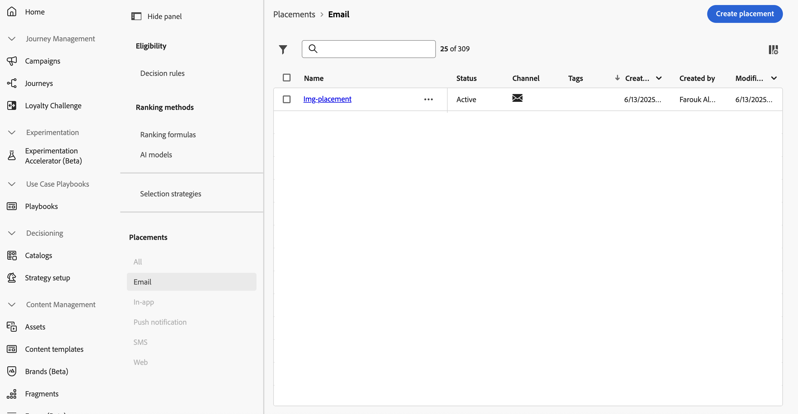

# Werken met stages {#create-decision}

## Informatie over plaatsingen {#about}

Een plaatsing is een container die wordt gebruikt om besluitpunten te tonen. Het helpt ervoor te zorgen dat de juiste aanbiedingsinhoud op de juiste plaats binnen uw bericht verschijnt.

Wanneer u een besluitvormingsbeleid aan een e-mail toevoegt, moet u een plaatsing aan de component associëren die de teruggekeerde besluitpunten zal tonen. Zo kunt u bijvoorbeeld de prestaties van beslissingstitems bijhouden op verschillende plaatsen in de rapportage.

De lijst met plaatsen is toegankelijk in het menu **[!UICONTROL Strategy setup]** . Er zijn filters beschikbaar waarmee u plaatsingen kunt ophalen op basis van een specifiek kanaaloppervlak of specifieke codes.

>[!NOTE]
>
>Plaatsen zijn momenteel alleen beschikbaar voor het e-mailkanaal.

## Een plaatsing maken {#create}

Voer de volgende stappen uit om een plaatsing te maken:

1. Blader naar het menu **[!UICONTROL Strategy setup]** , selecteer **[!UICONTROL Email]** en klik op de knop **[!UICONTROL Create placement]** .

   U kunt een plaatsing ook direct van de e-mailontwerper tot stand brengen wanneer het toevoegen van een besluitvormingsbeleid. [&#x200B; Leer hoe te om een plaatsing aan een e-mailcomponent &#x200B;](../experience-decisioning/create-decision.md#save) te associëren

1. Definieer de eigenschappen van de plaatsing:

   

   * **[!UICONTROL Name]**: De naam van de plaatsing. Zorg ervoor dat u een betekenisvolle naam definieert om deze eenvoudiger op te halen.
   * **[!UICONTROL Description]**: Een beschrijving van de plaatsing.
   * **[!UICONTROL Tags]**: wijs Adobe Experience Platform Verenigde Markeringen aan de plaatsing toe. Op deze manier kunt u ze gemakkelijk classificeren en zoeken verbeteren. [&#x200B; leer hoe te met markeringen &#x200B;](../start/search-filter-categorize.md#tags) werken
   * **[!UICONTROL Channel]**: Het kanaal waarvoor de plaatsing wordt gebruikt. Plaatsen zijn momenteel alleen beschikbaar voor e-mails.
   * **[!UICONTROL Channel configuration]**: Koppel een kanaalconfiguratie aan de plaatsing. [&#x200B; leer hoe te de configuraties van het opstellingskanaal &#x200B;](../configuration/channel-surfaces.md).

1. Klik op **[!UICONTROL Create]**.

Zodra de plaatsing wordt gecreeerd, toont het in de plaatsingslijst wanneer het toevoegen van een besluitvormingsbeleid in e-mail. U kunt het selecteren om zijn eigenschappen te tonen en het uit te geven. [&#x200B; Leer hoe te om besluitvormingsbeleid tot stand te brengen &#x200B;](../experience-decisioning/create-decision.md)

