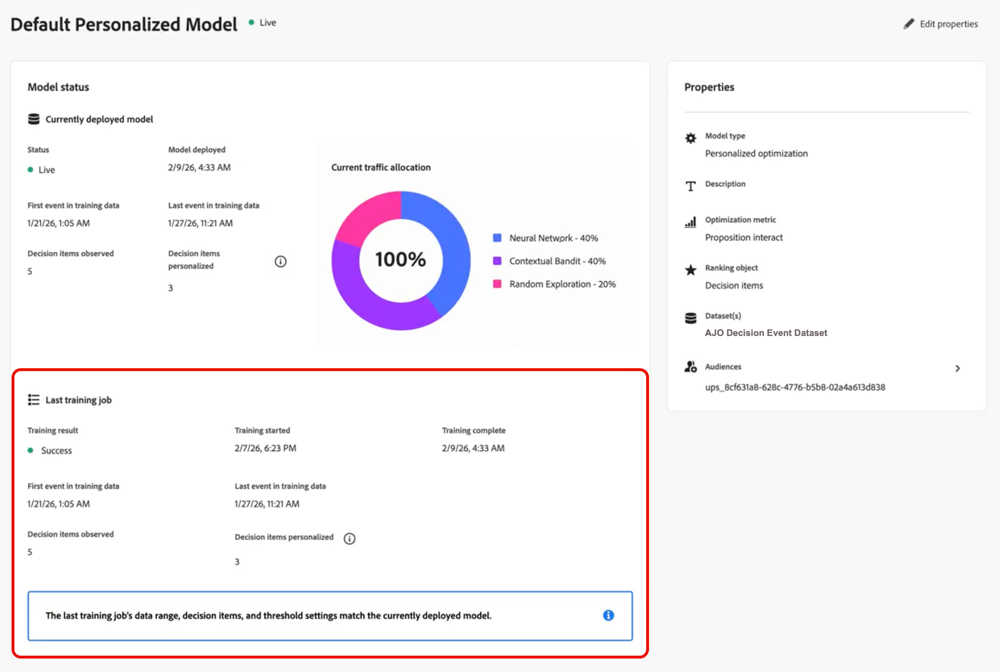

# Uw AI-modellen controleren {#ai-model-observability}

Of u een tellers, gegevenswetenschapper, of beslissingsbeheerder bent, die begrijpt hoe uw gepersonaliseerde optimalisatiemodellen presteren en gedraagt helpt u de beste aanbiedingen voor elke klant selecteren gebruikend AI.

Hiervoor kunt u de gezondheid, de trainingsstatus en de evolutie van uw AI-modellen rechtstreeks in [!DNL Journey Optimizer] volgen.

Dit geeft u een duidelijke mening van of uw model werkt, toen het het laatst werd opgeleid, wat tijdens opleiding gebeurde, hoe het uw bedrijfsresultaat (bijvoorbeeld, omzettingen of opbrengst) drijft, en problemen oplost wanneer het niet <!-- (for example, unexpected decision item count, training data date range, or insufficient events)--> werkt.

>[!AVAILABILITY]
>
>Momenteel wordt dit vermogen gesteund voor [ gepersonaliseerde optimalisering ](personalized-optimization-model.md) slechts modellen.

➡️ [Ontdek deze functie in video](#video)

## De trainingsstatus weergeven {#from-ai-model-list}

Als een model eenmaal is ingesteld op live, gaat het een doorlopende levenscyclus in: er worden gegevens verzameld en het model wordt regelmatig opnieuw opgeleid om de rangschikking van aanbiedingen te optimaliseren. U kunt de trainingsstatus van uw gepersonaliseerde optimalisatiemodellen controleren in de lijst met AI-modellen.

1. Ga naar **[!UICONTROL Decisioning]** > **[!UICONTROL Strategy setup]** > **[!UICONTROL AI models]** om de voorraad van het AI-model te openen.

1. U kunt al uw beschikbare AI-modellen en hun status bekijken.

1. Voor elk **[!UICONTROL Live]** AI-model van het gepersonaliseerde optimalisatietype kunt u de volgende twee kolommen zien:
   * wanneer de laatste trainingsbaan liep (**[!UICONTROL Last trained]**), en
   * of elk model met succes heeft getraind of niet (**[!UICONTROL Training result]**).

   

   Dit staat u toe om modellen snel te identificeren die verder onderzoek of het oplossen van problemen vergen.

## Toegang tot een modelstatusrapport {#access-ai-model-details}

Klik in de lijst in een gepersonaliseerd AI-model voor optimalisatie. Hierna kunt u de onderstaande elementen bekijken:

* **[!UICONTROL Currently deployed model]** - deze sectie toont het momenteel opgestelde model, toen het werd opgesteld, welke datumwaaier van gegevens het gebruikt, hoeveel besluitvormingspunten (aanbiedingen) inbegrepen en gepersonaliseerd zijn, en de huidige verkeerstoewijzing over submodellen <!-- (random exploration, new offer booster?, contextual bandit, neural network)-->.

  

  In dit voorbeeld, werd het model getraind op vijf besluitvormingspunten, en het model heeft genoeg verkeer om gepersonaliseerde voorspellingen voor drie van de besluitvormingspunten te ontwikkelen. De resterende twee beslissingselementen worden willekeurig betekend.

  U kunt ook zien dat het model momenteel 40% van verkeer aan het gepersonaliseerde neurale netwerk, 40% van verkeer aan de contextafhankelijke bandiet, en 20% van verkeer aan willekeurige exploratie toewijst.

* **[!UICONTROL Last training job]** - In deze sectie wordt de status van de laatste trainingstaak tijdens het uitvoeren weergegeven, en eventuele foutberichten. [ leer meer over foutenstaten ](#check-for-error-states)

  

  In dit voorbeeld kunt u zien dat het geïmplementeerde model overeenkomt met de trainingstaak zoals u had verwacht.

* **[!UICONTROL Properties]** - Deze sectie toont de eigenschappen van het model, zoals de gebruikte dataset, optimalisatiemetrisch, en het publiek dat wordt gebruikt om het gepersonaliseerde optimalisatiemodel te trainen.

  

  Klik op **[!UICONTROL Edit properties]** om deze elementen te wijzigen. U wordt omgeleid naar het scherm voor het maken van het AI-model. [Meer informatie](create-ai-models.md)

* **[!DNL Model performance]** - Deze sectie toont de prestaties van elke arm van het model in tijd, zoals de verkeerstoewijzing en de omzettingssnelheid voor elk submodel. U kunt tussen **laatste 7 dagen** en **laatste 30 dagen** van een knevel voorzien. De lift en de statistische significantie zijn de belangrijkste indicatoren om te bepalen of het model daadwerkelijk uw marketingresultaten verbetert.

  

  In dit voorbeeld ziet u dat de gepersonaliseerde submodellen in de afgelopen 30 dagen meer dan 60% opvallen in de conversiekoers, en deze opkomst is statistisch significant, wat betekent dat dit AI-model een invloed heeft op uw bedrijf.

* **[!UICONTROL Model traffic allocation over time]** - Deze sectie laat zien hoe het model zich in de loop der tijd heeft ontwikkeld. Wanneer een model eerst wordt opgesteld, is 100% van verkeer willekeurig omdat geen aanbiedingsgegevens nog zijn verzameld. Na de eerste omleiding verschuift het verkeer gewoonlijk naar de gepersonaliseerde armen.

  

  In dit voorbeeld, kunt u zien dat de verkeerstoewijzing van 100% willekeurige exploratie naar neuraal netwerk en contextueel bandverkeer is verschoven aangezien het model in tijd werd heropgeleid.

## Trainingsfouten begrijpen {#check-for-error-states}

Voer de onderstaande stappen uit om foutgegevens weer te geven voor een gepersonaliseerd AI-model waarvan de laatste trainingtaak is mislukt.

1. Klik in het model in de lijst. De details van de modelstatus worden weergegeven.

   {width="95%"}

   In dit voorbeeld ziet u dat er geen model is geïmplementeerd omdat de laatste trainingstaak is mislukt.

   >[!NOTE]
   >
   >Wanneer geen model wordt opgesteld, worden de besluitvormingsverzoeken gediend gebruikend eenvormige willekeurige verkeerstoewijzing.

1. Doorloop de foutdetails in de sectie **[!UICONTROL Last training job]** .

   {width="70%"}

   Een opleidingsbaan ontbreekt gewoonlijk wanneer er geen terugkoppelt gebeurtenissen in de dataset zijn die u voor dit model selecteerde. Het betekent dat u de dataset moet bevolken of een nieuwe dataset met aangewezen omzettingsgebeurtenissen selecteren.

1. U kunt controleren welke dataset in het model **[!UICONTROL Properties]** wordt geselecteerd. Klik op **[!UICONTROL Edit properties]** om een andere gegevensset te selecteren. [Meer informatie](create-ai-models.md)

   {align="left" width="45%"}

## Veelgestelde vragen {#faq}

+++ Welke AI modellen kan ik controleren?

AI modelcontrole wordt momenteel gesteund voor [ gepersonaliseerde optimalisering ](personalized-optimization-model.md) slechts modellen. Andere het rangschikken modeltypes stellen nog niet het rapport van de modelstatus bloot.
+++

+++ Waarom is de trainingsbaan van mijn model mislukt?

Trainingstaken mislukken vaak wanneer de gegevensset die voor het model is geselecteerd, geen of zeer weinig feedbackgebeurtenissen (conversie) bevat. Controleer de sectie **[!UICONTROL Last training job]** op de foutdetails en bekijk vervolgens de **[!UICONTROL Properties]** -code van het model om de gegevensset en optimalisatiemetrische gegevens te bevestigen. Vul de dataset met de juiste gebeurtenissen of [ selecteer een verschillende dataset ](create-ai-models.md) met aangewezen omzettingsgegevens.
+++

+++ Hoe verhoudt het toezicht op AI-modellen zich tot campagne- en reisrapporten?

Controle van AI-modellen verschilt van rapportage van campagne of reizen. Een enkel AI-model kan voor meerdere campagnes of meerdere reizen worden gebruikt, en uit campagne- of reisrapporten blijkt niet welk model voor een bepaalde levering is gebruikt. Gebruik de AI modelstatus controle om het model zelf te begrijpen en te controleren; gebruik [ campagnerapporten ](../../reports/campaign-global-report-cja.md) en [ reisrapporten ](../../reports/journey-global-report-cja.md) voor levering-vlakke metriek.
+++

+++ Mijn optimalisatiemetrisch is ononderbroken metrische als opbrengst of ordewaarde, niet binair metrisch zoals kliks of omzettingen. Hoe interpreteer ik de gerapporteerde waarden van Omzettingen en Omzettingstarief?

Bij gebruik van een continue metrische waarde zoals omzet of orderwaarde probeert het model de geschatte waarde te voorspellen die aan de presentatie van een bepaalde aanbieding is gekoppeld (niet de waarschijnlijkheid van omzetting). De gerapporteerde &quot;Omzettingen&quot;-waarde is de totale opbrengsten (of waarde van de opdracht) die aan de geregistreerde aanbiedingsschermen voor elke modeltak zijn gekoppeld. De gerapporteerde &quot;Omzetsnelheid&quot; is de omrekeningswaarde gedeeld door de waarde voor beeldschermen en kan 100% overschrijden in het geval van doorlopende metingen.
+++

+++ Wat is &quot;Lift significant&quot;?

Liftsignificantie is de statistische significantie van de gerapporteerde lift versus de willekeurige exploratie. De significantie wordt berekend aan de hand van een Chi-kwadraat-test van proportionele verschillen, die een identiek resultaat oplevert voor de berekening van de significantie van een Z-test voor twee populatiepercentages.
+++

+++ Wat is het model van de Gini-index? Wat is een &quot;goede&quot;waarde van de index van Gini?

Het model Gini-index (ook wel een Gini-coëfficiënt genoemd) is een offline meeteenheid voor de voorspellende kracht van een model. De modelGini-index varieert van 0 (geen voorspellende kracht) tot 1 (voorspelt perfect de conversie of de metrische waarde voor elke aanbieding voor elke klant). Er is geen universele &quot;goede&quot; Gini-indexwaarde, omdat verschillende gevallen van beslissingsgebruik resulteren in verschillend gebruikersgedrag en daarom verschillende modelresultaten. Binnen hetzelfde gebruiksgeval geven hogere Gini-indexwaarden een hoger kwaliteitsmodel aan.
+++

+++ Hoe wordt de Gini-index berekend?

De Gini-index voor elke modelarm wordt anders berekend, afhankelijk van het feit of de optimalisatiemetrisch binair of doorlopend is:

**Binaire optimalisering metrische** (b.v. kliks, orden): De index van Gini wordt gegevens verwerkt gebaseerd op het gebied onder de kromme (AUC) van de ontvanger-werkende karakteristieke kromme (ROC), normaal die als ROC AUC of eenvoudig AUC voor kort wordt bedoeld. De AUC van de ROC varieert van 0.5 (willekeurig model met nul voorspellend vermogen) tot 1.0 (perfecte voorspellende macht). ROC AUC wordt omgezet in een index van Gini gebruikend de formule Gini = 2 x (ROC AUC) - 1.

**Ononderbroken optimalisering metrische** (b.v. opbrengst, ordewaarde): De index van Gini wordt gegevens verwerkt gebaseerd op het gebied onder de kromme Lorenz verbonden aan de cumulatieve voorspelde positieven van het model tegenover de cumulatieve ware positieven in de bevolking. Het oppervlak onder de Lorenz-curve loopt van 0,0 (perfect voorspellend vermogen) tot 0,5 (willekeurig model met een voorspellend vermogen van nul). Lorenz AUC wordt in een Gini-index omgezet met de formule Gini = 1 - 2 x (Lorenz AUC).
+++

+++ Wat is een betere maatstaf voor modelkwaliteit: Gini index of Lift / Lift significant?

Doorgaans worden online metingen van modelkwaliteit, zoals het belang van lift en lift, beschouwd als de &quot;gouden standaardmethode&quot; voor het meten van de kwaliteit van het model. Gini-indexen worden gerapporteerd om een extra gegevenspunt te bieden voor teams van klantgegevens die beslissingsmodellen evalueren.
+++

<!--
## Understanding statuses and errors {#statuses-errors}

* **Success** – The latest training job completed successfully. The model is trained and deployed for ranking.
* **Failed** – The latest training job failed (for example, no events in the datasets). The UI shows an error message and a request ID; use these when troubleshooting or contacting support.
* **In progress** – A training job is running. Some metrics may be temporarily unavailable until it finishes.
* **Pending** – No result yet (for example, model recently activated or settings recently changed).

If no model has been successfully deployed yet, the "currently deployed model" section and some performance fields will be empty or show the initial-state messaging.
-->

## Hoe kan ik-video {#video}

Leer hoe u uw AI-classificatiemodellen kunt controleren en de trainingsstatus en -prestaties in [!DNL Journey Optimizer] kunt interpreteren.

>[!VIDEO](https://video.tv.adobe.com/v/3479849?quality=12)

## Gerelateerde documentatie {#related}

* [AI-modellen](ai-models.md)
* [Gepersonaliseerd optimalisatiemodel](personalized-optimization-model.md)
* [AI-modellen maken](create-ai-models.md)
* [Een gegevensset maken om gebeurtenissen te verzamelen](../data-collection/create-dataset.md)
