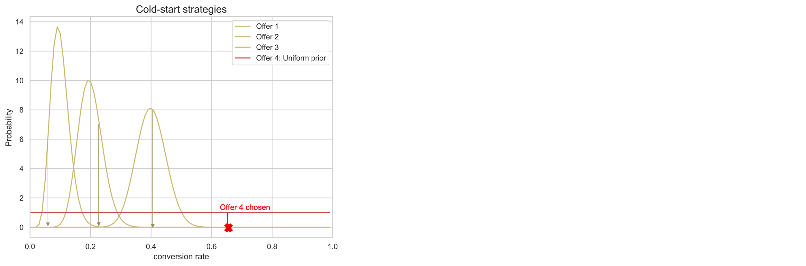

# Modellen voor automatische optimalisatie {#auto-optimization-model}

Een model voor automatische optimalisatie is bedoeld voor aanbiedingen die het rendement (KPI&#39;s) maximaliseren dat door zakelijke klanten is ingesteld. Deze KPI’s kunnen de vorm aannemen van omrekeningskoersen, inkomsten, enz. Op dit punt, richt de auto-optimalisering zich op optimaliserend aanbiedingskliks met aanbiedingsomzetting als ons doel. Automatisch optimaliseren is niet-gepersonaliseerd en optimaliseert op basis van &#39;algemene&#39; prestaties van de aanbiedingen.

## Gegevensvereisten

Om een model voor automatische optimalisatie te trainen, moet de dataset aan de volgende minimumvereisten voldoen:

* Ten minste 2 aanbiedingen in de dataset moeten minstens 100 vertoningsgebeurtenissen en 5 klikgebeurtenissen binnen de laatste 14 dagen hebben.
* Aanbiedingen met minder dan 100 beeldschermen en/of 5 klikgebeurtenissen in de afgelopen 14 dagen worden door het model behandeld als nieuwe aanbiedingen, en komen alleen in aanmerking om door het exploratiebandit te worden gediend.
* Aanbiedingen met meer dan 100 beeldschermen en 5 klikgebeurtenissen in de afgelopen 14 dagen worden door het model behandeld als bestaande aanbiedingen, en komen in aanmerking om door zowel exploratie- als exploitatiepunten te worden gediend.

Tot de eerste keer dat een model voor automatische optimalisatie wordt getraind, worden aanbiedingen binnen een selectiestrategie met behulp van een model voor automatische optimalisatie willekeurig aangeboden.

## Beperkingen {#limitations}

Voor het gebruik van modellen voor automatische optimalisatie voor besluitvormingsbeheer gelden de onderstaande beperkingen:

<!--* Auto-optimization models do not work with the Batch Decisioning API.-->
* Feedback die nodig is om het model te maken, moet worden verzonden als een ervaringsgebeurtenis. Deze mag niet automatisch via [!DNL Journey Optimizer] -kanalen worden verzonden.

## Terminologie {#terminology}

De volgende termen zijn handig wanneer u het over automatisch optimaliseren hebt:

* **Meervoudig-gewapende bandit**: Een [&#x200B; multi-gewapende bandit &#x200B;](https://en.wikipedia.org/wiki/Multi-armed_bandit){target="_blank"} benadering van optimalisatiesaldi verkennend leren en exploitatie van dat leren.

* **Thomson bemonstering**: De steekproef van Thompson is een algoritme voor online besluitvormingsproblemen waar de acties opeenvolgend op een manier worden genomen die tussen het exploiteren van wat moet in evenwicht brengen om directe prestaties te maximaliseren en te investeren om nieuwe informatie te verzamelen die toekomstige prestaties kan verbeteren. [Meer informatie](#thompson-sampling)

* [**de distributie van Beta** &#x200B;](https://en.wikipedia.org/wiki/Beta_distribution){target="_blank"}: Reeks ononderbroken [&#x200B; kansverdelingen &#x200B;](https://en.wikipedia.org/wiki/Probability_distribution){target="_blank"} die op het interval [ 0 worden bepaald, ] [&#x200B; &#x200B;](https://en.wikipedia.org/wiki/Statistical_parameter){target="_blank"} door twee positieve [&#x200B; vormparameters &#x200B;](https://en.wikipedia.org/wiki/Shape_parameter){target="_blank"} wordt bepaald.

## Thompson Sampling {#thompson-sampling}

Het algoritme dat aan auto-optimalisering ten grondslag ligt is **Thompson bemonstering**. In deze sectie bespreken we de intuïtie achter Thompson-steekproeven.

[&#x200B; Thompson bemonstering &#x200B;](https://en.wikipedia.org/wiki/Thompson_sampling){target="_blank"}, of Badesische banden, is een Bayesiaanse benadering van het multi-gewapende bandit probleem.  Het basisidee is de gemiddelde beloning 𝛍 van elk aanbod als a **willekeurige variabele** te behandelen en de gegevens te gebruiken die wij tot dusverre hebben verzameld, om ons &quot;geloof&quot;over de gemiddelde beloning bij te werken. Dit &quot;geloof&quot;wordt vertegenwoordigd wiskundig door a **posterior kansdistributie** - hoofdzakelijk een waaier van waarden voor de gemiddelde beloning, samen met de plausibiliteit (of de waarschijnlijkheid) dat de beloning die waarde voor elk aanbod heeft. Dan, voor elk besluit, zullen wij **een punt van elk van deze posterior beloningsverdelingen** steekproef en zullen selecteren de aanbieding waarvan bemonsterde beloning de hoogste waarde had.

Dit proces wordt geïllustreerd in onderstaande afbeelding, waar we drie verschillende aanbiedingen hebben. Aanvankelijk hebben we geen bewijs van de gegevens en we gaan ervan uit dat alle aanbiedingen een uniforme posterior-beloningspreiding hebben. We nemen een monster van de posterior beloningsdistributie van elk aanbod. Het voorbeeld dat u hebt geselecteerd bij de distributie van Aanbieding 2, heeft de hoogste waarde. Dit is een voorbeeld van **exploratie**. Na het tonen van Aanbieding 2, verzamelen wij om het even welke potentiële beloning (bijvoorbeeld omzetting/geen-omzetting) en werken de posterior distributie van Aanbieding 2 bij gebruikend Bayes Theorem zoals hieronder verklaard.  We zetten dit proces voort en werken de posterior distributies bij telkens wanneer een aanbieding wordt getoond en de beloning wordt geïnd. In het tweede cijfer, wordt Aanbieding 3 geselecteerd - hoewel Aanbieding 1 de hoogste gemiddelde beloning heeft (zijn posterior beloningsdistributie is het verst naar rechts), heeft het proces van bemonstering van elke distributie ertoe geleid dat wij een schijnbaar suboptimale Aanbieding 3 kozen. Daarmee geven we onszelf de kans om meer te leren over de werkelijke beloningsverdeling van Aanbieding 3.

Aangezien meer monsters worden verzameld, neemt het vertrouwen toe en wordt een nauwkeuriger schatting van de mogelijke beloning verkregen (die overeenkomt met een kleinere beloningsverdeling). Dit proces om onze overtuigingen bij te werken aangezien het meer bewijsmateriaal beschikbaar wordt is gekend als **Bayesiaanse Inferentie**.

Uiteindelijk, als één aanbieding (b.v. Aanbieding 1) een duidelijke winnaar is, zal zijn posterior beloningsdistributie van anderen worden gescheiden. Op dit moment zal de in de steekproef opgenomen beloning van aanbod 1 voor elk besluit waarschijnlijk de hoogste zijn, en we zullen er met een hogere waarschijnlijkheid voor kiezen. Dit is **exploitatie** - wij hebben een sterk geloof dat Aanbieding 1 het beste is, en zo wordt het gekozen om beloningen te maximaliseren.

**Figuur 1**: *voor elk besluit, steekproef wij een punt van de posterior beloningsverdelingen. Het aanbod met de hoogste steekproefwaarde (omrekeningskoers) wordt gekozen. In de eerste fase hebben alle aanbiedingen een uniforme verdeling, aangezien we geen enkel bewijs hebben van de omrekeningskoersen van de aanbiedingen op basis van de gegevens. Terwijl we meer monsters verzamelen, worden de posterior distributies smaller en nauwkeuriger. Uiteindelijk, zal de aanbieding met de hoogste omzettingspercentages elke keer worden gekozen.*

+++**Technische Details**

Om distributies te berekenen/bij te werken, gebruiken wij **Zeggen Theorem**. Voor elke aanbieding ***i***, willen wij hun ***P (𝛍 i berekenen | gegevens)***, d.w.z. voor elke aanbieding ***i***, hoe waarschijnlijk is een beloningswaarde **𝛍i**, gezien de gegevens die wij tot nu toe voor die aanbieding hebben verzameld.

Van Bayes Theorem:

***Posterior = Waarschijnlijkheid * Voorafgaand***

De **vroegere waarschijnlijkheid** is de aanvankelijke gok over de waarschijnlijkheid om een output te veroorzaken. De waarschijnlijkheid, nadat één of ander bewijsmateriaal is verzameld, is gekend als **achterste waarschijnlijkheid**. 

De auto-optimalisering wordt ontworpen om binaire beloningen (klik/geen-klik) te overwegen. In dit geval, vertegenwoordigt de waarschijnlijkheid het aantal successen van de proeven van N en door a **Binomiale distributie** gemodelleerd. Voor sommige waarschijnlijkheidsfuncties, als u een bepaalde vroegere kiest, uiteindelijk is de achter-achter in de zelfde distributie zoals vroeger. Zulk vroeger dan wordt genoemd a **conjugaat voorafgaand**. Dit soort van vroeger maakt de berekening van posterior distributie zeer eenvoudig. De **distributie van Beta** is een conjugaat voorafgaand aan de binomiale waarschijnlijkheid (binaire beloningen), en is zo een geschikte en redelijke keus voor de vroegere en posterior kansverdelingen.De distributie van Beta neemt twee parameters, ***α*** en ***β***. Deze parameters kunnen worden beschouwd als het aantal successen en mislukkingen en de gemiddelde waarde die wordt gegeven door:

De functie van de Waarschijnlijkheid zoals wij hierboven verklaarden wordt gemodelleerd door een Binomiale distributie, met s successen (omzettingen) en f mislukkingen (geen-omzettingen) en q is a [&#x200B; willekeurige variabele &#x200B;](https://en.wikipedia.org/wiki/Random_variable){target="_blank"} met a [&#x200B; bètadistributie &#x200B;](https://en.wikipedia.org/wiki/Beta_distribution){target="_blank"}.

Het bovenstaande voorbeeld wordt gemodelleerd door Beta-distributie en de posterior-distributie heeft de volgende vorm:

Posterior wordt berekend door het aantal successen en mislukkingen eenvoudig toe te voegen aan de bestaande parameters ***α***, ***β***.

Voor auto-optimalisering, zoals aangetoond in het voorbeeld hierboven, beginnen wij met een vroegere distributie ***Beta (1, 1)*** (eenvormige distributie) voor alle aanbiedingen en na het krijgen van s successen en van mislukkingen voor een bepaalde aanbieding, de posterior wordt een distributie van Beta met parameters ***(s+α, f+β)*** voor die aanbieding.
+++

**Verwante onderwerpen**:

Lees de volgende onderzoeksdocumenten voor een dieper inzicht in Thompson sampling:

* [&#x200B; een Empirische Evaluatie van Thompson Steekproef &#x200B;](https://proceedings.neurips.cc/paper/2011/file/e53a0a2978c28872a4505bdb51db06dc-Paper.pdf){target="_blank"}
* [&#x200B; Analyse van Thompson Steekproef voor het Meervoudig-gewapende Probleem van de Bandit &#x200B;](https://proceedings.mlr.press/v23/agrawal12/agrawal12.pdf){target="_blank"}

## Koudstartprobleem {#cold-start}

Het probleem van de &quot;koude start&quot; doet zich voor wanneer een nieuwe aanbieding aan een campagne wordt toegevoegd en er geen gegevens beschikbaar zijn over de omrekeningskoers van de nieuwe aanbieding. In deze periode moeten we een strategie bedenken voor de vraag hoe vaak dit nieuwe aanbod wordt gekozen, zodat de prestatievermindering tot een minimum wordt beperkt, terwijl we informatie verzamelen over de omrekeningskoers van dit nieuwe aanbod. Er zijn meerdere oplossingen beschikbaar om dit probleem aan te pakken. De sleutel is het vinden van een evenwicht tussen het verkennen van dit nieuwe aanbod, terwijl we de exploitatie niet veel opofferen. Momenteel gebruiken we &quot;uniforme distributie&quot; als eerste schatting van de omrekeningskoers van de nieuwe aanbieding (voorafgaande distributie). In feite geven we alle conversiesnelheidswaarden dezelfde kans op voorkomen.

**Figuur 2**: *overweeg een campagne met 3 aanbiedingen. Terwijl de campagne live is, wordt aanbieding 4 toegevoegd aan de campagne. Aanvankelijk hebben we geen gegevens over de omrekeningskoers van aanbod 4 en moeten we het probleem van de koudstartprocedure aanpakken. We gebruiken uniforme distributie als onze eerste schatting van de omrekeningskoers van Aanbieding 4, terwijl we gegevens verzamelen voor dit nieuwe aanbod. Zoals verklaard in de [&#x200B; steekproef van Thompson &#x200B;](#thompson-sampling) sectie, om te kiezen welke aanbieding aan een gebruiker zal worden getoond, nemen wij steekproefpunten van de posterior beloningsdistributies van de aanbiedingen en selecteren de aanbieding met de hoogste steekproefwaarde. In het voorbeeld hierboven, wordt Aanbieding 4 gekozen en later gebaseerd op de verzamelde beloning, wordt de posterior distributie van dit aanbod bijgewerkt zoals verklaard in de [&#x200B; steekproef Thompson &#x200B;](#thompson-sampling) sectie.*

## Liftmeting {#lift}

&quot;Lift&quot;is metrisch die wordt gebruikt om de prestaties van om het even welke strategie te meten die in het rangschikken van de dienst, in vergelijking met basislijnstrategie wordt opgesteld (het dienen van aanbiedingen enkel willekeurig).

Bijvoorbeeld, als wij in het meten van de prestaties van een strategie van de Steekproef van Thompson (TS) die in het rangschikken van de dienst wordt gebruikt geinteresseerd, en KPI is omzettingspercentage (CVR), wordt de &quot;lift&quot;van de TS strategie tegen basislijnstrategie gedefinieerd als:

>[!NOTE]
>
>Momenteel is het rapport van de Meting van de Lift slechts beschikbaar voor [&#x200B; Gepersonaliseerde optimalisering &#x200B;](personalized-optimization-model.md) AI model. [&#x200B; Leer meer op Beslissing die &#x200B;](../../reports/campaign-global-report-cja-code.md#decisioning-reporting) rapporteert
