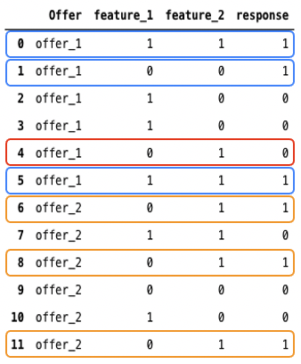

# Gepersonaliseerd optimalisatiemodel {#personalized-optimization-model}

## Overzicht {#overview}

Door de geavanceerde technologieën in het onder toezicht houden van machine het leren en diep leren te gebruiken, staat de Persoonlijke optimalisering een bedrijfsgebruiker (marktleider) toe om bedrijfsdoelstellingen te bepalen en hun klantengegevens te gebruiken om zaken-georiënteerde modellen op te leiden om gepersonaliseerde aanbiedingen te dienen en KPIs te maximaliseren.

<!---->

## Gegevensvereisten

Om een gepersonaliseerd optimalisatiemodel op te leiden, moet de dataset aan de volgende minimumvereisten voldoen:

* Minstens 2 aanbiedingen in de dataset moeten minstens 250 vertoningsgebeurtenissen en 25 succesgebeurtenissen (bijvoorbeeld, klikken of omzettingen) hebben binnen de laatste 30 dagen.
* Aanbiedingen met minder dan 250 beeldschermen en/of 25 succesgebeurtenissen in de afgelopen 30 dagen komen in aanmerking voor opname in gepersonaliseerd verkeer, maar worden door het personalisatiemodel behandeld als presterende op het niveau van de slechtst-score * aanbieding tot zij deze drempel overschrijden.
* Aanbiedingen met minder dan 250 beeldschermen en/of 25 succesgebeurtenissen in de afgelopen 30 dagen blijven in aanmerking komen voor opname in het exploratieverkeer.

Tot de eerste keer een gepersonaliseerd optimalisatiemodel wordt getraind, zullen aanbiedingen binnen een selectiestrategie die een gepersonaliseerd optimalisatiemodel gebruikt willekeurig worden gediend.

## Belangrijkste modelaannames en -beperkingen {#key}

Om het voordeel van het gebruiken van gepersonaliseerde optimalisering te maximaliseren, zijn er enkele belangrijke veronderstellingen en beperkingen om zich van bewust te zijn.

* **Aanbiedingen zijn verschillend genoeg zodat de gebruikers verschillende voorkeur onder de aanbiedingen in overweging** zullen hebben. Als de aanbiedingen te gelijkaardig zijn, zal een resulterend model minder effect hebben aangezien de reacties schijnbaar willekeurig zijn.
Als een bank bijvoorbeeld twee creditcardaanbiedingen heeft met het enige verschil in kleur, dan maakt het niet uit welke kaart wordt aanbevolen, maar als elke kaart andere voorwaarden heeft, geeft dit een reden waarom bepaalde klanten er een zouden kiezen en voldoende verschil tussen de aanbiedingen zouden maken om een onhandiger model op te bouwen.
* **het verkeerssamenstelling van de Gebruiker is stabiel**. Als de samenstelling van het gebruikersverkeer tijdens modelopleiding en het voorspellen dramatisch verandert, zouden de modelprestaties kunnen degraderen. Bijvoorbeeld, veronderstel in model opleidingsfase, slechts zijn de gegevens voor gebruikers in publiek A beschikbaar, maar het opgeleide model wordt gebruikt om voorspellingen voor gebruikers in publiek B te produceren, dan modelprestaties zouden kunnen worden beïnvloed.
* **de uitvoeringen van aanbiedingen veranderen niet dramatisch over een korte periode** aangezien dit model wekelijks bijwerkt en de veranderingen in prestaties als modelupdates worden overgebracht. Een product was bijvoorbeeld al eerder erg populair, maar in een openbaar rapport wordt het product geïdentificeerd als schadelijk voor onze gezondheid, en dit product wordt extreem snel impopulair. In dit scenario, kon het model dit product blijven voorspellen tot het model met veranderingen in gebruikersgedrag bijwerkt.

## Hoe het werkt {#how}

Het model leert complexe eigenschapinteractie tussen aanbiedingen, gebruikersinformatie en contextafhankelijke informatie om gepersonaliseerde aanbiedingen aan eind - gebruikers aan te bevelen. Functies zijn invoer in het model.

Er zijn drie typen functies:

| Typen functies | Functies toevoegen aan modellen |
|--------------|----------------------------|
| Decisioning-objecten (placementID, activityID, DecisionScopeID) | Deel van de feedback Experience Events voor het beheer van beslissingen die naar AEP zijn verzonden |
| Doelgroepen | Het publiek 0-50 kan worden toegevoegd als functies bij het maken van het Willekeurige AI-model |
| Contextgegevens | Een deel van de beslissingen die terugkoppelen Ervaring Gebeurtenissen verzonden naar AEP. Beschikbare contextgegevens die aan het schema moeten worden toegevoegd: Commerce Details, Channel Details, Application Details, Web Details, Environment Details, Device Details, PlaceContext |

Het model heeft twee fasen:

* In de **off-line modelopleiding** fase, wordt een model getraind door eigenschapinteractie in historische gegevens te leren en te herdenken.
* In de **fase van de 0} online conferentie, worden de kandidaten aangeboden gerangschikt gebaseerd op scores in real time die door het model worden geproduceerd.** In tegenstelling tot traditionele samenwerkings het filtreren technieken, die moeilijk om eigenschappen voor gebruikers en aanbiedingen te omvatten is, is de gepersonaliseerde optimalisering een diep het leren gebaseerde raadsmethode, en kan complexe en niet-lineaire patronen van de eigenschapinteractie omvatten en leren.

Hier volgt een vereenvoudigd voorbeeld om het basisidee achter gepersonaliseerde optimalisatie te illustreren. Veronderstel wij een dataset hebben die historische interactie tussen gebruikers en aanbiedingen opslaat, die in Figuur 1 wordt getoond. Er zijn:

* Twee aanbiedingen, aanbieding_1 en aanbieding_2,
* Twee functies, feature_1 en feature_2,
* Een responskolom.

De waarde van feature_1, feature_2 en response is 0 of 1. Wanneer wij de blauwe dozen en de oranje dozen in Figuur 1 bekijken, kunnen wij vinden dat voor aanbieding_1, de reacties eerder 1 zijn wanneer feature_1 en feature_2 de zelfde waarden hebben, terwijl voor offer_2, de etiketten eerder 1 zijn wanneer feature_1 0 is en feature_2 1 is. We kunnen ook zien dat in het rode vak, aanbieding_1 wordt gediend wanneer feature_1 0 is en feature_2 1 is, en de reactie 0 is. Gebaseerd op het patroon dat wij in oranje dozen zien, wanneer feature_1 0 is en feature_2 1 is, biedt_2 waarschijnlijk een betere aanbeveling is.

In feite is dit het idee om historische eigenschapinteractie te leren en te herdenken en deze toe te passen om gepersonaliseerde voorspellingen te genereren.

## Probleem met koude start {#cold-start}

Koud-startprobleem doet zich voor wanneer er onvoldoende gegevens zijn om een aanbeveling te doen. Voor gepersonaliseerde optimalisering, zijn er twee soorten koudstartproblemen.

* **na het creëren van een nieuw AI model zonder historische gegevens**, zullen de aanbiedingen voor een periode willekeurig worden gediend om gegevens te verzamelen, en de gegevens zullen worden gebruikt om het eerste model te trainen.
* **nadat het eerste model** wordt vrijgegeven, zal 10% van totaal verkeer voor het willekeurige dienen worden toegewezen terwijl 90% van verkeer voor modelaanbevelingen zal worden gebruikt. Als nieuwe aanbiedingen aan het AI-model worden toegevoegd, zouden deze dus worden geleverd als onderdeel van de 10% van het verkeer. De gegevens die over die aanbiedingen worden verzameld zouden het aantal tijden bepalen het onder de 90% van verkeer wordt geselecteerd aangezien het model blijft worden bijgewerkt.

## Herscholing {#re-training}

Modellen worden opnieuw getraind om de nieuwste functies-interacties te leren en de verslechtering van de modelprestaties wekelijks te beperken.
