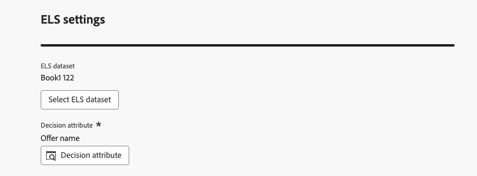

# De AI-formulebuilder gebruiken {#create-ranking-formulas}

**het Rangschikken formules** staat u toe om regels te bepalen die welke aanbieding eerst, eerder dan rekening houdend met de prioritaire scores zouden moeten worden voorgesteld.

Als u deze regels wilt maken, biedt de AI-formule builder in **[!UICONTROL Adobe Journey Optimizer]** meer flexibiliteit en controle voor de manier waarop aanbiedingen worden gerangschikt. In plaats van alleen te vertrouwen op een statische aanbiedingsprioriteit, kunt u nu aangepaste rangschikkingsformules definiëren die AI-modelscores combineren, prioriteiten, profielkenmerken bieden, kenmerken aanbieden en contextuele signalen via een geleide interface.

Deze benadering staat u toe om aanbiedingsrangschikking dynamisch aan te passen die op om het even welke combinatie van AI-gedreven neiging, bedrijfswaarde, en context in real time wordt gebaseerd, die het gemakkelijker maken om besluitvorming aan zowel marketing doelstellingen als klantenbehoeften te richten. De AI-formulebuilder ondersteunt eenvoudige of geavanceerde formules, afhankelijk van de mate van controle die u wilt toepassen.

Zodra een het rangschikken formule is gecreeerd, kunt u het aan a [&#x200B; selectiestrategie &#x200B;](../selection-strategies.md) toewijzen. Als meerdere aanbiedingen in aanmerking komen om te worden gepresenteerd wanneer deze selectiestrategie wordt gebruikt, gebruikt de beslissingsmotor de geselecteerde formule om te berekenen welke aanbieding het eerst moet worden geleverd.

➡️ [Ontdek deze functie in video](#video)

## Een waarderingsformule maken {#create-ranking-formula}

>[!CONTEXTUALHELP]
>id="ajo_exd_config_formulas"
>title="Rangschikkingsformules maken"
>abstract="Met indelingen kunt u regels definiëren die bepalen welk beslissingsitem als eerste moet worden weergegeven, in plaats van rekening te houden met de prioriteitsscores van de items. Nadat u een rangschikkingsformule hebt gemaakt, kunt u deze toewijzen aan een selectiestrategie."

Volg de onderstaande stappen om een rangschikkingsformule te maken.

1. Open het menu **[!UICONTROL Strategy setup]** en selecteer vervolgens **[!UICONTROL Ranking formulas]** tab. De lijst met eerder gemaakte formules wordt weergegeven.

   

1. Klik op **[!UICONTROL Create formula]**.

1. Geef de naam van de formule op en voeg desgewenst een beschrijving toe.

   {width="80%"}

1. Klik optioneel op **[!UICONTROL Select AI model]** om het model in te stellen dat wordt gebruikt als referentie om uw waarderingsformule samen te stellen.

   >[!NOTE]
   >
   >[&#x200B; Gepersonaliseerde optimalisatiemodellen &#x200B;](personalized-optimization-model.md) die ononderbroken metriek gebruiken worden niet gesteund met de AI formule bouwer.

   Telkens wanneer u naar een modelscore verwijst wanneer u hieronder uw formule bepaalt, zal het AI model worden gebruikt dat u selecteerde.

   >[!CAUTION]
   >
   >Wanneer het gebruiken van een AI model in een rangschikkende formule wordt opgenomen, worden de gegevens niet weerspiegeld in het [&#x200B; tarief van de Omzetting voor Holdout en Model Gedreven verkeer &#x200B;](../../reports/campaign-global-report-cja-code.md#conversion-rate) rapport.

1. Bepaal de voorwaarden die de rangschikkingsscore voor de passende besluitvormingspunten zullen bepalen. U kunt

   * vul de **[!UICONTROL Criteria]** sectie van het [&#x200B; gebruikersinterface &#x200B;](#ranking-select-criteria) in,
   * of schakelaar aan de [&#x200B; coderedacteur &#x200B;](#ranking-code-editor).

   >[!NOTE]
   >
   >De nestdiepte in een rangschikkingsformule is beperkt tot 30 niveaus. Dit wordt gemeten door de `)` haakjes sluiten in de PQL-tekenreeks te tellen. Een regeltekenreeks kan maximaal 8 kB groot zijn voor UTF-8-gecodeerde tekens. Dit komt overeen met 8.000 ASCII-tekens (1 byte elk) of 2.000-4.000 niet-ASCII-tekens (2-4 bytes elk). [&#x200B; leer meer over het Beslissen van gidsen &amp; beperkingen &#x200B;](../decisioning-guardrails.md#ranking-formulas)

1. U kunt ook gegevens uit Adobe Experience Platform gebruiken om de waarderingslogica dynamisch aan te passen aan de omstandigheden in de praktijk. Dit is vooral nuttig voor attributen die vaak veranderen, zoals productbeschikbaarheid of prijs in real time. [&#x200B; Leer hoe te om de gegevens van Adobe Experience Platform voor besluit te gebruiken &#x200B;](../aep-data-exd.md)

<!--## Select an ELS dataset {#els-dataset}

Journey Optimizer allows you to leverage data from Adobe Experience Platform. [Learn more](../data/aep-data-perso.md)

To leverage data from an AEP dataset, follow the steps below.

1. From the **[!UICONTROL ELS settings]** section, select an ELS dataset from the list.

1. Select a decision attribute.

    >[!NOTE]
    >
    >This action is mandatory.

{width="80%"-->

## Criteria definiëren met behulp van de formule builder {#ranking-select-criteria}

Met een intuïtieve interface kunt u de besluitvorming perfectioneren door AI-scores (eigenheid) aan te passen, waarde (prioriteit) aan te bieden, contextafhankelijke hefbomen en externe profieleigenschappen — afzonderlijk of in combinatie — om elke interactie te optimaliseren. <!--Whether you are maximizing revenue, promoting strategic offers, or balancing business goals with real-time context, the formula builder gives you total control in defining ranking strategies.-->

Volg de onderstaande stappen om criteria rechtstreeks vanuit de interface te definiëren.

<!--{width="80%"}-->

1. Geef in de sectie **[!UICONTROL Criterion 1]** de beslissingsitems op waarop u een waarderingsscore wilt toepassen door het volgende te doen:
   * selecteren de attributen van het a [&#x200B; besluit punt &#x200B;](../items.md#attributes)
   * een logische operator selecteren
   * voeg een passende voorwaarde toe - u of een waarde kan typen, of een profielattribuut of [&#x200B; contextgegevens &#x200B;](../context-data.md) selecteren

   {width="70%"}

1. U kunt desgewenst aanvullende elementen opgeven om de overeenkomende voorwaarden voor de geldigheid van de criteria te verfijnen.

   {width="80%"}

   Bijvoorbeeld, bepaalde u Criterium 1 zoals *Weather* douaneattribuut *evenaart* de *warme* voorwaarde. Bovendien, kunt u een andere voorwaarde toevoegen zoals als aan de eerste voorwaarde wordt voldaan en als de temperatuur 75 graden op het tijdstip van het verzoek overschrijdt, dan is Criterium 1 waar.<!--Add a screenshot with the example-->

1. Creeer een uitdrukking die een rangschikkingsscore aan de besluitpunten zal toewijzen die aan de hierboven bepaalde voorwaarde voldoen. U kunt naar elk van de volgende items verwijzen:

   * de score die uit het AI model kwam dat u naar keuze in de **[!UICONTROL Details]** sectie [&#x200B; hierboven &#x200B;](#create-ranking-formula) selecteerde;
   * de prioriteit van het besluitvormingspunt, die een waarde manueel wordt toegewezen wanneer [&#x200B; creërend een besluitvormingspunt &#x200B;](../items.md#attributes); <!--If a profile qualifies for multiple decision items, a higher priority grants the item precedence over others.-->
   * alle kenmerken die in het profiel kunnen voorkomen, zoals een extern afgeleide vermogensscore;
   * een statische waarde die u in een vrije indeling kunt toewijzen;
   * een combinatie van alle bovenstaande punten.

   {width="70%"}

   >[!NOTE]
   >
   >Klik op het pictogram naast het veld om vooraf gedefinieerde variabelen toe te voegen.

1. Klik op **[!UICONTROL Add criterion]** om een of meer criteria toe te voegen zo vaak als nodig is. De logica is als volgt:
   * Als het eerste criterium geldt voor een bepaald beslissingselement, heeft het voorrang op de volgende.
   * Indien niet waar (true), gaat de beslissingsengine door naar het tweede criterium, enzovoort.

1. In het laatste veld kunt u een expressie maken die wordt toegewezen aan alle beslissingsitems die niet aan de bovenstaande criteria voldoen.

   {width="70%"}

1. Klik op **[!UICONTROL Create]** om uw waarderingsformule te voltooien. U kunt deze nu in de lijst selecteren om de details weer te geven en vervolgens bewerken of verwijderen. Het is klaar om in a [&#x200B; selectiestrategie &#x200B;](../selection-strategies.md) te worden gebruikt om in aanmerking komende besluitvormingspunten te rangschikken.

### Voorbeeld van een willekeurige formule {#ranking-formula-example}

Bekijk het onderstaande voorbeeld:

{width="80%"}

Als het gebied van het besluitpunt (douaneattribuut) het geografische etiket van het profiel (profielattributen) evenaart, zal de rangschikkingsscore die hier wordt uitgedrukt (die een combinatie van de prioriteit van het besluitpunt, de AI modelscore en een statische waarde) is worden toegepast op alle besluitvormingspunten die aan die voorwaarde voldoen.

## De code-editor gebruiken {#ranking-code-editor}

Om rangschikkende formules in **syntaxis van PQL** uit te drukken, schakelaar aan de coderedacteur gebruikend de specifieke knoop op hoogste recht van het scherm. Voor meer op hoe te om de syntaxis van PQL te gebruiken, verwijs naar de [&#x200B; specifieke documentatie &#x200B;](https://experienceleague.adobe.com/docs/experience-platform/segmentation/pql/overview.html?lang=nl-NL).

>[!CAUTION]
>
>Hierdoor kunt u niet terugkeren naar de standaardbuilderweergave voor deze formule.

U kunt de attributen van het hefboomprofiel, [&#x200B; contextgegevens &#x200B;](../context-data.md), en [&#x200B; attributen van het besluitvormingspunt &#x200B;](../items.md#attributes) dan.

U wilt bijvoorbeeld de prioriteit van alle aanbiedingen verhogen met het kenmerk &quot;hot&quot; als het werkelijke weer heet is. Om dit te doen, werd **contextData.weather=hot** overgegaan in de beslissingsvraag. <!--[Learn how to work with context data](context-data.md)-->

{width="80%"}

>[!IMPORTANT]
>
>Wanneer u een rangschikkingsformule maakt, wordt terugkijken naar een vorige periode niet ondersteund, zoals het toevoegen van een ervaringsgebeurtenis die zich in de laatste maand heeft voorgedaan als een component van de formule. Elke poging om een terugzoekperiode op te nemen tijdens het maken van een formule, veroorzaakt een fout bij het opslaan ervan.

Om attributen met betrekking tot uw besluitpunten in formules te hefboomwerking, zorg ervoor u de correcte syntaxis in de code van uw het rangschikken formule volgt. Breid elke sectie voor meer informatie uit:

+++Gebruikmaking van besluitvormingsposten — standaardkenmerken


+++

+++Aangepaste kenmerken voor eigenschapsposten voor hefboomfinanciering


+++

### PQL-voorbeelden met rangschikkingsformule {#ranking-formula-examples}

U kunt verschillende rangschikkingsformules naar wens maken. Hieronder volgen enkele voorbeelden.

+++Verhoog aanbiedingen met bepaald aanbiedingskenmerk op basis van profielkenmerk

Als het profiel in de stad woont die overeenkomt met het aanbod, dan verdubbelt de prioriteit voor alle aanbiedingen in die stad.

**Rangschikkende formule:**

```
if( offer.characteristics.get("city") = homeAddress.city, offer.rank.priority * 2, offer.rank.priority)
```

+++

+++Verhoog aanbiedingen waarbij de einddatum minder dan 24 uur is.

**Rangschikkende formule:**

```
if( offer.selectionConstraint.endDate occurs <= 24 hours after now, offer.rank.priority * 3, offer.rank.priority)
```

+++

+++Verhoog de aanbiedingen op basis van de neiging van klanten om het aangeboden product te kopen

U kunt de score voor een aanbieding verhogen op basis van een klantdichtheid-score.

In dit voorbeeld, is de instantiehuurder *_salesvelocity* en het profielschema bevat een waaier van scores die in een serie wordt opgeslagen:


In dit geval geldt voor een profiel als:

```
{"_salesvelocity": {"individualScoring": [
                    {"core": {
                            "category":"insurance",
                            "propensityScore": 96.9
                        }},
                    {"core": {
                            "category":"personalLoan",
                            "propensityScore": 45.3
                        }},
                    {"core": {
                            "category":"creditCard",
                            "propensityScore": 78.1
                        }}
                    ]}
}
```

+++

+++Verhoog de aanbiedingen op basis van de postcode en het jaarinkomen van een profiel

In dit voorbeeld probeert het systeem altijd eerst een ZIP-matching-aanbieding weer te geven. Als er geen overeenkomst wordt gevonden, wordt de aanbieding voor andere ZIP-codes niet weergegeven.

```pql
if( offer._luma.offerDetails.zipCode = _luma.zipCode,luma.annualIncome / 1000 + 10000, if( not offer.luma.offerDetails.zipCode,_luma.annualIncome / 1000, -9999) )
```

Wat de formule doet:

* Als de aanbieding dezelfde postcode heeft als de gebruiker, geef deze een zeer hoge score zodat deze als eerste wordt gekozen.
* Als de aanbieding helemaal geen postcode heeft (het is een algemene aanbieding), geef deze een normale score op basis van de inkomsten van de gebruiker.
* Als de aanbieding een andere postcode heeft dan de gebruiker, geef deze een zeer lage score zodat deze niet is geselecteerd.

+++

+++Verhoog de aanbiedingen op basis van contextgegevens

Met [!DNL Journey Optimizer] kunt u bepaalde aanbiedingen verhogen op basis van de contextgegevens die in de aanroep worden doorgegeven. Als bijvoorbeeld `contextData.weather=hot` wordt doorgegeven, moet de prioriteit van alle aanbiedingen met `attribute=hot` worden verhoogd.

>[!NOTE]
>
>Voor gedetailleerde informatie over hoe te om contextgegevens <!-- using the **Edge Decisioning** and **Decisioning** APIs--> over te gaan, verwijs naar [&#x200B; deze sectie &#x200B;](../context-data.md).

Merk op dat wanneer het gebruiken van **Beslissing** API, de contextgegevens aan het profielelement in het verzoeklichaam, zoals in het hieronder voorbeeld worden toegevoegd:

```
"xdm:profiles": [
{
    "xdm:identityMap": {
        "crmid": [
            {
            "xdm:id": "CRMID1"
            }
        ]
    },
    "xdm:contextData": [
        {
            "@type":"_xdm.context.additionalParameters;version=1",
            "xdm:data":{
                "xdm:weather":"hot"
            }
        }
    ]
    
}],
```

+++

## Hoe kan ik-video {#video}

Leer hoe u de AI Formula Builder in Adobe Journey Optimizer kunt gebruiken voor het maken van classificatiestrategieën voor aangepaste aanbiedingen.

>[!VIDEO](https://video.tv.adobe.com/v/3464446/?learn=on&enablevpops)
