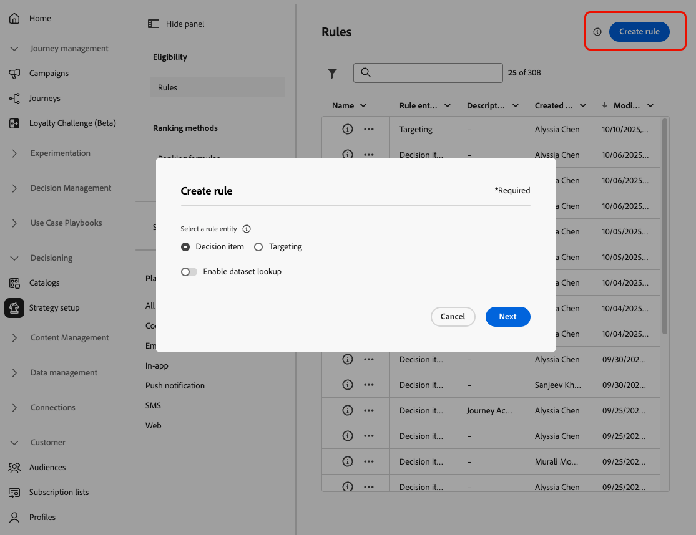

# Regels maken {#rules}

>[!CONTEXTUALHELP]
>id="ajo_exd_config_rules"
>title="Regels maken"
>abstract="U kunt twee soorten regels tot stand brengen: **besluitvormingsregels** die in besluitvormingspunten of selectiestrategieën kunnen worden gebruikt, om te controleren welke punten aan welk publiek zouden moeten worden voorgesteld, of **richtend regels** om specifieke publiekssegmenten te bepalen geschikt om gepersonaliseerde inhoud te ontvangen, of een specifieke weg van de reis in te gaan.   wanneer het creëren van een besluitvormingsregel, kunt u **[!UICONTROL Enable dataset lookup]** selecteren om de gegevens van Adobe Experience Platform te gebruiken. Op deze manier kunt u beleenbaarheidscriteria definiëren op basis van dynamische, externe kenmerken, zodat de beslissingsitems alleen worden weergegeven wanneer dat relevant is."

## Over regels {#about}

In [!DNL Journey Optimizer] kunt u twee soorten herbruikbare regels maken:

* [Besluitvormingsregels](#decision-rules)
* [Doelstellingen](#targeting-rules)

### Besluitvormingsregels {#decision-rules}

Met beslissingsregels kunt u het publiek voor beslissingsitems definiëren door beperkingen toe te passen, rechtstreeks op het niveau van de beslissingsitems of binnen een specifieke selectiestrategie. Hierdoor kunt u precies bepalen welke items aan wie moeten worden gepresenteerd.

Laten we bijvoorbeeld een scenario overwegen waarin u beslissingsitems hebt die Yoga-gerelateerde producten bevatten die zijn ontworpen voor vrouwen. Met beslissingsregels kunt u aangeven dat deze items alleen mogen worden weergegeven in profielen waarvan het geslacht &quot;Vrouwelijk&quot; is en die in &#39;Yoga&#39; een &#39;Belangenpunt&#39; hebben aangegeven.

>[!NOTE]
>
>Naast de besluitvormingsregels op het niveau van de item- en selectiestrategie kunt u ook het doelpubliek op campagnereniveau definiëren. [Meer informatie](../campaigns/create-campaign.md#audience)

### Doelstellingen {#targeting-rules}

>[!AVAILABILITY]
>
>De gerichte regels zijn momenteel in Beperkte Beschikbaarheid. Neem contact op met uw Adobe-vertegenwoordiger voor toegang.
>
>Gelieve te merken op dit vermogen slechts beschikbaar aan organisaties is die het **Besluit** toe:voegen-op aanbieden hebben gekocht. Het zal geleidelijk aan aan alle klanten worden uitgevoerd.

De gerichte regels staan toe om specifieke kwalificaties te bepalen die een klant moet worden ontmoet om in aanmerking te komen om gepersonaliseerde inhoud te ontvangen of een specifiek reisweg in te gaan, die op specifieke publiekssegmenten wordt gebaseerd, die u toelaat om subpubliek in uw reizen en campagnes te richten.

Vaak, zijn zij een combinatie veelvoudige attributen, naast de gebeurtenissen van het klantengedrag en contextgegevens. Om u tijd en moeite te besparen, kunt u het richten regels eens tot stand brengen en hen over uw reizen en campagnes opnieuw gebruiken, met de capaciteit om hen op het tijdstip van creatie snel inline te wijzigen.

U kunt de volgende regels ook gebruiken:

* Wanneer het creëren van [&#x200B; inhoudsoptimalisering richtend &#x200B;](../content-management/optimization-targeting.md) in reizen of campagnes;
* Wanneer het bouwen van [&#x200B; optimalisering van de wegweg &#x200B;](../building-journeys/optimize.md#targeting).

➡️ [Ontdek deze functie in video](#video)

## Toegangsregels {#access}

De lijst met regels is toegankelijk via **[!UICONTROL Decisioning]** > **[!UICONTROL Strategy setup]** .

De volgende acties zijn beschikbaar:

* U kunt op de regelentiteit (**[!UICONTROL Decision item]** of **[!UICONTROL Targeting]** filtreren - [&#x200B; Leer meer &#x200B;](#about)).

* Selecteer een regel door op de naam ervan te klikken en deze te bewerken met de regelbouwer. [&#x200B; leer hoe &#x200B;](#create)

* Via de knop **[!UICONTROL More actions]** naast elk item kunt u het volgende doen:

   * Als u de entiteit **[!UICONTROL Decision item]** hebt geselecteerd, voegt u de regel toe aan een pakket om deze naar een andere sandbox te exporteren. Leer hoe te [&#x200B; voorwerpen naar een andere zandbak &#x200B;](../configuration/copy-objects-to-sandbox.md) uitvoeren.
   * Dupliceer een regel.
   * Verwijder een regel.

{width=100%}

* Klik op het pictogram **[!UICONTROL More info]** om de formule weer te geven waaruit de regel bestaat.

{width=60%}

## Een regel maken {#create}

Ga als volgt te werk om een regel te maken:

1. Navigeer naar **[!UICONTROL Decisioning]** > **[!UICONTROL Strategy setup]** > **[!UICONTROL Rules]** en klik vervolgens op de knop **[!UICONTROL Create rule]** .

1. Selecteer de regelentiteit om op te geven voor welk type object de regel wordt gemaakt.

   {width=90%}

   * **[!UICONTROL Decision item]** - de regel kan op a [&#x200B; besluitpunt &#x200B;](#decision-rules) in de context van Beslissing worden toegepast;
   * **[!UICONTROL Targeting]** - de regel kan worden gebruikt wanneer het bouwen van [&#x200B; richtend &#x200B;](#targeting-rules) regels, of als deel van [&#x200B; inhoudoptimalisering &#x200B;](../content-management/optimization-targeting.md) in een campagne of een reis, of in [&#x200B; optimaliseert reisactiviteit &#x200B;](../building-journeys/optimize.md#targeting).

1. Als u een **[!UICONTROL Decision item]** -regel maakt, kunt u **[!UICONTROL Enable dataset lookup]** selecteren om gegevens uit Adobe Experience Platform te gebruiken om uw besluitvormingslogica te verrijken met externe gegevens. Dit is vooral nuttig voor attributen die vaak veranderen, zoals productbeschikbaarheid, of prijs in real time. [&#x200B; Leer hoe te om de gegevens van Adobe Experience Platform voor besluit te gebruiken &#x200B;](../experience-decisioning/aep-data-exd.md)

1. Het scherm voor het maken van regels wordt geopend. Geef de regel een naam en geef een beschrijving op.

1. Bouw de regel aan uw behoeften gebruikend de Bouwer van het Segment van Adobe Experience Platform. Hiervoor kunt u verschillende gegevensbronnen gebruiken, zoals:
   * Profielkenmerken;
   * Eigenschappen van beslissingstips - alleen beschikbaar bij het maken van een **[!UICONTROL Decision item]** -regel;
   * publiek;
   * Contextgegevens afkomstig van Adobe Experience Platform. [&#x200B; Leer hoe te hefboomwerking contextgegevens &#x200B;](context-data.md)

   {width=85%}

   >[!NOTE]
   >
   >De opsteller van het Segment verstrekte om regels tot stand te brengen heeft sommige specifieke eigenschappen in vergelijking met die gebruikt met de dienst van de Segmentatie van Adobe Experience Platform. Het algemene proces dat in de documentatie wordt beschreven, is echter geldig voor het samenstellen van regels in [!DNL Journey Optimizer] . [&#x200B; leer hoe te om segmentdefinities te bouwen &#x200B;](../audience/creating-a-segment-definition.md)

1. Terwijl u nieuwe velden toevoegt en configureert in de werkruimte, wordt in het deelvenster **[!UICONTROL Audience properties]** informatie weergegeven over de geschatte profielen die bij het publiek horen. Klik op **[!UICONTROL Refresh estimate]** om gegevens bij te werken.

   {width=85%}

   >[!NOTE]
   >
   >Profielramingen zijn niet beschikbaar wanneer de regelparameters gegevens bevatten die niet in het profiel zijn opgeslagen, zoals contextgegevens.

1. Klik op **[!UICONTROL Create]** als uw regel gereed is. De gemaakte regel wordt in de lijst weergegeven en is, afhankelijk van de entiteit die u hebt gemaakt, beschikbaar voor gebruik:

   * In **besluitvormingspunten** en **selectiestrategieën** om de presentatie van besluitpunten aan profielen te regeren;
   * Of wanneer het bouwen van **richtend** in inhoudoptimalisering of wegoptimalisering.

>[!NOTE]
>
>De nestdiepte in een regel is beperkt tot 30 niveaus. Dit wordt gemeten door de haakjes sluiten `)` in de PQL-tekenreeks te tellen.
>
>Een regeltekenreeks kan maximaal 15 kB groot zijn voor UTF-8-gecodeerde tekens. Dit komt overeen met 15.000 ASCII-tekens (1 byte elk) of 3.750-7.500 niet-ASCII-tekens (2-4 bytes elk).
>
>[&#x200B; Leer meer over de Gidsen van de Regels van de Geschiktheid &amp; beperkingen &#x200B;](decisioning-guardrails.md#eligibility-rules)

## Hoe kan ik-video {#video}

Leer om, herbruikbare **het richten van regels** in Adobe Journey Optimizer tot stand te brengen te dupliceren en toe te passen om campagnes efficiënt te personaliseren die op klantenattributen zoals gebied, taal, en gedrag-besparing tijd terwijl het verbeteren van publieksprecisie worden gebaseerd.

>[!VIDEO](https://video.tv.adobe.com/v/3476127/?quality=12)
