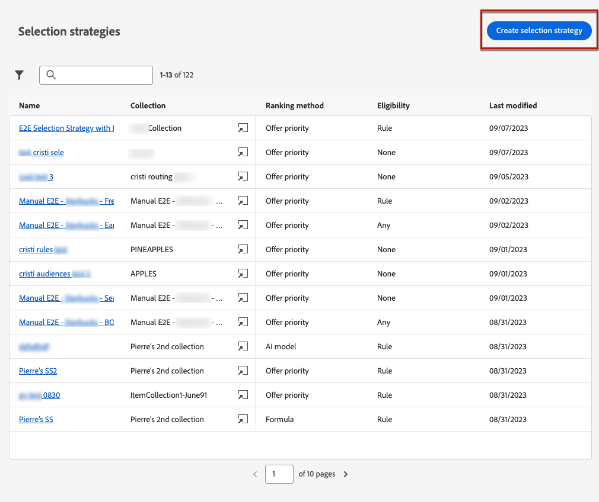
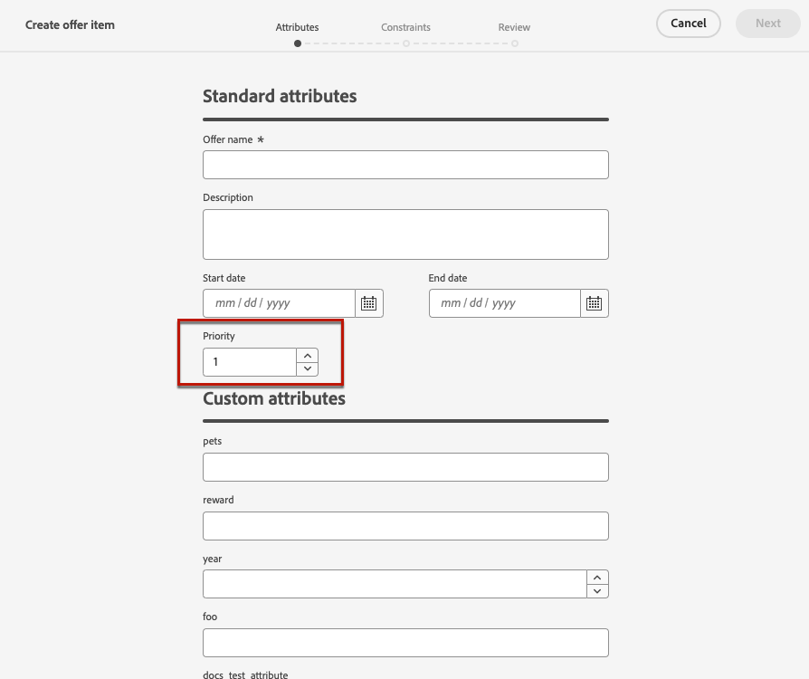

# Selectiestrategieën maken {#selection-strategies}

>[!CONTEXTUALHELP]
>id="ajo_exd_config_strategies"
>title="Uw selectiestrategieën definiëren"
>abstract="Een selectiestrategie is herbruikbaar en bestaat uit een verzameling die gekoppeld is aan een toelatingsbeperking en een rangschikkingsmethode om te bepalen welke aanbiedingen moeten worden getoond wanneer zij in een besluitvormingsbeleid worden geselecteerd."
>additional-url="https://experienceleague.adobe.com/docs/journey-optimizer/using/experience-decisioning/create-decision.html" text="Beslissingsbeleid maken"

>[!CONTEXTUALHELP]
>id="ajo_exd_strategy_eligibility"
>title="De in aanmerking komende profielen beperken"
>abstract="U kunt de selectie van aanbiedingen voor deze selectiestrategie beperken. Standaard zijn alle profielen subsidiabel, maar u kunt publiek of regels gebruiken om de selectie van de aanbieding te beperken tot specifieke profielen."
>additional-url="https://experienceleague.adobe.com/docs/journey-optimizer/using/audiences-profiles-identities/audiences/about-audiences.html" text="Soorten publiek gebruiken"
>additional-url="https://experienceleague.adobe.com/docs/journey-optimizer/using/experience-decisioning/selection/rules.html" text="Beslissingsregels gebruiken"

Een selectiestrategie is herbruikbaar en bestaat uit een verzameling die gekoppeld is aan een geschiktheidsbeperking en een rangschikkingsmethode om de aanbiedingen te bepalen die moeten worden getoond wanneer ze worden geselecteerd in een [beslissingsbeleid](create-decision.md).

## Selectiestrategieën openen en beheren

1. Ga naar **[!UICONTROL Experience Decisioning]** > **[!UICONTROL Strategy setup]** > **[!UICONTROL Selection strategies]**.

1. Alle selectiestrategieën die tot nu toe zijn ontwikkeld, worden vermeld. Er zijn filters beschikbaar waarmee u volgens de waarderingsmethode strategieën kunt ophalen.

   

1. Klik op de naam van een selectiestrategie om deze te bewerken.

1. De voor elke strategie geselecteerde verzameling, rangschikkingsmethode en geschiktheid worden ook weergegeven. U kunt op het pictogram naast elke verzamelingsnaam klikken om een verzameling rechtstreeks te bewerken.

   

## Een selectiestrategie maken

Volg onderstaande stappen om een selectiestrategie te maken.

1. Van de **[!UICONTROL Selection strategies]** voorraad, klik **[!UICONTROL Create selection strategy]**.

   

1. Voeg een naam toe voor uw strategie.

   >[!NOTE]
   >
   >Momenteel alleen de standaardwaarde **[!UICONTROL Offers]** catalogus is beschikbaar.

1. Vul de gegevens voor de selectiestrategie in, te beginnen met de naam.

   

1. Selecteer de [collectie](collections.md) dat de aanbiedingen bevat die in overweging moeten worden genomen.

1. Gebruik de **[!UICONTROL Eligibility]** om de selectie van de aanbiedingen voor deze selectiestrategie te beperken.

   

   * Als u de selectie van de aanbiedingen wilt beperken tot de leden van een publiek in een Experience Platform, selecteert u **[!UICONTROL Audiences]** en kiest u een publiek in de lijst. [Leer hoe u met het publiek kunt werken](../audience/about-audiences.md)

   * Als u een selectiegrens met een beslissingsregel wilt toevoegen, gebruikt u de optie **[!UICONTROL Decision rule]** en selecteert u de gewenste regel. [Leer hoe u een regel maakt](rules.md)

1. Definieer de waarderingsmethode die u wilt gebruiken om de beste aanbieding voor elk profiel te selecteren. [Meer informatie](#select-ranking-method)

   

   * Als er meerdere aanbiedingen in aanmerking komen voor deze strategie, worden standaard de [Voorstelprioriteit](#offer-priority) Deze methode gebruikt de waarde die in de aanbiedingen is gedefinieerd.

   * Als u een specifieke berekende score wilt gebruiken om te kiezen welke aanbieding in aanmerking komt, selecteert u [Formule](#ranking-formula) of [AI-model](#ai-ranking).

1. Klik op **[!UICONTROL Create]**. Het is nu klaar om in een [beslissingsbeleid](create-decision.md)

## Een waarderingsmethode selecteren {#select-ranking-method}

>[!CONTEXTUALHELP]
>id="ajo_exd_strategy_ranking"
>title="Bepalen hoe aanbiedingen moeten worden beoordeeld"
>abstract="Als meerdere aanbiedingen in aanmerking komen voor een bepaalde selectiestrategie, kiest u de methode waarmee de beste aanbieding voor elk profiel wordt geselecteerd bij het maken van een selectiestrategie: prioriteit of rangschikkingsformule."
>additional-url="https://experienceleague.adobe.com/docs/journey-optimizer/using/experience-decisioning/create-decision.html" text="Beslissingsbeleid maken"

Als meerdere aanbiedingen in aanmerking komen voor een bepaalde selectiestrategie, kunt u bij het maken van een selectiestrategie de methode kiezen waarmee u de beste aanbieding voor elk profiel kunt selecteren. Je kunt voorstellen plaatsen op:

* [Voorstelprioriteit](#offer-priority)
* [Formule](#ranking-formula)
* [AI-rangschikking](#ai-ranking)

### Voorstelprioriteit {#offer-priority}

Wanneer meerdere aanbiedingen in aanmerking komen voor een bepaalde plaatsing in een beslissingsbeleid, worden standaard de items met de hoogste **prioriteit** wordt eerst aan de klanten geleverd.

De prioritaire scores van aanbiedingen worden toegewezen wanneer het creëren van [beslissingsitem](items.md).

### Willekeurige formule {#ranking-formula}

Met Journey Optimizer kunt u niet alleen prioriteit bieden, maar ook **waarderingsformules**. Dit zijn formules die bepalen welke aanbieding eerst voor een bepaalde plaatsing moet worden gepresenteerd, in plaats van rekening te houden met de prioriteitsscores van de aanbiedingen.

U kunt bijvoorbeeld de prioriteit verhogen van alle aanbiedingen met een einddatum van minder dan 24 uur, of aanbiedingen verhogen van de categorie &quot;actief&quot; als het interessepunt van het profiel &quot;actief&quot; is. Leer hoe u een waarderingsformule maakt in [deze sectie](ranking.md).

Nadat u de formule hebt gemaakt, kunt u deze gebruiken in een selectiestrategie. Als meerdere aanbiedingen in aanmerking komen om te worden ingediend bij het gebruik van deze selectiestrategie, wordt in de beslissing de geselecteerde formule gebruikt om te berekenen welke aanbieding het eerst moet worden geleverd.

### AI-rangschikking {#ai-ranking}

U kunt ook een getraind modelsysteem gebruiken dat aanbiedingen voor een bepaald profiel automatisch rangschikt door een AI-model te selecteren. Leer hoe u een AI-model maakt in [deze sectie](ranking.md).

Nadat u een AI-model hebt gemaakt, kunt u het gebruiken in een selectiestrategie. Indien meerdere aanbiedingen in aanmerking komen, bepaalt het opgeleide modelsysteem welke aanbieding eerst voor deze selectiestrategie moet worden ingediend.
