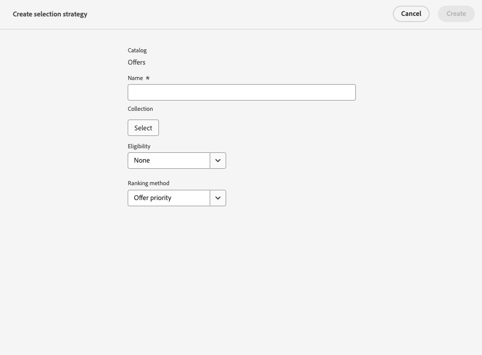

# Selectiestrategieën maken {#selection-strategies}

>[!CONTEXTUALHELP]
>id="ajo_exd_config_strategies"
>title="Uw selectiestrategieën definiëren"
>abstract="Een selectiestrategie is herbruikbaar en bestaat uit een verzameling die gekoppeld is aan een toelatingsbeperking en een rangschikkingsmethode om te bepalen welke aanbiedingen moeten worden getoond wanneer zij in een besluitvormingsbeleid worden geselecteerd."

>[!CONTEXTUALHELP]
>id="ajo_exd_strategy_eligibility"
>title="De in aanmerking komende profielen beperken"
>abstract="U kunt de selectie van aanbiedingen voor deze selectiestrategie beperken. Standaard zijn alle profielen subsidiabel, maar u kunt publiek of regels gebruiken om de selectie van de aanbieding te beperken tot specifieke profielen."
>additional-url="https://experienceleague.adobe.com/nl/docs/journey-optimizer/using/audiences-profiles-identities/audiences/about-audiences" text="Soorten publiek gebruiken"
>additional-url="https://experienceleague.adobe.com/nl/docs/journey-optimizer/using/decisioning/experience-decisioning/rules" text="Beslissingsregels gebruiken"

Een selectiestrategie is herbruikbaar, en bestaat uit een inzameling verbonden aan een geschiktheidsbeperking en een rangschikkende methode om de aanbiedingen te bepalen die moeten worden getoond wanneer geselecteerd in a [&#x200B; besluitvormingsbeleid &#x200B;](create-decision.md).

## Selectiestrategieën openen en beheren

1. Ga naar **[!UICONTROL Decisioning]** > **[!UICONTROL Strategy setup]** > **[!UICONTROL Selection strategies]** .

1. Alle selectiestrategieën die tot nu toe zijn ontwikkeld, worden vermeld. Er zijn filters beschikbaar waarmee u volgens de waarderingsmethode strategieën kunt ophalen.

   

1. Klik op de naam van een selectiestrategie om deze te bewerken.

1. De voor elke strategie geselecteerde verzameling, rangschikkingsmethode en geschiktheid worden ook weergegeven. U kunt op het pictogram naast elke verzamelingsnaam klikken om een verzameling rechtstreeks te bewerken.

   

## Een selectiestrategie maken {#create-selection-strategy}

Volg onderstaande stappen om een selectiestrategie te maken.

1. Klik in de **[!UICONTROL Selection strategies]** -voorraad op **[!UICONTROL Create selection strategy]** .

   

1. Voeg een naam toe voor uw strategie.

   >[!NOTE]
   >
   >Momenteel is alleen de standaardcatalogus **[!UICONTROL Offers]** beschikbaar.

1. Vul de gegevens voor de selectiestrategie in, te beginnen met de naam.

   

1. Selecteer de [&#x200B; inzameling &#x200B;](collections.md) die de aanbiedingen bevat om te overwegen.

1. Gebruik het veld **[!UICONTROL Eligibility]** om de selectie van aanbiedingen voor deze selectiestrategie te beperken.

   

   * Als u de selectie van de aanbiedingen wilt beperken tot de leden van een Experience Platform-publiek, selecteert u **[!UICONTROL Audiences]** en kiest u een publiek in de lijst. [&#x200B; leer hoe te met publiek &#x200B;](../audience/about-audiences.md) werken

   * Als u een selectieregel wilt toevoegen met een beslissingsregel, gebruikt u de optie **[!UICONTROL Decision rule]** en selecteert u de gewenste regel. [&#x200B; Leer hoe te om een regel &#x200B;](rules.md) tot stand te brengen

1. Definieer de waarderingsmethode die u wilt gebruiken om de beste aanbieding voor elk profiel te selecteren. [Meer informatie](#select-ranking-method)

   

   * Door gebrek, als de veelvoudige aanbiedingen voor deze strategie verkiesbaar zijn, gebruikt de [&#x200B; prioritaire van de Aanbieding &#x200B;](#offer-priority) methode de waarde die in de aanbiedingen wordt bepaald.

   * Als u een specifieke berekende score wilt gebruiken om te kiezen welke in aanmerking komende aanbieding te leveren, selecteer [&#x200B; Formule &#x200B;](#ranking-formula) of [&#x200B; AI model &#x200B;](#ai-ranking).

1. Klik op **[!UICONTROL Create]**. Het is nu klaar om in a [&#x200B; besluitvormingsbeleid &#x200B;](create-decision.md) te worden gebruikt

## Een waarderingsmethode selecteren {#select-ranking-method}

>[!CONTEXTUALHELP]
>id="ajo_exd_strategy_ranking"
>title="Bepalen hoe aanbiedingen moeten worden beoordeeld"
>abstract="Als meerdere aanbiedingen in aanmerking komen voor een bepaalde selectiestrategie, kiest u de methode waarmee de beste aanbieding voor elk profiel wordt geselecteerd bij het maken van een selectiestrategie: prioriteit of rangschikkingsformule."
>additional-url="https://experienceleague.adobe.com/docs/journey-optimizer/using/decisioning/experience-decisioning/decision-policies/create-decision.html" text="Beslissingsbeleid maken"

Als meerdere aanbiedingen in aanmerking komen voor een bepaalde selectiestrategie, kunt u bij het maken van een selectiestrategie de methode kiezen waarmee u de beste aanbieding voor elk profiel kunt selecteren. Je kunt voorstellen plaatsen op:

* [Voorstelprioriteit](#offer-priority)
* [Formule](#ranking-formula)
* [AI-rangschikking](#ai-ranking)

### Voorstelprioriteit {#offer-priority}

Door gebrek, wanneer verscheidene aanbiedingen in een besluitvormingsbeleid verkiesbaar zijn, zullen de punten met de hoogste **prioriteit** eerst aan de klanten worden geleverd.

{width=85%}

De prioritaire scores van aanbiedingen worden toegewezen wanneer het creëren van a [&#x200B; besluitvormingspunt &#x200B;](items.md).

### Willekeurige formule {#ranking-formula}

Naast het aanbieden van prioriteit, staat Journey Optimizer u toe om **het rangschikken formules** tot stand te brengen. Dit zijn formules die bepalen welke aanbieding eerst voor een bepaalde plaatsing moet worden gepresenteerd, in plaats van rekening te houden met de prioriteitsscores van de aanbiedingen.

U kunt bijvoorbeeld de prioriteit verhogen van alle aanbiedingen met een einddatum van minder dan 24 uur, of aanbiedingen verhogen van de categorie &quot;actief&quot; als het interessepunt van het profiel &quot;actief&quot; is. Leer hoe te om een het rangschikken formule in [&#x200B; tot stand te brengen deze sectie &#x200B;](ranking/ranking-formulas.md).

Nadat u de formule hebt gemaakt, kunt u deze gebruiken in een selectiestrategie. Als meerdere aanbiedingen in aanmerking komen om te worden ingediend bij het gebruik van deze selectiestrategie, wordt in de beslissing de geselecteerde formule gebruikt om te berekenen welke aanbieding het eerst moet worden geleverd.

### AI-rangschikking {#ai-ranking}

U kunt ook een getraind modelsysteem gebruiken dat aanbiedingen voor een bepaald profiel automatisch rangschikt door een AI-model te selecteren. Leer hoe te om een AI model in [&#x200B; tot stand te brengen deze sectie &#x200B;](ranking/create-ai-models.md).

Nadat u een AI-model hebt gemaakt, kunt u het gebruiken in een selectiestrategie. Indien meerdere aanbiedingen in aanmerking komen, bepaalt het opgeleide modelsysteem welke aanbieding eerst voor deze selectiestrategie moet worden ingediend.

>[!NOTE]
>
>Momenteel is het [&#x200B; rapport van de Meting van het 0&rbrace; optillen slechts beschikbaar voor het &#x200B;](ranking/auto-optimization-model.md#lift) Gepersonaliseerde model van optimalisering [&#x200B; AI.](ranking/personalized-optimization-model.md)

