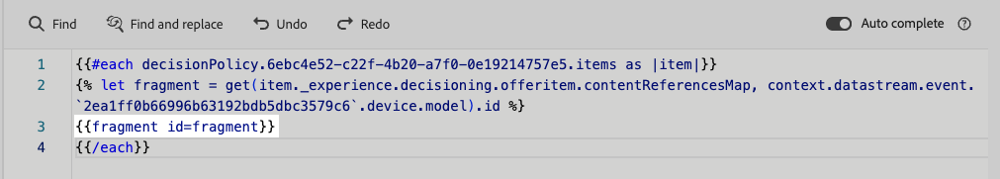

# Beslissingsbeleid gebruiken in berichten {#create-decision}

Zodra een besluitvormingsbeleid is gecreeerd, kunnen het beleid en de attributen verbonden aan de teruggekeerde besluitpunten in uw inhoud voor verpersoonlijking worden gebruikt. Daartoe moet de code die aan het besluitvormingsbeleid is gekoppeld eerst in uw inhoud worden ingevoegd. Zodra gedaan, kunt u zijn attributen voor verpersoonlijking gebruiken.

## De beleidscode voor beslissingen invoegen {#insert-code}

>[!BEGINTABS]

>[!TAB  op code-gebaseerde ervaring ]

1. Open de personalisatie-editor en open het menu **[!UICONTROL Decision policies]** .

1. Selecteer **[!UICONTROL Insert policy]** om de code toe te voegen die overeenkomt met het beslissingsbeleid.

   

   >[!NOTE]
   >
   >Als de knoop van de codetoevoeging niet toont, kan een besluitbeleid reeds voor de oudercomponent gevormd zijn.

1. De code voor het beslissingsbeleid wordt toegevoegd. Deze opeenvolging zal het aantal tijden worden herhaald u het besluitvormingsbeleid wilt zijn teruggekeerd. Bijvoorbeeld, als u verkoos om terug 2 punten terug te keren wanneer [&#x200B; creërend het besluit &#x200B;](#add-decision), zal de zelfde opeenvolging tweemaal worden herhaald.

>[!TAB  E-mail ]

1. Open de personalisatie-editor en open het menu **[!UICONTROL Decision policy]** .

1. Selecteer **[!UICONTROL Insert syntax]** om de code toe te voegen die overeenkomt met het beslissingsbeleid.

   

   >[!NOTE]
   >
   >Als de knoop van de codetoevoeging niet toont, kan een besluitbeleid reeds voor de oudercomponent gevormd zijn.

1. Als er vooraf geen plaatsing aan de component is gekoppeld, selecteert u een plaatsing in de lijst en klikt u op **[!UICONTROL Assign]** .

   

>[!ENDTABS]

Zodra de code voor het besluitvormingsbeleid wordt toegevoegd, zal deze opeenvolging worden herhaald het aantal tijden u het besluitbeleid wilt zijn teruggekeerd. Bijvoorbeeld, als u verkoos om terug 2 punten terug te keren wanneer [&#x200B; creërend het besluit &#x200B;](#add-decision), zal de zelfde opeenvolging tweemaal worden herhaald.

## Kenmerken voor hefboomfinanciering-besluitvormingsposten {#attributes}

Nu kunt u alle beslissingskenmerken toevoegen die u in die code wilt. De beschikbare kenmerken worden opgeslagen in het schema van de catalogus van **[!UICONTROL Offers]** . De attributen van de douane worden opgeslagen in **`_<imsOrg`>** omslag en standaardattributen in de **`_experience`** omslag. [&#x200B; Leer meer over het schema van de catalogus van Aanbiedingen &#x200B;](catalogs.md)


>[!NOTE]
>
>Voor het volgen van het beleid van Punt, moet het `trackingToken` attribuut als volgt voor de inhoud van het besluitvormingsbeleid worden toegevoegd:
>&#x200B;>`trackingToken: {{item._experience.decisioning.decisionitem.trackingToken}}`

Als u een kenmerk wilt toevoegen, klikt u op het plusteken (+) naast het kenmerk. U kunt zoveel kenmerken aan de code toevoegen als u wilt.


Plaats de lus `#each` tussen vierkante haakjes `[ ]` en voeg een komma vóór het sluiten `/each` toe.


U kunt ook alle andere kenmerken toevoegen die beschikbaar zijn in de verpersoonlijkingseditor, zoals profielkenmerken.


## Hefboomfragmenten (op code-gebaseerde ervaring) {#fragments}

Als uw besluitvormingsbeleid besluitpunten met inbegrip van fragmenten bevat, kunt u deze fragmenten in de code van het besluitvormingsbeleid hefboomwerking. [&#x200B; Leer meer op fragmenten &#x200B;](../content-management/fragments.md)

>[!AVAILABILITY]
>
>Deze mogelijkheid is momenteel alleen beschikbaar voor het op code gebaseerde ervaringskanaal en voor een aantal organisaties (beperkte beschikbaarheid). Neem voor meer informatie contact op met uw Adobe-vertegenwoordiger.

Stel bijvoorbeeld dat u verschillende inhoud wilt weergeven voor verschillende modellen van mobiele apparaten. Zorg ervoor u fragmenten die aan die apparaten beantwoorden aan het besluitvormingspunt toevoegde dat u in het besluitvormingsbeleid gebruikt. [&#x200B; leer hoe &#x200B;](items.md#attributes).

{width=70%}

Nadat u dit hebt gedaan, kunt u een van de volgende methoden gebruiken:

>[!BEGINTABS]

>[!TAB neemt direct de code  op]

U plakt gewoon het codeblok hieronder in de code voor het beslissingsbeleid. Vervang `variable` door de fragment-id en `placement` door de fragmentverwijzingssleutel:

```

{{fragment id = variable}}
```

>[!TAB  volg de gedetailleerde stappen ]

1. Navigeer aan **[!UICONTROL Helper functions]** en voeg **&#x200B;**&#x200B;functie ` {{variable}}` aan de coderuit toe, waar u de variabele voor uw fragment kunt verklaren.

   

1. Gebruik de **Kaart** > **krijgt** functie `` om uw uitdrukking te bouwen. De kaart is het fragment waarnaar wordt verwezen in het beslissingsitem en de tekenreeks kan het apparaatmodel zijn dat u als **[!UICONTROL Fragment reference key]** hebt ingevoerd in het beslissingsitem.

   

1. U kunt ook een contextueel kenmerk gebruiken dat deze id van het apparaatmodel zou bevatten.

   

1. Voeg de variabele toe die u als fragment-id voor het fragment hebt gekozen.

   

>[!ENDTABS]

De fragment-id en de verwijzingssleutel worden geselecteerd in de sectie **[!UICONTROL Fragments]** van het beslissingsitem.

>[!WARNING]
>
>Als de fragmentsleutel onjuist is of als de fragmentinhoud niet geldig is, zal de rendering mislukken en een fout veroorzaken in de Edge-aanroep.

### Afbeeldingen bij gebruik van fragmenten {#fragments-guardrails}

**punt van het Besluit en contextattributen**

Kenmerken van beslissingsitems en contextafhankelijke kenmerken worden standaard niet ondersteund in [!DNL Journey Optimizer] -fragmenten. In plaats daarvan kunt u echter algemene variabelen gebruiken, zoals hieronder beschreven.

Laten wij zeggen u de *sport* variabele in uw fragment wilt gebruiken.

1. Verwijs naar deze variabele in het fragment, bijvoorbeeld:

   ```
   Elevate your practice with new {{sport}} gear!
   ```

1. Bepaal de variabele met **laat** functie binnen het blok van het besluitvormingsbeleid. In het voorbeeld hieronder, *sport* wordt bepaald met de attributen van het besluitvormingspunt:

   ```
   {#each decisionPolicy.13e1d23d-b8a7-4f71-a32e-d833c51361e0.items as |item|}}
   
   {{fragment id = get(item._experience.decisioning.offeritem.contentReferencesMap, "placement1").id }}
   {{/each}}
   ```

**de inhoudsbevestiging van het het puntfragment van het Besluit**

* Wegens de dynamische aard van deze fragmenten, wanneer gebruikt in een campagne, wordt de berichtbevestiging tijdens de verwezenlijking van de campagneinhoud overgeslagen voor fragmenten die in besluitpunten van verwijzingen worden voorzien.

* De validatie van de fragmentinhoud vindt alleen plaats tijdens het maken en publiceren van het fragment.

* In het geval van JSON-fragmenten is de geldigheid van het JSON-object niet gegarandeerd. Zorg ervoor dat de inhoud van het uitdrukkingsfragment een geldige JSON is zodat het in besluitvormingspunten kan worden gebruikt.

Tijdens runtime wordt de inhoud van de campagne (inclusief fragmentinhoud van besluitvormingsitems) gevalideerd. Als de validatie mislukt, wordt de campagne niet weergegeven.

## Volgende stappen {#final-steps}

Als uw inhoud klaar is, kunt u uw campagne of reis beoordelen en publiceren:

* [Een journey publiceren](../building-journeys/publishing-the-journey.md)
* [Een campagne activeren bekijken](../campaigns/review-activate-campaign.md)
* [Een op code gebaseerde ervaring publiceren en activeren](../code-based/publish-code-based.md)

Voor code-gebaseerde ervaringen, zodra uw ontwikkelaar een API of SDK vraag om inhoud voor de oppervlakte te halen die in uw kanaalconfiguratie wordt bepaald, zullen de veranderingen op uw Web-pagina of app worden toegepast.

>[!NOTE]
>
>Momenteel kunt u geen inhoud van het gebruikersinterface in a [&#x200B; code-gebaseerde ervaring &#x200B;](../code-based/create-code-based.md) campagne of reis simuleren gebruikend besluiten. Een alternerende actie is beschikbaar in [&#x200B; deze sectie &#x200B;](../code-based/code-based-decisioning-implementations.md).

Om te zien hoe uw besluiten presteren, kunt u douane [&#x200B; Customer Journey Analytics creëren die dashboards &#x200B;](cja-reporting.md) rapporteert.

