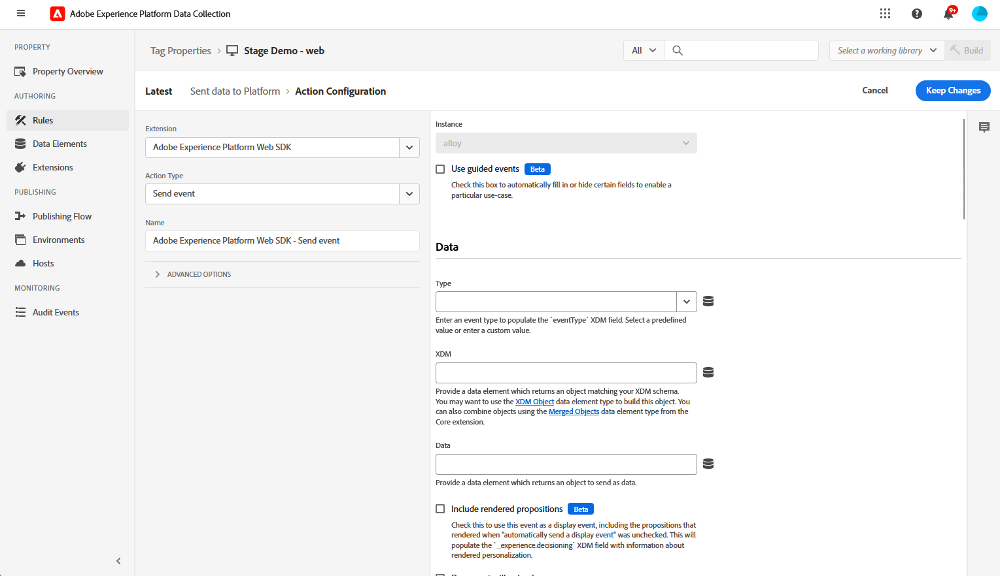
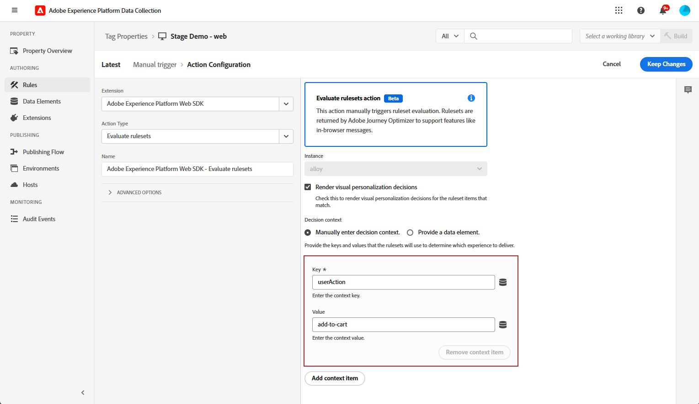
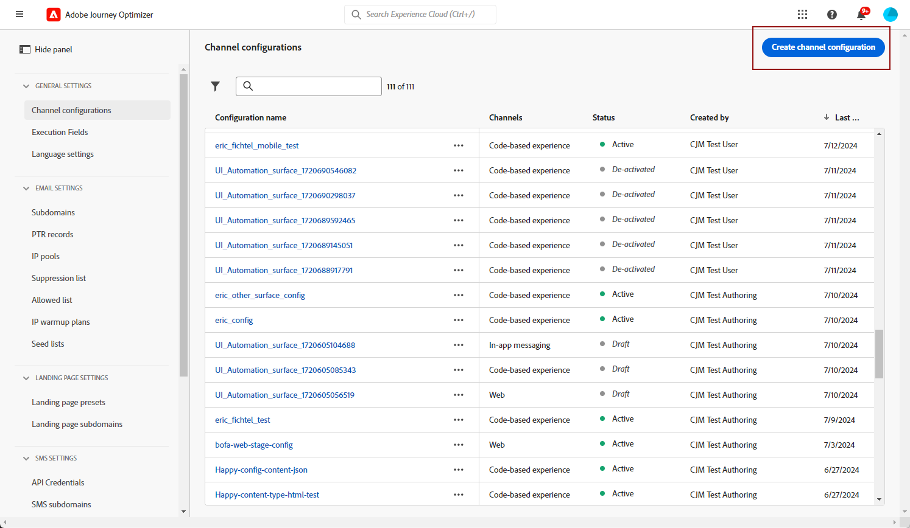

# Het webkanaal in de app configureren {#configure-in-app-web}

## Vereisten {#prerequisites}

* Verzeker u de recentste versie voor uw **uitbreiding van SDK van het Web van 0} Adobe Experience Platform gebruikt.**

* Installeer de **uitbreiding van het Web SDK van 0} Adobe Experience Platform {in uw** eigenschappen van de Markering **en laat de** Opslag van Personalization **optie toe.**

  Deze configuratie is essentieel voor het opslaan van gebeurtenisgeschiedenissen op de cliënt, een voorwaarde voor het uitvoeren van de Regels van de Frequentie in de Bouwer van Regels. [Meer informatie](https://experienceleague.adobe.com/docs/experience-platform/tags/extensions/client/web-sdk/web-sdk-extension-configuration.html){target="_blank"}

  

## Verzonden gegevens naar platformregel configureren {#configure-sent-data-trigger}

1. Heb toegang tot uw **instantie van de Gegevensverzameling van 0} Adobe Experience Platform {en navigeer aan** Eigenschappen van de Markering **die met de** wordt gevormd SDK van het Web van Adobe Experience Platform **uitbreiding.**

1. Van het **Authoring** menu, uitgezochte **Regels** dan **creeer nieuwe regel** of **voegt regel** toe.

   

1. In de **sectie van Gebeurtenissen**, voegt de klik **** toe en vormt het als volgt:

   * **Uitbreiding**: Kern

   * **Type van Gebeurtenis**: Bibliotheek Geladen (de Boven van de Pagina).

   

1. Klik **houden veranderingen** om de configuratie van de Gebeurtenis te bewaren.

1. In de **sectie van Acties**, klik **** toevoegen en vormen het als volgt:

   * **Uitbreiding**: Adobe Experience Platform Web SDK

   * **Type van Actie**: Verzend gebeurtenis

   

1. In de **sectie van Personalization** van uw **type van Actie**, laat **visuele verpersoonlijkingsbesluiten** optie terug.

   

1. In de **sectie van de Context van het Besluit**, bepaal de **Zeer belangrijke** en **Paren van de Waarde** die welke ervaring bepalen om te leveren.

   

1. Sparen uw **configuratie van de Actie** door **te klikken houdt veranderingen**.

1. Navigeer aan het **Publiceren stroom** menu. Creeer een nieuwe **Bibliotheek** of selecteer een bestaande **Bibliotheek** en voeg uw onlangs gecreeerde **Regel** aan het toe. [Meer informatie](https://experienceleague.adobe.com/docs/experience-platform/tags/publish/libraries.html#create-a-library){target="_blank"}

1. Van uw **Bibliotheek**, uitgezocht **sparen &amp; bouwen aan ontwikkeling**.

   

## Handmatige regel configureren {#configure-manual-trigger}

1. Heb toegang tot uw **instantie van de Gegevensverzameling van 0} Adobe Experience Platform {en navigeer aan** Eigenschappen van de Markering **die met de** wordt gevormd SDK van het Web van Adobe Experience Platform **uitbreiding.**

1. Van het **Authoring** menu, uitgezochte **Regels** dan **creeer nieuwe regel** of **voegt regel** toe.

   

1. In de **sectie van Gebeurtenissen**, voegt de klik **** toe en vormt het als volgt:

   * **Uitbreiding**: Kern

   * **Type van Gebeurtenis**: Klik

   

1. In de **configuratie van de Klik**, bepaal de **Selecteur** die zal worden geëvalueerd.

   

1. Klik **houden veranderingen** om de **configuratie van de Gebeurtenis** te bewaren.

1. In de **sectie van Acties**, klik **** toevoegen en vormen het als volgt:

   * **Uitbreiding**: Adobe Experience Platform Web SDK

   * **Type van Actie**: Evalueer heersers

   

1. In **evalueer linialen actiesectie** van uw **type van de Actie**, laat **visuele verpersoonlijkingsbesluiten** optie terug.

   

1. In de **sectie van de Context van het Besluit**, bepaal de **Zeer belangrijke** en **Paren van de Waarde** die welke ervaring bepalen om te leveren.

1. Heb toegang tot het **Publiceren stroom** menu, creeer een nieuwe **Bibliotheek** of selecteer een bestaande **Bibliotheek** en voeg uw pas gecreëerde **Regel** toe. [Meer informatie](https://experienceleague.adobe.com/docs/experience-platform/tags/publish/libraries.html#create-a-library){target="_blank"}

1. Van uw **Bibliotheek**, uitgezocht **sparen &amp; bouwen aan ontwikkeling**.

   

## Een webconfiguratie in de app maken {#in-app-config}

1. Open het menu **[!UICONTROL Channels]** > **[!UICONTROL General settings]** > **[!UICONTROL Channel configurations]** en klik op **[!UICONTROL Create channel configuration]** .

   

1. Voer een naam en beschrijving (optioneel) voor de configuratie in en selecteer vervolgens het kanaal dat u wilt configureren.

   >[!NOTE]
   >
   > Namen moeten beginnen met een letter (A-Z). Het mag alleen alfanumerieke tekens bevatten. U kunt ook onderstrepingsteken `_` -, punt `.` - en afbreekstreepjes `-` gebruiken.

1. Als u aangepaste of basislabels voor gegevensgebruik aan de configuratie wilt toewijzen, kunt u **[!UICONTROL Manage access]** selecteren. [ leer meer over de Controle van de Toegang van het Niveau van Objecten (OLAC) ](../administration/object-based-access.md).

1. Selecteer **[!UICONTROL Marketing action]**(s) om het toestemmingsbeleid aan de berichten te associëren gebruikend deze configuratie. Alle toestemmingsbeleid verbonden aan de marketing actie wordt gebruikt om de voorkeur van uw klanten te respecteren. [Meer informatie](../action/consent.md#surface-marketing-actions)

1. Selecteer **In-app overseinen** kanaal.

1. Definieer een toepassingsconfiguratie. U hebt twee opties om wijzigingen aan te brengen:

   * U kunt een **[!UICONTROL Page URL]** invoeren om wijzigingen toe te passen op een specifieke pagina.

   * U kunt een regel maken om meerdere URL&#39;s met hetzelfde patroon als doel in te stellen.

     +++ Hoe te om een de passende regel van Pagina&#39;s te bouwen.

      1. Selecteer **[!UICONTROL Pages matching rule]** als toepassingsconfiguratie en voer uw **[!UICONTROL Page URL]** in.

      1. Definieer in het venster **[!UICONTROL Edit configuration rule]** de criteria voor de velden **[!UICONTROL Domain]** en **[!UICONTROL Page]** .
      1. Verbeter uw criteria vanuit de voorwaarde-dropdowns.

         Als u bijvoorbeeld elementen wilt bewerken die op alle pagina&#39;s met verkoopproducten van uw Luma-website worden weergegeven, selecteert u Domein > Begint met > Lumma en Pagina > Bevat > Verkoop.

         

      1. Klik indien nodig op **[!UICONTROL Add another page rule]** om een andere regel te maken.

      1. Selecteer **[!UICONTROL Default authoring and preview URL]**.

      1. Sla uw wijzigingen op. De regel wordt weergegeven in het **[!UICONTROL Create campaign]** -scherm.

     +++

1. Verzend uw webconfiguratie in de app.

U kunt [ nu tot een Web in-app ](../in-app/create-in-app-web.md) binnen een campagne leiden.
