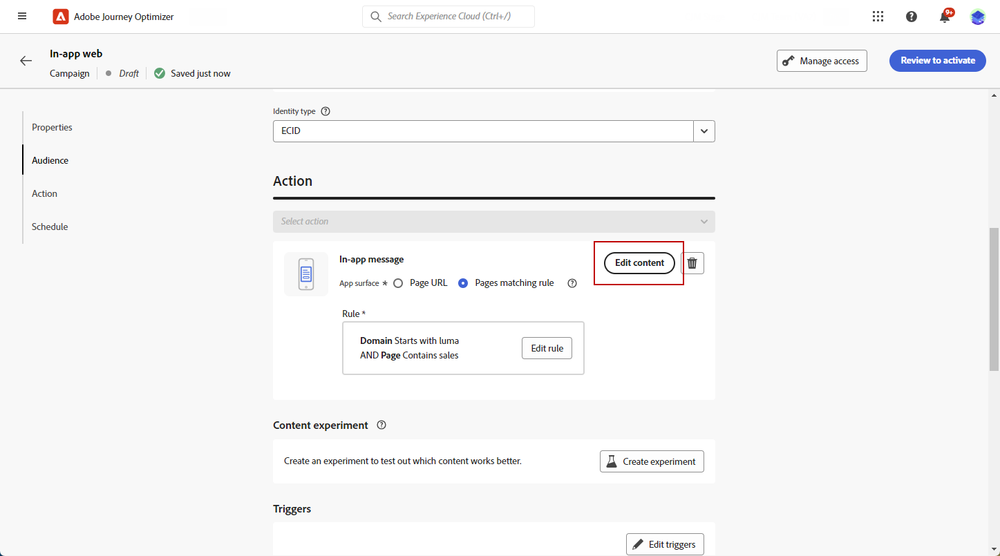

# Een Web In-app-bericht maken {#create-in-app-web}

## Het webkanaal in de app configureren {#configure-web-inapp}

Volg onderstaande stappen om uw Web in-app kanaal in te stellen:

* Installeer de Web SDK-tagextensie om Web In-app Messaging te ondersteunen. [Meer informatie](https://experienceleague.adobe.com/docs/experience-platform/tags/extensions/client/web-sdk/web-sdk-extension-configuration.html?lang=nl-NL){target="_blank"}

* Pas de triggers aan. Het Berichten van het Web in-app steunt twee types van trekkers: Verzonden gegevens naar platform en Hand trekkers. [Meer informatie](https://experienceleague.adobe.com/docs/experience-platform/edge/personalization/ajo/web-in-app-messaging.html?lang=nl-NL){target="_blank"}

* Maak uw Web in-app configuratie. [Meer informatie](inapp-configuration.md)

## Maak uw Web In-app berichtcampagne {#create-inapp-web-campaign}

1. Open het menu **[!UICONTROL Campaigns]** en klik op **[!UICONTROL Create campaign]** .

1. Kies het uitvoeringstype van de campagne: Gepland of API-geactiveerd. Leer meer over campagneretypen op [&#x200B; deze pagina &#x200B;](../campaigns/create-campaign.md#campaigntype).

1. Kies in de vervolgkeuzelijst **[!UICONTROL Actions]** de optie **[!UICONTROL In-app message]** .

   

1. Kies of maak uw toepassingsconfiguratie. [Meer informatie](inapp-configuration.md#channel-prerequisites)

## Uw webberichtcampagne in de app definiëren {#configure-inapp}

1. Voer in de sectie **[!UICONTROL Properties]** de beschrijving **[!UICONTROL Title]** en **[!UICONTROL Description]** in.

1. Selecteer **[!UICONTROL Manage access]** als u aangepaste labels of basislabels voor gegevensgebruik wilt toewijzen aan het bericht in de app. [Meer informatie](../administration/object-based-access.md).

1. Klik op de knop **[!UICONTROL Select audience]** om het doelpubliek in de lijst met beschikbare Adobe Experience Platform-soorten publiek te definiëren. [Meer informatie](../audience/about-audiences.md).

   

1. Kies in het veld **[!UICONTROL Identity namespace]** de naamruimte die u wilt gebruiken om de personen van het geselecteerde publiek te identificeren. [Meer informatie](../event/about-creating.md#select-the-namespace).

1. In het menu **[!UICONTROL Action]** vindt u de eerder geconfigureerde instellingen als **[!UICONTROL App configuration]** . U kunt hier indien nodig wijzigingen aanbrengen of uw regel bijwerken door op **[!UICONTROL Edit Rule]** te klikken.

1. Klik op **[!UICONTROL Create experiment]** om uw inhoudexperiment te configureren en behandelingen te maken om de prestaties te meten en de beste optie voor uw doelgroep te identificeren. [Meer informatie](../content-management/content-experiment.md)

1. Klik op **[!UICONTROL Edit triggers]** om de gebeurtenis(sen) en criteria te kiezen die het bericht activeren. Met regelbuilders kunnen gebruikers criteria en waarden opgeven die, wanneer ze voldoen, een set handelingen activeren, zoals het verzenden van een bericht in de app.

   1. Klik op de vervolgkeuzelijst Gebeurtenis om de trigger zo nodig te wijzigen.

      +++Zie beschikbare triggers.

      | Pakket | Trigger | Definitie |
      |---|---|---|
      | Platform | Gegevens verzonden naar platform | Wordt geactiveerd wanneer de mobiele app een Edge Experience-gebeurtenis uitgeeft om gegevens naar Adobe Experience Platform te verzenden. Gewoonlijk de API vraag [&#x200B; sendEvent &#x200B;](https://developer.adobe.com/client-sdks/documentation/edge-network/api-reference/#sendevent){target="_blank"} van de uitbreiding van AEP Edge. |
      | Handmatig | Handmatige trigger | Twee bijbehorende gegevenselementen: een sleutel, die een constante is die de gegevensset definieert (bijvoorbeeld geslacht, kleur, prijs), en een waarde, die een variabele is die tot de set behoort (bijvoorbeeld man/vrouw, groen, 100). |

      +++

   1. Klik op **[!UICONTROL Add condition]** als u wilt dat de trigger rekening houdt met meerdere gebeurtenissen of criteria.

   1. Kies de voorwaarde **[!UICONTROL Or]** als u meer **[!UICONTROL Triggers]** wilt toevoegen om de lijn verder uit te breiden.

      

   1. Kies de voorwaarde **[!UICONTROL And]** als u een aangepast **[!UICONTROL Trait]** wilt toevoegen en de lijn beter wilt afstemmen.

      +++Zie de beschikbare traits.

      | Pakket | Trait | Definitie |
      |---|---|---|
      | Platform | XDM-gebeurtenistype | Wordt geactiveerd wanneer aan het opgegeven gebeurtenistype wordt voldaan. |
      | Platform | XDM-waarde | Wordt geactiveerd wanneer aan de opgegeven XDM-waarde wordt voldaan. |

      +++

      

   1. Klik op **[!UICONTROL Make group]** om triggers samen te groeperen.

1. Kies de frequentie van de trigger wanneer het bericht in de app actief is. De volgende opties zijn beschikbaar:

   * **[!UICONTROL Everytime]**: altijd het bericht weergeven wanneer de gebeurtenissen plaatsvinden die in de vervolgkeuzelijst **[!UICONTROL Mobile app trigger]** zijn geselecteerd.
   * **[!UICONTROL Once]**: Alleen dit bericht weergeven wanneer de gebeurtenissen die in de vervolgkeuzelijst **[!UICONTROL Mobile app trigger]** zijn geselecteerd, voor het eerst optreden.
   * **[!UICONTROL Until click through]**: dit bericht weergeven wanneer de gebeurtenissen die zijn geselecteerd in de vervolgkeuzelijst **[!UICONTROL Mobile app trigger]** , plaatsvinden totdat de SDK een interactieve gebeurtenis heeft verzonden met de actie &quot;Kliked&quot;.
   * **[!UICONTROL X number of times]**: toon dit bericht X tijd.

1. Kies zo nodig welke **[!UICONTROL Day of the week]** of **[!UICONTROL Time of day]** het bericht in de app wordt weergegeven.

1. Campagnes worden ontworpen om op een specifieke datum of op een terugkomende frequentie worden uitgevoerd. Leer hoe te om **[!UICONTROL Schedule]** van uw campagne in [&#x200B; te vormen deze sectie &#x200B;](../campaigns/create-campaign.md#schedule).

   

1. U kunt nu beginnen met het ontwerpen van uw inhoud met de knop **[!UICONTROL Edit content]** . [Meer informatie](design-in-app.md)

   

**Verwante onderwerpen:**

* [Uw In-app-bericht testen en verzenden](send-in-app.md)
* [Rapport in app](../reports/campaign-global-report-cja-inapp.md)
* [Configuratie in de app](inapp-configuration.md)
