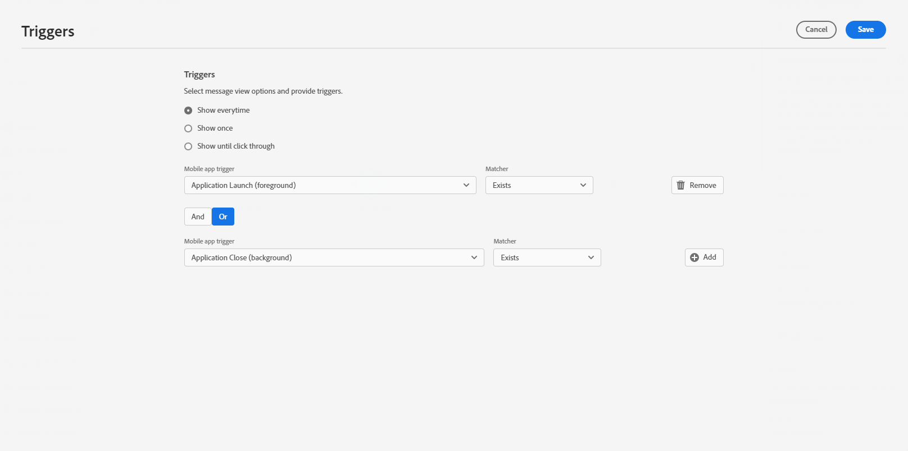

# Een bericht in de app maken {#create-in-app}

>[!CONTEXTUALHELP]
>id="ajo_campaigns_inapp_triggers"
>title="In-app-triggers beheren"
>abstract="U kunt uw triggers efficiënt besturen door de specifieke gebeurtenissen en criteria te selecteren waarmee uw berichten worden geactiveerd. Met de Bouwer van de Regel, kunnen de gebruikers nauwkeurige voorwaarden en waarden bepalen. Wanneer aan deze voorwaarden wordt voldaan, starten zij een reeks acties, waaronder de levering van berichten in de app."

U kunt een bericht in de app toevoegen aan een campagne of een reis. Voer de onderstaande stappen uit om in beide contexten een bericht in de app te maken.

In-app-berichten worden niet beïnvloed door de keuze van de gebruiker om zich aan te melden of zich af te melden voor pushberichten op het besturingssysteem.

>[!BEGINTABS]

>[!TAB  voeg een In-app bericht aan een reis toe ]

Ga als volgt te werk om een bericht in de app toe te voegen:

1. Open uw reis en sleep vervolgens een **[!UICONTROL In-app]** -activiteit vanuit de **[!UICONTROL Actions]** -sectie van het palet.

   Wanneer een profiel het einde van de rit bereikt, verlopen alle berichten in de app die aan hen worden weergegeven, automatisch. Daarom wordt er automatisch een wachtbewerking toegevoegd na uw activiteiten in de app om de juiste timing te garanderen.

   

1. Voer een **[!UICONTROL Label]** en **[!UICONTROL Description]** in voor uw bericht.

1. Kies uw [ in-app configuratie ](inapp-configuration.md#channel-prerequisites) aan gebruik.

   

1. U kunt nu beginnen met het ontwerpen van uw inhoud met de knop **[!UICONTROL Edit content]** . [Meer informatie](design-in-app.md)

1. Klik op **[!UICONTROL Edit triggers]** om de gebeurtenis(sen) en criteria te kiezen die het bericht activeren. Met regelbuilders kunnen gebruikers criteria en waarden opgeven die, wanneer ze voldoen, een set handelingen activeren, zoals het verzenden van een bericht in de app.

   

   1. Klik op de vervolgkeuzelijst Gebeurtenis om de trigger zo nodig te wijzigen.

      +++Zie beschikbare triggers.

      | Pakket | Trigger | Definitie |
      |---|---|---|
      | Gegevens verzenden naar platform | Gegevens verzonden naar platform | Wordt geactiveerd wanneer de mobiele app een Edge Experience-gebeurtenis uitgeeft om gegevens naar Adobe Experience Platform te verzenden. Gewoonlijk de API vraag [ sendEvent ](https://developer.adobe.com/client-sdks/documentation/edge-network/api-reference/#sendevent) van de uitbreiding van AEP Edge. |
      | Core tracking | Handeling track | Teweeggebracht wanneer de erfenisfunctionaliteit die in mobiele code API [ wordt aangeboden trackAction ](https://developer.adobe.com/client-sdks/documentation/mobile-core/api-reference/#trackaction) wordt geroepen. |
      | Core tracking | Status track | Teweeggebracht wanneer de erfenisfunctionaliteit die in mobiele code API [ wordt aangeboden trackState ](https://developer.adobe.com/client-sdks/documentation/mobile-core/api-reference/#trackstate) wordt geroepen. |
      | Core tracking | PII verzamelen | Teweeggebracht wanneer de erfenisfunctionaliteit die in mobiele code API [ wordt aangeboden collectPII ](https://developer.adobe.com/client-sdks/documentation/mobile-core/api-reference/#collectpii) wordt geroepen. |
      | Levenscyclus toepassing | Toepassing starten | Teweeggebracht bij elke looppas, met inbegrip van neerstortingen en installaties. Wordt ook geactiveerd op een hervat vanaf de achtergrond wanneer de time-out van de levenscyclussessie is overschreden. |
      | Levenscyclus toepassing | Toepassing installeren | Wordt geactiveerd bij de eerste run na installatie of herinstallatie. |
      | Levenscyclus toepassing | Toepassingsupdate | Teweeggebracht bij de eerste looppas na een verbetering of wanneer het versieaantal verandert. |
      | Levenscyclus toepassing | Toepassing sluiten | Wordt geactiveerd wanneer de toepassing wordt gesloten. |
      | Levenscyclus toepassing | Toepassing vastloopt | Wordt geactiveerd wanneer de toepassing geen achtergrond heeft voordat deze wordt gesloten. De gebeurtenis wordt verzonden wanneer de toepassing na de crash wordt gestart. Adobe Mobile-crashrapportage implementeert geen globale handler voor niet-afgevangen uitzonderingen. |
      | Plaatsen | POI invoeren | Wordt geactiveerd door de SDK Places wanneer uw klant het Point of Interest (POI) invoert dat u hebt geconfigureerd. |
      | Plaatsen | POI afsluiten | Wordt geactiveerd door de SDK Places wanneer uw klant het Point of Interest (POI) verlaat dat u hebt geconfigureerd. |

      +++

   1. Klik op **[!UICONTROL Add condition]** als u wilt dat de trigger rekening houdt met meerdere gebeurtenissen of criteria.

   1. Kies de voorwaarde **[!UICONTROL Or]** als u meer **[!UICONTROL Triggers]** wilt toevoegen om de lijn verder uit te breiden.

      

   1. Kies de voorwaarde **[!UICONTROL And]** als u **[!UICONTROL Traits]** wilt toevoegen en uw regel beter wilt perfectioneren.

      +++Zie de beschikbare traits.

      | Pakket | Treinen | Definitie |
      |---|---|---|
      | Apparaatinfo | Naam vervoerder | Wordt geactiveerd wanneer aan een van de naam van de vervoerder uit de lijst wordt voldaan. |
      | Apparaatinfo | Apparaatnaam | Wordt geactiveerd wanneer aan een van de apparaatnamen wordt voldaan. |
      | Apparaatinfo | Landinstelling | Wordt geactiveerd wanneer aan een van de talen in de lijst wordt voldaan. |
      | Apparaatinfo | Besturingssysteemversie | Wordt geactiveerd wanneer aan een van de opgegeven versies van het besturingssysteem wordt voldaan. |
      | Apparaatinfo | Vorige OS-versie | Wordt geactiveerd wanneer aan een van de opgegeven versies van het vorige besturingssysteem wordt voldaan. |
      | Apparaatinfo | Uitvoeren, modus | Wordt geactiveerd als de uitvoeringsmodus een toepassing of een uitbreiding is. |
      | Levenscyclus toepassing | Toepassings-id | Wordt geactiveerd wanneer aan de opgegeven toepassings-id wordt voldaan. |
      | Levenscyclus toepassing | Dag van de week | Wordt geactiveerd wanneer de opgegeven dag van de week is bereikt. |
      | Levenscyclus toepassing | Dag sinds eerste gebruik | Wordt geactiveerd wanneer het opgegeven aantal dagen sinds het eerste gebruik is bereikt. |
      | Levenscyclus toepassing | Dag sinds laatste gebruik | Wordt geactiveerd wanneer het opgegeven aantal dagen sinds laatste gebruik is bereikt. |
      | Levenscyclus toepassing | Dag sinds upgrade | Wordt geactiveerd wanneer het opgegeven aantal dagen sinds de laatste upgrade is bereikt. |
      | Levenscyclus toepassing | Datum van installatie | Wordt geactiveerd wanneer de opgegeven installatiedatum is bereikt. |
      | Levenscyclus toepassing | Starten | Wordt geactiveerd wanneer aan het opgegeven aantal Launches wordt voldaan. |
      | Levenscyclus toepassing | Tijd van dag | Wordt geactiveerd wanneer de opgegeven tijd van de dag is bereikt. |
      | Plaatsen | Huidige POI | Wordt geactiveerd door de SDK Places wanneer uw klant het opgegeven Interessepunt (POI) ingaat. |
      | Plaatsen | Laatste ingevoerde POI | Wordt geactiveerd door de Places SDK, afhankelijk van het punt van interesse dat de klant het laatst heeft ingevoerd (POI). |
      | Plaatsen | Laatst afgesloten POI | Wordt geactiveerd door de Places SDK, afhankelijk van uw klant die het laatst het Point of Interest (POI) heeft verlaten. |

      +++

      

   1. Klik op **[!UICONTROL Make group]** om triggers samen te groeperen.

      

   1. Kies de frequentie van de trigger wanneer het bericht in de app actief is:

      * **[!UICONTROL Show every time]**: altijd het bericht weergeven wanneer de gebeurtenissen plaatsvinden die in de vervolgkeuzelijst **[!UICONTROL Mobile app trigger]** zijn geselecteerd.
      * **[!UICONTROL Show once]**: Dit bericht wordt slechts eenmaal per gebruikerssessie weergegeven en blijft zichtbaar in alle vensters of activiteiten totdat het wordt gesloten. Om het tot een bepaald scherm te beperken of het automatisch te maken sluiten, gebruik douanelogica met de overseinenafgevaardigde.
      * **[!UICONTROL Show until click through]**: dit bericht weergeven wanneer de gebeurtenissen die zijn geselecteerd in de vervolgkeuzelijst **[!UICONTROL Mobile app trigger]** , plaatsvinden totdat de SDK een interactieve gebeurtenis heeft verzonden met de actie &quot;Kliked&quot;.

1. Indien nodig voltooit u de reisflow door extra handelingen of gebeurtenissen te slepen en neer te zetten. [Meer informatie](../building-journeys/about-journey-activities.md)

1. Zodra uw bericht in de app klaar is, voltooit u de configuratie en publiceert u uw reis om het te activeren.

Voor meer informatie over hoe te om een reis te vormen, verwijs naar [ deze pagina ](../building-journeys/journey-gs.md).

>[!NOTE]
>
>Als u een in-app bericht kort na het verzenden van een duw bericht wilt tonen, gebruik a **wacht** activiteit om de in-app tijd van de berichtlading toe te staan om zich te verspreiden. Meestal wordt een wachttijd van 5 tot 15 minuten aanbevolen, maar de exacte wachttijden kunnen variëren afhankelijk van de complexiteit van de lading en de behoeften aan personalisatie.

>[!TAB  voeg een In-app bericht aan een campagne toe ]

Voer de volgende stappen uit om een bericht in de app toe te voegen aan een campagne:

1. Open het menu **[!UICONTROL Campaigns]** en klik op **[!UICONTROL Create campaign]** .

1. Selecteer het type campagne dat u wilt uitvoeren

   * **Gepland - Op de markt brengend**: voer onmiddellijk de campagne of op een gespecificeerde datum uit. Geplande campagnes zijn gericht op het verzenden van marketingberichten. Zij worden gevormd en uitgevoerd van het gebruikersinterface.

   * **API-teweeggebracht - Marketing/Transactioneel**: voer de campagne uit gebruikend een API vraag. API-getriggerde campagnes zijn gericht op het verzenden van marketingberichten of transactiemeldingen, d.w.z. berichten die worden verzonden na een actie van een individu: wachtwoordinstelling, winkelwagentje enz.

1. Voer in de sectie **[!UICONTROL Properties]** de beschrijving **[!UICONTROL Title]** en **[!UICONTROL Description]** in.

1. Selecteer **[!UICONTROL Manage access]** als u aangepaste labels of basislabels voor gegevensgebruik wilt toewijzen aan het bericht in de app. [Meer informatie](../administration/object-based-access.md).

1. Klik op de knop **[!UICONTROL Select audience]** om het doelpubliek in de lijst met beschikbare Adobe Experience Platform-soorten publiek te definiëren. [Meer informatie](../audience/about-audiences.md).

   

1. Kies in het veld **[!UICONTROL Identity namespace]** de naamruimte die u wilt gebruiken om de personen van het geselecteerde publiek te identificeren. [Meer informatie](../event/about-creating.md#select-the-namespace).

1. Kies in de sectie **[!UICONTROL Actions]** de **[!UICONTROL In-app message]** en selecteer of maak een nieuwe configuratie.

   Leer meer over in-app configuratie op [ deze pagina ](inapp-configuration.md).

   

1. Klik op **[!UICONTROL Create experiment]** om uw inhoudexperiment te configureren en behandelingen te maken om de prestaties te meten en de beste optie voor uw doelgroep te identificeren. [Meer informatie](../content-management/content-experiment.md)

1. Klik op **[!UICONTROL Edit triggers]** om de gebeurtenis(sen) en criteria te kiezen die het bericht activeren. Met regelbuilders kunnen gebruikers criteria en waarden opgeven die, wanneer ze voldoen, een set handelingen activeren, zoals het verzenden van een bericht in de app.

   1. Klik op de vervolgkeuzelijst Gebeurtenis om de trigger zo nodig te wijzigen.

      +++Zie beschikbare triggers.

      | Pakket | Trigger | Definitie |
      |---|---|---|
      | Gegevens verzenden naar platform | Gegevens verzonden naar platform | Wordt geactiveerd wanneer de mobiele app een Edge Experience-gebeurtenis uitgeeft om gegevens naar Adobe Experience Platform te verzenden. Gewoonlijk de API vraag [ sendEvent ](https://developer.adobe.com/client-sdks/documentation/edge-network/api-reference/#sendevent) van de uitbreiding van AEP Edge. |
      | Core tracking | Handeling track | Teweeggebracht wanneer de erfenisfunctionaliteit die in mobiele code API [ wordt aangeboden trackAction ](https://developer.adobe.com/client-sdks/documentation/mobile-core/api-reference/#trackaction) wordt geroepen. |
      | Core tracking | Status track | Teweeggebracht wanneer de erfenisfunctionaliteit die in mobiele code API [ wordt aangeboden trackState ](https://developer.adobe.com/client-sdks/documentation/mobile-core/api-reference/#trackstate) wordt geroepen. |
      | Core tracking | PII verzamelen | Teweeggebracht wanneer de erfenisfunctionaliteit die in mobiele code API [ wordt aangeboden collectPII ](https://developer.adobe.com/client-sdks/documentation/mobile-core/api-reference/#collectpii) wordt geroepen. |
      | Levenscyclus toepassing | Toepassing starten | Teweeggebracht bij elke looppas, met inbegrip van neerstortingen en installaties. Wordt ook geactiveerd op een hervat vanaf de achtergrond wanneer de time-out van de levenscyclussessie is overschreden. |
      | Levenscyclus toepassing | Toepassing installeren | Wordt geactiveerd bij de eerste run na installatie of herinstallatie. |
      | Levenscyclus toepassing | Toepassingsupdate | Teweeggebracht bij de eerste looppas na een verbetering of wanneer het versieaantal verandert. |
      | Levenscyclus toepassing | Toepassing sluiten | Wordt geactiveerd wanneer de toepassing wordt gesloten. |
      | Levenscyclus toepassing | Toepassing vastloopt | Wordt geactiveerd wanneer de toepassing geen achtergrond heeft voordat deze wordt gesloten. De gebeurtenis wordt verzonden wanneer de toepassing na de crash wordt gestart. Adobe Mobile-crashrapportage implementeert geen globale handler voor niet-afgevangen uitzonderingen. |
      | Plaatsen | POI invoeren | Wordt geactiveerd door de SDK Places wanneer uw klant het Point of Interest (POI) invoert dat u hebt geconfigureerd. |
      | Plaatsen | POI afsluiten | Wordt geactiveerd door de SDK Places wanneer uw klant het Point of Interest (POI) verlaat dat u hebt geconfigureerd. |

      +++

   1. Klik op **[!UICONTROL Add condition]** als u wilt dat de trigger rekening houdt met meerdere gebeurtenissen of criteria.

   1. Kies de voorwaarde **[!UICONTROL Or]** als u meer **[!UICONTROL Triggers]** wilt toevoegen om de lijn verder uit te breiden.

      

   1. Kies de voorwaarde **[!UICONTROL And]** als u **[!UICONTROL Traits]** wilt toevoegen en uw regel beter wilt perfectioneren.

      +++Zie de beschikbare traits.

      | Pakket | Treinen | Definitie |
      |---|---|---|
      | Apparaatinfo | Naam vervoerder | Wordt geactiveerd wanneer aan een van de naam van de vervoerder uit de lijst wordt voldaan. |
      | Apparaatinfo | Apparaatnaam | Wordt geactiveerd wanneer aan een van de apparaatnamen wordt voldaan. |
      | Apparaatinfo | Landinstelling | Wordt geactiveerd wanneer aan een van de talen in de lijst wordt voldaan. |
      | Apparaatinfo | Besturingssysteemversie | Wordt geactiveerd wanneer aan een van de opgegeven versies van het besturingssysteem wordt voldaan. |
      | Apparaatinfo | Vorige OS-versie | Wordt geactiveerd wanneer aan een van de opgegeven versies van het vorige besturingssysteem wordt voldaan. |
      | Apparaatinfo | Uitvoeren, modus | Wordt geactiveerd als de uitvoeringsmodus een toepassing of een uitbreiding is. |
      | Levenscyclus toepassing | Toepassings-id | Wordt geactiveerd wanneer aan de opgegeven toepassings-id wordt voldaan. |
      | Levenscyclus toepassing | Dag van de week | Wordt geactiveerd wanneer de opgegeven dag van de week is bereikt. |
      | Levenscyclus toepassing | Dag sinds eerste gebruik | Wordt geactiveerd wanneer het opgegeven aantal dagen sinds het eerste gebruik is bereikt. |
      | Levenscyclus toepassing | Dag sinds laatste gebruik | Wordt geactiveerd wanneer het opgegeven aantal dagen sinds laatste gebruik is bereikt. |
      | Levenscyclus toepassing | Dag sinds upgrade | Wordt geactiveerd wanneer het opgegeven aantal dagen sinds de laatste upgrade is bereikt. |
      | Levenscyclus toepassing | Datum van installatie | Wordt geactiveerd wanneer de opgegeven installatiedatum is bereikt. |
      | Levenscyclus toepassing | Starten | Wordt geactiveerd wanneer aan het opgegeven aantal Launches wordt voldaan. |
      | Levenscyclus toepassing | Tijd van dag | Wordt geactiveerd wanneer de opgegeven tijd van de dag is bereikt. |
      | Plaatsen | Huidige POI | Wordt geactiveerd door de SDK Places wanneer uw klant het opgegeven Interessepunt (POI) ingaat. |
      | Plaatsen | Laatste ingevoerde POI | Wordt geactiveerd door de Places SDK, afhankelijk van het punt van interesse dat de klant het laatst heeft ingevoerd (POI). |
      | Plaatsen | Laatst afgesloten POI | Wordt geactiveerd door de Places SDK, afhankelijk van uw klant die het laatst het Point of Interest (POI) heeft verlaten. |

      +++

      

   1. Klik op **[!UICONTROL Make group]** om triggers samen te groeperen.

1. Kies de frequentie van de trigger wanneer het bericht in de app actief is. De volgende opties zijn beschikbaar:

   * **[!UICONTROL Everytime]**: altijd het bericht weergeven wanneer de gebeurtenissen plaatsvinden die in de vervolgkeuzelijst **[!UICONTROL Mobile app trigger]** zijn geselecteerd.
   * **[!UICONTROL Once]**: Alleen dit bericht weergeven wanneer de gebeurtenissen die in de vervolgkeuzelijst **[!UICONTROL Mobile app trigger]** zijn geselecteerd, voor het eerst optreden.
   * **[!UICONTROL Until click through]**: dit bericht weergeven wanneer de gebeurtenissen die zijn geselecteerd in de vervolgkeuzelijst **[!UICONTROL Mobile app trigger]** , plaatsvinden totdat de SDK een interactieve gebeurtenis heeft verzonden met de actie &quot;Kliked&quot;.
   * **[!UICONTROL X number of times]**: toon dit bericht X tijd.

1. Kies zo nodig welke **[!UICONTROL Day of the week]** of **[!UICONTROL Time of day]** het bericht in de app wordt weergegeven.

1. Campagnes worden ontworpen om op een specifieke datum of op een terugkomende frequentie worden uitgevoerd. Leer hoe te om **[!UICONTROL Schedule]** van uw campagne in [ te vormen deze sectie ](../campaigns/create-campaign.md#schedule).

   

1. U kunt nu beginnen met het ontwerpen van uw inhoud met de knop **[!UICONTROL Edit content]** . [Meer informatie](design-in-app.md)

   

>[!ENDTABS]

## Hoe kan ik-video&#39;s{#video}

* In de onderstaande video ziet u hoe u in-app-berichten kunt maken, configureren en publiceren in uw campagnes.

  +++Zie video

  >[!VIDEO](https://video.tv.adobe.com/v/3410430?quality=12&learn=on)

  +++

* In de onderstaande video ziet u hoe u experimenten met inhoud kunt configureren en analyseren op In-app-berichten voor A/B-tests.

  +++Zie video

  >[!VIDEO](https://video.tv.adobe.com/v/3419898/?learn=on&autoplay=true)

  +++

* In de onderstaande video ziet u hoe u een bericht in de app maakt tijdens een reis en hoe u uw reis kunt testen en publiceren.

  +++Zie video

  >[!VIDEO](https://video.tv.adobe.com/v/3423077/?learn=on&autoplay=true)

  +++

**Verwante onderwerpen:**

* [In-app-bericht ontwerpen](design-in-app.md)
* [Uw In-app-bericht testen en verzenden](send-in-app.md)
* [Rapport in app](../reports/campaign-global-report-cja-inapp.md)
* [Configuratie in de app](inapp-configuration.md)