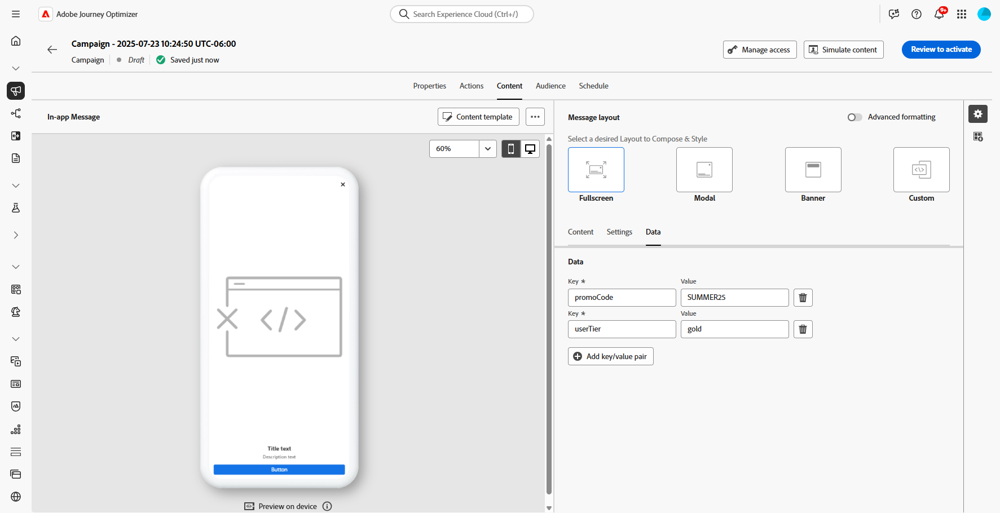

# In-app-inhoud ontwerpen {#design-content}

>[!CONTEXTUALHELP]
>id="ajo_campaigns_inapp_content"
>title="In-app-inhoud definiëren"
>abstract="Pas de inhoud en de stijl van uw in-app berichten aan. U kunt ook media- en actieknoppen toevoegen om uw berichten aantrekkelijker en effectiever te maken."

U kunt de inhoud in de app bewerken om ervaringsopties te configureren:

* Klik in een **[!UICONTROL Campaign]** vanuit het menu **[!UICONTROL Action]** op de knop **[!UICONTROL Edit content]** om de inhoud van het bericht te configureren.

  

* In een **[!UICONTROL Journey]** , vanuit het geavanceerde menu van uw In-app **[!UICONTROL Action]** , kunt u de inhoud ontwerpen met de knop **[!UICONTROL Edit content]** .

  

Met de schakeloptie **[!UICONTROL Advanced formatting]** activeert u aanvullende opties om de ervaring aan te passen.

Nadat u het bericht in de app hebt gemaakt en de inhoud ervan hebt gedefinieerd en gepersonaliseerd, kunt u het bericht controleren en activeren. Vervolgens worden de meldingen verzonden volgens het campagneprogramma. Leer meer op [ deze pagina ](send-in-app.md).

## Berichtlay-out {#message-layout}

>[!CONTEXTUALHELP]
>id="ajo_campaigns_inapp_authoring_message_layout"
>title="In-app-inhoud definiëren"
>abstract="De berichtlay-out voorziet u van algemeen gebruikte malplaatjes om uw bericht te voorzien. Aangepaste indeling biedt opties voor het uploaden of samenstellen van aangepaste HTML-berichten."

Selecteer in de sectie **[!UICONTROL Message Layout]** een van de vier verschillende lay-outopties waaruit u kunt kiezen, afhankelijk van uw berichtbehoeften.

* **[!UICONTROL Fullscreen]**: Dit type lay-out bedekt het volledige scherm van de apparaten van uw doelgroep.

  Media- (afbeeldingen, video), tekst- en knopcomponenten worden ondersteund.

* **[!UICONTROL Modal]**: Deze lay-out wordt weergegeven in een groot waarschuwingsvenster. Uw applicatie is op de achtergrond nog steeds zichtbaar.

  Media- (afbeeldingen, video), tekst- en knopcomponenten worden ondersteund.

* **[!UICONTROL Banner]**: Dit type lay-out wordt weergegeven als een waarschuwingsbericht van het besturingssysteem.

  U kunt alleen een **[!UICONTROL Header]** en een **[!UICONTROL Body]** aan uw bericht toevoegen.

* **[!UICONTROL Custom]**: In de modus Aangepast bericht kunt u een van uw vooraf geconfigureerde HTML-berichten rechtstreeks importeren en bewerken.

   * Selecteer **[!UICONTROL Compose]** om de onbewerkte HTML-code in te voeren of te plakken.

     Gebruik het linkerdeelvenster om de personalisatiemogelijkheden van Journey Optimizer te benutten. Raadpleeg [deze sectie](../personalization/personalize.md) voor meer informatie.

   * Selecteer **[!UICONTROL Import]** om het HTML- of ZIP-bestand met uw HTML-inhoud te importeren.

## Inhoud, tabblad {#content-tab}

Van het **lusje van de Inhoud**, kunt u de inhoud van het bericht en de stijl van de **Sluiten** knoop bepalen en personaliseren. U kunt ook media toevoegen aan uw melding in de app en actieknoppen toevoegen vanaf dit tabblad.

### Knop Sluiten {#close-button}

>[!CONTEXTUALHELP]
>id="ajo_campaigns_inapp_authoring_close"
>title="Kies de Stijl van uw Dichte knoop."
>abstract="In de sectie Knop Sluiten kunt u opties selecteren voor het selecteren van variaties van de knop Sluiten van het bericht en kunt u een aangepaste afbeelding uploaden."

Kies de **[!UICONTROL Style]** van uw **[!UICONTROL Close button]** .

Beschikbare stijlen zijn:

* **[!UICONTROL Simple]**
* **[!UICONTROL Circle]**
* **[!UICONTROL Custom image]** via een media-URL of uw Assets.

+++Meer opties met geavanceerde opmaak

Als **[!UICONTROL Advanced formatting mode]** is ingeschakeld, kunt u de optie **[!UICONTROL Color]** inschakelen om de kleur en dekking van de knop te kiezen.

+++

### Media {#add-media}

>[!CONTEXTUALHELP]
>id="ajo_campaigns_inapp_authoring_media"
>title="Voeg media toe aan uw bericht in de app om een aantrekkelijke ervaring voor de eindgebruiker te creëren."
>abstract="Geef een directe koppeling naar de inhoud op of gebruik de kiezer voor middelen om media in Essentiële elementen te selecteren om aan uw bericht toe te voegen."

In het veld **[!UICONTROL Media]** kunt u media toevoegen aan uw In-app-bericht om een aantrekkelijke ervaring voor de eindgebruiker te creëren.

Typ uw media-URL of klik op het pictogram **[!UICONTROL Select Assets]** om elementen die in uw Assets-bibliotheek zijn opgeslagen, rechtstreeks toe te voegen aan uw In-app-bericht. [ Leer meer over activabeheer ](../integrations/assets.md).
U kunt ook een **[!UICONTROL Alternative text]** toevoegen voor schermlezingstoepassingen.

+++Meer opties met geavanceerde opmaak

Als **[!UICONTROL Advanced formatting mode]** is ingeschakeld, kunt u de **[!UICONTROL Max height]** en **[!UICONTROL Max width]** van uw media aanpassen.

+++

### Inhoud {#title-body}

>[!CONTEXTUALHELP]
>id="ajo_campaigns_inapp_authoring_content"
>title="Als u uw bericht wilt samenstellen, voert u de inhoud in de velden Koptekst en Hoofdtekst in."
>abstract="Hier kan zowel de koptekst als de hoofdtekst worden toegevoegd. Als u personalisatietokens wilt opnemen, opent u het dialoogvenster voor personalisatie."

Voer de inhoud in de velden **[!UICONTROL Header]** en **[!UICONTROL Body]** in om uw bericht samen te stellen.

Gebruik het pictogram **[!UICONTROL Personalization]** om personalisatie toe te voegen. Leer meer over verpersoonlijking in de redacteur van de verpersoonlijking van Adobe Journey Optimizer [ in deze sectie ](../personalization/personalize.md).

+++Meer opties met geavanceerde opmaak

Als **[!UICONTROL Advanced formatting mode]** is ingeschakeld, kunt u kiezen voor de opties **[!UICONTROL Header]** en **[!UICONTROL Body]** :

* the **[!UICONTROL Font]**
* the **[!UICONTROL Pt size]**
* the **[!UICONTROL Font Color]**
* the **[!UICONTROL Alignment]**
+++

### Knoppen {#add-buttons}

>[!CONTEXTUALHELP]
>id="ajo_campaigns_inapp_authoring_buttons"
>title="Voeg knoppen toe waarmee gebruikers kunnen communiceren met uw In-app-bericht."
>abstract="In deze sectie kunt u call-to-action-knoppen toevoegen aan uw bericht. U kunt aangepaste tekst en doelen voor elke knop opnemen."

Voeg knoppen toe waarmee gebruikers kunnen communiceren met uw In-app-bericht.

Zo past u de knop aan:

1. Bewerk het veld Knop #1 (primaire). U kunt ook het pictogram **[!UICONTROL Personalization]** gebruiken om inhoud en aanpassingsgegevens te definiëren.

1. Kies de **[!UICONTROL Interact event]** die de handeling van de knop definieert nadat gebruikers ermee hebben gewerkt.

1. Voer in het veld **[!UICONTROL Target]** de URL of diepte van uw web in.

1. Klik op **[!UICONTROL Add button]** als u meerdere knoppen wilt toevoegen.

+++Meer opties met geavanceerde opmaak

Als de **[!UICONTROL Advanced formatting mode]** is ingeschakeld, kunt u kiezen voor de **[!UICONTROL Buttons]** :

* the **[!UICONTROL Font]**
* the **[!UICONTROL Pt size]**
* the **[!UICONTROL Font Color]**
* the **[!UICONTROL Alignment]**
* the **[!UICONTROL Button style]**
* the **[!UICONTROL Radius]**
* the **[!UICONTROL Button color]**

+++

## Het tabblad Instellingen {#settings-tab}

Van het **lusje van Montages**, kunt u de berichtlay-out bepalen en uw in-app bericht voorproef. U hebt ook toegang tot geavanceerde opmaakopties.

### Voorvertoning {#preview-tab}

>[!CONTEXTUALHELP]
>id="ajo_campaigns_inapp_authoring_preview"
>title="Geef een voorvertoning weer van uw bericht in de app."
>abstract="Dit is de voorvertoningsafbeelding die wordt weergegeven wanneer uw bericht naar het berichtenoverzicht van het apparaat wordt verzonden."

>[!NOTE]
>
>Voorvertoning is alleen beschikbaar voor mobiele berichten in de app.

Met **[!UICONTROL App Preview]** kunt u een achtergrond toevoegen achter uw bericht in de app:

* Een medium via een URL-koppeling.

* Middelen uit uw Assets-bibliotheek.

* Een achtergrondkleur.

### Layout {#layout-options}

>[!CONTEXTUALHELP]
>id="ajo_campaigns_inapp_authoring_layout"
>title="Bepaal de berichtlay-out van uw In-app bericht."
>abstract="In deze sectie kunt u een achtergrond toevoegen aan uw In-app-bericht. Hiervoor moet de overname van de gebruikersinterface zijn ingeschakeld."

In het veld **[!UICONTROL Background image]** kunt u een achtergrond toevoegen aan uw bericht in de app:

* Een medium via een URL-koppeling.

* Een achtergrondkleur.

### Bericht {#message-tab}

>[!CONTEXTUALHELP]
>id="ajo_campaigns_inapp_authoring_message_advanced"
>title="Definieer de geavanceerde instellingen voor berichten."
>abstract="In deze sectie kunt u de inhoud in de app aanpassen, met name wanneer Geavanceerde opmaak is ingeschakeld."

Met de optie UI-overname, die standaard is ingeschakeld, kunt u de achtergrond achter uw In-app-bericht donkerder maken om de focus op uw inhoud te benadrukken.

+++Meer opties met geavanceerde opmaak

Als **[!UICONTROL Advanced formatting mode]** wordt aangezet, kunt u uw bericht verder personaliseren met de volgende opties:

* **[!UICONTROL Customize gestures]**: hiermee kunt u aanpassen wat de interactie met een veegbeweging van de gebruiker is. Als sluiten is geselecteerd, kunt u een aangepaste interactie-gebeurtenis en/of doelbestemming toevoegen.

* **[!UICONTROL Customize UI takeover]** : hiermee kunt u een kleur selecteren die op de achtergrond en de dekking wordt weergegeven.

* **[!UICONTROL Customize size]**: hiermee kunt u de breedte en hoogte van uw In-app-melding aanpassen.

* **[!UICONTROL Customize position]**: hiermee kunt u de positie van uw In-app-berichten op het scherm van uw gebruikers aanpassen. U kunt de verticale en horizontale uitlijning wijzigen.

* **[!UICONTROL Customize animation]**: hiermee kunt u de animaties voor Weergave en Afwijzen aanpassen, bijvoorbeeld als u een melding in de app links of boven op het apparaat van de gebruiker verschijnt.

* **[!UICONTROL Message round corner]**: hiermee kunt u ronde hoeken toevoegen aan uw In-app-melding door het pictogram **[!UICONTROL Corner radius]** te wijzigen.

+++

## Tabblad Gegevens {#data-tab}

Van het **lusje van Gegevens**, kunt u een ** [!UICONTROL Key] ** &#x200B; en **[!UICONTROL Value]** bepalen om douanevariabelen in de nuttige lading te omvatten. Deze sleutel/waardeparen staan u toe om extra gegevens, afhankelijk van uw specifieke configuratie over te gaan.

Voor meer informatie, verwijs naar de [ documentatie van de Ontwikkelaar ](https://developer.adobe.com/client-sdks/edge/adobe-journey-optimizer/in-app-message/tutorials/messaging-metadata/).

1. Selecteer op het tabblad **[!UICONTROL Data]** de optie **[!UICONTROL Add key/value pair]**.

   

1. Vul de velden **[!UICONTROL Key]** &#x200B; en **[!UICONTROL Value]** in.

   

1. Klik op  om de benodigde paar te verwijderen.

**Verwante onderwerpen:**

* [In-app-bericht maken](create-in-app.md)
* [Rapport in app](../reports/campaign-global-report-cja-inapp.md)
* [Configuratie in de app](inapp-configuration.md)

## Hoe kan ik-video{#video}

In de onderstaande video ziet u hoe u uw In-app-berichten kunt ontwerpen en testen.

>[!VIDEO](https://video.tv.adobe.com/v/3410471?quality=12&learn=on)
