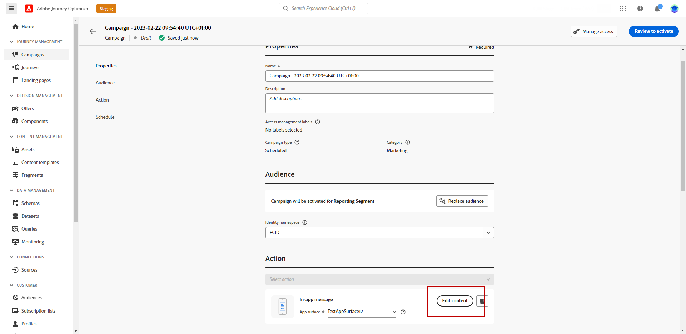

# In-app-inhoud ontwerpen {#design-content}

U kunt de inhoud in de app bewerken om ervaringsopties te configureren, zoals de lay-out en weergave van berichten, tekst en knopopties.

Om de berichtinhoud te vormen, klik **[!UICONTROL Edit content]** en gebruik de opties in het rechtergedeelte van het scherm om uw inhoud van uw In-app-bericht te ontwerpen.

De **[!UICONTROL Advanced formatting]** als u schakelt, worden aanvullende opties geactiveerd om de ervaring aan te passen.

Nadat u het bericht in de app hebt gemaakt en de inhoud ervan hebt gedefinieerd en gepersonaliseerd, kunt u het bericht controleren en activeren. Vervolgens worden de meldingen verzonden volgens het campagneprogramma. Meer informatie in [deze pagina](create-in-app.md#in-app-send).

## Berichtlay-out {#message-layout}

Van de **[!UICONTROL Message Layout]** , selecteert u een van de vier verschillende indelingsopties waaruit u kunt kiezen, afhankelijk van uw berichtenbehoeften.

* **[!UICONTROL Fullscreen]**: Dit type lay-out bedekt het volledige scherm van de apparaten van uw doelgroep.

   Media- (afbeeldingen, video), tekst- en knopcomponenten worden ondersteund.

* **[!UICONTROL Modal]**: Deze lay-out wordt weergegeven in een groot waarschuwingsvenster. Uw applicatie is op de achtergrond nog steeds zichtbaar.

   Media- (afbeeldingen, video), tekst- en knopcomponenten worden ondersteund.

* **[!UICONTROL Banner]**: Dit type lay-out wordt weergegeven als een waarschuwingsbericht van het besturingssysteem.

   U kunt alleen een **[!UICONTROL Header]** en **[!UICONTROL Body]** aan uw bericht.

* **[!UICONTROL Custom]**: In de modus Aangepast bericht kunt u een van uw vooraf geconfigureerde HTML-berichten rechtstreeks importeren en bewerken.

   * Selecteren **[!UICONTROL Compose]** om de onbewerkte HTML-code in te voeren of te plakken.

      Gebruik het linkerdeelvenster om de personalisatiemogelijkheden van Journey Optimizer te benutten. Raadpleeg [deze sectie](../personalization/personalize.md) voor meer informatie.

   * Selecteren **[!UICONTROL Import]** om het HTML- of ZIP-bestand met uw HTML-inhoud te importeren.

## Inhoud, tabblad {#content-tab}

Van de **Inhoud** kunt u definiëren en aanpassen: de inhoud van de kennisgeving en de stijl van de **Sluiten** knop. U kunt ook media toevoegen aan uw melding in de app en actieknoppen toevoegen vanaf dit tabblad.

### Knop Sluiten {#close-button}

Kies de optie **[!UICONTROL Style]** van uw **[!UICONTROL Close button]**.

Beschikbare stijlen zijn:

* **[!UICONTROL Simple]**
* **[!UICONTROL Circle]**
* **[!UICONTROL Custom image]** via een media-URL of uw middelen.

+++Meer opties met geavanceerde opmaak

Als de **[!UICONTROL Advanced formatting mode]** is ingeschakeld, kunt u controleren **[!UICONTROL Color]** om de kleur en dekking van de knop te kiezen.

+++

### Media {#add-media}

De **[!UICONTROL Media]** kunt u media toevoegen aan uw In-app-bericht om een aantrekkelijke ervaring voor de eindgebruiker te creëren.

Typ uw media-URL of klik op de knop **[!UICONTROL Select Assets]** om elementen die in uw middelenbibliotheek zijn opgeslagen, rechtstreeks toe te voegen aan uw In-app-bericht. [Meer informatie over middelenbeheer](../design/assets-essentials.md).
U kunt ook een **[!UICONTROL Alternative text]** voor schermlezingstoepassingen.

+++Meer opties met geavanceerde opmaak

Als de **[!UICONTROL Advanced formatting mode]** is ingeschakeld, kunt u de **[!UICONTROL Max height]** en **[!UICONTROL Max width]** van uw media.

+++

### Koptekst en tekst {#title-body}

Als u uw bericht wilt samenstellen, voert u de inhoud in het dialoogvenster **[!UICONTROL Header]** en **[!UICONTROL Body]** velden.

Gebruik de **[!UICONTROL Personalization]** pictogram om personalisatie toe te voegen. Meer informatie over personalisatie in de Adobe Journey Optimizer Expression Editor [in deze sectie](../personalization/personalize.md).

+++Meer opties met geavanceerde opmaak

Als de **[!UICONTROL Advanced formatting mode]** is ingeschakeld, kunt u kiezen voor uw **[!UICONTROL Header]** en **[!UICONTROL Body]**:

* de **[!UICONTROL Font]**
* de **[!UICONTROL Pt size]**
* de **[!UICONTROL Font Color]**
* de **[!UICONTROL Alignment]**
+++

### Knoppen {#add-buttons}

Voeg knoppen toe waarmee gebruikers kunnen communiceren met uw In-app-bericht.

Zo past u de knop aan:

1. Bewerk het veld Knop #1 (primaire). U kunt ook de opdracht **[!UICONTROL Personalization]** pictogram voor het definiëren van inhoud en aanpassingsgegevens.

1. Kies uw **[!UICONTROL Interact event]** Hiermee definieert u de actie van de knop nadat gebruikers er interactie mee hebben gehad.

1. Voer de URL van uw web in of selecteer deze in het dialoogvenster **[!UICONTROL Target]** veld.

1. Als u meerdere knoppen wilt toevoegen, klikt u op **[!UICONTROL Add button]**.

+++Meer opties met geavanceerde opmaak

Als de **[!UICONTROL Advanced formatting mode]** is ingeschakeld, kunt u kiezen voor uw **[!UICONTROL Buttons]**:

* de **[!UICONTROL Font]**
* de **[!UICONTROL Pt size]**
* de **[!UICONTROL Font Color]**
* de **[!UICONTROL Alignment]**
* de **[!UICONTROL Button style]**
* de **[!UICONTROL Radius]**
* de **[!UICONTROL Button color]**

+++

## Het tabblad Instellingen {#settings-tab}

Van de **Instellingen** kunt u de berichtlay-out definiëren en een voorvertoning van uw In-app-bericht weergeven. U hebt ook toegang tot geavanceerde opmaakopties.

### Voorvertoning {#preview-tab}

De **[!UICONTROL App Preview]** kunt u een achtergrond toevoegen achter uw In-app-bericht:

* Media van een URL-koppeling.

* Een middel uit uw bibliotheek van Activa.

* Een achtergrondkleur.

### Lay-out {#layout-options}

De **[!UICONTROL Background image]** kunt u een achtergrond toevoegen aan uw In-app-bericht:

* Media van een URL-koppeling.

* Een achtergrondkleur.

### Bericht {#message-tab}

Met de optie UI-overname, die standaard is ingeschakeld, kunt u de achtergrond achter uw In-app-bericht donkerder maken om de focus op uw inhoud te benadrukken.

+++Meer opties met geavanceerde opmaak

Als de **[!UICONTROL Advanced formatting mode]** is ingeschakeld, kunt u uw bericht verder personaliseren met de volgende opties:

* **[!UICONTROL Customize gestures]**: Hiermee kunt u aanpassen wat de interactie met een veegbeweging van de gebruiker is. Als sluiten is geselecteerd, kunt u een aangepaste interactie-gebeurtenis en/of doelbestemming toevoegen.

* **[!UICONTROL Customize UI takeover]**: Hiermee kunt u een kleur selecteren die op de achtergrond en de dekking wordt weergegeven.

* **[!UICONTROL Customize size]**: kunt u de breedte en hoogte van uw In-app-melding aanpassen.

* **[!UICONTROL Customize position]**: Hiermee kunt u de positie van uw In-app-berichten op het scherm van uw gebruikers aanpassen. U kunt de verticale en horizontale uitlijning wijzigen.

* **[!UICONTROL Customize animation]**: Hiermee kunt u de weergave- en weergaveanimaties aanpassen, bijvoorbeeld als u een melding in de app links of boven aan het apparaat van de gebruiker ziet.

* **[!UICONTROL Message round corner]**: kunt u ronde hoeken toevoegen aan uw In-app-melding door het **[!UICONTROL Corner radius]**.

+++

**Verwante onderwerpen:**

* [In-app-bericht maken](create-in-app.md)
* [Rapport in app](inapp-report.md)
* [Configuratie in de app](inapp-configuration.md)

