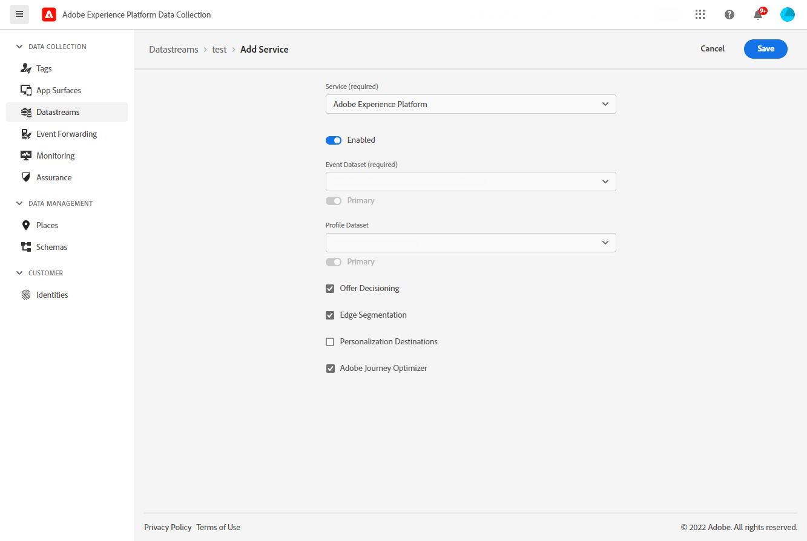

# Vereisten en configuratie {#inapp-configuration}

## Configuratiestappen {#inapp-steps}

Als u in-app-berichten wilt verzenden tijdens reizen en campagnes met [!DNL Journey Optimizer] , moet u de volgende configuratiestappen doorlopen.

1. Zorg ervoor dat u de juiste machtigingen hebt voor Journey Optimizer-campagnes voordat u begint, zelfs als u alleen in-app-berichten tijdens reizen wilt gebruiken. Campagnemachtigingen zijn nog steeds vereist. [Meer informatie](../campaigns/get-started-with-campaigns.md#campaign-prerequisites).
1. Laat Adobe Journey Optimizer in uw de gegevensstroom van de Inzameling van Gegevens van Adobe Experience Platform toe, en controleer uw standaardsamenvoegbeleid in Adobe Experience Platform, zoals die in de [&#x200B; eerste vereisten van de Levering &#x200B;](#delivery-prerequisites) hieronder worden gedetailleerd.
1. Creeer een configuratie van het in-app berichtkanaal in Beleid > Kanalen > de configuraties van het Kanaal, zoals die in [&#x200B; wordt gedetailleerd deze sectie &#x200B;](#channel-prerequisites).
1. Als u inhoudsexperimenten gebruikt, zorg ervoor om de vereisten te volgen die in [&#x200B; worden vermeld deze sectie &#x200B;](#experiment-prerequisite).

Als u klaar bent, kunt u uw eerste In-app-bericht maken, configureren en verzenden. Leer hoe te om dit in [&#x200B; te bereiken deze sectie &#x200B;](create-in-app.md).

## Leveringsvoorwaarden {#delivery-prerequisites}

Voor de correcte levering van de berichten in de app moeten de volgende instellingen worden gedefinieerd:

* In de [&#x200B; Gegevensverzameling van Adobe Experience Platform &#x200B;](https://experienceleague.adobe.com/docs/experience-platform/edge/datastreams/overview.html?lang=nl-NL){target="_blank"}, zorg ervoor u een gegevensstroom hebt die zoals onder de **[!UICONTROL Adobe Experience Platform]** dienst wordt bepaald u toegelaten Adobe Experience Platform Edge en **[!UICONTROL Adobe Journey Optimizer]** optie hebt.

  Dit zorgt ervoor dat de binnenkomende gebeurtenissen van Journey Optimizer correct worden afgehandeld door de Adobe Experience Platform Edge. [Meer informatie](https://experienceleague.adobe.com/docs/experience-platform/edge/datastreams/configure.html?lang=nl-NL){target="_blank"}

  

* In [&#x200B; Adobe Experience Platform &#x200B;](https://experienceleague.adobe.com/docs/experience-platform/profile/home.html?lang=nl){target="_blank"}, zorg ervoor u het standaard toegelaten samenvoegbeleid met de **[!UICONTROL Active-On-Edge Merge Policy]** optie hebt. Selecteer hiertoe een beleid in het menu **[!UICONTROL Customer]** > **[!UICONTROL Profiles]** > **[!UICONTROL Merge Policies]** Experience Platform. [Meer informatie](https://experienceleague.adobe.com/docs/experience-platform/profile/merge-policies/ui-guide.html?lang=nl-NL#configure){target="_blank"}

  Dit samenvoegbeleid wordt door [!DNL Journey Optimizer] binnenkomende kanalen gebruikt om binnenkomende campagnes op de rand correct te activeren en te publiceren. [Meer informatie](https://experienceleague.adobe.com/docs/experience-platform/profile/merge-policies/ui-guide.html?lang=nl-NL){target="_blank"}

  >[!NOTE]
  >
  >Wanneer u een aangepast **[!UICONTROL Dataset preference]** samenvoegbeleid gebruikt, moet u de **[!UICONTROL Journey Inbound]** -gegevensset toevoegen binnen het opgegeven samenvoegbeleid.

  

* Om de levering van de mobiele ervaringen van Journey Optimizer problemen op te lossen, kunt u de **Edge Delivery** mening binnen **Adobe Experience Platform Assurance** gebruiken. Deze plugin laat u toe om verzoekvraag in detail te inspecteren, te verifiëren of de verwachte randvraag zoals voorzien voorkomt, en profielgegevens, met inbegrip van identiteitskaarten, segmentlidmaatschap, en toestemmingsmontages te onderzoeken. Daarnaast kunt u de activiteiten bekijken waarvoor het verzoek is gekwalificeerd en vaststellen voor welke activiteiten het niet heeft uitgevoerd.

  Het gebruiken van de **insteekmodule van Edge Delivery** helpt u de inzichten verkrijgen nodig om uw binnenkomende implementaties effectief te begrijpen en problemen op te lossen.

  [&#x200B; leer meer over de mening van Edge Delivery &#x200B;](https://experienceleague.adobe.com/nl/docs/experience-platform/assurance/view/edge-delivery){target="_blank"}

## Een configuratie in de app maken {#channel-prerequisites}

Ga als volgt te werk om een configuratie in de app in Journey Optimizer te maken:

1. Open het menu **[!UICONTROL Channels]** > **[!UICONTROL General settings]** > **[!UICONTROL Channel configurations]** en klik op **[!UICONTROL Create channel configuration]** .

   

1. Voer een naam en beschrijving (optioneel) voor de configuratie in en selecteer vervolgens het kanaal dat u wilt configureren.

   >[!NOTE]
   >
   > Namen moeten beginnen met een letter (A-Z). Het mag alleen alfanumerieke tekens bevatten. U kunt ook onderstrepingsteken `_` -, punt `.` - en afbreekstreepjes `-` gebruiken.

1. Als u aangepaste of basislabels voor gegevensgebruik aan de configuratie wilt toewijzen, kunt u **[!UICONTROL Manage access]** selecteren. [&#x200B; leer meer over de Controle van de Toegang van het Niveau van Objecten (OLAC) &#x200B;](../administration/object-based-access.md).

1. Selecteer **[!UICONTROL Marketing action]**(s) om het toestemmingsbeleid aan de berichten te associëren gebruikend deze configuratie. Alle toestemmingsbeleid verbonden aan de marketing actie wordt gebruikt om de voorkeur van uw klanten te respecteren. [Meer informatie](../action/consent.md#surface-marketing-actions)

1. Selecteer **In-app overseinen** kanaal.

   

1. Selecteer het platform waarvoor u de instellingen wilt definiëren. Op deze manier kunt u de doelapp voor elk platform opgeven en zorgt u voor consistente levering van inhoud op meerdere platforms.

   >[!NOTE]
   >
   >Voor iOS- en Android-platforms is de levering uitsluitend gebaseerd op de toepassings-id. Als beide toepassingen dezelfde toepassings-id hebben, wordt inhoud geleverd aan beide toepassingen, ongeacht het platform dat is geselecteerd in de **[!UICONTROL Channel configuration]** .

   

1. Voor web:

   * U kunt een **[!UICONTROL Page URL]** invoeren om wijzigingen toe te passen op een specifieke pagina.

   * U kunt een regel maken om meerdere URL&#39;s met hetzelfde patroon als doel in te stellen.

     +++ Hoe te om een de passende regel van Pagina&#39;s te bouwen.

      1. Selecteer **[!UICONTROL Pages matching rule]** als toepassingsconfiguratie en voer uw **[!UICONTROL Page URL]** in.

      1. Definieer in het venster **[!UICONTROL Edit configuration rule]** de criteria voor de velden **[!UICONTROL Domain]** en **[!UICONTROL Page]** .
      1. Verbeter uw criteria vanuit de voorwaarde-dropdowns.

         Als u bijvoorbeeld elementen wilt bewerken die op alle pagina&#39;s met verkoopproducten van uw Luma-website worden weergegeven, selecteert u Domein > Begint met > Lumma en Pagina > Bevat > Verkoop.

         

      1. Klik indien nodig op **[!UICONTROL Add another page rule]** om een andere regel te maken.

      1. Selecteer **[!UICONTROL Default authoring and preview URL]**.

      1. Sla uw wijzigingen op. De regel wordt weergegeven in het **[!UICONTROL Create campaign]** -scherm.

     +++

1. Voor iOS en Android:

   * Voer uw **[!UICONTROL App id]** in.

1. Verzend uw wijzigingen.

U kunt nu uw configuratie selecteren wanneer u uw In-app-bericht maakt.

## Voorwaarden voor rapportage {#experiment-prerequisites}

>[!NOTE]
>
>De dataset wordt gebruikt read-only door het [!DNL Journey Optimizer] rapporteringssysteem en beïnvloedt gegevensinzameling of gegevensopname niet.

Om rapportering voor in-app kanaal toe te laten, moet u ervoor zorgen de [&#x200B; dataset &#x200B;](../data/get-started-datasets.md) die in uw in-app implementatie [&#x200B; wordt gebruikt datastream &#x200B;](https://experienceleague.adobe.com/docs/experience-platform/datastreams/overview.html?lang=nl-NL){target="_blank"} ook inbegrepen in uw rapporteringsconfiguratie is. Met andere woorden, als u bij het configureren van rapporten een gegevensset toevoegt die niet aanwezig is in uw toepassingsgegevensstroom, worden toepassingsgegevens niet weergegeven in uw rapporten. Leer hoe te om datasets voor het melden in [&#x200B; toe te voegen deze sectie &#x200B;](../reports/reporting-configuration.md#add-datasets).

Als u **niet** gebruikend de volgende vooraf bepaalde [&#x200B; gebiedsgroepen &#x200B;](https://experienceleague.adobe.com/docs/experience-platform/xdm/tutorials/create-schema-ui.html?lang=nl-NL#field-group){target="_blank"} voor uw datasetschema bent: `AEP Web SDK ExperienceEvent` en `Consumer Experience Event` (zoals bepaald op [&#x200B; deze pagina &#x200B;](https://experienceleague.adobe.com/docs/platform-learn/implement-web-sdk/initial-configuration/configure-schemas.html?lang=nl-NL#add-field-groups){target="_blank"}), zorg ervoor om de volgende gebiedsgroepen toe te voegen: `Experience Event - Proposition Interactions`, `Application Details`, `Commerce Details`, en `Web Details`. Deze zijn nodig door [!DNL Journey Optimizer] -rapporten, omdat ze bijhouden aan welke campagnes en reizen elk profiel deelneemt.

[Meer informatie over rapportconfiguratie](../reports/reporting-configuration.md)

>[!NOTE]
>
>Het toevoegen van deze veldgroepen heeft geen invloed op de normale gegevensverzameling. Het is alleen additief voor de pagina&#39;s waarop een campagne of reis wordt uitgevoerd, waarbij alle andere trackingmogelijkheden ongewijzigd blijven

**Verwante onderwerpen:**

* [Een bericht in de app maken](create-in-app.md)
* [Een campagne maken](../campaigns/create-campaign.md)
* [In-app-bericht ontwerpen](design-in-app.md)
* [Rapport in app](../reports/campaign-global-report-cja-inapp.md)

