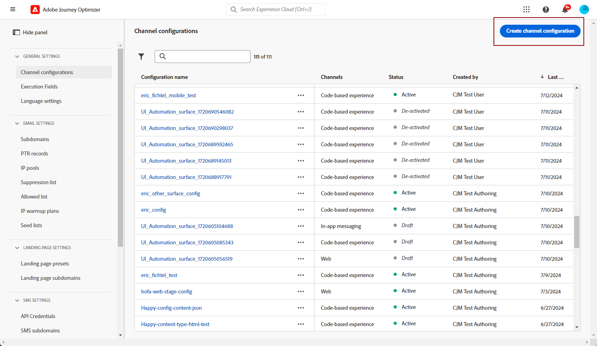

# In-app-kanaal configureren {#inapp-configuration}

Voordat u berichten in de app verzendt, moet u uw kanaal in de app configureren in [!DNL Adobe Experience Platform Data Collection].

1. Van uw [!DNL Adobe Experience Platform Data Collection] account, toegang krijgen tot de **[!UICONTROL Datastream]** menu en klik op **[!UICONTROL New datastream]**. Raadpleeg voor meer informatie over het maken van gegevensstromen de [deze pagina](https://experienceleague.adobe.com/docs/experience-platform/edge/datastreams/configure.html).

1. Selecteer de [!DNL Adobe Experience Platform] service.

   [!DNL Edge Segmentation] en [!DNL Adobe Journey Optimizer] moet worden geselecteerd.

   

   >[!NOTE]
   >
   >Als u inhoudsexperimenten wilt inschakelen voor het kanaal in de app, moet u ervoor zorgen dat de [gegevensset](../data/get-started-datasets.md) gebruikt in uw In-app [datastream](https://experienceleague.adobe.com/docs/experience-platform/datastreams/overview.html){target="_blank"} is ook aanwezig in uw rapportconfiguratie. Anders worden in-app-gegevens niet weergegeven in de rapporten over het inhoudexperiment. [Leer hoe u gegevenssets kunt toevoegen](../campaigns/reporting-configuration.md#add-datasets)
   >
   >De dataset wordt gebruikt read-only door [!DNL Journey Optimizer] rapportagesysteem en heeft geen invloed op gegevensverzameling of gegevensinvoer.

1. Ga vervolgens naar het dialoogvenster **[!UICONTROL App surfaces]** menu en klik op **[!UICONTROL Create App surface]**.

   >[!NOTE]
   >
   > U hebt de **Toepassingsconfiguratie beheren** toestemming om toegang te hebben tot **[!UICONTROL App surfaces]** -menu. Raadpleeg voor meer informatie [deze video](#video).

   

1. Voeg een naam toe aan uw **[!UICONTROL App surface]**.

   

1. Van de **[!UICONTROL Apple iOS]** , configureert u uw mobiele toepassing voor Apple iOS.

+++ Meer informatie

   1. Typ uw **[!UICONTROL iOS Bundle ID]**. Zie [Apple-documentatie](https://developer.apple.com/documentation/appstoreconnectapi/bundle_ids) voor meer informatie over **Bundel-id**.

   1. (optioneel) Kies de optie **[!UICONTROL Sandbox]** waar u pushmeldingen wilt verzenden. Merk op dat het kiezen van een specifieke zandbak de noodzakelijke toegangstoestemmingen vereist.

      Raadpleeg voor meer informatie over sandboxbeheer [deze pagina](../administration/sandboxes.md#assign-sandboxes).

   1. De optie **[!UICONTROL Push credentials]** om het .p8-bestand met de aautoets indien nodig te slepen en neer te zetten.

      U kunt ook de opdracht **[!UICONTROL Manually enter push credentials]** om de APNs AUth-toets rechtstreeks te kopiëren en plakken.

   1. Voer uw **[!UICONTROL Key ID]** en **[!UICONTROL Team ID]**.

      

+++

1. Van de **[!UICONTROL Android]** , configureert u uw mobiele toepassing voor Android.

+++ Meer informatie

   1. Typ uw **[!UICONTROL Android package name]**. Zie [Android-documentatie](https://support.google.com/admob/answer/9972781?hl=en#:~:text=The%20package%20name%20of%20an,supported%20third%2Dparty%20Android%20stores) voor meer informatie over **Pakketnaam**.

   1. (optioneel) Kies de optie **[!UICONTROL Sandbox]** waar u pushmeldingen wilt verzenden. Merk op dat het kiezen van een specifieke zandbak de noodzakelijke toegangstoestemmingen vereist.

      Raadpleeg voor meer informatie over sandboxbeheer [deze pagina](../administration/sandboxes.md#assign-sandboxes).

   1. De optie **[!UICONTROL Push credentials]** optie om uw .json dossier van de privé sleutel te slepen en te laten vallen indien nodig.

      U kunt ook de opdracht **[!UICONTROL Manually enter push credentials]** om de persoonlijke sleutel van FCM rechtstreeks te kopiëren en te plakken.

      

1. Klikken **[!UICONTROL Save]** wanneer u de configuratie van uw voltooide **[!UICONTROL App surface]**.

   

   Uw **[!UICONTROL App surface]** is nu beschikbaar wanneer u een nieuwe campagne maakt met een bericht in de app. [Meer informatie](create-in-app.md)

1. Nadat u het oppervlak van uw app hebt gemaakt, moet u nu een mobiele eigenschap maken.

   Zie [deze pagina](https://experienceleague.adobe.com/docs/experience-platform/tags/admin/companies-and-properties.html#for-mobile) voor de nadere regeling.

   

1. Installeer de volgende extensies in het menu Extensies van de nieuwe eigenschap:

   * Adobe Experience Platform Edge Network
   * Adobe Journey Optimizer
   * AEP-betrouwbaarheid
   * Toestemming
   * Identiteit
   * Mobiele kern
   * Profiel

   Zie [deze pagina](https://experienceleague.adobe.com/docs/experience-platform/tags/ui/extensions/overview.html#add-a-new-extension) voor de nadere regeling.

   

Het kanaal in de app is nu geconfigureerd. U kunt in-app-berichten naar uw gebruikers verzenden.

**Verwante onderwerpen:**

* [Een bericht in de app maken](create-in-app.md)
* [Een campagne maken](../campaigns/create-campaign.md)
* [In-app-bericht ontwerpen](design-in-app.md)
* [Rapport in app](../reports/campaign-global-report.md#inapp-report)

## Instructievideo&#39;s{#video}

* In de onderstaande video ziet u hoe u de **Toepassingsconfiguratie beheren** machtiging om het menu met toepassingsoppervlakken te openen.

  +++Zie video

  >[!VIDEO](https://video.tv.adobe.com/v/3421607)

+++

