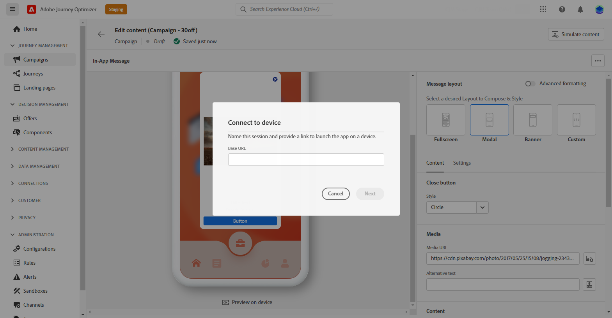

# Uw In-app-melding testen en verzenden {#create-in-app}

## Voorvertonen op apparaat {#preview-device}

Als u een blik van het in-app bericht wilt krijgen alvorens het voor alle gebruikers live gaat, hebt u de capaciteit om het op een specifiek apparaat voor te vertonen. Met deze functionaliteit kunt u ervoor zorgen dat de melding er op het gekozen apparaat uitziet en naar behoren functioneert, zodat de gebruikers er beter van kunnen genieten.

Volg onderstaande stappen om dit te doen:

1. Klik op **[!UICONTROL Preview on device]**.

   

1. Van de **[!UICONTROL Connect to device]** venster, klikt u op **[!UICONTROL Start]**.

1. Voer de **[!UICONTROL Base URL]** van uw toepassing en klik op **[!UICONTROL Next]**.

   

1. Scan de QR-code met het apparaat en voer de weergegeven pincode in.

Het bericht in de app kan nu rechtstreeks op het apparaat worden geactiveerd, zodat u een voorbeeld van het bericht kunt bekijken en het op een echt apparaat kunt bekijken.

## Uw In-app-melding controleren en activeren{#in-app-review}

Nadat u het bericht in de app hebt gemaakt en de inhoud ervan hebt gedefinieerd en gepersonaliseerd, kunt u het bericht controleren en activeren.

Volg onderstaande stappen om dit te doen:

1. Gebruik de **[!UICONTROL Review to activate]** om een overzicht van uw bericht weer te geven.

   In het overzicht kunt u uw campagne desgewenst wijzigen en controleren of een parameter onjuist is of ontbreekt.

   

1. Controleer of uw campagne correct is geconfigureerd en klik vervolgens op **[!UICONTROL Activate]**.

Uw campagne is nu geactiveerd. Het bericht In-App dat in de campagne wordt gevormd wordt verzonden onmiddellijk, of op de gespecificeerde datum.

Zodra verzonden, kunt u het effect van uw in-app berichten binnen de Campagne of de rapporten van de Reis meten. Raadpleeg [deze sectie](../reports/campaign-global-report.md#inapp-report) voor meer informatie over rapporten.

**Verwante onderwerpen:**

* [Een bericht in de app maken](create-in-app.md)
* [In-app-bericht ontwerpen](design-in-app.md)
* [Rapport in app](../reports/campaign-global-report.md#inapp-report)
* [Configuratie in de app](inapp-configuration.md)
