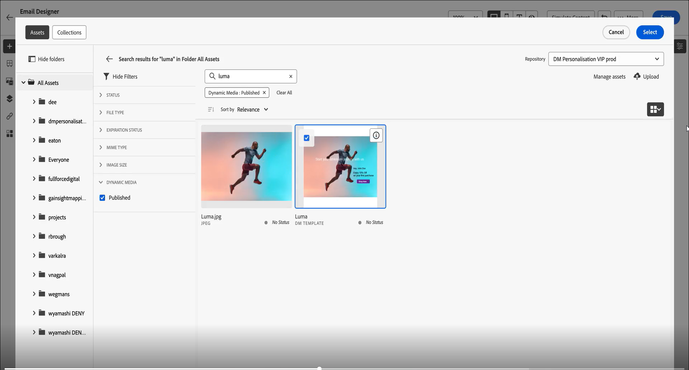
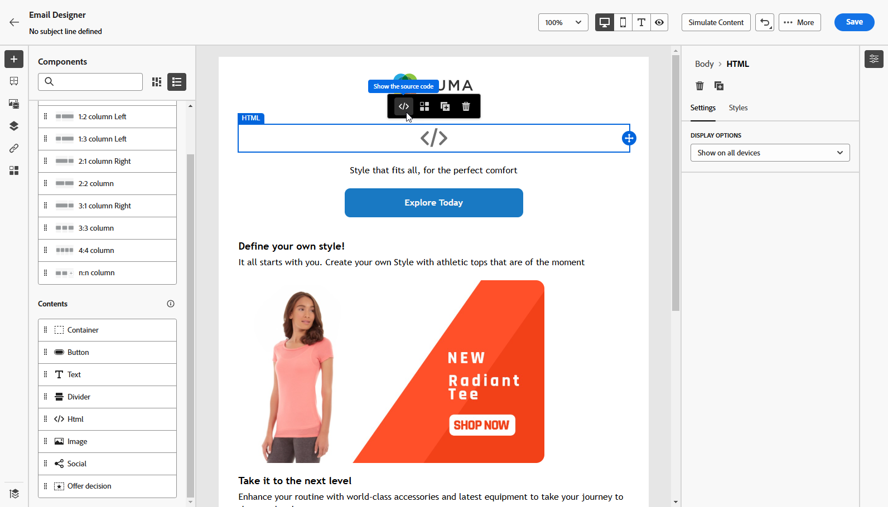

# Werken met dynamische media {#aem-dynamic}

## Aan de slag met dynamische media {#gs-aem-dynamic}

De Asset-kiezer ondersteunt nu Dynamische media waarmee u goedgekeurde dynamische media-uitvoeringen naadloos kunt selecteren en gebruiken in Journey Optimizer. Wijzigingen die u aanbrengt in elementen in Adobe Experience Manager, worden direct weerspiegeld in uw Journey Optimizer-inhoud. Zo weet u zeker dat de meest actuele versies altijd worden gebruikt zonder dat u handmatige updates hoeft uit te voeren.

Deze integratie is alleen beschikbaar voor klanten die Dynamic Media Manager as a Cloud Service gebruiken.

Meer over Dynamische Media in Adobe Experience Manager as a Cloud Service leren, verwijs naar [&#x200B; documentatie van Experience Manager &#x200B;](https://experienceleague.adobe.com/en/docs/experience-manager-cloud-service/content/assets/dynamicmedia/dynamic-media){target="_blank"}.

>[!AVAILABILITY]
>
>Voor klanten van de gezondheidszorg is de integratie alleen mogelijk na het in licentie geven van het Journey Optimizer Healthcare Shield- en Adobe Experience Manager Extended Security for Healthcare-add-on-aanbod.

## Dynamische media toevoegen en beheren {#dynamic-media}

Verbeter en optimaliseer uw inhoud voor om het even welk scherm of browser door dynamische media van Adobe Experience Manager as a Cloud Service direct in uw inhoud van Journey Optimizer op te nemen.  Vervolgens kunt u het formaat van de aanpassingen desgewenst aanpassen, uitsnijden, verbeteren en andere aanpassingen aanbrengen.

>[!IMPORTANT]
>
>Zorg ervoor dat Dynamic Media met OpenAPI is ingeschakeld in Adobe Experience Manager as a Cloud Service. [Meer informatie](https://experienceleague.adobe.com/en/docs/experience-manager-cloud-service/content/assets/dynamicmedia/dynamic-media-open-apis/dynamic-media-open-apis-overview#enable-dynamic-media-open-apis){target="_blank"}.

De dynamische media integratie met Adobe Journey Optimizer is beschikbaar voor zowel Dynamische Media [&#x200B; wijze Scene7 &#x200B;](https://experienceleague.adobe.com/en/docs/experience-manager-65/content/assets/dynamic/config-dms7){target="_blank"} als [&#x200B; met OpenAPI &#x200B;](https://experienceleague.adobe.com/en/docs/experience-manager-cloud-service/content/assets/dynamicmedia/dynamic-media-open-apis/dynamic-media-open-apis-overview){target="_blank"}.

<!--
>[!AVAILABILITY]
>
>Older versions of Outlook (including 2016) do not support rendering of content with Dynamic Media.  We are actively working on a permanent fix to enhance compatibility. In the meantime, apply the following guidelines:
>
>* For Dynamic Media Scene7 URLs: Append `?bfc=on` to the image URL. This enables automatic format negotiation, ensuring the most compatible image format is delivered based on the client's capabilities.
>
>* For Dynamic Media with Open API: Use the `.avif` format. This format includes built-in fallback mechanisms to deliver a compatible format when necessary.
>
-->

Voer de volgende stappen uit om een Adobe Experience Manager-element toe te voegen aan uw HTML-inhoud:

1. Sleep een **[!UICONTROL HTML component]** naar de inhoud.

1. Selecteer **[!UICONTROL Show the source code]**.

   

1. Navigeer in het menu **[!UICONTROL Edit HTML]** naar **[!UICONTROL Assets]** en klik vervolgens op **[!UICONTROL Open asset selector]** .

   U kunt ook de URL van het element kopiëren en plakken.

   

1. Blader door uw AEM-middelen en selecteer de middelen die u aan uw inhoud wilt toevoegen.

1. Pas de afbeeldingsparameters (bijv. hoogte, breedte, roteren, spiegelen, helderheid, kleurtoon, enz.) naar wens aan de vereisten voor het element aan.

   Voor een uitvoerige lijst van beeldparameters die aan URL kunnen worden toegevoegd, verwijs naar [&#x200B; documentatie van Experience Manager &#x200B;](https://experienceleague.adobe.com/en/docs/dynamic-media-developer-resources/image-serving-api/image-serving-api/http-protocol-reference/command-reference/c-command-reference){target="_blank"}.

   

1. Klik op **[!UICONTROL Save]**.

Uw inhoud bevat nu dynamische media. Alle updates die u aanbrengt in Experience Manager, worden automatisch weergegeven in Journey Optimizer.

## Uw tekstbedekking aanpassen {#text-overlay}

U kunt alle dynamische media eenvoudig aanpassen door de bestaande tekstbedekking te vervangen door nieuwe tekst van uw keuze, zodat u naadloze updates en personalisatie kunt uitvoeren.

Met de experimentatiefunctionaliteit kunt u bijvoorbeeld de bestaande tekstbedekking bijwerken door deze te vervangen door een andere tekst voor elke behandeling, zodat deze voor elk profiel wordt aangepast wanneer de berichten worden geopend.

>[!AVAILABILITY]
>
>**de bedekking van de Tekst verpersoonlijking** is beschikbaar uitsluitend op Dynamische Media [&#x200B; wijze Scene7 &#x200B;](https://experienceleague.adobe.com/en/docs/experience-manager-65/content/assets/dynamic/config-dms7){target="_blank"}. Aangezien de wijze Scene7 niet toegankelijk voor klanten van de Gezondheid is, wordt de inhoud teruggegeven gebruikend een binaire kopie van Journey Optimizer van het beeld. Neem voor alle uitzonderingen contact op met uw Adobe-vertegenwoordiger.

Voer de volgende stappen uit om uw tekstbedekking aan te passen:

1. Sleep een **[!UICONTROL HTML component]** naar de inhoud.

1. Selecteer **[!UICONTROL Show the source code]**.

1. Open **[!UICONTROL Edit HTML]** then **[!UICONTROL Assets]** via het menu **[!UICONTROL Open asset selector]** .

   U kunt ook gewoon de URL van uw elementen kopiëren en plakken.

1. Blader door uw AEM-elementen en selecteer de element die u aan uw inhoud wilt toevoegen.

1. Vervang de bedekking door de gewenste tekst.

   

1. Werk de afbeeldingsparameters bij:

   * **Laag**: ga het basiselement in waar uw tekst wordt geplaatst.
   * **Grootte**: werk de grootte van uw tekstblok bij.
   * **TextAttr**: pas de grootte van uw tekstdoopvont aan.
   * **Pos**: plaats de positie van uw tekst in het beeld.

   >[!WARNING]
   >
   >De parameter van de Laag wordt vereist om uw dynamische media bij te werken.

   

1. Klik op **[!UICONTROL Save]**.

Uw inhoud bevat nu uw bijgewerkte tekstbedekking.

## De sjabloon voor dynamische media toevoegen en beheren {#dynamic-media-template}

Voeg uw Dynamic Media-sjabloon eenvoudig toe in Journey Optimizer en werk uw media-inhoud waar nodig bij. U kunt nu aanpassingsvelden opnemen in uw media, zodat u in Journey Optimizer meer aangepaste en aantrekkelijke inhoud kunt maken.

Leer meer over [&#x200B; Dynamische media malplaatje &#x200B;](https://experienceleague.adobe.com/en/docs/dynamic-media-classic/using/template-basics/quick-start-template-basics){target="_blank"}.

>[!AVAILABILITY]
>
>**Dynamisch media malplaatje** is beschikbaar uitsluitend op Dynamische Media [&#x200B; wijze Scene7 &#x200B;](https://experienceleague.adobe.com/en/docs/experience-manager-65/content/assets/dynamic/config-dms7). Aangezien de wijze Scene7 niet toegankelijk voor klanten van de Gezondheidszorg is, zal de inhoud niet worden teruggegeven. Neem voor alle uitzonderingen contact op met de ondersteuning van Experience Manager.

### Met afbeeldingscomponent {#image-component}

U kunt de dynamische sjabloon rechtstreeks in de inhoud invoegen met behulp van de component Afbeelding:

1. Open uw campagne of reis en open uw inhoud.

1. De belemmering en laat vallen een **component van het Beeld** in uw lay-out.

   Voor meer informatie over de component van het Beeld, verwijs naar [&#x200B; deze pagina &#x200B;](../email/content-components.md).

   

1. Blader door uw AEM-elementen en selecteer de sjabloon Dynamische media die u aan uw inhoud wilt toevoegen.

   

1. In de **montages van het Beeld**, navigeer om tot de parameters van uw dynamisch media malplaatje toegang te hebben.

   De beschikbare gebieden hangen van de parameters af die tijdens de [&#x200B; malplaatjeverwezenlijking &#x200B;](https://experienceleague.adobe.com/en/docs/dynamic-media-classic/using/template-basics/creating-template-parameters#creating_template_parameters){target="_blank"} in Adobe Experience Manager worden toegevoegd.

   

1. Vul de verschillende gebieden in en gebruik de verpersoonlijkingsredacteur om gepersonaliseerde inhoud toe te voegen. U kunt elk kenmerk, zoals de profielnaam, de plaats of andere relevante details, gebruiken om een meer aangepaste ervaring te maken.

   Leer meer over verpersoonlijking op [&#x200B; deze pagina &#x200B;](../personalization/personalize.md).

   

1. Voorwaardelijke inhoud kan worden toegepast op de component Dynamische media om verschillende varianten van de inhoud te produceren. [Meer informatie](../personalization/dynamic-content.md)

1. Klik op **[!UICONTROL Save]**.

Nadat u de tests hebt uitgevoerd en de inhoud hebt gevalideerd, kunt u uw bericht naar het publiek sturen.

### Met HTML-component {#html-component}

U kunt uw dynamische sjabloon rechtstreeks in uw inhoud invoegen met behulp van de HTML-component:

1. Open uw campagne of reis en open uw inhoud.

1. De belemmering en laat vallen een **component van HTML** in uw lay-out.

   

1. Selecteer **[!UICONTROL Show the source code]**.

   

1. Open **[!UICONTROL Edit HTML]** then **[!UICONTROL Assets]** via het menu **[!UICONTROL Open asset selector]** .

   U kunt ook gewoon de URL van uw elementen kopiëren en plakken.

1. Pas de parameters voor afbeeldingstekst naar wens aan de vereisten voor elementen aan.

   

1. Klik op **[!UICONTROL Save]**.

Nadat u de tests hebt uitgevoerd en de inhoud hebt gevalideerd, kunt u uw bericht naar het publiek sturen.

<!--
## Personalization with Text Overlay

Easily customize any dynamic media by replacing the existing text overlay with new text of your choice, allowing for seamless updates and personalization.

In this example, our goal is to update the existing text overlay by replacing it with a new validity date and adding a personalization block, ensuring it is customized for each profile when they open their messages.

1. Drag and drop an **[!UICONTROL HTML component]** into your content.

1. Select **[!UICONTROL Show the source code]**.

1. From the **[!UICONTROL Edit HTML]** menu, access **[!UICONTROL Assets]** then **[!UICONTROL Open asset selector]**.

    You can also simply copy and paste your assets URL.

1. Browse through your AEM assets and select the one you want to add to your content.

1. Replace the overlay with the desired text.

    Here we change the validity date from 31st December 2024 to the 1st July 2025.

1. Add the required personalization fields to your image.

1. Click **[!UICONTROL Save]**.

Your content now includes your updated text overlay and personalization.

## Add Dynamic media conditional content

Enable conditional content in your dynamic media to better target your audience and deliver a more personalized experience.

1. Drag and drop an **[!UICONTROL HTML component]** into your content.

1. Select **[!UICONTROL Show the source code]**.

1. From the **[!UICONTROL Edit HTML]** menu, access **[!UICONTROL Assets]** then **[!UICONTROL Open asset selector]**.

    You can also simply copy and paste your assets URL.

1. Browse through your AEM assets and select the one you want to add to your content.

1. Once your dynamic media is inserted to your content, select **[!UICONTROL Enable conditional]** content from your HTML component toolbar to create your different user experiences. 

1. From the Variant - 1, click **[!UICONTROL Select condition]** to fine tune your audience.

1. Choose your condition or create a new one if needed and click **[!UICONTROL Select]**.

    [Learn more about conditions](../personalization/create-conditions.md)

1. Select your **[!UICONTROL Component]** and access the **[!UICONTROL Settings]** menu.

1. In the **[!UICONTROL Custom Attributes]** menu, populate the Dynamic Media text and personalization fields to customize the content for your audience.

-->

## Hoe kan ik-video {#video}

Leer hoe u Adobe Experience Manager Dynamic Media met Adobe Journey Optimizer kunt integreren om realtime content-updates en personalisatie mogelijk te maken.

In deze zelfstudie wordt uitgelegd hoe u afbeeldingen rechtstreeks in AJO kunt wijzigen, tekstbedekkingen kunt toevoegen met de HTML-modus, dynamische mediasjablonen kunt maken in AEM voor hyperpersonalisatie en campagnes kunt aanpassen door de inhoud voor verschillende publiekssegmenten op maat te maken. Dankzij deze integratie kunnen marketers op efficiënte wijze aantrekkelijke en gepersonaliseerde campagnes maken zonder dat ze van toepassing op andere toepassingen hoeven te wisselen.

>[!VIDEO](https://video.tv.adobe.com/v/3457695/?learn=on&enablevpops=&autoplay=true)

