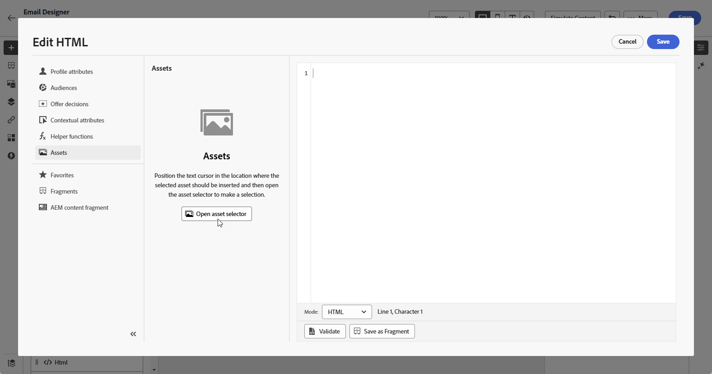

# Werken met dynamische media {#aem-dynamic}

>[!AVAILABILITY]
>
>Deze integratie is uitsluitend beschikbaar voor klanten die Dynamic Media Manager as a Cloud Service gebruiken.

De Asset-kiezer ondersteunt nu Dynamische media waarmee u goedgekeurde dynamische media-uitvoeringen naadloos kunt selecteren en gebruiken in Journey Optimizer. Wijzigingen die u aanbrengt in de middelen van Adobe Experience Manager, worden direct weerspiegeld in uw Journey Optimizer-inhoud. Zo weet u zeker dat de meest actuele versies altijd worden gebruikt zonder dat u handmatige updates hoeft uit te voeren.

Meer op Dynamische Media in Adobe Experience Manager as a Cloud Service leren, verwijs naar [ documentatie van Experience Manager ](https://experienceleague.adobe.com/en/docs/experience-manager-cloud-service/content/assets/dynamicmedia/dynamic-media).

## Dynamische media toevoegen en beheren

Verbeter en optimaliseer uw inhoud voor om het even welk scherm of browser door dynamische media van Adobe Experience Manager as a Cloud Service direct in uw inhoud van Journey Optimizer op te nemen.  Vervolgens kunt u het formaat van de aanpassingen desgewenst aanpassen, uitsnijden, verbeteren en andere aanpassingen aanbrengen.

1. Sleep een **[!UICONTROL HTML component]** naar de inhoud.

1. Selecteer **[!UICONTROL Show the source code]**.

   

1. Navigeer in het menu **[!UICONTROL Edit HTML]** naar **[!UICONTROL Assets]** en klik vervolgens op **[!UICONTROL Open asset selector]** .

   U kunt ook de URL van het element kopiëren en plakken.

   

1. Blader door uw AEM-middelen en selecteer de middelen die u aan uw inhoud wilt toevoegen.

1. Pas de afbeeldingsparameters (bijvoorbeeld hoogte en breedte) naar wens aan de vereisten voor het element aan.

1. Klik op **[!UICONTROL Save]**.

Uw inhoud bevat nu dynamische media. Alle updates die u aanbrengt in Experience Manager, worden automatisch weergegeven in Journey Optimizer.

## Personalization afbeeldingen gebruiken met tekstbedekking

U kunt inhoud eenvoudig presenteren met afbeeldingen met tekstbedekking.
tekst kan worden gewijzigd in AJO door de bovenstaande URL te wijzigen

1. Sleep een **[!UICONTROL HTML component]** naar de inhoud.

1. Selecteer **[!UICONTROL Show the source code]**.

1. Open **[!UICONTROL Assets]** then **[!UICONTROL Open asset selector]** via het menu **[!UICONTROL Edit HTML]** .

   U kunt ook gewoon de URL van uw elementen kopiëren en plakken.

1. Blader door uw AEM-elementen en selecteer de element die u aan uw inhoud wilt toevoegen.

## Aanpassing bij uitvoering

Gelaagde sjablonen met DM-lagen parameteren met hulp van de WYSIWYG-auteur om inhoud aan te passen
Toewijzing van profiel-/contextafhankelijke kenmerken met de personaliseringseditor van AJO&#39;s

1. Sleep een **[!UICONTROL HTML component]** naar de inhoud.

1. Selecteer **[!UICONTROL Show the source code]**.

1. Open **[!UICONTROL Assets]** then **[!UICONTROL Open asset selector]** via het menu **[!UICONTROL Edit HTML]** .

   U kunt ook gewoon de URL van uw elementen kopiëren en plakken.

1. Blader door uw AEM-elementen en selecteer de element die u aan uw inhoud wilt toevoegen.