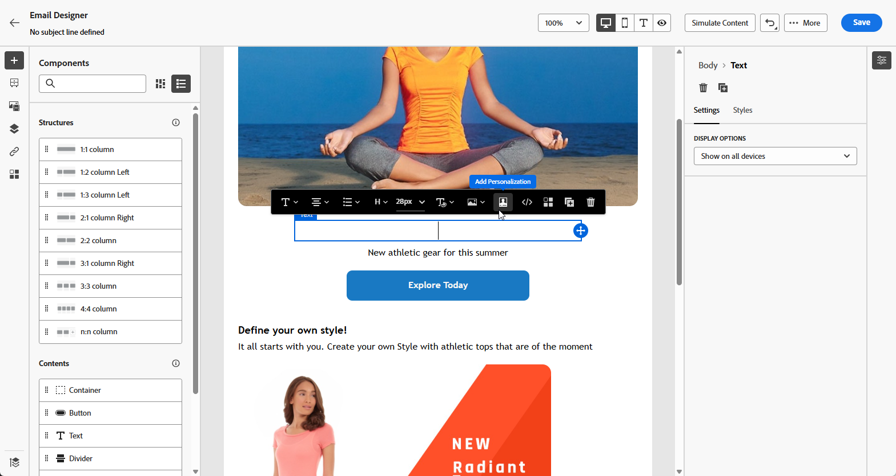
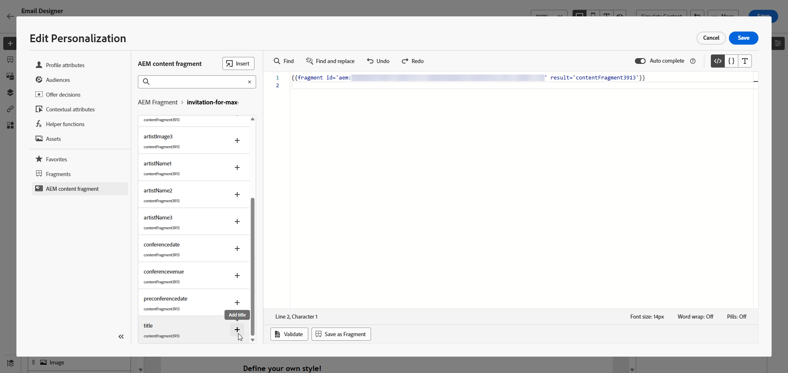

# Adobe Experience Manager-inhoudsfragmenten {#aem-fragments}

Door Adobe Experience Manager as a Cloud Service te integreren met Adobe Journey Optimizer, kunt u nu uw AEM-inhoudsfragmenten naadloos opnemen in uw Journey Optimizer-inhoud. Deze gestroomlijnde verbinding vereenvoudigt het proces van toegang tot en gebruik van AEM-inhoud, waardoor persoonlijke en dynamische campagnes en reizen kunnen worden gemaakt.

Meer over de Fragmenten van de Inhoud van AEM leren, verwijs naar [&#x200B; Werkend met de Fragmenten van de Inhoud &#x200B;](https://experienceleague.adobe.com/nl/docs/experience-manager-cloud-service/content/sites/administering/content-fragments/content-fragments-with-journey-optimizer){target="_blank"} in de documentatie van Experience Manager.

## Voordat u begint {#start}

>[!AVAILABILITY]
>
>Voor klanten in de gezondheidszorg is de integratie alleen mogelijk na het in licentie geven van het Journey Optimizer Healthcare Shield- en Adobe Experience Manager Enhanced Security-add-on-aanbod.

### Beperkingen {#limitations}

Houd rekening met de volgende beperkingen wanneer u werkt met Adobe Experience Manager Content Fragments in Journey Optimizer:

* **de Types van Fragment van Inhoud**: Slechts worden de eenvoudige Fragmenten van de Inhoud gesteund. Variaties en geneste fragmenten worden momenteel niet ondersteund.

* **Meertalige inhoud**: Slechts wordt de handstroom gesteund.

* **Personalization**: Slechts profielattributen, contextuele attributen, statische koorden, en pre-gedeclareerde variabelen worden gesteund. Afgeleide of berekende kenmerken worden niet ondersteund.

* **Updates en versioning**: De updates van het Fragment van de inhoud vereisen handherpublicatie van Adobe Experience Manager. Er is geen automatische afstemming van versies tussen Adobe Experience Manager en Journey Optimizer.

* **Caching**: Journey Optimizer haalt de Fragmenten van de Inhoud in real time van Adobe Experience Manager publiceren. Er is geen pre-rendercaching.

* **het Bewijzen**: Het bewijs voor gepubliceerde campagnes en reizen wijst op gegevens van de recentste publicatie van het Fragment van de Inhoud van Experience Manager. Er is geen historische versieslot.

* **toegang van de Gebruiker**: Het wordt geadviseerd om het aantal gebruikers met toegang te beperken om de Fragmenten van de Inhoud te publiceren om het risico van toevallige fouten te verminderen.

### Stroom van inhoudssynchronisatie {#content-sync-flow}

De integratie tussen Adobe Experience Manager en Journey Optimizer volgt deze gegevensstroom:

1. **[creeer en auteur &#x200B;](https://experienceleague.adobe.com/nl/docs/experience-manager-cloud-service/content/sites/administering/content-fragments/managing#creating-a-content-fragment)**: De inhoud wordt gecreeerd en in Adobe Experience Manager gevormd als Fragments van de Inhoud.

1. **[het Etiketteren &#x200B;](https://experienceleague.adobe.com/nl/docs/experience-manager-cloud-service/content/sites/administering/content-fragments/managing#manage-tags)**: De Fragmenten van de inhoud moeten met de Journey Optimizer-Specifieke markering (`ajo-enabled:{OrgId}/{SandboxName}`) worden geëtiketteerd.

1. **[publiceer &#x200B;](https://experienceleague.adobe.com/nl/docs/experience-manager-cloud-service/content/sites/administering/content-fragments/managing#publishing-and-previewing-a-fragment)**: De Fragmenten van de inhoud worden gepubliceerd in Adobe Experience Manager, die hen ter beschikking stellen van Journey Optimizer.

1. **[Toegang](#aem-add)**: Journey Optimizer haalt en toont beschikbare de Fragmenten van de Inhoud van Adobe Experience Manager publiceren instantie in real time.

1. **[Integratie](#aem-add)**: De Fragmenten van de inhoud worden geselecteerd en in campagnes of reizen geïntegreerd.

## Een tag maken en toewijzen in Experience Manager

Voordat u het inhoudsfragment in Journey Optimizer kunt gebruiken, moet u een specifieke tag voor Journey Optimizer maken:

1. Heb toegang tot uw **milieu van Experience Manager**.

1. Van het **menu van Hulpmiddelen**, uitgezochte **Tags**.

   

1. Klik **creëren Markering**.

1. Controleer of de id voldoet aan de volgende syntaxis: `ajo-enabled:{AJO-OrgId}/{AJO-SandboxName}` .

1. Klik **creëren**.

1. Bepaal uw Model van het Fragment van de Inhoud zoals die in [&#x200B; wordt gedetailleerd de documentatie van Experience Manager &#x200B;](https://experienceleague.adobe.com/nl/docs/experience-manager-cloud-service/content/sites/administering/content-fragments/content-fragment-models){target="_blank"} en wijs uw pas gecreëerde markering van Journey Optimizer toe.

Deze real-time verbinding zorgt ervoor dat uw inhoud altijd up-to-date is, maar betekent ook dat wijzigingen in gepubliceerde fragmenten onmiddellijk van invloed zullen zijn op actieve campagnes en reizen.

U kunt nu beginnen met het maken en configureren van het inhoudsfragment voor later gebruik in Journey Optimizer. Leer meer in [&#x200B; documentatie van Experience Manager &#x200B;](https://experienceleague.adobe.com/nl/docs/experience-manager-cloud-service/content/sites/administering/content-fragments/managing){target="_blank"}.

## Experience Manager-inhoudsfragmenten toevoegen {#aem-add}

Nadat u de AEM Content Fragments hebt gemaakt en gepersonaliseerd, kunt u deze nu importeren naar uw campagne of reis voor het optimaliseren van de reis.

1. Creeer uw [&#x200B; Campagne &#x200B;](../campaigns/create-campaign.md) of [&#x200B; Reis &#x200B;](../building-journeys/journey-gs.md).

1. Om tot uw de inhoudsfragment van AEM toegang te hebben, klik  binnen om het even welk tekstgebied, of open de broncode door een de inhoudscomponent van HTML.

   

1. Klik in het menu **[!UICONTROL AEM Content Fragment]** in het linkerdeelvenster op **[!UICONTROL Open AEM CF selector]** .

   

1. Selecteer een **[!UICONTROL Content Fragment]** in de lijst met beschikbare items om deze te importeren in uw Journey Optimizer-inhoud.

1. Klik op **[!UICONTROL Show filters]** om de lijst met inhoudsfragmenten te verfijnen.

   Standaard is het filter Inhoudsfragment vooraf ingesteld om alleen goedgekeurde inhoud weer te geven.

   

1. Nadat u **[!UICONTROL Content Fragment]** hebt geselecteerd, klikt u op **[!UICONTROL Select]** om het te openen.

   

1. Klik op **[!UICONTROL View fragment]** om de fragmentgegevens weer te geven. Als u het menu **[!UICONTROL Fragment Info]** opent, wordt de editor alleen-lezen.

   Selecteer **[!UICONTROL Preview]** in het rechtermenu om het fragment in Adobe Experience Manager weer te geven.

   

1. Klik  om tot het geavanceerde menu van uw Fragment toegang te hebben:

   * **[!UICONTROL Swap fragment]**
   * **[!UICONTROL Explore references]**
   * **[!UICONTROL Open in AEM]**

   

1. Kies de gewenste velden in uw **[!UICONTROL Fragment]** om aan uw inhoud toe te voegen.
   <!--
    Note that if you choose to copy the value, any future updates to the Content Fragment will not be reflected in your campaign or journey. However, using dynamic placeholders ensures real-time updates.-->

   

1. Om realtime personalisatie mogelijk te maken, moeten alle plaatsaanduidingen die binnen een **[!UICONTROL Content fragment]** worden gebruikt, expliciet door de gebruiker worden gedeclareerd als parameters in de fragmenthulplijntag. Met de volgende methoden kunt u deze plaatsaanduidingen toewijzen aan profielkenmerken, contextafhankelijke kenmerken, statische tekenreeksen of vooraf gedefinieerde variabelen:

   1. **Profiel of Contextual Attributen Toewijzing**: wijs placeholder aan een profiel of contextafhankelijk attribuut toe, b.v. naam = profile.person.name.firstName.

   1. **de Statische Toewijzing van het Koord**: wijs een vaste koordwaarde toe door het binnen dubbele citaten te plaatsen, b.v. naam = &quot;John&quot;.

   1. **Veranderlijke Afbeelding**: Verwijzing een variabele die vroeger binnen zelfde HTML wordt verklaard, b.v. naam = &quot;variableName&quot;.
In dit geval, zorg ervoor **_variableName_** alvorens fragmentidentiteitskaart toe te voegen wordt gedeclareerd, gebruikend volgende syntaxis:

      ```html
       
      ```

   In het voorbeeld hieronder, wordt **_naam_** placeholder in kaart gebracht aan **_profile.person.name.firstName_** attributen binnen het fragment.

   {zoomable="yes"}

1. Klik op **[!UICONTROL Save]**. U kunt nu uw berichtinhoud zoals die in [&#x200B; wordt gedetailleerd deze sectie &#x200B;](../content-management/preview.md) testen en controleren.
Zodra u uw tests hebt uitgevoerd en de inhoud bevestigd, kunt u [&#x200B; uw campagne &#x200B;](../campaigns/review-activate-campaign.md) verzenden of [&#x200B; uw reis &#x200B;](../building-journeys/publish-journey.md) aan uw publiek publiceren.

Met Adobe Experience Manager kunt u de Journey Optimizer-campagnes of -reizen identificeren waar een inhoudsfragment wordt gebruikt. Leer meer in [&#x200B; documentatie van Adobe Experience Manager &#x200B;](https://experienceleague.adobe.com/nl/docs/experience-manager-cloud-service/content/sites/administering/content-fragments/extension-content-fragment-ajo-external-references).

## Problemen oplossen {#troubleshooting}

Als u problemen tegenkomt bij het werken met Adobe Experience Manager Content Fragments in Journey Optimizer, raadpleegt u de volgende algemene problemen en resoluties:

| Probleem | Oorzaak | Resolutie |
|-|-|-|
| **Markering niet gevonden** of **het Fragment van de Inhoud niet zichtbaar in selecteur** | De syntaxis van de Adobe Experience Manager-tag komt niet overeen met de vereiste indeling `ajo-enabled:{OrgId}/{SandboxName}` | Valideer dat identiteitskaart van de markering correcte **identiteitskaart van de Organisatie** en **Naam Sandbox** gebruikt. Zorg ervoor dat er geen spaties of onjuiste scheidingstekens zijn. Publiceer het inhoudsfragment opnieuw nadat u de tag hebt gecorrigeerd. |
| **het Fragment van de Inhoud verschijnt niet in lijst** | Inhoudsfragment bevindt zich in concept of is niet goedgekeurd | Alleen goedgekeurde en gepubliceerde inhoudsfragmenten worden weergegeven in de Journey Optimizer-kiezer. Publiceer het inhoudsfragment in Adobe Experience Manager en controleer of het de goedgekeurde status heeft. |
| **Veranderlijke niet gedefiniëerde fout** | Tijdelijke aanduiding voor Personalization is niet gedeclareerd in fragment helper-tag | Voeg alle vereiste parameters toe aan de fragmenthulplijntag. Elke tijdelijke aanduiding die in het inhoudsfragment wordt gebruikt, moet expliciet worden gedeclareerd met de toewijzing ervan. |
| **de vertoningen van de proef onverwachte inhoud** | Proef gebruikt de meest recente gepubliceerde versie van Adobe Experience Manager | Proefversies weerspiegelen altijd de meest recente publicatie van het inhoudsfragment in Adobe Experience Manager. Als u recente wijzigingen hebt aangebracht in Adobe Experience Manager, publiceert u het fragment opnieuw en vernieuwt u de proefdruk. |
| **Ontkende Toegang (CPES) fout** | Gebruikersrol is niet geautoriseerd voor toegang tot bepaalde kenmerken | Neem contact op met de systeembeheerder om te controleren of uw rol de juiste machtigingen heeft voor het profiel of de contextafhankelijke kenmerken die worden gebruikt in personalisatie. |
| **de vertoningen van het fragment leeg of ontbrekende inhoud** | Ontbrekende vereiste verpersoonlijkingsparameters of terugvalwaarden | Zorg ervoor dat alle vereiste parameters zijn opgegeven en denk na of u terugvalwaarden voor optionele kenmerken wilt toevoegen. |

Als het probleem zich blijft voordoen, neemt u contact op met uw Adobe-vertegenwoordiger voor meer informatie over uw Content Fragment ID, campagne- of reis-id en eventuele weergegeven foutberichten.
