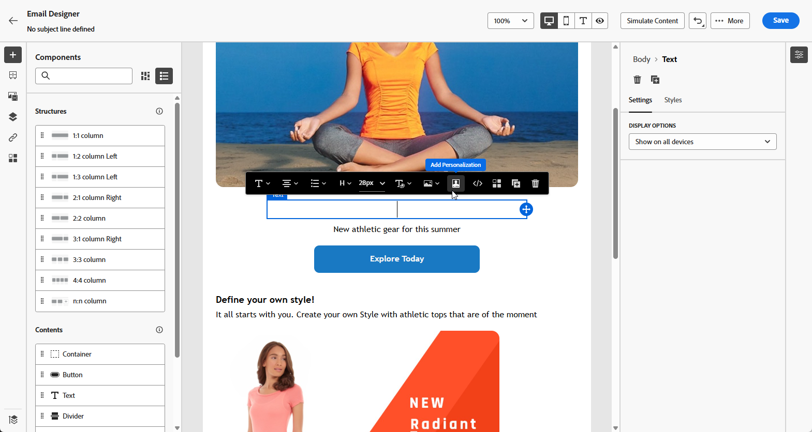
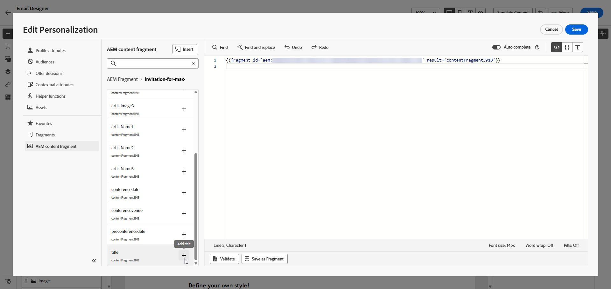

# Werken met Adobe Experience Manager-inhoudsfragmenten {#aem-fragments}

>[!AVAILABILITY]
>
>Deze integratie is op **de Plaatsen van Adobe Experience Manager as a Cloud Service**, voor **slechts de Fragmenten van de Inhoud** van toepassing. Journey Optimizer leest fragmenten van **publiceren** rij (niet Auteur).

De integratie tussen Adobe Experience Manager en Journey Optimizer volgt deze gegevensstroom:

1. **[vorm Dispatcher &#x200B;](https://experienceleague.adobe.com/en/docs/experience-manager-cloud-service/content/sites/administering/content-fragments/content-fragments-with-journey-optimizer#dispatcher-configuration){target="_blank"}**: Om Journey Optimizer toe te laten om tot de Fragmenten van de Inhoud via het Beheer API van het Fragment van de Inhoud toegang te hebben, moet u Dispatcher eerst vormen. Dat is een voorwaarde voor de integratie.

1. **[creeer en auteur &#x200B;](https://experienceleague.adobe.com/en/docs/experience-manager-cloud-service/content/sites/administering/content-fragments/managing#creating-a-content-fragment)**: De inhoud wordt gecreeerd en in Adobe Experience Manager gevormd als Fragments van de Inhoud.

1. **[het Etiketteren &#x200B;](https://experienceleague.adobe.com/en/docs/experience-manager-cloud-service/content/sites/administering/content-fragments/managing#manage-tags)**: De Fragmenten van de inhoud moeten met de Journey Optimizer-Specifieke markering (`ajo-enabled:{OrgId}/{SandboxName}`) worden geëtiketteerd.

1. **[publiceer &#x200B;](https://experienceleague.adobe.com/en/docs/experience-manager-cloud-service/content/sites/administering/content-fragments/managing#publishing-and-previewing-a-fragment)**: De Fragmenten van de inhoud worden gepubliceerd in Adobe Experience Manager, die hen ter beschikking stellen van Journey Optimizer.

1. **[Toegang](#aem-add)**: Journey Optimizer haalt en toont beschikbare de Fragmenten van de Inhoud van Adobe Experience Manager publiceren instantie in real time.

1. **[Integratie](#aem-add)**: De Fragmenten van de inhoud worden geselecteerd en in campagnes of reizen geïntegreerd.

Wanneer een inhoudsfragment in Adobe Experience Manager wordt gepubliceerd, wordt een gebeurtenis verzonden om de inhoud aan de Journey Optimizer-zijde bij te werken. Als de update is gelukt, wordt het inhoudsfragment binnen ongeveer 5 minuten beschikbaar voor eenheidreizen en in de volgende verwerkingsbatch voor batchgebruik. Zodra de update beschikbaar is in Journey Optimizer, wordt de meest recente gepubliceerde inhoud gebruikt voor alle toepasselijke campagnes en reizen.

>[!AVAILABILITY]
>
>Voor klanten in de gezondheidszorg is de integratie alleen mogelijk na het in licentie geven van het Journey Optimizer Healthcare Shield- en Adobe Experience Manager Extended Security for Healthcare-add-on-aanbod.

## Een tag maken en toewijzen in Experience Manager

>[!IMPORTANT]
>
>Om Journey Optimizer toe te laten om tot de Fragmenten van de Inhoud van Adobe Experience Manager via het Beheer API van het Fragment van de Inhoud toegang te hebben, moet u eerst [&#x200B; Dispatcher &#x200B;](https://experienceleague.adobe.com/en/docs/experience-manager-cloud-service/content/sites/administering/content-fragments/content-fragments-with-journey-optimizer#dispatcher-configuration){target="_blank"} vormen.

Voordat u het inhoudsfragment in Journey Optimizer kunt gebruiken, moet u een specifieke tag voor Journey Optimizer maken:

1. Heb toegang tot uw **milieu van Experience Manager**.

1. Van het **menu van Hulpmiddelen**, uitgezochte **Tags**.

   

1. Klik **creëren Markering**.

1. Controleer of de id voldoet aan de volgende syntaxis: `ajo-enabled:{AJO-OrgId}/{AJO-SandboxName}` .

1. Klik **creëren**.

1. Bepaal uw Model van het Fragment van de Inhoud zoals die in [&#x200B; wordt gedetailleerd de documentatie van Experience Manager &#x200B;](https://experienceleague.adobe.com/en/docs/experience-manager-cloud-service/content/sites/administering/content-fragments/content-fragment-models){target="_blank"} en wijs uw pas gecreëerde markering van Journey Optimizer toe.

Deze real-time verbinding zorgt ervoor dat uw inhoud altijd up-to-date is, maar betekent ook dat wijzigingen in gepubliceerde fragmenten onmiddellijk van invloed zullen zijn op actieve campagnes en reizen.

U kunt nu beginnen met het maken en configureren van het inhoudsfragment voor later gebruik in Journey Optimizer. Leer meer in [&#x200B; documentatie van Experience Manager &#x200B;](https://experienceleague.adobe.com/en/docs/experience-manager-cloud-service/content/sites/administering/content-fragments/managing){target="_blank"}.

## Experience Manager-inhoudsfragmenten toevoegen {#aem-add}

Nadat u de AEM Content Fragments hebt gemaakt en gepersonaliseerd, kunt u deze nu importeren naar uw campagne of reis voor het optimaliseren van de reis.

1. Creeer uw [&#x200B; Campagne &#x200B;](../campaigns/create-campaign.md) of [&#x200B; Reis &#x200B;](../building-journeys/journey-gs.md).

1. Om tot uw de inhoudsfragment van AEM toegang te hebben, klik  binnen om het even welk tekstgebied, of open de broncode door een de inhoudscomponent van HTML.

   

1. Klik in het menu **[!UICONTROL AEM Content Fragment]** in het linkerdeelvenster op **[!UICONTROL Open AEM CF selector]** .

   

1. Blader door de lijst en selecteer een **[!UICONTROL Content Fragment]** die u in uw Journey Optimizer-inhoud wilt importeren.

   >[!NOTE]
   >
   > Als het fragment één of meerdere **gepubliceerde** variaties heeft, verschijnt a **[!UICONTROL Variation]** dropdown in de selecteur. Als geen **[!UICONTROL Variation]** wordt geselecteerd, wordt de **Hoofd** variatie automatisch gebruikt. Leer meer in [&#x200B; Werkend met de variaties van het Fragment van de Inhoud &#x200B;](#aem-variations).

1. Klik op **[!UICONTROL Show filters]** om de lijst met inhoudsfragmenten te verfijnen.

   Standaard is het filter Inhoudsfragment vooraf ingesteld om alleen goedgekeurde inhoud weer te geven.

   

1. Nadat u **[!UICONTROL Content Fragment]** hebt geselecteerd, klikt u op **[!UICONTROL Select]** om het toe te voegen.

   

1. Klik op **[!UICONTROL View fragment]** om de fragmentgegevens weer te geven. Als u het menu **[!UICONTROL Fragment Info]** opent, wordt de editor alleen-lezen.

   Selecteer **[!UICONTROL Preview]** in het rechtermenu om het fragment in Adobe Experience Manager weer te geven.

   

1. Klik  om tot het geavanceerde menu van uw Fragment toegang te hebben:

   * **[!UICONTROL Swap fragment]**
   * **[!UICONTROL Explore references]**
   * **[!UICONTROL Open in AEM]**

   

1. Kies de gewenste velden in uw **[!UICONTROL Fragment]** om aan uw inhoud toe te voegen.

   <!--
    Note that if you choose to copy the value, any future updates to the Content Fragment will not be reflected in your campaign or journey. However, using dynamic placeholders ensures real-time updates.-->

   

1. Als u een afbeeldings-URL wilt laten doorlopen die is opgeslagen in een kenmerk Inhoudsfragment, bijvoorbeeld een pad- of URL-veld van het fragmentmodel, voegt u deze URL in uw HTML in met een tag `` en het fragmentkenmerk als bron, bijvoorbeeld:

   ```html
   
   ```

   >[!NOTE]
   >
   >Relatieve beeld URLs van Adobe Experience Manager wordt niet gesteund, gebruik **absolute** URLs.

1. Selecteer **Vullingen: Van** om de vullingservaring toe te laten om leesbaarheid te verbeteren door lange attributenwegen te verbergen.

   

1. Om **verpersoonlijkingsplaceholders** te gebruiken authored in Adobe Experience Manager binnen uw fragmenttekst, bepaal hen in het Fragment van de Inhoud in Adobe Experience Manager als volgt: `{{name}}`.

   In Journey Optimizer zijn deze tokens plaatsaanduidingen. Met de **pillen** ervaring op, verschijnen zij in de **[!UICONTROL AEM Content Fragment]** sectie van het juiste spoor naast fragmentgebieden.

1. Om realtime personalisatie mogelijk te maken, moeten alle plaatsaanduidingen die binnen een **[!UICONTROL Content fragment]** worden gebruikt, expliciet door de gebruiker worden gedeclareerd als parameters in de fragmenthulplijntag. Wijs deze plaatsaanduidingen als volgt toe aan profielkenmerken, contextafhankelijke kenmerken, statische tekenreeksen of vooraf gedefinieerde variabelen:

   1. **Profiel of Contextual Attributen Toewijzing**: wijs placeholder aan een profiel of contextafhankelijk attribuut toe, b.v. naam = profile.person.name.firstName.

   1. **de Statische Toewijzing van het Koord**: wijs een vaste koordwaarde toe door het binnen dubbele citaten te plaatsen, b.v. naam = &quot;John&quot;.

   1. **Veranderlijke Afbeelding**: Verwijzing een variabele die vroeger binnen zelfde HTML wordt verklaard, b.v. naam = &quot;variableName&quot;.
In dit geval, zorg ervoor **_variableName_** alvorens fragmentidentiteitskaart toe te voegen wordt gedeclareerd, gebruikend volgende syntaxis:

      ```html
       
      ```

   In het voorbeeld hieronder, wordt **_maand_** placeholder in kaart gebracht aan het {**_attribuut 2} profile.person.bornDate binnen het fragment._**

   {zoomable="yes"}

1. Klik op **[!UICONTROL Save]**. U kunt nu uw berichtinhoud zoals die in [&#x200B; wordt gedetailleerd deze sectie &#x200B;](../content-management/preview.md) testen en controleren.

   <!--Note that the Content Fragment you selected stays active for this message. When you open the Personalization Editor in another field or content block, you can keep working with the same fragment from the **[!UICONTROL AEM Content Fragment]** section and add more fields without reopening **[!UICONTROL Open AEM CF selector]**.-->

Zodra u uw tests hebt uitgevoerd en de inhoud bevestigd, kunt u [&#x200B; uw campagne &#x200B;](../campaigns/review-activate-campaign.md) verzenden of [&#x200B; uw reis &#x200B;](../building-journeys/publish-journey.md) aan uw publiek publiceren.

Met Adobe Experience Manager kunt u de Journey Optimizer-campagnes of -reizen identificeren waar een inhoudsfragment wordt gebruikt. Leer meer in [&#x200B; documentatie van Adobe Experience Manager &#x200B;](https://experienceleague.adobe.com/en/docs/experience-manager-cloud-service/content/sites/administering/content-fragments/extension-content-fragment-ajo-external-references){target="_blank"}.

## Werken met variaties in inhoudsfragmenten {#aem-variations}

In Adobe Experience Manager bestaat elk inhoudsfragment uit het volgende:

* **Hoofd**: de kerninhoud van het fragment dat altijd bestaat, kan niet worden geschrapt, en is de basis voor alle variaties.
* **Variaties**: één of meerdere permutaties van **Hoofd** die de auteurs voor specifieke kanalen of scenario&#39;s creëren. De variaties leven binnen het fragment niet als afzonderlijke activa en kunnen met **Hoofd** worden vergeleken en worden gesynchroniseerd.

➡️ [&#x200B; Leer meer in de documentatie van Adobe Experience Manager &#x200B;](https://experienceleague.adobe.com/en/docs/experience-manager-65/content/assets/content-fragments/content-fragments-variations)

Voorbeelden van gevallen van variatiegebruik:

* Een korte versie van een kopie voor een pushmelding en een langere versie voor e-mail.
* Regionale kleurtintaanpassingen zonder een afzonderlijk fragment te maken.
* Kanaalspecifieke berichten (bijvoorbeeld web in vergelijking met mobiel).

In Journey Optimizer kunt u kiezen welke variatie u wilt gebruiken wanneer u een fragment invoegt. Verschillende campagnes of reizen kunnen dus afhankelijk zijn van verschillende vertoningen van dezelfde broninhoud in Adobe Experience Manager zonder fragmenten te dupliceren.

Een variatie selecteren:

1. Open a [&#x200B; campagne &#x200B;](../campaigns/create-campaign.md) of [&#x200B; reis &#x200B;](../building-journeys/journey-gs.md).

1. Klik  op om het even welk tekstgebied, of open de bron van HTML van een de inhoudscomponent van HTML.

1. Klik in **[!UICONTROL AEM Content Fragment]** op **[!UICONTROL Open CF selector]** .

   

1. Als u een landspecifiek Adobe Experience Manager-inhoudsfragment wilt selecteren in de tabelweergave, voegt u de kolom **[!UICONTROL Customize table]** toe met **[!UICONTROL Language]** . De waarden voor de landinstelling worden weergegeven in de tabel, zodat u het juiste fragment kunt identificeren en selecteren.

   

1. Selecteer de **[!UICONTROL Content Fragment]** .

1. Klik het  om **[!UICONTROL Details]** menu te openen. Als het fragment een of meer gepubliceerde variaties heeft, wordt een vervolgkeuzelijst **[!UICONTROL Variation]** weergegeven naast de fragmentdetails.

   

1. Klik in het menu **[!UICONTROL Quick details]** op **[!UICONTROL Explore references]** om verwante opties in Adobe Experience Manager te openen voor variatiedetails, voorvertoning en proefdruk, indien beschikbaar.

1. Kies uw variatie en klik op **[!UICONTROL Select]** .

   >[!NOTE]
   >
   > Als u geen variatie selecteert, of als het fragment werd toegevoegd alvorens de variatiesteun beschikbaar was, gebruikt Journey Optimizer automatisch de **Hoofd** variatie op leveringstijdstip.

Nadat u een fragment met een variatie opneemt, herpubliceert het in Adobe Experience Manager elk **van verwijzingen voorzien variatie** in actieve campagnes of reizen automatisch. Voor voorvertoningen en proefdrukken wordt nog steeds de gekozen variatie gebruikt, met de meest recente gepubliceerde inhoud voor die variatie.
