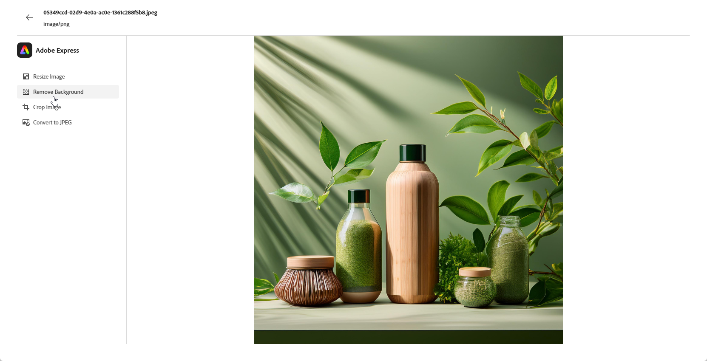

# Elementen bewerken met [!DNL Adobe Express]{#express}

>[!CONTEXTUALHELP]
>id="ajo_express_menu"
>title="Adobe Express-integratie"
>abstract="Pas uw middelen aan met de Adobe Express-integratie. Met deze functie kunt u afbeeldingen vergroten of verkleinen, achtergronden verwijderen, visuele effecten uitsnijden en elementen omzetten in JPEG of PNG."

>[!AVAILABILITY]
>
>Adobe Express-integratie in Adobe Journey Optimizer is momenteel niet beschikbaar voor gebruik met het Healthcare Shield of Privacy and Security Shield.

Dankzij de Adobe Express-integratie in Adobe Journey Optimizer hebt u eenvoudig toegang tot Adobe Express-functies voor het bewerken van inhoud. Dankzij deze integratie kunt u afbeeldingen vergroten/verkleinen, achtergronden verwijderen, visuele effecten uitsnijden en elementen omzetten in JPEG of PNG zonder dat u tussen oplossingen hoeft te schakelen.

Meer op Adobe Express leren, verwijs naar [ deze documentatie ](https://helpx.adobe.com/express/user-guide.html).

Om tot het **[!DNL Adobe Express]** menu toegang te hebben, heb toegang tot uw **montages van het Beeld** van de E-mailontwerper en klik **[!UICONTROL Edit in Adobe Express]**.

## Formaat afbeelding wijzigen {#resize}

1. Selecteer **[!UICONTROL Resize image]** in het menu Adobe Express.

   

1. Selecteer de **[!UICONTROL Aspect ratio]** die het beste past bij de verhoudingen van uw element.

   

1. Gebruik de schuifregelaar om te zoomen en elementen uit te snijden en sleep om het zichtbare gebied te pannen en aan te passen.

   

1. Klik op **[!UICONTROL Reset]** om de oorspronkelijke staat van het element te herstellen.

1. Klik op **[!UICONTROL Apply]** als het formaat van de afbeelding aan uw wensen voldoet. Vervolgens **[!UICONTROL Save]** uw gewijzigde element.

1. Klik in het **[!UICONTROL Upload Image]** -venster op **[!UICONTROL Next]** en selecteer een map waarin u het gewijzigde element wilt opslaan.

   Klik vervolgens op **[!UICONTROL Import]** .

Uw afbeelding kan nu worden gebruikt in uw inhoud.

## Achtergrond verwijderen {#background}

1. Selecteer **[!UICONTROL Remove background]** in het menu Adobe Express.

   

1. De middelen worden automatisch zonder de achtergrond weergegeven.

   Klik op **[!UICONTROL Apply]** om dit in uw inhoud te gebruiken.

   

1. Klik op **[!UICONTROL Save]**.

1. Klik in het **[!UICONTROL Upload Image]** -venster op **[!UICONTROL Next]** en selecteer een map waarin u het gewijzigde element wilt opslaan.

   Klik vervolgens op **[!UICONTROL Import]** .

Uw afbeelding kan nu worden gebruikt in uw inhoud.

## Afbeelding uitsnijden {#crop-image}

1. Selecteer **[!UICONTROL Crop image]** in het menu Adobe Express.

   

1. Sleep de hoekgrepen om de afbeelding naar wens aan te passen en uit te snijden.

   

1. Klik op **[!UICONTROL Apply]** om dit in uw inhoud te gebruiken. Vervolgens **[!UICONTROL Save]** uw gewijzigde element.

1. Klik in het **[!UICONTROL Upload Image]** -venster op **[!UICONTROL Next]** en selecteer een map waarin u het gewijzigde element wilt opslaan.

   Klik vervolgens op **[!UICONTROL Import]** .

Uw afbeelding kan nu worden gebruikt in uw inhoud.

## Omzetten in JPEG of PNG {#convert}

1. Selecteer **[!UICONTROL Convert to JPEG]** of **[!UICONTROL Convert to PNG]** in het menu Adobe Express, afhankelijk van de oorspronkelijke afbeeldingsindeling.

   

1. Klik op **[!UICONTROL Apply]** om de conversie te starten.

   

1. Klik op **[!UICONTROL Save]**.

1. Als de indeling wordt gewijzigd, kunt u deze opslaan als een nieuwe afbeelding met een andere naam. Werk **[!UICONTROL Name]** bij en klik **[!UICONTROL Save]**.

   

1. Klik in het **[!UICONTROL Upload Image]** -venster op **[!UICONTROL Next]** en selecteer een map waarin u het gewijzigde element wilt opslaan.

   Klik vervolgens op **[!UICONTROL Import]** .

Uw afbeelding kan nu worden gebruikt in uw inhoud.
