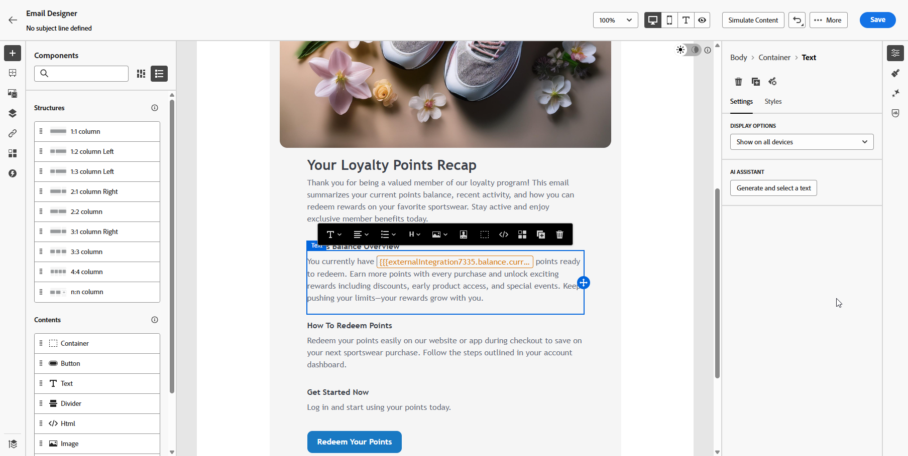

# Werken met integratie {#external-sources}

## Overzicht

De **eigenschap van de Integratie** laat naadloze integratie van derdegegevensbronnen in Adobe Journey Optimizer toe. Deze eigenschap stroomlijnt de integratie van externe gegevens en inhoudsbronnen in uw campagnes, die u machtigen om hoogst gepersonaliseerd en dynamisch overseinen over veelvoudige kanalen te leveren.

Met deze functie hebt u toegang tot externe gegevens en kunt u inhoud ophalen uit gereedschappen van derden, zoals:

* **beloningen Punten** van loyaliteitssystemen.
* **Informatie van de Prijs** voor producten.
* **Aanbevelingen van het Product** van aanbeveling motoren.
* **Logistics werkt** als leveringsstatus bij.

## Beta-beperkingen {#limitations}

De bètaversie heeft de volgende beperkingen:

* Uitgaande kanalen worden slechts gesteund.

* Alleen JSON-indeling wordt ondersteund voor API-reacties. HTML en onbewerkte binaire afbeeldingsuitvoer zijn niet beschikbaar.

* Alleen API&#39;s voor ophalen die specifiek zijn voor bepaalde inhoud worden ondersteund, API&#39;s voor lijsten zijn niet beschikbaar.

* De functie Integraties is zowel beschikbaar voor reizen als voor campagnes, maar wordt niet ondersteund in fragmenten.

## Uw integratie configureren {#configure}

Als beheerder, kunt u opstelling externe integratie door deze stappen te volgen:

1. Navigeer naar de sectie **[!UICONTROL Configurations]** in het linkermenu en klik op **[!UICONTROL Manage]** van de kaart **[!UICONTROL Integrations]** .

   Klik vervolgens op **[!UICONTROL Create Integration]** om een nieuwe configuratie te starten.

   

1. Geef een **[!UICONTROL Name]** en **[!UICONTROL Description]** op voor uw integratie.

   >[!NOTE]
   >
   >Deze velden mogen geen spaties bevatten.

1. Voer het API-eindpunt **[!UICONTROL URL]** in, dat padparameters kan bevatten met variabelen die kunnen worden gedefinieerd met labels en standaardwaarden.

1. Configureer de **[!UICONTROL Path Template]** met **[!UICONTROL Name]** en **[!UICONTROL Default value]** .

   

1. Selecteer de **[!UICONTROL HTTP Method]** tussen GET en POST.

1. Klik op **[!UICONTROL Add Header]** en/of **[!UICONTROL Add Query Parameters]** als dat nodig is voor uw integratie. Geef voor elke parameter de volgende gegevens:

   * **[!UICONTROL Parameter]**: Een unieke id die intern wordt gebruikt om naar de parameter te verwijzen.

   * **[!UICONTROL Name]**: De werkelijke naam van de parameter zoals wordt verwacht door de API.

   * **[!UICONTROL Type]**: Kies **Constante** voor een vaste waarde of **Variabele** voor dynamische input.

   * **[!UICONTROL Value]**: voer de waarde rechtstreeks in voor constanten of selecteer een variabele-toewijzing.

   * **[!UICONTROL Mandatory]**: geef op of deze parameter vereist is.

   

1. Kies een **[!UICONTROL Authentication Type]** :

   * **[!UICONTROL No Authentication]**: voor geopende API&#39;s waarvoor geen referenties vereist zijn.

   * **[!UICONTROL API key]**: Verzoeken verifiëren met een statische API-sleutel. Voer **[!UICONTROL API Key Name &#x200B;]** , **[!UICONTROL API Key Value &#x200B;]** in en geef uw **[!UICONTROL Location]** op.

   * **[!UICONTROL Basic Auth]**: standaard HTTP Basic Authentication gebruiken. Voer **[!UICONTROL Username]** en **[!UICONTROL Password]** in.

   * **[!UICONTROL OAuth 2.0]**: verifieer het gebruiken van het protocol OAuth 2.0. Klik  pictogram **[!UICONTROL Payload]** om te vormen of bij te werken.

   

1. Stel **[!UICONTROL Policy configuration]** dergelijke **[!UICONTROL Timeout]** -periode in voor API-aanvragen en schakel throttling, cache en/of retry in.

1. Met het veld **[!UICONTROL Response payload]** kunt u bepalen welke velden van de voorbeelduitvoer moeten worden gebruikt voor het aanpassen van berichten.

   Klik  pictogram en kleef een steekproefJSON antwoordlading om gegevenstypes automatisch te ontdekken.

1. Kies de velden die u toegankelijk wilt maken voor personalisatie en geef de corresponderende gegevenstypen op.

   

1. Gebruik **[!UICONTROL Send test connection]** om de integratie te valideren.

   Klik op **[!UICONTROL Activate]** nadat de validatie is uitgevoerd.

## Externe integratie gebruiken voor personalisatie {#personalization}

Als markeerteken, kunt u gevormde integraties gebruiken om uw inhoud te personaliseren. Voer de volgende stappen uit:

1. Open de inhoud van uw campagne en klik op **[!UICONTROL Add personalization]** vanuit uw Text of HTML **[!UICONTROL Components]** .

[Meer informatie over componenten](../email/content-components.md)

   

1. Navigeer naar de sectie **[!UICONTROL Integrations]** en klik op **[!UICONTROL Open integrations]** om alle actieve integratie weer te geven.

   

1. Selecteer een integratie en klik op **[!UICONTROL Save]** .

   

1. Schakel de modus **[!UICONTROL Pills]** in om het menu Geavanceerde integratie te ontgrendelen.

   

1. Om uw integratieopstelling te voltooien, bepaal uw integratiekenmerken, die eerder tijdens [ configuratie ](#configure) werden gespecificeerd.

   U kunt waarden aan deze kenmerken toewijzen met behulp van statische waarden, die constant blijven, of profielkenmerken, die dynamisch informatie van gebruikersprofielen ophalen.

   

1. Zodra de integratiekenmerken worden bepaald, kunt u de integratievelden in uw inhoud voor gepersonaliseerd overseinen nu gebruiken door  pictogram toe.

   

1. Klik op **[!UICONTROL Save]**.

Uw integratieverpersoonlijking wordt nu met succes toegepast op uw inhoud, ervoor zorgend elke ontvanger een op maat gemaakte, relevante ervaring ontvangt die op de attributen wordt gebaseerd u hebt gevormd.

