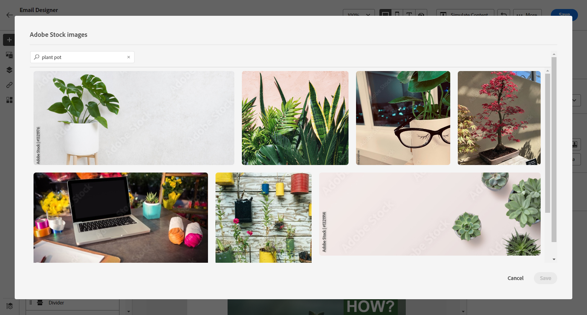

# Werken met [!DNL Adobe Stock] -afbeeldingen {#stock}

## Aan de slag met [!DNL Adobe Stock] {#get-started-stock}

Met de insteekmodule [!DNL Adobe Stock] en [!DNL Adobe Journey Optimizer] Email Designer kunt u op eenvoudige wijze door afbeeldingen navigeren en afbeeldingen licentiëren en opslaan voor gebruik in het schrijven van berichten.

[ Adobe Stock ](https://helpx.adobe.com/stock/get-started.html){target="_blank"} verleent toegang tot miljoenen van kwaliteit, gekrulde, royalty-vrije foto&#39;s, video&#39;s, illustraties, en vectorgrafiek. U kunt ervoor kiezen om een creditpakket aan te schaffen om een licentie voor activa te verkrijgen of slechts één standaard- of uitgebreide licentie voor het benodigde element te kopen. Adobe Stock biedt ook een gratis collectie van activa.

Met [!DNL Adobe Journey Optimizer] kunt u afbeeldingen rechtstreeks vanuit [!DNL Adobe Stock] uploaden naar uw e-mail en deze toevoegen aan de map **[!UICONTROL Assets]** met de optie **[!UICONTROL Find Adobe Stock photos]** . Daarnaast kunt u met de optie **[!UICONTROL Find Similar Stock photos]** afbeeldingen vinden die overeenkomen met de inhoud, kleur en compositie van het element dat wordt gebruikt bij de levering.

## Machtigingen{#stock-permissions}

De opties **[!UICONTROL Find Adobe Stock photos]** en **[!UICONTROL Find Similar Image]** zijn beschikbaar voor gebruikers met toegang tot een AEM Assets Essentials-productprofiel.

Voor meer op dit, verwijs naar [ documentatie van Experience Manager Assets ](https://experienceleague.adobe.com/docs/experience-manager-assets-essentials/help/get-started-admins/deploy-administer.html#add-users-to-essentials){target="_blank"}.

## Een afbeelding invoegen vanuit [!DNL Adobe Stock] {#add-stock-image}

Voer de onderstaande stappen uit om afbeeldingen van [!DNL Adobe Stock] toe te voegen aan uw inhoud:

1. Van de **[!UICONTROL Content components]** sectie van e-mail Designer, sleep en laat vallen een **Beeld**.

1. Klik op de knop **[!UICONTROL Find Adobe Stock photos]** aan de linkerkant van de Designer-mailtoepassing.

   

1. Blader door de bibliotheek of voer een term in het zoekveld in.

   

1. Selecteer de gekozen afbeelding en klik op **[!UICONTROL Save]** .

   Als het beeld u selecteerde niet vergunning geeft, moet u [ de vergunning ](#license-stock-image) krijgen.

## Vergelijkbare foto&#39;s zoeken {#similar-stock-image}

U kunt elke bestaande afbeelding in uw e-mailinhoud vervangen door een foto uit [!DNL Adobe Stock] . Houd er rekening mee dat deze optie beschikbaar is voor alle afbeeldingen: onder licentie/zonder licentie Stock-afbeeldingen en afbeeldingen uit uw Assets-map.

Voer de onderstaande stappen uit om door vergelijkbare foto&#39;s te bladeren:

1. Selecteer de afbeelding die u wilt vervangen.
1. Klik op de knop **[!UICONTROL Find similar Stock photos]** om elementen in [!DNL Adobe Stock] weer te geven die overeenkomen met de inhoud, kleur en compositie van de afbeelding.

   

1. Selecteer de gekozen afbeelding en klik op **[!UICONTROL Save]** .

   

   Als het beeld u selecteerde niet vergunning geeft, moet u [ de vergunning ](#license-stock-image) krijgen.

1. Pas indien nodig de afbeelding aan met de tabbladen **[!UICONTROL Settings]** en **[!UICONTROL Styles]** . [ leer meer over componentenmontages ](../email/content-components.md).

## Licentie ophalen van [!DNL Adobe Stock] {#license-stock-image}

Als voor uw afbeelding al een licentie is verleend, wordt deze weergegeven door het pictogram  . Zo niet, dan moet u een licentie geven.

Voer de onderstaande stappen uit om een licentie te verkrijgen en uw afbeelding te downloaden:

1. Selecteer het en klik op het pictogram **[!UICONTROL License Adobe Stock image]** .

   

   Vervolgens wordt u omgeleid naar de [!DNL Adobe Stock] -website om de licentie te kopen.

   

1. Op de [!DNL Adobe Stock] -website moet u uw element aanschaffen om de afbeelding te kunnen downloaden en het watermerk te kunnen verwijderen.

   Deze aankoop is afhankelijk van uw abonnement op Adobe Stock. Als je meerdere Adobe Stock-accounts hebt, wordt je doorgestuurd naar de laatst gebruikte voorraad-id. Controleer in dit geval of u bent aangemeld bij de juiste account voordat u een licentie voor uw asset aanschaft.

   Voor meer over de plannen en de prijzen van Adobe Stock in [ documentatie van Adobe Stock ](https://stock.adobe.com/plans){target="_blank"}.

   >[!WARNING]
   > Als een e-mail met een afbeelding zonder licentie wordt verzonden, behoudt de afbeelding het formulier zonder licentie met het watermerk.

1. Nadat uw aankoop is voltooid, kunt u nu teruggaan naar uw e-mail in [!DNL Adobe Journey Optimizer] en **[!UICONTROL Import stock image]** selecteren om uw afbeelding met licentie te importeren naar uw middelen.

   

1. Selecteer in welke map u het element wilt opslaan. Voor meer informatie over [!DNL Experience Manager Assets], verwijs naar deze [ pagina ](assets.md#get-started-assets).

## Verwante onderwerpen{#stock-related-topics}

* [E-mailontwerp in Journey Optimizer](../email/get-started-email-design.md)
* [Componentinstellingen voor e-mailontwerp](../email/content-components.md)
* [ Adobe Stock wordt begonnen ](https://helpx.adobe.com/stock/get-started.html){target="_blank"}.

