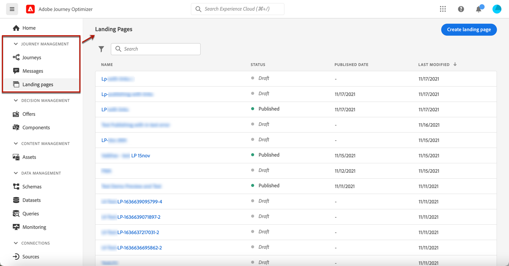
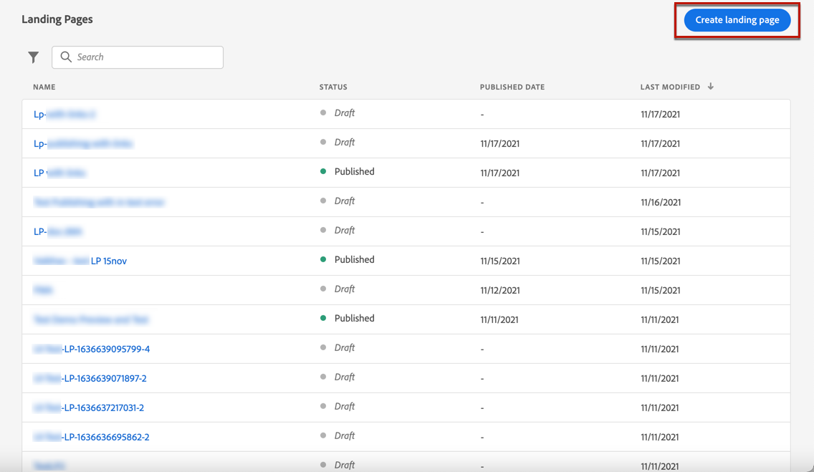

# bestemmingspagina&#39;s maken en publiceren {#create-lp}

>[!CAUTION]
>
>Het gebruik van bestemmingspagina&#39;s is momenteel beschikbaar in vroege toegang tot geselecteerde gebruikers slechts. Als u deze functie wilt gebruiken, neemt u contact op met de Adobe-accountmanager.

## Openingspagina&#39;s openen

Selecteer **[!UICONTROL Journey Management]** > **[!UICONTROL Landing pages]** in het linkermenu.

De **[!UICONTROL Landing Pages]** worden alle gemaakte items weergegeven. U kunt ze filteren op basis van hun status of wijzigingsdatum.

## Een landingspagina maken

De stappen voor het maken van een bestemmingspagina zijn als volgt.

1. Klik in de lijst met openingspagina&#39;s op **[!UICONTROL Create landing page]**.

   

1. Voeg een titel toe. U kunt desgewenst een beschrijving toevoegen.

   

1. Klik op **[!UICONTROL Create]**.

1. De primaire pagina en de bijbehorende eigenschappen worden weergegeven. Leer hoe u de pagina-instellingen configureert [hier](#configure-primary-page).

   

1. Klik op het pictogram + om een subpagina toe te voegen. Leer hoe u de instellingen configureert [hier](#configure-subpages).

   

Zodra u vormde en ontwierp [primaire pagina](#configure-primary-page) en de [subpagina&#39;s](#configure-subpages) indien van toepassing, kunt u [test](#test) en [publish](#publish) uw openingspagina.

## De primaire pagina configureren {#configure-primary-page}

De primaire pagina is de pagina die direct aan de gebruikers wordt getoond wanneer zij op de verbinding aan uw landende pagina, zoals van een e-mail of een website klikken.

Voer de onderstaande stappen uit om de instellingen voor de primaire pagina te definiëren.

1. U kunt de paginanaam wijzigen. **[!UICONTROL Primary page]** standaard.

1. Bewerk de inhoud van de pagina met de inhoudsontwerper. Leer hoe u landende pagina-inhoud ontwerpt [hier](design-lp.md).

   

1. Definieer de URL van de bestemmingspagina.

   >[!CAUTION]
   >
   >De bestemmingspagina-URL moet uniek zijn.

   

   Het eerste deel van de URL wordt vooraf ingevuld en kan niet via de gebruikersinterface worden bewerkt. Neem contact op met uw Adobe-accountvertegenwoordiger of de [Adobe-team voor klantenondersteuning](https://helpx.adobe.com/nl/enterprise/admin-guide.html/enterprise/using/support-for-experience-cloud.ug.html){target=&quot;_blank&quot;}.

1. U kunt een vervaldatum voor uw pagina bepalen. In dat geval moet u een actie selecteren bij het verlopen van de pagina:

   * **[!UICONTROL Redirect URL]**: Voer de URL in van de pagina waarnaar de gebruikers worden omgeleid wanneer de pagina vervalt.
   * **[!UICONTROL Custom page]**: [Een subpagina configureren](#configure-subpages) en selecteert u deze in de vervolgkeuzelijst die wordt weergegeven.
   * **[!UICONTROL Browser error]**: Typ de fouttekst die in plaats van de pagina wordt weergegeven.

   

   <!--1. In the **[!UICONTROL Additional data]** section, define a **[!UICONTROL Key]** and the corresponding **[!UICONTROL Parameter value]**. // you can define how the data entered in the landing page is managed once it has been submitted by a user??-->

1. Als u een of meer abonnementlijsten voor de primaire pagina hebt geselecteerd, worden deze weergegeven in het dialoogvenster **[!UICONTROL Subscription list]** sectie.

   

1. Vanaf de bestemmingspagina kunt u rechtstreeks een reis maken die een bevestigingsbericht naar gebruikers stuurt wanneer zij het formulier verzenden.

   

   Klikken **[!UICONTROL Create journey]** om te beginnen [deze reis configureren](../building-journeys/journey-gs.md#jo-build). U wordt omgeleid naar de **[!UICONTROL Journey Management]** > **[!UICONTROL Journeys]** lijst.

## Subpagina&#39;s configureren {#configure-subpages}

U kunt zoveel subpagina&#39;s toevoegen als u nodig hebt. U kunt bijvoorbeeld een pagina voor bedankt maken die wordt weergegeven wanneer de gebruikers het formulier verzenden. U kunt ook een foutpagina definiëren die wordt aangeroepen wanneer een fout optreedt met de bestemmingspagina.

Voer de onderstaande stappen uit om subpagina-instellingen te definiëren.

1. U kunt de paginanaam wijzigen. **[!UICONTROL Subpage 1]** standaard.

1. Bewerk de inhoud van de pagina met de inhoudsontwerper. Leer hoe u landende pagina-inhoud ontwerpt [hier](design-lp.md).

1. Definieer de URL van de bestemmingspagina.

   Het eerste deel van de URL wordt vooraf ingevuld en kan niet via de gebruikersinterface worden bewerkt. Neem contact op met uw Adobe-accountvertegenwoordiger of de [Adobe-team voor klantenondersteuning](https://helpx.adobe.com/enterprise/admin-guide.html/enterprise/using/support-for-experience-cloud.ug.html){target=&quot;_blank&quot;}.

   >[!CAUTION]
   >
   >De bestemmingspagina-URL moet uniek zijn.

## De openingspagina testen {#test}

Nadat de instellingen en inhoud van de bestemmingspagina zijn gedefinieerd, kunt u testprofielen gebruiken om een voorvertoning weer te geven. Als u [persoonlijke inhoud](../personalization/personalize.md), kunt u controleren hoe deze inhoud op de openingspagina wordt weergegeven door gebruik te maken van testprofielgegevens.

>[!CAUTION]
>
>U hebt testprofielen nodig om uw berichten te kunnen bekijken en proefdrukken te kunnen verzenden. Leer hoe u testprofielen maakt in [deze pagina](../building-journeys/creating-test-profiles.md).

1. Klik in de interface van de bestemmingspagina of in de inhoudsontwerper op de knop **[!UICONTROL Preview & test]** om de selectie van het testprofiel te openen.

   

1. Selecteer een of meer testprofielen.

   

   De stappen om testprofielen te selecteren zijn het zelfde als wanneer het testen van een bericht. Deze worden in [deze sectie](../preview.md#select-test-profiles).

1. Klik op de knop **[!UICONTROL Preview]** om de openingspagina te testen.

   <!---->

1. De gepersonaliseerde elementen worden vervangen door de geselecteerde gegevens van het testprofiel. Selecteer andere testprofielen om de rendering voor elke variant van de landingspagina te bekijken.

## Waarschuwingen controleren {#alerts}

Terwijl u uw landingspagina maakt, wordt u gewaarschuwd wanneer u belangrijke acties moet ondernemen voordat u publiceert.

Waarschuwingen worden rechtsboven op het scherm weergegeven, zoals hieronder wordt getoond:

>[!NOTE]
>
>Als deze knop niet wordt weergegeven, is er geen melding gevonden.

Er kunnen twee typen waarschuwingen optreden:

* **Waarschuwingen** verwijzen naar aanbevelingen en beste praktijken. <!--For example, a message will display if -->

* **Fouten** voorkomt u dat u het bericht publiceert zolang deze niet zijn opgelost. U wordt bijvoorbeeld in een bericht gewaarschuwd dat de URL van de primaire pagina ontbreekt.

<!--All possible warnings and errors are detailed [below](#alerts-and-warnings).-->

>[!CAUTION]
>
> U moet alles oplossen **fout** waarschuwingen vóór publicatie.

<!--The settings and elements checked by the system are listed below. You will also find information on how to adapt your configuration to resolve the corresponding issues.

**Warnings**:

* 

**Errors**:

* 

>[!CAUTION]
>
> To be able to publish your message, you need to resolve all **error** alerts.
-->

## De openingspagina publiceren {#publish}

Als de landingspagina gereed is, kunt u deze publiceren en gebruiken in een bericht of op een website.

>[!CAUTION]
>
>Controleer en los waarschuwingen op voordat u ze publiceert. [Meer informatie](#alerts)

Wanneer de landingspagina is gepubliceerd, wordt deze aan de lijst met landingspagina&#39;s toegevoegd met de opdracht **[!UICONTROL Published]** status.

Het is nu live en de link ernaar is klaar om te worden gebruikt in een [message](../create-message.md) en via een [reis](../building-journeys/journey.md).
