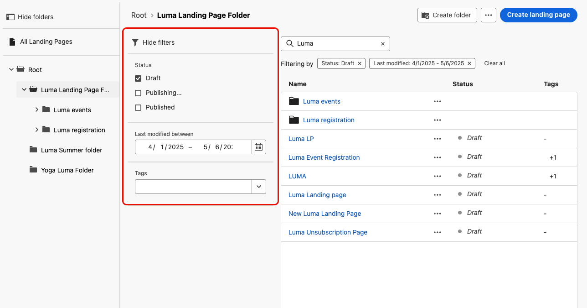
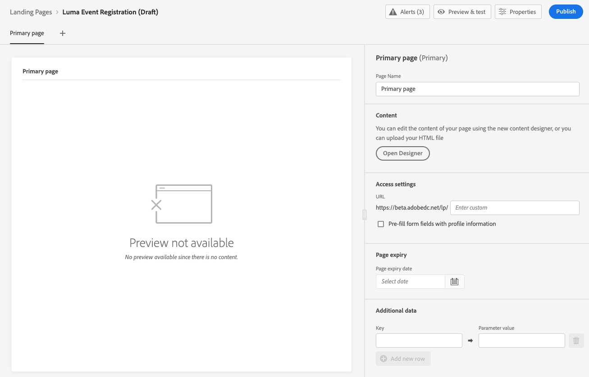
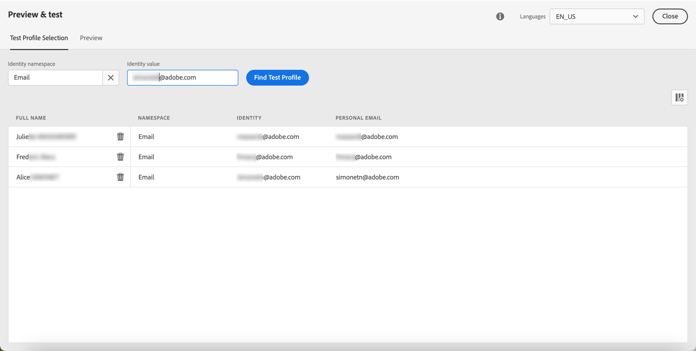

# bestemmingspagina&#39;s maken en publiceren {#create-lp}

## Openingspagina&#39;s openen {#access-landing-pages}

Selecteer **[!UICONTROL Journey Management]** > **[!UICONTROL Landing pages]** in het linkermenu.

De **[!UICONTROL Landing Pages]** worden alle gemaakte items weergegeven. U kunt ze filteren op basis van hun status of wijzigingsdatum.

In deze lijst hebt u toegang tot de [openingspagina Live-rapport](../reports/lp-report-live.md) of [landingspagina Global-rapport](../reports/lp-report-global.md) voor gepubliceerde items.

U kunt ook een openingspagina verwijderen, dupliceren en de publicatie ervan ongedaan maken.

>[!CAUTION]
>
>Als u de publicatie van een bestemmingspagina ongedaan maakt waarnaar in een bericht wordt verwezen, wordt de koppeling naar de bestemmingspagina verbroken en wordt een foutpagina weergegeven.

Klik op de drie stippen naast een openingspagina om de gewenste actie te selecteren.

>[!NOTE]
>
>U kunt een [gepubliceerd](#publish-landing-page) openingspagina. Als u het wilt verwijderen, moet u de publicatie eerst ongedaan maken.

## Een landingspagina maken {#create-landing-page}

>[!CONTEXTUALHELP]
>id="ajo_lp_create"
>title="De bestemmingspagina definiëren en configureren"
>abstract="Als u een openingspagina wilt maken, moet u een voorinstelling selecteren, vervolgens de primaire pagina en subpagina&#39;s configureren en ten slotte de pagina testen voordat u deze publiceert."
>additional-url="https://experienceleague.adobe.com/docs/journey-optimizer/using/configuration/lp-configuration/lp-presets.html#lp-create-preset" text="Voorinstellingen voor openingspagina&#39;s maken"
>additional-url="https://experienceleague.adobe.com/docs/journey-optimizer/using/landing-pages/create-lp.html#publish-landing-page" text="De openingspagina publiceren"

>[!CONTEXTUALHELP]
>id="ajo_lp_access_management_labels"
>title="Labels toewijzen aan uw bestemmingspagina"
>abstract="Om gevoelige digitale elementen te beschermen, kunt u vergunningen bepalen om gegevenstoegang tot uw landingspagina te beheren gebruikend etiketten."
>additional-url="https://experienceleague.adobe.com/docs/journey-optimizer/using/access-control/object-based-access.html" text="Voorinstellingen voor openingspagina&#39;s maken"

De stappen voor het maken van een bestemmingspagina zijn als volgt.

1. Klik in de lijst met openingspagina&#39;s op **[!UICONTROL Create landing page]**.

   

1. Voeg een titel toe. U kunt desgewenst een beschrijving toevoegen.

   

1. Als u aangepaste of basislabels voor gegevensgebruik wilt toewijzen aan de landingspagina, selecteert u **[!UICONTROL Manage access]**. [Leer meer op de Controle van de Toegang van het Niveau van Objecten (OLAC)](../administration/object-based-access.md)

   <!--You can add a tag. See AEP documentation?-->

1. Selecteer een voorinstelling. Leer hoe u voorinstellingen voor openingspagina&#39;s maakt in [deze sectie](../configuration/lp-presets.md#lp-create-preset).

   

1. Klik op **[!UICONTROL Create]**.

1. De primaire pagina en de bijbehorende eigenschappen worden weergegeven. Leer hoe u de instellingen voor de primaire pagina configureert [hier](#configure-primary-page).

   

1. Klik op het pictogram + om een subpagina toe te voegen. Leer hoe u de subpagina-instellingen configureert [hier](#configure-subpages).

   

Zodra u vormde en ontwierp [primaire pagina](#configure-primary-page)en de [subpagina&#39;s](#configure-subpages) indien van toepassing, kunt u [test](#test-landing-page) en [publish](#publish-landing-page) uw openingspagina.

## De primaire pagina configureren {#configure-primary-page}

>[!CONTEXTUALHELP]
>id="ajo_lp_primary_page"
>title="De primaire pagina-instellingen definiëren"
>abstract="De primaire pagina wordt direct aan de gebruikers getoond nadat zij de verbinding aan uw landende pagina, zoals van een e-mail of een website klikken."
>additional-url="https://experienceleague.adobe.com/docs/journey-optimizer/using/landing-pages/landing-pages-design/design-lp.html" text="De inhoud van de bestemmingspagina ontwerpen"

>[!CONTEXTUALHELP]
>id="ajo_lp_access_settings"
>title="De URL van de landingspagina definiëren"
>abstract="Definieer in deze sectie een unieke URL van een bestemmingspagina. Voor het eerste deel van de URL moet u eerder een subdomein voor een bestemmingspagina instellen als onderdeel van de voorinstelling die u hebt geselecteerd."
>additional-url="https://experienceleague.adobe.com/docs/journey-optimizer/using/configuration/lp-configuration/lp-subdomains.html" text="Subdomeinen van bestemmingspagina configureren"
>additional-url="https://experienceleague.adobe.com/docs/journey-optimizer/using/configuration/lp-configuration/lp-presets.html#lp-create-preset" text="Voorinstellingen voor openingspagina&#39;s maken"

De primaire pagina is de pagina die onmiddellijk aan de gebruikers wordt getoond nadat zij de verbinding aan uw landende pagina, zoals van een e-mail of een website klikken.

Voer de onderstaande stappen uit om de instellingen voor de primaire pagina te definiëren.

1. U kunt de paginanaam wijzigen. **[!UICONTROL Primary page]** standaard.

1. Bewerk de inhoud van de pagina met de inhoudsontwerper. Leer hoe u de inhoud van de bestemmingspagina definieert [hier](design-lp.md).

   

1. Definieer de URL van de bestemmingspagina. Voor het eerste deel van de URL moet u eerder een subdomein van een bestemmingspagina instellen als onderdeel van het [voorinstelling](../configuration/lp-presets.md#lp-create-preset) geselecteerd. [Meer informatie](../configuration/lp-subdomains.md)

   >[!CAUTION]
   >
   >De bestemmingspagina-URL moet uniek zijn.

   

   >[!NOTE]
   >
   >U hebt geen toegang tot uw landingspagina door deze URL gewoon in een webbrowser te kopiëren en te plakken, zelfs niet als deze gepubliceerd is. In plaats daarvan kunt u het testen met behulp van de voorvertoningsfunctie, zoals beschreven in [deze sectie](#test-landing-page).

1. Als u wilt dat de landingspagina de formuliergegevens vooraf laadt die al beschikbaar zijn, selecteert u de optie **[!UICONTROL Pre-fill form fields with profile information]**.

   

   Als deze optie is ingeschakeld en een profiel al in-/uitgeschakeld heeft of al aan een abonnementenlijst is toegevoegd, worden de keuzes ervan weerspiegeld bij de weergave van de bestemmingspagina.

   Als een profiel er bijvoorbeeld voor heeft gekozen communicatie over toekomstige gebeurtenissen te ontvangen, is het bijbehorende selectievakje al ingeschakeld wanneer de landingspagina de volgende keer naar dat profiel wordt weergegeven.

   

1. U kunt een vervaldatum voor uw pagina bepalen. In dat geval moet u een actie selecteren bij het verlopen van de pagina:

   * **[!UICONTROL Redirect URL]**: Voer de URL in van de pagina waarnaar de gebruikers worden omgeleid wanneer de pagina vervalt.
   * **[!UICONTROL Custom page]**: [Een subpagina configureren](#configure-subpages) en selecteert u deze in de vervolgkeuzelijst die wordt weergegeven.
   * **[!UICONTROL Browser error]**: Typ de fouttekst die in plaats van de pagina wordt weergegeven.

   

1. In de **[!UICONTROL Additional data]** , definieert u een of meer sleutels en de bijbehorende parameterwaarden. U kunt deze toetsen gebruiken in de inhoud van uw primaire pagina en subpagina&#39;s met de opdracht [Expression-editor](../personalization/personalization-build-expressions.md). Meer informatie in [deze sectie](lp-content.md#use-form-component#use-additional-data).

   

1. Als u een of meer abonnementenlijsten hebt geselecteerd wanneer [de primaire pagina ontwerpen](design-lp.md)worden weergegeven in de **[!UICONTROL Subscription list]** sectie.

   

1. Vanaf de openingspagina kunt u rechtstreeks [een reis maken](../building-journeys/journey-gs.md#jo-build) Hiermee wordt een bevestigingsbericht verzonden naar gebruikers wanneer zij het formulier verzenden. Leer hoe u zo&#39;n reis aan het eind van deze reis bouwt [use case](lp-use-cases.md#subscription-to-a-service).

   

   Klikken **[!UICONTROL Create journey]** om naar de **[!UICONTROL Journey Management]** > **[!UICONTROL Journeys]** lijst.

## Subpagina&#39;s configureren {#configure-subpages}

>[!CONTEXTUALHELP]
>id="ajo_lp_subpage"
>title="De subpagina-instellingen definiëren"
>abstract="U kunt maximaal twee subpagina&#39;s toevoegen. U kunt bijvoorbeeld een pagina &#39;Bedankt&#39; maken die wordt weergegeven wanneer de gebruikers het formulier verzenden en u kunt een foutpagina definiëren die wordt aangeroepen wanneer zich een probleem voordoet met de landingspagina."
>additional-url="https://experienceleague.adobe.com/docs/journey-optimizer/using/landing-pages/landing-pages-design/design-lp.html" text="De inhoud van de bestemmingspagina ontwerpen"

>[!CONTEXTUALHELP]
>id="ajo_lp_access_settings-subpage"
>title="De URL van de landingspagina definiëren"
>abstract="Definieer in deze sectie een unieke URL van een bestemmingspagina. Voor het eerste deel van de URL moet u eerder een subdomein voor een bestemmingspagina instellen als onderdeel van de voorinstelling die u hebt geselecteerd."
>additional-url="https://experienceleague.adobe.com/docs/journey-optimizer/using/configuration/lp-configuration/lp-subdomains.html" text="Subdomeinen van bestemmingspagina configureren"
>additional-url="https://experienceleague.adobe.com/docs/journey-optimizer/using/configuration/lp-configuration/lp-presets.html#lp-create-preset" text="Voorinstellingen voor openingspagina&#39;s maken"

U kunt maximaal twee subpagina&#39;s toevoegen. U kunt bijvoorbeeld een pagina &#39;Bedankt&#39; maken die wordt weergegeven wanneer de gebruikers het formulier verzenden en u kunt een foutpagina definiëren die wordt aangeroepen wanneer zich een probleem voordoet met de landingspagina.

Voer de onderstaande stappen uit om de subpagina-instellingen te definiëren.

1. U kunt de paginanaam wijzigen. **[!UICONTROL Subpage 1]** standaard.

1. Bewerk de inhoud van de pagina met de inhoudsontwerper. Leer hoe u de inhoud van de bestemmingspagina definieert [hier](design-lp.md).

   >[!NOTE]
   >
   >U kunt een koppeling naar de primaire pagina invoegen vanuit elke subpagina van dezelfde bestemmingspagina. Als u bijvoorbeeld gebruikers wilt omleiden die een fout hebben gemaakt en zich opnieuw willen abonneren, kunt u een koppeling toevoegen van de bevestigingssubpagina naar de primaire pagina van het abonnement. Leer hoe u koppelingen kunt invoegen in [deze sectie](../email/message-tracking.md#insert-links).

1. Definieer de URL van de bestemmingspagina. Voor het eerste deel van de URL moet u eerder een subdomein voor een bestemmingspagina instellen. [Meer informatie](../configuration/lp-subdomains.md)

   >[!CAUTION]
   >
   >De bestemmingspagina-URL moet uniek zijn.

## De openingspagina testen {#test-landing-page}

Nadat de instellingen en inhoud van de bestemmingspagina zijn gedefinieerd, kunt u testprofielen gebruiken om een voorvertoning weer te geven. Als u [persoonlijke inhoud](../personalization/personalize.md)kunt u met testprofielgegevens controleren hoe deze inhoud op de bestemmingspagina wordt weergegeven.

>[!CAUTION]
>
>U moet testprofielen beschikbaar hebben om een voorbeeld van uw berichten te kunnen bekijken en proefdrukken te kunnen verzenden. Leer hoe u [testprofielen maken](../segment/creating-test-profiles.md).

1. Klik in de interface van de bestemmingspagina op de knop **[!UICONTROL Preview & test]** om de selectie van het testprofiel te openen.

   

   >[!NOTE]
   >
   >De **[!UICONTROL Preview]** De knop is ook toegankelijk vanuit de inhoudsontwerper.

1. Van de **[!UICONTROL Preview & test]** selecteert u een of meer testprofielen.

   

   De stappen om testprofielen te selecteren zijn het zelfde als wanneer het testen van een bericht. Deze worden in [deze sectie](../email/preview.md#select-test-profiles).

1. Selecteer **[!UICONTROL Preview]** en klik op **[!UICONTROL Open preview]** om de openingspagina te testen.

   

1. De voorvertoning van de bestemmingspagina wordt in een nieuw tabblad geopend. De gepersonaliseerde elementen worden vervangen door de geselecteerde gegevens van het testprofiel.

   

1. Selecteer andere testprofielen om de rendering voor elke variant van de landingspagina te bekijken.

## Waarschuwingen controleren {#check-alerts}

Terwijl u uw landingspagina maakt, wordt u gewaarschuwd wanneer u belangrijke acties moet ondernemen voordat u publiceert.

Waarschuwingen worden rechtsboven op het scherm weergegeven, zoals hieronder wordt getoond:

>[!NOTE]
>
>Als deze knop niet wordt weergegeven, is er geen melding gevonden.

Er kunnen twee typen waarschuwingen optreden:

* **Waarschuwingen** verwijzen naar aanbevelingen en beste praktijken. <!--For example, a message will display if -->

* **Fouten** voorkomt u dat u de bestemmingspagina publiceert zolang deze niet is opgelost. U krijgt bijvoorbeeld een waarschuwing als de URL van de primaire pagina ontbreekt.

<!--All possible warnings and errors are detailed [below](#alerts-and-warnings).-->

>[!CAUTION]
>
> U moet alles oplossen **fout** waarschuwingen vóór publicatie.

<!--The settings and elements checked by the system are listed below. You will also find information on how to adapt your configuration to resolve the corresponding issues.

**Warnings**:

* 

**Errors**:

* 

>[!CAUTION]
>
> To be able to publish your message, you must resolve all **error** alerts.
-->

## De openingspagina publiceren {#publish-landing-page}

Als de landingspagina gereed is, kunt u deze publiceren en in een bericht gebruiken.

>[!CAUTION]
>
>Controleer en los waarschuwingen op voordat u ze publiceert. [Meer informatie](#check-alerts)

Wanneer de landingspagina is gepubliceerd, wordt deze aan de lijst met landingspagina&#39;s toegevoegd met de opdracht **[!UICONTROL Published]** status.

Het is nu live en klaar om te worden gebruikt in een [!DNL Journey Optimizer] bericht dat via een [reis](../building-journeys/journey.md).

>[!NOTE]
>
>U kunt de gevolgen van de landingspagina controleren aan de hand van specifieke rapporten. [Meer informatie](../reports/lp-report-live.md)

