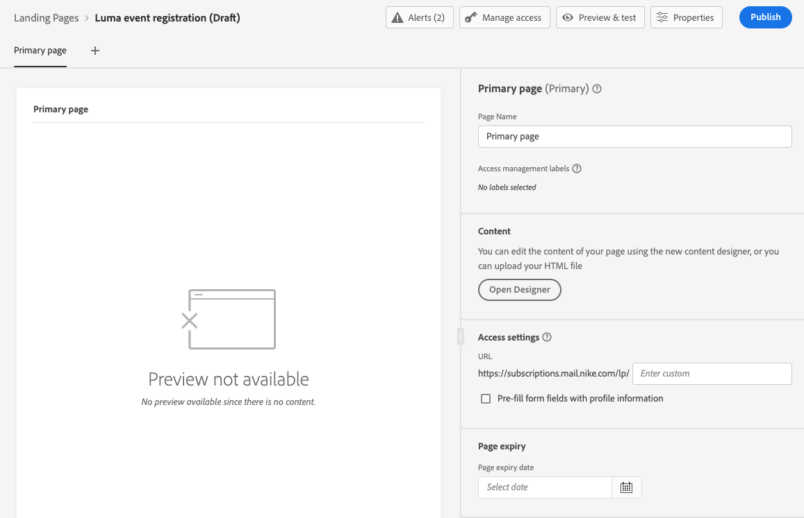
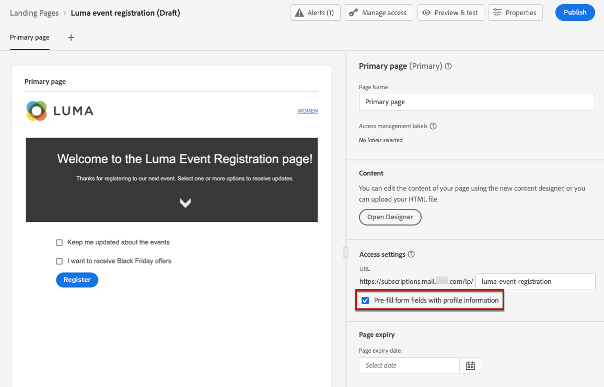

# bestemmingspagina&#39;s maken en publiceren {#create-lp}

Als u uw klanten wilt omleiden naar een gedefinieerde webpagina die u wilt weergeven wanneer ze op een specifieke koppeling klikken, maakt u een bestemmingspagina in [!DNL Journey Optimizer] , configureert u de primaire pagina en eventuele subpagina&#39;s, test en publiceert u deze.

De belangrijkste stappen voor het maken van bestemmingspagina&#39;s zijn als volgt:

## Een landingspagina maken {#create-landing-page}

>[!CONTEXTUALHELP]
>id="ajo_lp_create"
>title="De bestemmingspagina definiëren en configureren"
>abstract="Als u een openingspagina wilt maken, moet u een voorinstelling selecteren, vervolgens de primaire pagina en subpagina&#39;s configureren en ten slotte de pagina testen voordat u deze publiceert."

>[!CONTEXTUALHELP]
>id="ajo_lp_access_management_labels"
>title="Labels toewijzen aan uw bestemmingspagina"
>abstract="Om gevoelige digitale elementen te beschermen, kunt u vergunningen bepalen om gegevenstoegang tot uw landingspagina te beheren gebruikend etiketten."
>additional-url="https://experienceleague.adobe.com/docs/journey-optimizer/using/access-control/object-based-access.html?lang=nl-NL" text="Toegangsbeheer op objectniveau"

Als u een openingspagina wilt maken, moet u een voorinstelling selecteren, vervolgens de primaire pagina en subpagina&#39;s configureren en ten slotte de pagina testen voordat u deze publiceert. Deze stappen worden hieronder beschreven:

1. Blader in het linkermenu naar **[!UICONTROL Content Management]** > **[!UICONTROL Landing pages]** .

1. Klik in de lijst met openingspagina&#39;s op **[!UICONTROL Create landing page]** .

   

1. Voeg een titel toe. U kunt desgewenst een beschrijving toevoegen.

   

1. Selecteer **[!UICONTROL Manage access]** als u aangepaste of basislabels voor gegevensgebruik aan de landingspagina wilt toewijzen. [&#x200B; leer meer over de Controle van de Toegang van het Niveau van Objecten (OLAC) &#x200B;](../administration/object-based-access.md)

1. Selecteer of maak Adobe Experience Platform-tags in het veld **[!UICONTROL Tags]** om uw openingspagina te categoriseren voor een betere zoekopdracht. [Meer informatie](../start/search-filter-categorize.md#tags)

1. Selecteer een voorinstelling. Leer hoe te om het landen van pagina tot stand te brengen vooraf instelt in [&#x200B; deze sectie &#x200B;](../landing-pages/lp-presets.md#lp-create-preset).

   

1. Klik op **[!UICONTROL Create]**.

1. De primaire pagina en de bijbehorende eigenschappen worden weergegeven. Leer hoe te om de primaire paginamontages [&#x200B; hier &#x200B;](#configure-primary-page) te vormen.

   

1. Klik op het pictogram + om een subpagina toe te voegen. Leer hoe te om subpage montages [&#x200B; hier &#x200B;](#configure-subpages) te vormen.

   

Zodra u vormde en de [&#x200B; primaire pagina &#x200B;](#configure-primary-page) ontwierp, en [&#x200B; subpages &#x200B;](#configure-subpages) als om het even welk, kunt u [&#x200B; testen &#x200B;](#test-landing-page) en [&#x200B; publiceren &#x200B;](#publish-landing-page) uw het landen pagina.

>[!CAUTION]
>
>U hebt geen toegang tot uw landingspagina door de gedefinieerde URL gewoon te kopiëren en in een webbrowser te plakken, zelfs niet als deze is gepubliceerd. In plaats daarvan kunt u het testen gebruikend de voorproeffunctie zoals die in [&#x200B; wordt beschreven deze sectie &#x200B;](#test-landing-page).

## De primaire pagina configureren {#configure-primary-page}

>[!CONTEXTUALHELP]
>id="ajo_lp_primary_page"
>title="De primaire pagina-instellingen definiëren"
>abstract="De primaire pagina wordt direct aan de gebruikers getoond nadat zij de verbinding aan uw landende pagina, zoals van een e-mail of een website klikken."
<!--
>additional-url="https://experienceleague.adobe.com/docs/journey-optimizer/using/landing-pages/landing-pages-design/design-lp.html?lang=nl-NL" text="Design the landing page content"-->

>[!CONTEXTUALHELP]
>id="ajo_lp_access_settings"
>title="De URL van de landingspagina definiëren"
>abstract="Definieer in deze sectie een unieke URL van een bestemmingspagina. Voor het eerste deel van de URL moet u eerder een subdomein voor een bestemmingspagina instellen als onderdeel van de voorinstelling die u hebt geselecteerd."
>additional-url="https://experienceleague.adobe.com/nl/docs/journey-optimizer/using/content-management/landing-pages/lp-configuration/lp-subdomains" text="Subdomeinen van bestemmingspagina configureren"
>additional-url="https://experienceleague.adobe.com/nl/docs/journey-optimizer/using/content-management/landing-pages/lp-configuration/lp-presets#lp-create-preset" text="Voorinstellingen voor openingspagina&#39;s maken"

De primaire pagina is de pagina die onmiddellijk aan de gebruikers wordt getoond nadat zij de verbinding aan uw landende pagina, zoals van een e-mail of een website klikken.

Voer de onderstaande stappen uit om de instellingen voor de primaire pagina te definiëren.

1. U kunt de paginanaam wijzigen. Standaard is dit **[!UICONTROL Primary page]** .

1. Bewerk de inhoud van de pagina met de inhoudsontwerper. Leer hoe te om het landen van pagina inhoud [&#x200B; hier &#x200B;](design-lp.md) te bepalen.

   

1. Geef de URL van de bestemmingspagina op. Het eerste deel van URL vereist u eerder opstelling een het landen pagina subdomain als deel van [&#x200B; vooraf ingesteld &#x200B;](../landing-pages/lp-presets.md#lp-create-preset) u selecteerde. [Meer informatie](../landing-pages/lp-subdomains.md)

   >[!CAUTION]
   >
   >De bestemmingspagina-URL moet uniek zijn.
   >
   >U hebt geen toegang tot uw landingspagina door deze URL gewoon in een webbrowser te kopiëren en te plakken, zelfs niet als deze gepubliceerd is. In plaats daarvan kunt u het testen gebruikend de voorproeffunctie zoals die in [&#x200B; wordt beschreven deze sectie &#x200B;](#test-landing-page).

   

1. Als u wilt dat de landingspagina de formuliergegevens vooraf laadt die al beschikbaar zijn, selecteert u de optie **[!UICONTROL Pre-fill form fields with profile information]** .

   

   Als deze optie is ingeschakeld en een profiel al in-/uitgeschakeld heeft of al aan een abonnementenlijst is toegevoegd, worden de keuzes ervan weerspiegeld bij de weergave van de bestemmingspagina.

   Als een profiel er bijvoorbeeld voor heeft gekozen communicatie over toekomstige gebeurtenissen te ontvangen, is het bijbehorende selectievakje al ingeschakeld wanneer de landingspagina de volgende keer naar dat profiel wordt weergegeven.

   

1. U kunt een vervaldatum voor uw pagina bepalen. In dat geval moet u een actie selecteren bij het verlopen van de pagina:

   * **[!UICONTROL Redirect URL]**: voer de URL in van de pagina waarnaar de gebruikers worden omgeleid wanneer de pagina vervalt.
   * **[!UICONTROL Custom page]**: [&#x200B; vorm subpage &#x200B;](#configure-subpages) en selecteer het van de drop-down lijst die toont.
   * **[!UICONTROL Browser error]**: typ de fouttekst die wordt weergegeven in plaats van de pagina.

   

<!--1. In the **[!UICONTROL Additional data]** section, define one or more keys and their corresponding parameter values. You will be able to leverage these keys in the content of your primary page and subpages using the [personalization editor](../personalization/personalization-build-expressions.md). Learn more in [this section](lp-content.md#use-additional-data).

    -->

1. Als u één of meerdere abonnementslijsten selecteerde toen [&#x200B; het ontwerpen van de primaire pagina &#x200B;](design-lp.md), tonen zij in de **[!UICONTROL Subscription list]** sectie.

   

1. Van de het landen pagina, kunt u een reis [&#x200B; direct tot stand brengen die een bevestigingsbericht naar gebruikers zal verzenden wanneer zij de vorm voorleggen. &#x200B;](../building-journeys/journey-gs.md#jo-build) Leer hoe te om zulk een reis aan het eind van dit [&#x200B; gebruiksgeval &#x200B;](lp-use-cases.md#subscription-to-a-service) te bouwen.

   

   Klik op **[!UICONTROL Create journey]** om te worden omgeleid naar de lijst **[!UICONTROL Journey Management]** > **[!UICONTROL Journeys]** .

## Subpagina&#39;s configureren {#configure-subpages}

>[!CONTEXTUALHELP]
>id="ajo_lp_subpage"
>title="De subpagina-instellingen definiëren"
>abstract="U kunt maximaal twee subpagina&#39;s toevoegen. U kunt bijvoorbeeld een pagina &#39;Bedankt&#39; maken die wordt weergegeven wanneer de gebruikers het formulier verzenden en u kunt een foutpagina definiëren die wordt aangeroepen wanneer zich een probleem voordoet met de landingspagina."
>additional-url="https://experienceleague.adobe.com/nl/docs/journey-optimizer/using/content-management/landing-pages/landing-pages-design/design-lp" text="De inhoud van de bestemmingspagina ontwerpen"

>[!CONTEXTUALHELP]
>id="ajo_lp_access_settings-subpage"
>title="De URL van de landingspagina definiëren"
>abstract="Definieer in deze sectie een unieke URL van een bestemmingspagina. Voor het eerste deel van de URL moet u eerder een subdomein voor een bestemmingspagina instellen als onderdeel van de voorinstelling die u hebt geselecteerd."
>additional-url="https://experienceleague.adobe.com/docs/journey-optimizer/using/content-management/landing-pages/lp-configuration/lp-subdomains.html?lang=nl-NL" text="Subdomeinen van bestemmingspagina configureren"
>additional-url="https://experienceleague.adobe.com/docs/journey-optimizer/using/content-management/landing-pages/lp-configuration/lp-presets.html?lang=nl-NL#lp-create-preset" text="Voorinstellingen voor openingspagina&#39;s maken"

U kunt maximaal twee subpagina&#39;s toevoegen. U kunt bijvoorbeeld een pagina &#39;Bedankt&#39; maken die wordt weergegeven wanneer de gebruikers het formulier verzenden en u kunt een foutpagina definiëren die wordt aangeroepen wanneer zich een probleem voordoet met de landingspagina.

Voer de onderstaande stappen uit om de subpagina-instellingen te definiëren.

1. U kunt de paginanaam wijzigen. Standaard is dit **[!UICONTROL Subpage 1]** .

1. Bewerk de inhoud van de pagina met de inhoudsontwerper. Leer hoe te om het landen van pagina inhoud [&#x200B; hier &#x200B;](design-lp.md) te bepalen.

   >[!NOTE]
   >
   >U kunt een koppeling naar de primaire pagina invoegen vanuit elke subpagina van dezelfde bestemmingspagina. Als u bijvoorbeeld gebruikers wilt omleiden die een fout hebben gemaakt en zich opnieuw willen abonneren, kunt u een koppeling toevoegen van de bevestigingssubpagina naar de primaire pagina van het abonnement. Leer hoe te om verbindingen in [&#x200B; op te nemen deze sectie &#x200B;](../email/message-tracking.md#insert-links).

1. Geef de URL van de bestemmingspagina op. Voor het eerste deel van de URL moet u eerder een subdomein voor een bestemmingspagina instellen. [Meer informatie](../landing-pages/lp-subdomains.md)

   >[!CAUTION]
   >
   >De bestemmingspagina-URL moet uniek zijn.
   >
   >U hebt geen toegang tot uw subpagina door deze URL gewoon in een webbrowser te kopiëren en te plakken, zelfs niet als deze is gepubliceerd. In plaats daarvan kunt u het testen gebruikend de voorproeffunctie zoals die in [&#x200B; wordt beschreven deze sectie &#x200B;](#test-landing-page).

## De openingspagina testen {#test-landing-page}

>[!CONTEXTUALHELP]
>id="ac_preview_lp_profiles"
>title="De openingspagina voorvertonen en testen"
>abstract="Nadat u de instellingen en inhoud van de bestemmingspagina hebt gedefinieerd, kunt u testprofielen gebruiken om een voorvertoning weer te geven."
>additional-url="https://experienceleague.adobe.com/docs/journey-optimizer/using/audiences-profiles-identities/profiles/creating-test-profiles.html?lang=nl-NL" text="Testprofielen selecteren"

Nadat de instellingen en inhoud van de bestemmingspagina zijn gedefinieerd, kunt u testprofielen gebruiken om een voorvertoning weer te geven. Als u [&#x200B; gepersonaliseerde inhoud &#x200B;](../personalization/personalize.md) opnam, zult u kunnen controleren hoe deze inhoud in de het landen pagina wordt getoond, gebruikend de gegevens van het testprofiel.

>[!CAUTION]
>
>Als u bestemmingspagina&#39;s wilt testen, moet u **[!UICONTROL Publish Messages]** toestemming hebben.
>
>U moet testprofielen beschikbaar hebben om een voorbeeld van uw berichten te kunnen bekijken en proefdrukken te kunnen verzenden. Leer hoe te om [&#x200B; testprofielen &#x200B;](../audience/creating-test-profiles.md) tot stand te brengen.

1. Klik in de interface van de bestemmingspagina op de knop **[!UICONTROL Simulate content]** om toegang te krijgen tot de selectie van het testprofiel.

   

   >[!NOTE]
   >
   >De knop **[!UICONTROL Simulate content]** is ook toegankelijk vanuit de inhoudsontwerper.

1. Selecteer een of meer testprofielen in het scherm **[!UICONTROL Simulate]** .

   

   De stappen om testprofielen te selecteren zijn het zelfde als wanneer het testen van een bericht. Zij zijn gedetailleerd in de [&#x200B; sectie van het Beheer van de Inhoud &#x200B;](../content-management/test-profiles.md).

1. Selecteer **[!UICONTROL Open preview]** om de openingspagina te testen.

   

1. De voorvertoning van de bestemmingspagina wordt in een nieuw tabblad geopend. De gepersonaliseerde elementen worden vervangen door de geselecteerde gegevens van het testprofiel.

   <!---->

1. Selecteer andere testprofielen om de rendering voor elke variant van de landingspagina te bekijken.

## Waarschuwingen controleren {#check-alerts}

Terwijl u uw landingspagina maakt, wordt u gewaarschuwd wanneer u belangrijke acties moet ondernemen voordat u publiceert.

Waarschuwingen worden rechtsboven op het scherm weergegeven, zoals hieronder wordt getoond:

>[!NOTE]
>
>Als deze knop niet wordt weergegeven, is er geen melding gevonden.

Er kunnen twee typen waarschuwingen optreden:

* **de Waarschuwingen** verwijzen naar aanbevelingen en beste praktijken. <!--For example, a message will display if -->

* **de Fouten** verhinderen u de het landen pagina te publiceren zolang zij niet worden opgelost. U krijgt bijvoorbeeld een waarschuwing als de URL van de primaire pagina ontbreekt.

<!--All possible warnings and errors are detailed [below](#alerts-and-warnings).-->

>[!CAUTION]
>
> U moet alle **fout** alarm vóór publicatie oplossen.

<!--The settings and elements checked by the system are listed below. You will also find information on how to adapt your configuration to resolve the corresponding issues.

**Warnings**:

* 

**Errors**:

-->

## De openingspagina publiceren {#publish-landing-page}

>[!CAUTION]
>
>Gebruikers moeten de machtiging **[!UICONTROL Publish Messages]** hebben om bestemmingspagina&#39;s te publiceren.

Als de landingspagina gereed is, kunt u deze publiceren en in een bericht gebruiken.

>[!CAUTION]
>
>Controleer en los waarschuwingen op voordat u ze publiceert. [Meer informatie](#check-alerts)

Nadat de landingspagina is gepubliceerd, wordt deze met de status **[!UICONTROL Published]** toegevoegd aan de lijst met landingspagina&#39;s.

Het is nu levend en klaar om in a [!DNL Journey Optimizer] bericht te worden gebruikt dat door a [&#x200B; reis &#x200B;](../building-journeys/journey.md) zal worden verzonden.

>[!NOTE]
>
>U kunt tot uw landende pagina niet toegang hebben door eenvoudig kopiëren-kleeft in Webbrowser bepaalde URL wanneer [&#x200B; creërend de pagina &#x200B;](#create-landing-page), zelfs als gepubliceerd. In plaats daarvan kunt u het testen gebruikend de voorproeffunctie zoals die in [&#x200B; wordt beschreven deze sectie &#x200B;](#test-landing-page).

U kunt de gevolgen van de landingspagina controleren aan de hand van specifieke rapporten. [Meer informatie](../reports/lp-report-live.md)
