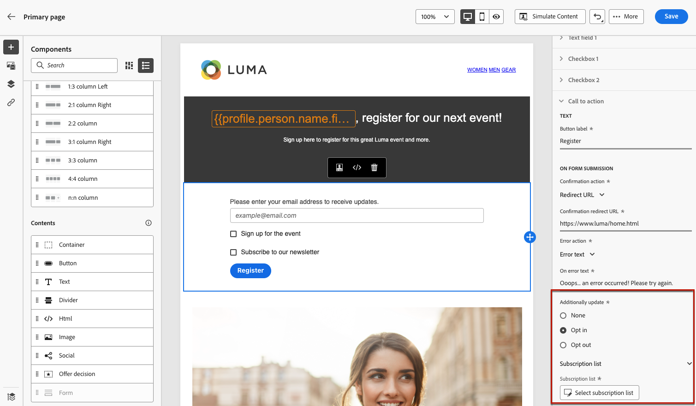
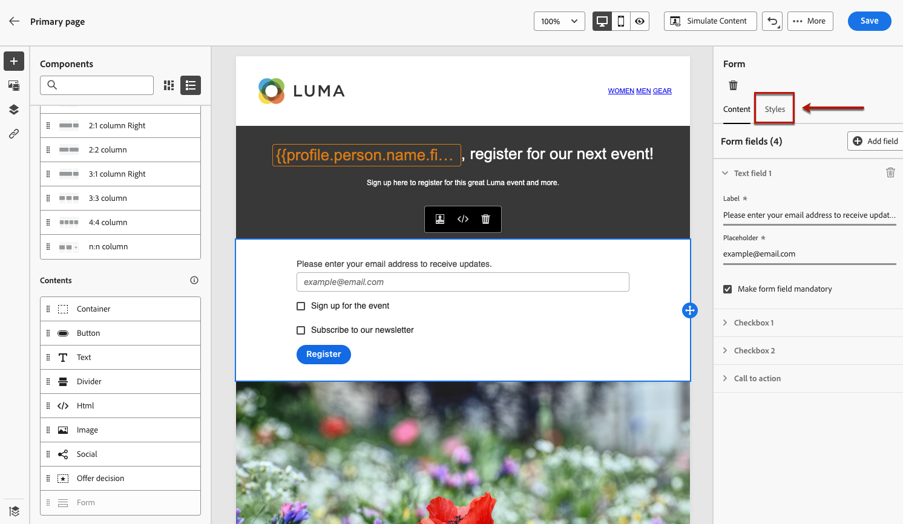
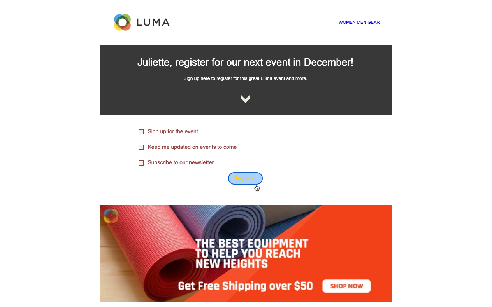

# De inhoud van de bestemmingspagina ontwerpen {#design-lp-content}

Beginnen met het maken van inhoud voor uw landing [primaire pagina](create-lp.md#configure-primary-page) of [subpagina](create-lp.md#configure-subpages)Houd de muis boven de inhoud van de primaire pagina en klik op **[!UICONTROL Open Designer]**. U kunt ook op de bijbehorende knop in het rechterpalet klikken.

Vanaf dat punt kunt u:

* **Ontwerp uw openingspagina helemaal** via de interface van de inhoudsontwerper en met behulp van afbeeldingen van [Adobe Experience Manager Assets Essentials](../design/assets-essentials.md). Leer hoe u uw inhoud ontwerpt of ingebouwde sjablonen gebruikt [in deze sectie](../design/create-email-content.md).

* **Code of paste raw HTML** rechtstreeks in de inhoudsontwerper. Leer hoe u uw eigen inhoud codeert [in deze sectie](../design/code-content.md).

* **Bestaande HTML-inhoud importeren** uit een bestand of een ZIP-map. Leer hoe u inhoud importeert [in deze sectie](../design/existing-content.md).

>[!NOTE]
>
>De ontwerper van de landingspagina-inhoud is meestal vergelijkbaar met de ontwerper van de e-mail. Meer informatie over [inhoud ontwerpen met [!DNL Journey Optimizer]](../design/design-emails.md).

## Paginaspecifieke inhoud definiëren {#define-lp-specific-content}

Volg onderstaande stappen om specifieke inhoud te definiëren waarmee gebruikers hun keuzes op de bestemmingspagina kunnen selecteren en verzenden.

1. De landingspagina-specifiek slepen en neerzetten **[!UICONTROL Form]** van het linkerpalet naar de hoofdwerkruimte.

   

   >[!NOTE]
   >
   >De **[!UICONTROL Form]** kan slechts eenmaal op dezelfde pagina worden gebruikt.

1. Selecteer het. De **[!UICONTROL Form content]** wordt weergegeven in het rechterpalet, zodat u de verschillende velden van het formulier kunt bewerken.

   

   >[!NOTE]
   >
   >Naar de **[!UICONTROL Form style]** kunt u op elk gewenst moment de stijlen van de inhoud van uw formuliercomponent bewerken. [Meer informatie](#define-lp-styles)

1. Van de **[!UICONTROL Checkbox 1]** kunt u het label bewerken dat overeenkomt met dit selectievakje.

1. Bepaal als dit checkbox gebruikers binnen of uit moet kiezen: gaan zij ermee akkoord om mededelingen te ontvangen of vragen zij geen contact meer op te nemen ?

   

   Kies een van de drie onderstaande opties:

   * **[!UICONTROL Opt in if checked]**: gebruikers moeten het selectievakje voor toestemming (opt-in) inschakelen.
   * **[!UICONTROL Opt out if checked]**: gebruikers moeten het selectievakje inschakelen om hun toestemming te verwijderen (opt-out).
   * **[!UICONTROL Opt in if checked, opt out if unchecked]**: Met deze optie kunt u één selectievakje voor opt-in/opt-out invoegen. Gebruikers moeten het selectievakje voor toestemming (opt-in) inschakelen en het selectievakje uitschakelen om hun toestemming (opt-out) te verwijderen.

1. Kies wat tussen de drie volgende opties wordt bijgewerkt:

   

   * **[!UICONTROL Subscription list]**: U moet de abonnementenlijst selecteren die wordt bijgewerkt als het profiel dit selectievakje selecteert. Meer informatie over [abonnementenlijsten](subscription-list.md).

      

   * **[!UICONTROL Channel (email)]**: De opt-in of opt-out geldt voor het gehele kanaal. Als een profiel dat opteert bijvoorbeeld twee e-mailadressen heeft, worden beide adressen uitgesloten van al uw communicatie.

   * **[!UICONTROL Email identity]**: De opt-in of opt-out is alleen van toepassing op het e-mailadres dat is gebruikt voor toegang tot de bestemmingspagina. Als een profiel bijvoorbeeld twee e-mailadressen heeft, ontvangt alleen het profiel dat is gebruikt om u aan te melden, communicatie van uw merk.

1. Klikken **[!UICONTROL Add field]** > **[!UICONTROL Checkbox]** om nog een selectievakje toe te voegen. Herhaal bovenstaande stappen om de eigenschappen ervan te definiëren.

   

1. Nadat u alle gewenste selectievakjes hebt toegevoegd, klikt u op **[!UICONTROL Call to action]** om de corresponderende sectie uit te vouwen. Hiermee kunt u het gedrag van de knop in het dialoogvenster **[!UICONTROL Form]** component.

   

1. Bepaal wat er gebeurt wanneer u op de knop klikt:

   * **[!UICONTROL Redirect URL]**: Voer de URL in van de pagina waarnaar de gebruikers worden omgeleid.
   * **[!UICONTROL Confirmation text]**: Typ de bevestigingstekst die wordt weergegeven.
   * **[!UICONTROL Link to a subpage]**: Een [subpagina](create-lp.md#configure-subpages) en selecteert u deze in de vervolgkeuzelijst die wordt weergegeven.

   

1. Definieer wat er gebeurt wanneer op de knop wordt geklikt in het geval een fout optreedt:

   * **[!UICONTROL Redirect URL]**: Voer de URL in van de pagina waarnaar de gebruikers worden omgeleid.
   * **[!UICONTROL Error text]**: Typ de fouttekst die wordt weergegeven. U kunt de fouttekst voorvertonen bij het definiëren van de [formulierstijlen](#define-lp-styles).

   * **[!UICONTROL Link to a subpage]**: Een [subpagina](create-lp.md#configure-subpages) en selecteert u deze in de vervolgkeuzelijst die wordt weergegeven.

   

1. Als u aanvullende updates wilt uitvoeren wanneer u het formulier verzendt, selecteert u **[!UICONTROL Opt in]** of **[!UICONTROL Opt out]** en definieer of u een abonnementenlijst, het kanaal of alleen het gebruikte e-mailadres wilt bijwerken.

   

1. Sla de inhoud op en klik op de pijl naast de paginanaam om terug te gaan naar de map [eigenschappen van bestemmingspagina](create-lp.md#configure-primary-page).

   

<!--Will the name Email Designer be kept if you can also design LP with the same tool? > To modify in Messages section > content designer or Designer-->

## Landingspagina-formulierstijlen definiëren {#define-lp-styles}

1. Als u de stijlen van de inhoud van een formuliercomponent wilt wijzigen, schakelt u op elk gewenst moment over naar de **[!UICONTROL Form style]** tab.

   

1. Breid uit **[!UICONTROL Checkboxes]** om de vormgeving van de selectievakjes en de bijbehorende tekst te definiëren. U kunt bijvoorbeeld de lettertypefamilie of -grootte en de randkleur van het selectievakje aanpassen.

   

1. Breid uit **[!UICONTROL Buttons]** om de weergave van de knop in het deelformulier te wijzigen. U kunt bijvoorbeeld een rand toevoegen, de labelkleur bij aanwijzen bewerken of de uitlijning van de knop aanpassen.

   

   U kunt een voorvertoning van bepaalde instellingen, zoals de kleur van knoplabels op de muisaanwijzer, weergeven met de opdracht **[!UICONTROL Preview]** knop. Meer informatie over het testen van bestemmingspagina&#39;s [hier](create-lp.md#test-landing-page).

   

1. Breid uit **[!UICONTROL Form layout]** om de layoutinstellingen zoals de achtergrondkleur, opvulling of marge te bewerken.

   

1. Breid uit **[!UICONTROL Form error]** om de weergave aan te passen van het foutbericht dat wordt weergegeven wanneer zich een probleem voordoet. Schakel de desbetreffende optie in om een voorbeeld van de fouttekst op het formulier te bekijken.

   

