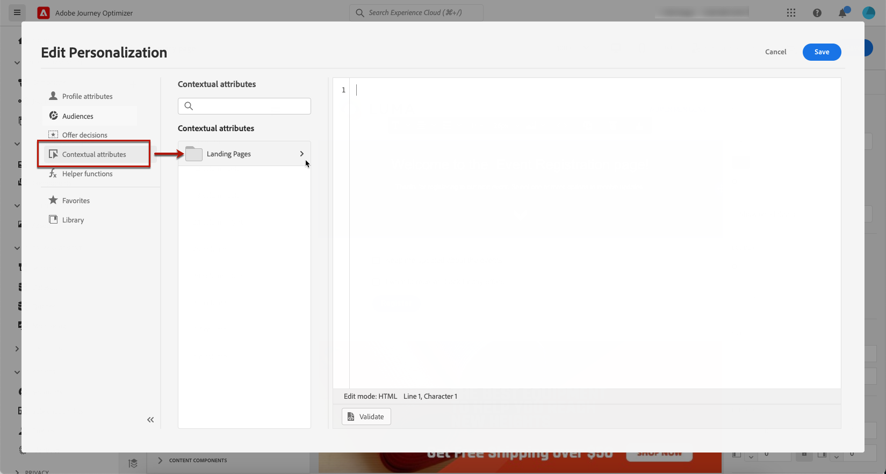

# Paginaspecifieke inhoud definiëren {#lp-content}

>[!CONTEXTUALHELP]
>id="ac_lp_components"
>title="Inhoudscomponenten gebruiken"
>abstract="Inhoudscomponenten zijn lege plaatsaanduidingen voor inhoud die u kunt gebruiken om de lay-out van een bestemmingspagina te maken. Gebruik de formuliercomponent om specifieke inhoud te definiëren waarmee gebruikers hun keuzes kunnen selecteren en verzenden."
>additional-url="https://experienceleague.adobe.com/docs/journey-optimizer/using/email/design-email/add-content/content-components.html#add-content-components" text="Inhoudscomponenten toevoegen"

Als u de inhoud van de bestemmingspagina wilt ontwerpen, kunt u dezelfde onderdelen gebruiken als voor een e-mail. [Meer informatie](../email/content-components.md#add-content-components)

Om specifieke inhoud te ontwerpen die gebruikers zal toelaten om hun keuzen te selecteren en te verzenden, [de formuliercomponent gebruiken](#use-form-component) en stelt de [paginaspecifieke stijlen plaatsen](#lp-form-styles).

>[!NOTE]
>
>U kunt ook een doorklikingspagina zonder een **[!UICONTROL Form]** component. In dat geval wordt de landingspagina weergegeven aan gebruikers, maar hoeven zij geen formulier in te dienen. Dit kan handig zijn als u alleen een bestemmingspagina wilt weergeven zonder dat u enige actie van uw ontvangers nodig hebt, zoals aanmelden of Weigeren, of informatie wilt opgeven waarvoor geen invoer van de gebruiker is vereist.

Met de landende pagina-inhoudontwerper kunt u ook contextuele gegevens gebruiken die afkomstig zijn van de primaire pagina in een subpagina. [Meer informatie](#use-primary-page-context)

## De formuliercomponent gebruiken {#use-form-component}

>[!CONTEXTUALHELP]
>id="ac_lp_formfield"
>title="De velden voor formuliercomponenten instellen"
>abstract="Bepaal hoe de ontvangers hun keuzes vanaf de bestemmingspagina zien en verzenden."
>additional-url="https://experienceleague.adobe.com/en/docs/journey-optimizer/using/landing-pages/landing-pages-design/lp-content#lp-form-styles" text="Landingspagina-formulierstijlen definiëren"

>[!CONTEXTUALHELP]
>id="ac_lp_submission"
>title="Wat gebeurt er als u op de knop klikt"
>abstract="Bepaal wat er gebeurt wanneer gebruikers het formulier voor de landingspagina indienen."

Als u specifieke inhoud wilt definiëren waarmee gebruikers hun keuzes vanaf de bestemmingspagina kunnen selecteren en verzenden, gebruikt u de optie **[!UICONTROL Form]** component. Volg de onderstaande stappen om dit te doen.

1. De landingspagina-specifiek slepen en neerzetten **[!UICONTROL Form]** van het linkerpalet naar de hoofdwerkruimte.

   

   >[!NOTE]
   >
   >De **[!UICONTROL Form]** kan slechts eenmaal op dezelfde pagina worden gebruikt.

1. Selecteer het. De **[!UICONTROL Form content]** wordt weergegeven in het rechterpalet, zodat u de verschillende velden van het formulier kunt bewerken.

   

   >[!NOTE]
   >
   >Schakel over naar de **[!UICONTROL Styles]** kunt u op elk gewenst moment de stijlen van de inhoud van uw formuliercomponent bewerken. [Meer informatie](#define-lp-styles)

1. Van de **[!UICONTROL Checkbox 1]** kunt u het label bewerken dat overeenkomt met dit selectievakje.

1. Definiëren of dit selectievakje gebruikers in- of uitchecken is: stemmen ze in met het ontvangen van communicatie of vragen ze niet meer contact met hen op te nemen?

   

   Kies een van de drie onderstaande opties:

   * **[!UICONTROL Opt in if checked]**: gebruikers moeten het selectievakje voor toestemming (opt-in) inschakelen.
   * **[!UICONTROL Opt out if checked]**: gebruikers moeten het selectievakje inschakelen om hun toestemming te verwijderen (opt-out).
   * **[!UICONTROL Opt in if checked, opt out if unchecked]**: met deze optie kunt u één selectievakje voor opt-in/opt-out invoegen. Gebruikers moeten het selectievakje voor toestemming (opt-in) inschakelen en het selectievakje uitschakelen om hun toestemming (opt-out) te verwijderen.

1. Kies wat tussen de drie volgende opties wordt bijgewerkt:

   

   * **[!UICONTROL Subscription list]**: U moet de abonnementenlijst selecteren die wordt bijgewerkt als het profiel dit selectievakje selecteert. Meer informatie over [abonnementenlijsten](subscription-list.md).

     <!---->

   * **[!UICONTROL Channel (email)]**: De opt-in of opt-out geldt voor het gehele kanaal. Als een profiel dat opteert bijvoorbeeld twee e-mailadressen heeft, worden beide adressen uitgesloten van al uw communicatie.

   * **[!UICONTROL Email identity]**: De opt-in of opt-out is alleen van toepassing op het e-mailadres dat is gebruikt voor toegang tot de bestemmingspagina. Als een profiel bijvoorbeeld twee e-mailadressen heeft, ontvangt alleen het profiel dat is gebruikt om u aan te melden, communicatie van uw merk.

1. Klikken **[!UICONTROL Add field]** > **[!UICONTROL Checkbox]** om nog een selectievakje toe te voegen. Herhaal bovenstaande stappen om de eigenschappen ervan te definiëren.

   

1. U kunt ook een **[!UICONTROL Text field]**.

   

   * Voer de **[!UICONTROL Label]** die boven op het veld in het formulier worden weergegeven.

   * Voer een **[!UICONTROL Placeholder]** tekst. Het wordt in het veld weergegeven voordat de gebruiker het veld invult.

   * Controleer de **[!UICONTROL Make form field mandatory]** indien nodig. In dat geval kan de landingspagina alleen worden verzonden als de gebruiker dit veld heeft ingevuld. Als een verplicht veld niet is ingevuld, wordt een foutbericht weergegeven wanneer de gebruiker de pagina verzendt.

   

1. Nadat u alle gewenste selectievakjes en/of tekstvelden hebt toegevoegd, klikt u op **[!UICONTROL Call to action]** om de bijbehorende sectie uit te vouwen. Hiermee kunt u het gedrag van de knop in het dialoogvenster **[!UICONTROL Form]** component.

   

1. Bepaal wat er gebeurt wanneer u op de knop klikt:

   * **[!UICONTROL Redirect URL]**: Voer de URL in van de pagina waarnaar de gebruikers worden omgeleid.
   * **[!UICONTROL Confirmation text]**: Typ de bevestigingstekst die wordt weergegeven.
   * **[!UICONTROL Link to a subpage]**: Vorm een [subpagina](create-lp.md#configure-subpages) en selecteert u deze in de vervolgkeuzelijst die wordt weergegeven.

   

1. Definieer wat er gebeurt wanneer op de knop wordt geklikt in het geval een fout optreedt:

   * **[!UICONTROL Redirect URL]**: Voer de URL in van de pagina waarnaar de gebruikers worden omgeleid.
   * **[!UICONTROL Error text]**: Typ de fouttekst die wordt weergegeven. U kunt de fouttekst voorvertonen bij het definiëren van de [formulierstijlen](#define-lp-styles).

   * **[!UICONTROL Link to a subpage]**: Vorm een [subpagina](create-lp.md#configure-subpages) en selecteert u deze in de vervolgkeuzelijst die wordt weergegeven.

   

1. Als u aanvullende updates wilt uitvoeren wanneer u het formulier verzendt, selecteert u **[!UICONTROL Opt in]** of **[!UICONTROL Opt out]** en definieer of u een abonnementenlijst, het kanaal of alleen het gebruikte e-mailadres wilt bijwerken.

   

1. Sla de inhoud op en klik op de pijl naast de paginanaam om terug te gaan naar de map [eigenschappen van bestemmingspagina](create-lp.md#configure-primary-page).

   

## Landingspagina-formulierstijlen definiëren {#lp-form-styles}

1. Als u de stijlen van de inhoud van een formuliercomponent wilt wijzigen, schakelt u op elk gewenst moment over naar de **[!UICONTROL Style]** tab.

   

1. De **[!UICONTROL Fields]** wordt standaard uitgevouwen, zodat u de weergave van het tekstveld kunt bewerken, zoals het label- en plaatsaanduidingslettertype, de positie van het label, de achtergrondkleur van het veld of de veldrand.

   

1. Breid uit **[!UICONTROL Checkboxes]** om de vormgeving van de selectievakjes en de bijbehorende tekst te definiëren. U kunt bijvoorbeeld de lettertypefamilie of -grootte of de randkleur van het selectievakje aanpassen.

   

1. Breid uit **[!UICONTROL Buttons]** om de weergave van de knop in het deelformulier te wijzigen. U kunt bijvoorbeeld het lettertype wijzigen, een rand toevoegen, de labelkleur bewerken op de muisaanwijzer of de uitlijning van de knop aanpassen.

   

   U kunt een voorvertoning van bepaalde instellingen, zoals de kleur van knoplabels op de muisaanwijzer, weergeven met de opdracht **[!UICONTROL Simulate content]** knop. Meer informatie over het testen van bestemmingspagina&#39;s [hier](create-lp.md#test-landing-page).

   <!---->

1. Breid uit **[!UICONTROL Form layout]** om de layoutinstellingen zoals de achtergrondkleur, opvulling of marge te bewerken.

   

1. Breid uit **[!UICONTROL Form error]** om de weergave aan te passen van het foutbericht dat wordt weergegeven wanneer zich een probleem voordoet. Schakel de desbetreffende optie in om een voorbeeld van de fouttekst op het formulier te bekijken.

   

## De context van de primaire pagina gebruiken {#use-primary-page-context}

U kunt contextuele gegevens gebruiken die afkomstig zijn van een andere pagina binnen dezelfde landingspagina.

Als u bijvoorbeeld een selectievakje koppelt <!-- or the submission of the page--> een [abonnementenlijst](subscription-list.md) op de primaire landingspagina kunt u die abonnementslijst op de subpagina &quot;bedankt&quot; gebruiken.

Stel dat u twee selectievakjes op de primaire pagina koppelt aan twee verschillende abonnementlijsten. Als een gebruiker zich op een van deze machtigingen abonneert, wilt u bij het verzenden van het formulier een specifiek bericht weergeven, afhankelijk van het selectievakje dat de gebruiker heeft ingeschakeld.

Hiervoor voert u de volgende stappen uit:

1. Koppel op de primaire pagina elk selectievakje van het **[!UICONTROL Form]** aan de betreffende abonnementenlijst. [Meer informatie](#use-form-component).

   

1. Plaats de aanwijzer van de muis op de subpagina waar u de tekst wilt invoegen en selecteer **[!UICONTROL Add personalization]** in de contextuele werkbalk.

   

1. In de **[!UICONTROL Edit personalization]** venster, selecteert u **[!UICONTROL Contextual attributes]** > **[!UICONTROL Landing Pages]** > **[!UICONTROL Primary Page Context]** > **[!UICONTROL Subscription]**.

1. Alle abonnementenlijsten die u op de primaire pagina hebt geselecteerd, worden weergegeven. Selecteer de relevante items met het pictogram +.

   

1. Voeg de relevante voorwaarden toe gebruikend de hulpfuncties van de verpersoonlijkingsredacteur. [Meer informatie](../personalization/functions/functions.md)

   

   >[!CAUTION]
   >
   >Als er een speciaal teken in de expressie staat, zoals een afbreekstreepje, moet u de tekst weglaten, inclusief het afbreekstreepje.

1. Sla uw wijzigingen op.

Nu wanneer gebruikers een van de selectievakjes selecteren,

het bericht dat overeenkomt met het geselecteerde selectievakje wordt weergegeven bij het verzenden van het formulier.

<!---->

>[!NOTE]
>
>Als een gebruiker de twee selectievakjes selecteert, worden beide teksten weergegeven.

<!--
## Use landing page additional data {#use-additional-data}

When [configuring the primary page](create-lp.md#configure-primary-page), you can create additional data to enable storing information when the landing page is being submitted.

>[!NOTE]
>
>This data may not be visible to users who visit the page.

If you defined one or more keys with their corresponding values when [configuring the primary page](create-lp.md#configure-primary-page), you can leverage these keys in the content of your primary page and subpages using the [personalization editor](../personalization/personalization-build-expressions.md).

///When you reuse the same text on a page, this enables you to dynamically change that text if needed, without going through each occurrence.

For example, if you define the company name as a key, you can quickly update it everywhere (on all the pages of a given landing page) by changing it only once in the [primary page settings](create-lp.md#configure-primary-page).///

To leverage these keys in a landing page, follow the steps below:

1. When configuring the primary page, define a key and its corresponding value in the **[!UICONTROL Additional data]** section. [Learn more](create-lp.md#configure-primary-page)

    

1. When editing your primary page with the designer, place the pointer of your mouse where you want to insert your key and select **[!UICONTROL Add personalization]** from the contextual toolbar.

    

1. In the **[!UICONTROL Edit Personalization]** window, select **[!UICONTROL Contextual attributes]** > **[!UICONTROL Landing Pages]** > **[!UICONTROL Additional Context]**.

    

1. All the keys that you created when configuring the primary page are listed. Select the key of your choice using the + icon.

    

1. Save your changes and repeat the steps above as many times as needed.

    

    You can see that the personalization item corresponding to your key is now displayed everywhere you inserted it.
-->