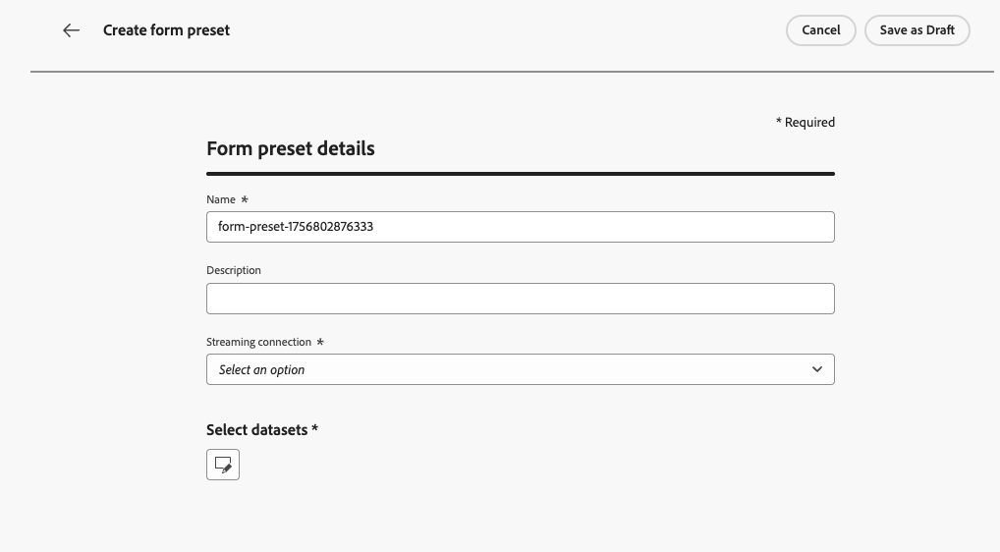
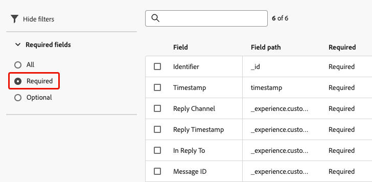
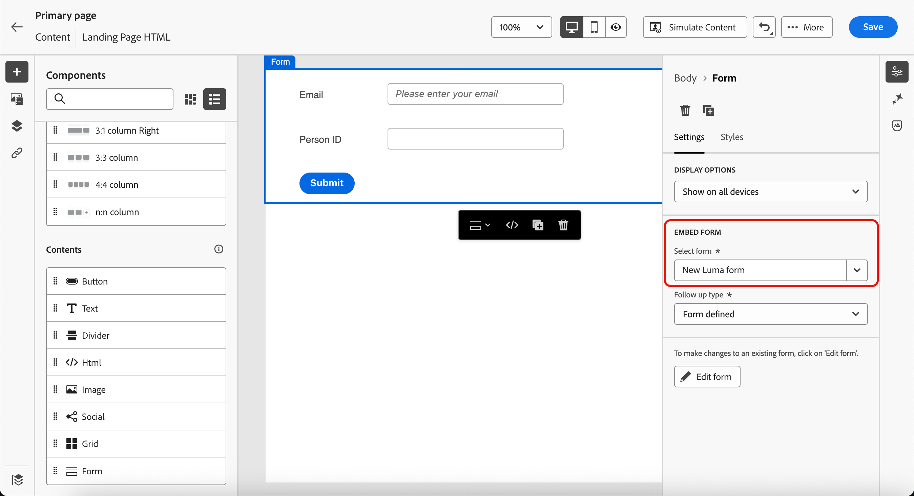

# Formulieren gebruiken op de bestemmingspagina&#39;s {#lp-forms}

>[!AVAILABILITY]
>
>Deze mogelijkheid is beschikbaar in Beperkte Beschikbaarheid. Neem contact op met uw Adobe-vertegenwoordiger voor toegang.

Als u profielgegevens wilt vastleggen met uw [!DNL Journey Optimizer] -bestemmingspagina&#39;s en de [!DNL Experience Platform] -gegevenssets wilt verrijken, kunt u formulieren gebruiken in uw bestemmingspagina&#39;s.

## Een formuliervoorinstelling maken {#create-form-preset}

>[!CONTEXTUALHELP]
>id="ajo_lp_form_connection"
>title="Selecteer het te gebruiken eindpunt"
>abstract="Definieer het streamingeindpunt waar gegevens worden verzonden bij het verzenden van het formulier."
>additional-url="https://experienceleague.adobe.com/en/docs/experience-platform/sources/ui-tutorials/create/streaming/http" text="Een HTTP API-streamingverbinding maken"

>[!CONTEXTUALHELP]
>id="ajo_lp_form_dataset"
>title="Een gegevensset selecteren"
>abstract="Definieer een gegevensset waarin de formulierreacties worden opgeslagen en weergegeven. U kunt typen om een specifieke dataset te zoeken of het van de lijst te selecteren."

Voordat u een formulier kunt maken, moet u een speciale voorinstelling maken waarin u het eindpunt van de verbinding selecteert waarnaar gegevens voor formulierverzending worden verzonden en de gegevensset waarin de gegevens worden opgeslagen die door het formulier zijn vastgelegd.

Wanneer de gegevens op het stromen eindpunt landen, is het verbonden met de datasetinformatie. Gebruikend de geproduceerde bron/doelverbindingen en bronstroom, worden de gegevens dan geduwd in de dataset.

Bij het maken van een voorinstelling:

* U kunt meerdere voorinstellingen instellen met verschillende combinaties van gegevenssets en streamingverbindingen.
* Dezelfde gegevensset of streamingverbinding kan opnieuw worden gebruikt voor meerdere voorinstellingen.
* Elke streamingverbinding genereert automatisch bronnen zoals:
   * **verbinding van Source** - waar de gegevens voortkomen.
   * **verbinding van het Doel** - waar het gegeven wordt opgeslagen of verbruikt.
   * **stroom van Source** - de pijpleiding die gegevens van de bronverbinding in [!DNL Experience Platform] beweegt, afbeelding, transformatie, en bevestiging behandelt.

>[!NOTE]
>
> Als u formuliervoorinstellingen wilt openen en bewerken, moet u beschikken over de machtiging **[!UICONTROL Manage form presets]** in de productiesandbox. Leer meer over toestemmingen in [ deze sectie ](../administration/high-low-permissions.md#administration-permissions).<!--TBC-->

1. Als u de **[!UICONTROL Form presets]** -voorraad wilt openen, selecteert u **[!UICONTROL Administration]** > **[!UICONTROL Channels]** > **[!UICONTROL Form settings]** in het linkermenu.

1. Klik op **[!UICONTROL Create form preset]**.

1. Werk de naam bij om deze eenvoudiger op te halen en voeg zo nodig een beschrijving toe.

   {width=80%}

1. Selecteer de **[!UICONTROL Streaming connection]** die u voor dat formulier wilt gebruiken. Dit is het streamingeindpunt waar gegevens worden verzonden bij het verzenden van het formulier.

   >[!NOTE]
   >
   >Leer meer bij het creëren van een het stromen bronverbinding in de [ documentatie van Experience Platform ](https://experienceleague.adobe.com/en/docs/experience-platform/sources/ui-tutorials/create/streaming/http){target="_blank"}.

1. Selecteer een **[!UICONTROL Dataset]** die u aan het formulier wilt koppelen. Hier worden de reacties op het formulier opgeslagen en weergegeven. U kunt typen om een specifieke dataset te zoeken of het van de lijst te selecteren.

   >[!NOTE]
   >
   >Momenteel zijn alleen [!DNL Adobe Experience Platform]-gegevenssets beschikbaar voor selectie. Er kan slechts één gegevensset tegelijk worden geselecteerd.

1. Klik op **[!UICONTROL Publish]**. Uw voorinstelling kan nu in een formulier worden gebruikt.

## Formulieren openen en beheren {#access-forms}

Als u de formulierlijst wilt openen, selecteert u **[!UICONTROL Content Management]** > **[!UICONTROL Forms]** in het linkermenu.

Alle bestaande formulieren worden weergegeven. U kunt formulieren filteren op basis van hun status, aanmaakdatum of wijzigingsdatum.

## Een formulier maken en ontwerpen {#create-form}

>[!CONTEXTUALHELP]
>id="ajo_lp_form_preset"
>title="Een voorinstelling selecteren"
>abstract="Kies een vooraf gedefinieerde voorinstelling die de te gebruiken verbinding en een vooraf gedefinieerde gegevensset voor uw formulier bevat."
>additional-url="https://experienceleague.adobe.com/en/docs/journey-optimizer/using/content-management/landing-pages/lp-forms#create-form-preset" text="Een formuliervoorinstelling maken"

Voer de onderstaande stappen uit om een formulier te maken.

1. Klik in de lijst **[!UICONTROL Forms]** op **[!UICONTROL Create form]** .

1. Voeg een naam toe. U kunt desgewenst een beschrijving toevoegen.

   

1. Selecteer een **[!UICONTROL Preset]** met de verbinding die moet worden gebruikt en een vooraf gedefinieerde gegevensset voor uw formulier. [ Leer hoe te om een vorm tot stand te brengen vooraf ingesteld ](#create-form-preset)

1. Klik op **[!UICONTROL Create]**. De vormontwerper opent, die u toelaat om structuren en inhoud [ componenten ](../email/content-components.md#add-content-components) toe te voegen om uw inhoud te bouwen. U kunt [ Tekst ](../email/content-components.md#text) en **[!UICONTROL Field]** componenten gebruiken.

1. Als u profielgegevens en -kenmerken wilt vastleggen, voegt u specifieke velden toe aan het formulier. [Meer informatie](#define-fields)

1. Configureer en ontwerp deze velden. [Meer informatie](#configure-fields)

1. U kunt de indeling, opmaak en afmetingen van het formulier naar wens aanpassen in het deelvenster **[!UICONTROL Styles]** . [ Leer meer bij het stileren ](../email/get-started-email-style.md)

1. Wanneer u alle velden hebt geconfigureerd, klikt u op **[!UICONTROL Save & close]** .

1. Vorm Dank u pagina. [ leer hoe ](#thank-you-page)

1. **[!UICONTROL Publish]** het formulier om het beschikbaar te maken voor selectie op bestemmingspagina&#39;s.

### Specifieke velden definiëren {#define-fields}

Als u specifieke velden aan het formulier wilt toevoegen, sleept u een structuur naar het canvas en sleept u een component **[!UICONTROL Field]** naar het canvas. <!--**[!UICONTROL Select field attribute]** or **[!UICONTROL Add custom field]**.-->

Selecteer vervolgens een van de volgende opties:

>[!BEGINTABS]

>[!TAB  Uitgezochte gebied attributen ]

Gebruik deze optie om een attribuut te selecteren dat op het datasetschema wordt gebaseerd verbonden aan uw vorm.

>[!NOTE]
>
>De dataset wordt bepaald in vooraf ingesteld geselecteerd voor uw vorm. [Meer informatie](#create-form-preset)

{width=100%}

U kunt bijvoorbeeld de e-mail- en persoon-id instellen. Wanneer de gebruikers deze gebieden invullen, wordt de ingegane informatie bewaard aan de geselecteerde dataset.

{width=55%}

Als u de verzamelde gegevens wilt toewijzen aan een profiel, selecteert u een profiel-identiteitsveld. De identiteitsvelden zijn gemarkeerd als **[!UICONTROL Required]** in de lijst met kenmerken - u kunt er op filteren.

{width=65%}

>[!TAB voeg douanegebied  toe]

Met deze optie, kunt u enkel een vrij gebied bepalen zonder het aan een gebied in de verbonden dataset in kaart te brengen.

{width=85%}

>[!ENDTABS]

### Een veld configureren en ontwerpen {#configure-fields}

Nadat u een veldkenmerk hebt geselecteerd of een aangepast veld hebt toegevoegd, kunt u de details en het gedrag van het kenmerk verder aanpassen bij het verzenden van het formulier.

1. In de sectie **[!UICONTROL Field details]** van het tabblad **[!UICONTROL Content]** aan de rechterkant kunt u de volgende elementen opgeven:

   * Pas **[!UICONTROL Label]** aan om het voor de ontvangers van uw formulier duidelijk te maken.
   * Wijzig de **[!UICONTROL Field type]** naar wens. Dit kan een selectievakje, valuta, datum, schuifregelaar, URL enzovoort zijn.

     >[!NOTE]
     >
     >De andere velddetails kunnen variëren afhankelijk van het geselecteerde veldtype.

   * Voeg een **[!UICONTROL Placeholder]** toe.<!--To explain-->
   * Opgeven **[!UICONTROL Instructions]**.<!--How will they be displayed in the form? To explain-->
   * Voer een **[!UICONTROL Default value]** in die wordt weergegeven voordat de gebruikers van het formulier het veld invullen.
   * U kunt een aangepaste **[!UICONTROL Validation message]** definiëren.
   * Stel een **[!UICONTROL Maximum length]** in. Er wordt een foutbericht weergegeven als de ontvangers van het formulier de limiet overschrijden wanneer ze het veld invullen.

   {width=85%}

1. In de sectie **[!UICONTROL Field behaviors]** kunt u het volgende definiëren:

   * Selecteer **[!UICONTROL Required]** om dit veld verplicht te maken. Als gebruikers het veld niet invullen, kunnen ze het formulier niet verzenden.
   * Selecteer **[!UICONTROL Sensitive]** om onderscheid te maken tussen hoofdletters en kleine letters. <!--To confirm - do you mean retain capitalization when added to the dataset?-->
   * Selecteer **[!UICONTROL Prefilled Enabled]** om het veld te vullen met de profielgegevens, indien beschikbaar.<!--Even for a custom field, or a field not mapped to a profile? What happens if no data is available?-->
   * Selecteer **[!UICONTROL Enable input mask]** om de invoer van gebruikers te vervangen door generieke tekens. U kunt *9* gebruiken om het even welk aantal te betekenen, *a* om het even welke brief te betekenen, of * om het even welk aantal of brief te betekenen.<!--Not sure how you define that in the form-->

   {width=75%}

### De pagina Hartelijk dank configureren {#thank-you-page}

>[!CONTEXTUALHELP]
>id="ajo_lp_forms_thankyou_page"
>title="Bedankt, pagina"
>abstract="Configureer wat er gebeurt wanneer iemand het formulier invult of doorstuurt."

Configureer in de sectie **[!UICONTROL Thank you page]** wat er gebeurt wanneer een gebruiker het formulier invult.

{width=70%}

Stel een van de volgende handelingen in:

* **[!UICONTROL Stay on page]** - Met deze optie blijft de bezoeker op dezelfde pagina staan wanneer het formulier is verzonden.
* **[!UICONTROL Landing page]** - selecteer een gepubliceerde [ landende pagina ](create-lp.md) waaraan de gebruiker na het voorleggen van de vorm opnieuw gericht wordt.
* **[!UICONTROL External URL]** - Voer de volledige URL in die u als vervolgpagina wilt gebruiken. Nadat de gebruiker het formulier heeft verzonden, wordt deze naar de opgegeven URL geleid.
* **[!UICONTROL Conditional redirect]** - Stel regels in om op dynamische wijze verschillende vervolgacties weer te geven op basis van de reacties op het formulier.

  U kunt een regel voor elk specifiek publiek bepalen. U kunt bijvoorbeeld een specifieke landingspagina weergeven voor inwoners van de VS, een andere pagina voor inwoners van Canada, enzovoort. Tot slot opstelling een standaardactie voor gebruikers die niet in om het even welke regel vallen die u bepaalde.

  >[!NOTE]
  >
  >De voorwaarden die in een regel worden gedefinieerd, worden opeenvolgend gelezen.

  {width=40%}

## Een gepubliceerd formulier bewerken {#edit-form}

Nadat een formulier is gepubliceerd, kunt u het nog steeds bewerken. Voer de onderstaande stappen uit.

1. Heb toegang tot de [ lijst van vormen ](#access-forms) en selecteer een gepubliceerde vorm.

1. Klik op de knop **[!UICONTROL Edit form]**.

   {width=90%}

1. Er wordt een nieuwe versie van het formulier gemaakt met de status van het concept. Klik op **[!UICONTROL Create draft version]**.

1. Werk het formulier naar wens bij en klik op **[!UICONTROL Save]** . Het formulier heeft nu de status **[!UICONTROL Published (with draft)]** :

   * De huidige versie heeft de status **[!UICONTROL Published]** totdat u de bijgewerkte versie publiceert.

   * De bijgewerkte versie heeft de **[!UICONTROL Draft]** status.

1. In het formulieroverzicht kunt u weer navigeren tussen de twee versies van het formulier.

   {width=70%}

1. In de sectie **[!UICONTROL Draft]** kunt u het concept publiceren of verwijderen en de details of inhoud van het formulier bewerken.

   {width=75%}

## Gebruik het formulier in een landingspagina {#leverage-form-in-lp}

U kunt dit formulier nu insluiten in een bestemmingspagina om gegevens vast te leggen die overeenkomen met de kenmerken die u in het formulier hebt gedefinieerd en op te slaan in de geselecteerde gegevensset. Voer de onderstaande stappen uit.

1. Maak een openingspagina. [ leer hoe ](create-lp.md#create-landing-page)

1. Selecteer **[!UICONTROL Data Capture]** als het type openingspagina en klik op **[!UICONTROL Create]** .

   {width=65%}

1. Vorm de primaire pagina. [ leer hoe ](create-lp.md#configure-primary-page)

1. Open de [ het landen paginaontwerper ](design-lp.md).

1. Sleep een **[!UICONTROL Structure component]** naar de inhoud. Sleep een component **[!UICONTROL Form]** naar die structuur.

   >[!NOTE]
   >
   >Alleen gepubliceerde formulieren kunnen op een bestemmingspagina worden geselecteerd.

1. Selecteer in de sectie **[!UICONTROL Embed form]** het formulier dat u hebt gemaakt.

   

   >[!NOTE]
   >
   >U kunt het geselecteerde formulier bijwerken met de knop **[!UICONTROL Edit form]** . Het formulier wordt geopend op een nieuw tabblad. De stappen om de vorminhoud uit te geven zijn het zelfde zoals die in [ wordt beschreven deze sectie ](#create-form).

1. Configureer in de sectie **[!UICONTROL Follow up type]** wat er gebeurt wanneer een gebruiker het formulier invult:

   * Kies **[!UICONTROL Form defined]** om de actie te selecteren die is gedefinieerd in het ingesloten formulier. [Meer informatie](#thank-you-page)

   * U kunt ook een gepubliceerde [ landende pagina ](create-lp.md) selecteren waaraan de gebruiker na het voorleggen van de vorm opnieuw gericht wordt.

   * U kunt ook een **[!UICONTROL External URL]** definiëren als de vervolgpagina waarop gebruikers de instructie krijgen wanneer ze het formulier verzenden.

1. Sla de openingspagina op en test deze. [ leer hoe ](create-lp.md#test-landing-page)

Zodra uw het landen pagina [ wordt gepubliceerd ](create-lp.md#publish-landing-page) en gebruikt in een reis, wanneer de gebruikers de vorm invullen, wordt de ingegane informatie opgenomen in de geselecteerde dataset.

>[!NOTE]
>
>Als u de publicatie ongedaan maakt van een formulier dat wordt gebruikt op een bestemmingspagina, bewerkt u dit formulier en publiceert u het opnieuw, gebruikt de bestemmingspagina altijd de meest recente gepubliceerde versie van het formulier.
