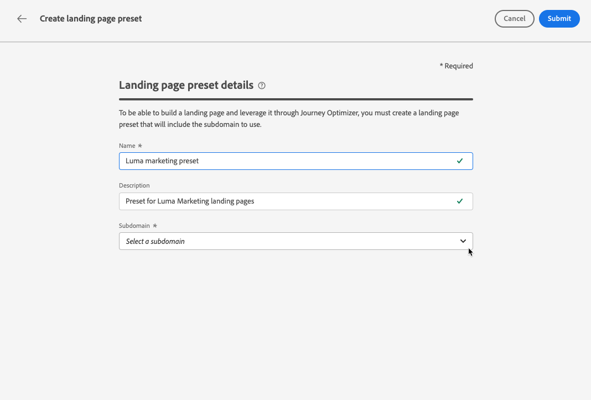

# Voorinstellingen voor openingspagina definiëren {#lp-presets}

>[!CONTEXTUALHELP]
>id="ajo_admin_config_lp_subdomain_header"
>title="Een voorinstelling voor een openingspagina maken"
>abstract="Als u een bestemmingspagina wilt maken en deze via Journey Optimizer wilt gebruiken, moet u een voorinstelling voor een bestemmingspagina maken die het te gebruiken subdomein bevat."

## Aan de slag met voorinstellingen voor openingspagina {#gs-lp-presets}

Wanneer [ creërend een het landen pagina ](../landing-pages/create-lp.md#create-a-lp), moet u een het landen vooraf ingestelde pagina selecteren om de het landen pagina en hefboomwerking het door **[!DNL Journey Optimizer]** te kunnen bouwen. De voorinstelling bevat het subdomein dat moet worden gebruikt voor de bestemmingspagina&#39;s die op deze voorinstelling zijn gebaseerd.

Voordat u een voorinstelling maakt, moet u controleren of u eerder minstens één subdomein van de bestemmingspagina hebt geconfigureerd. [ Leer hoe te om een het landen pagina subdomain ](lp-subdomains.md) tot stand te brengen.

## Voorinstellingen voor openingspagina&#39;s openen {#access-lp-presets}

Volg onderstaande stappen om voorinstellingen voor openingspagina&#39;s te openen:

1. Open het menu **[!UICONTROL Administration]** > **[!UICONTROL Channels]** .

1. Selecteer **[!UICONTROL Landing page settings]** > **[!UICONTROL Landing page presets]** .

   

1. Klik op een vooraf ingesteld label voor toegang tot de details van de voorinstelling voor de openingspagina.

   

## Een voorinstelling voor een openingspagina maken {#lp-create-preset}

Voer de onderstaande stappen uit om een voorinstelling voor een openingspagina te maken:

1. Blader door het menu **[!UICONTROL Administration]** > **[!UICONTROL Channels]** en selecteer vervolgens **[!UICONTROL Landing page settings]** > **[!UICONTROL Landing page presets]** .

1. Selecteer **[!UICONTROL Create landing page preset]**.

   

1. Voer een naam en een beschrijving in voor de voorinstelling.

   Namen moeten beginnen met een letter (A-Z) en mogen alleen alfanumerieke tekens, onderstrepingsteken `_` , punt `.` en afbreekstreepje `-` bevatten.

1. Selecteer een subdomein van een bestemmingspagina in de vervolgkeuzelijst.

   

   >[!NOTE]
   >
   >Om een subdomein te kunnen selecteren, zorg ervoor u eerder minstens één het landen paginasubdomain hebt gevormd. [ leer hoe ](lp-subdomains.md)

   De instellingen die overeenkomen met de geselecteerde subdomeinweergave.

1. U kunt het subdomein van de bestemmingspagina voor **[!UICONTROL Tracking URL]** selecteren door de optie **[!UICONTROL Same as landing page subdomain]** te controleren. [ Leer meer over het volgen ](../email/message-tracking.md)

   

   Als de bestemmingspagina-URL bijvoorbeeld &#39;pages.mail.luma.com&#39; is en de URL voor bijhouden &#39;data.mail.luma.com&#39;, kunt u &#39;pages.mail.luma.com&#39; kiezen die u wilt gebruiken als subdomein voor bijhouden.

   >[!CAUTION]
   >
   >Het geselecteerde landende paginasubdomain wordt gebruikt om **[!UICONTROL Tracking URL]** <!--and **[!UICONTROL Image Delivery URL]** --> te specificeren als dat subdomain gebruikend [ bestaand subdomain ](lp-subdomains.md#lp-use-existing-subdomain) werd gecreeerd.
   >
   >Als subdomain werd gecreeerd gebruikend [ voeg uw eigen domein ](lp-subdomains.md#lp-configure-new-subdomain) optie toe, primaire subdomain (d.w.z., eerste gemachtigde subdomain) in plaats daarvan wordt gebruikt.

1. Klik op **[!UICONTROL Submit]** om het maken van de voorinstelling voor de openingspagina te bevestigen. <!--You can also save the preset as draft and resume its configuration later on.-->

   <!---->

1. Nadat de voorinstelling voor de openingspagina is gemaakt, wordt deze in de lijst weergegeven met de status **[!UICONTROL Active]** . U kunt deze nu gebruiken voor uw bestemmingspagina&#39;s.

U bent nu klaar om landende pagina&#39;s [ in ](../landing-pages/create-lp.md) te creëren.[!DNL Journey Optimizer]
<!--
>[!NOTE]
>
>Learn how to create channel configurations for push notifications and emails in [this section](channel-surfaces.md).-->

**Verwante onderwerpen**:

* [Aan de slag met bestemmingspagina&#39;s](../landing-pages/get-started-lp.md)
* [Een landingspagina maken](../landing-pages/create-lp.md#create-a-lp)
