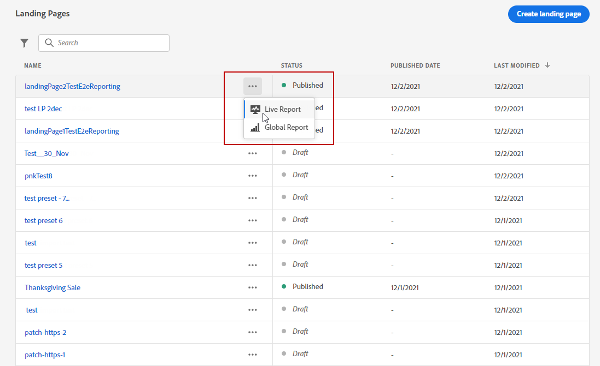

# Rapport van bestemmingspagina {#lp-report}

Het abonnementsrapport bevat informatie over de gevolgen van uw bestemmingspagina&#39;s. Er zijn twee rapporttypen beschikbaar:

* De **[!UICONTROL Live report]** om het succes van uw bestemmingspagina&#39;s in de laatste 24 uren slechts te meten en te visualiseren.

* De **[!UICONTROL Global report]** om het succes van uw bestemmingspagina&#39;s over een geselecteerde tijdspanne te meten en te visualiseren.

Als u uw rapporten wilt openen, selecteert u **Live** of **[!UICONTROL Global report]** in het geavanceerde menu van de geselecteerde bestemmingspagina.

## Live-verslag over de landingspagina {#lp-live}

De **[!UICONTROL Landing page performance]** widget geeft de belangrijkste informatie met betrekking tot uw bericht over de afgelopen 24 uur door KPIs detail:

* **[!UICONTROL Total visits]**: Het totale aantal bezoeken aan uw landingspagina van een reis of andere bronnen, met inbegrip van veelvoudige bezoeken van één ontvanger.

* **[!UICONTROL Conversions]**: Aantal personen dat interactie had met de landingspagina, bijvoorbeeld geabonneerd op een formulier.

* **[!UICONTROL Bounces]**: Aantal personen die niet met de landingspagina in wisselwerking stonden en de actie van het intekenen niet voltooiden.

De **[!UICONTROL Visit sources]** widget geeft aan hoe bezoekers uw landingspagina openen:

* **[!UICONTROL Journey(s)]**: Aantal bezoeken aan uw landingspagina die van een reis komen.

* **[!UICONTROL Other sources]**: Aantal bezoeken aan uw landingspagina die van een externe bron in plaats van een reis komen.

De **[!UICONTROL Top clicked links]** geeft de interactie tussen bezoekers en de landingspagina aan:

* **[!UICONTROL Clicks]**: Aantal keren dat op een inhoud is geklikt op de bestemmingspagina.

De **[!UICONTROL Journey(s)]** widget geeft het aantal bezoeken aan uw landingspagina weer van een reis .

De **[!UICONTROL Other sources]** widget geeft het aantal bezoeken aan uw landingspagina aan vanuit een externe bron in plaats van een reis .

De **[!UICONTROL Visits by messages]** / **[!UICONTROL Conversions by messages]** grafieken geven het totale aantal bezoeken en personen aan die de laatste 24 uur succesvol hebben gereageerd op uw landingspagina, afhankelijk van de verzonden berichten.

De **[!UICONTROL Visits by channels]** / **[!UICONTROL Conversions by channels]** de grafieken geven het totale aantal bezoeken en personen aan die de laatste 24 uur met succes hebben gereageerd op uw landingspagina, afhankelijk van de kanalen.

## Algemeen rapport landingspagina {#lp-global}

De **[!UICONTROL Number of visits]** en **[!UICONTROL Number of visits over time]** Met widgets kunt u de invloed van de landingspagina op de geselecteerde tijdsperiode zien via een grafiek en KPI&#39;s met de volgende meetwaarden:

* **[!UICONTROL Total visits]**: Het totale aantal bezoeken aan uw landingspagina dat afkomstig is van reizen en externe bronnen, inclusief meerdere bezoeken van één ontvanger.

* **[!UICONTROL Unique visitors]**: Aantal personen dat uw landingspagina heeft bezocht, meerdere bezoeken van één ontvanger worden niet in aanmerking genomen.

De **[!UICONTROL Landing page performance]** widget geeft via KPI&#39;s informatie weer over de belangrijkste informatie ten opzichte van uw bericht:

* **[!UICONTROL Conversion rate]**: Aantal personen dat met de aanlandingspagina heeft gecommuniceerd, bv. op een formulier geabonneerd, in verhouding tot het totale aantal bezoeken.

* **[!UICONTROL Bounce rate]**: Aantal personen dat niet met de landingspagina in wisselwerking stond en de actie van het intekenen niet voltooide, in verhouding tot het totale aantal bezoeken.

De **[!UICONTROL Visit sources]** widget geeft aan hoe bezoekers uw landingspagina openen:

* **[!UICONTROL Journey(s)]**: Aantal bezoeken aan uw landingspagina die van een reis komen.

* **[!UICONTROL Other sources]**: Aantal bezoeken aan uw landingspagina die van een externe bron in plaats van een reis komen.

De **[!UICONTROL Top clicked links]** identificeert de interactie van de bezoekers met de levering:

* **[!UICONTROL Clicks]**: Aantal keren dat op een inhoud is geklikt op de bestemmingspagina.

* **[!UICONTROL Click rate]**: Percentage klikken op de bestemmingspagina.

De **[!UICONTROL Journey(s)]** widget geeft het aantal bezoeken aan uw landingspagina weer van een reis :

* **[!UICONTROL Visits]**: Aantal bezoeken aan uw landingspagina, met inbegrip van veelvoudige bezoeken van één ontvanger.

De **[!UICONTROL Other sources]** widget geeft het aantal bezoeken aan uw landingspagina aan vanuit een externe bron in plaats van een reis .

De **[!UICONTROL Visits by messages]** / **[!UICONTROL Conversions by messages]** de grafieken geven het totale aantal bezoeken en personen aan die met succes hebben gereageerd op uw landingspagina voor de betrokken periode, afhankelijk van de verzonden berichten.

De **[!UICONTROL Visits by channels]** / **[!UICONTROL Conversions by channels]** de grafieken geven het totale aantal bezoeken en personen aan die met succes hebben gereageerd op uw landingspagina voor de betrokken periode, afhankelijk van de kanalen.
