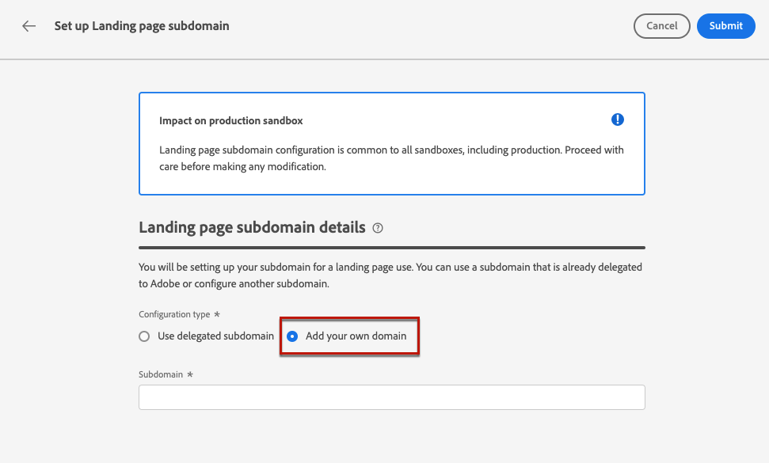

# Subdomeinen van bestemmingspagina configureren {#lp-subdomains}

>[!CONTEXTUALHELP]
>id="ajo_admin_subdomain_lp_header"
>title="Een subdomein van een bestemmingspagina delegeren"
>abstract="U stelt het subdomein in voor een gebruik van een bestemmingspagina. U kunt een subdomein gebruiken dat al aan Adobe is gedelegeerd of een ander subdomein vormen."

>[!CONTEXTUALHELP]
>id="ajo_admin_subdomain_lp"
>title="Een subdomein van een bestemmingspagina delegeren"
>abstract="U moet een subdomein configureren om te gebruiken voor uw bestemmingspagina&#39;s, aangezien u dit subdomein nodig hebt om een voorinstelling voor een bestemmingspagina te maken. U kunt een subdomein gebruiken dat al aan Adobe is gedelegeerd of een nieuw subdomein configureren."
>additional-url="https://experienceleague.adobe.com/docs/journey-optimizer/using/content-management/landing-pages/lp-configuration/lp-presets.html#lp-create-preset" text="Voorinstellingen voor openingspagina&#39;s maken"

>[!CONTEXTUALHELP]
>id="ajo_admin_config_lp_subdomain"
>title="Een voorinstelling voor een openingspagina maken"
>abstract="Als u een voorinstelling voor een bestemmingspagina wilt maken, moet u ervoor zorgen dat u eerder ten minste één subdomein van de bestemmingspagina hebt geconfigureerd om te kiezen uit de lijst met subdomeinnamen."
>additional-url="https://experienceleague.adobe.com/docs/journey-optimizer/using/content-management/landing-pages/lp-configuration/lp-presets.html#lp-create-preset" text="Voorinstellingen voor openingspagina&#39;s maken"

## Aan de slag met het landen van subdomeinen van pagina&#39;s {#gs-lp-subdomains}

Om het landen van pagina te kunnen [&#x200B; tot stand brengen stelt &#x200B;](lp-presets.md) vooraf in, moet u opstelling subdomeinen u voor uw het landen pagina&#39;s zult gebruiken.

U kunt een subdomein gebruiken dat al aan Adobe is gedelegeerd, of u kunt een ander subdomein vormen. Leer meer over het delegeren van subdomeinen aan Adobe in [&#x200B; deze sectie &#x200B;](../configuration/delegate-subdomain.md).

Het landen van pagina subdomain configuratie is **gemeenschappelijk aan alle milieu&#39;s**. Daarom geldt het volgende:

* Als u landende subdomeinen van pagina&#39;s wilt openen en bewerken, moet u over de bevoegdheid **[!UICONTROL Manage Landing Page Subdomains]** beschikken in de productiesandbox.

* Elke wijziging van een subdomein van een bestemmingspagina heeft ook invloed op de productiesandboxen.

## Een bestaand subdomein gebruiken {#lp-use-existing-subdomain}

Als u een subdomein wilt gebruiken dat al is gedelegeerd aan Adobe, voert u de volgende stappen uit:

1. Open het menu **[!UICONTROL Administration]** > **[!UICONTROL Channels]** en selecteer vervolgens **[!UICONTROL Landing page settings]** > **[!UICONTROL Landing page subdomains]** .

1. Klik op **[!UICONTROL Set up subdomain]**.

   

1. Selecteer **[!UICONTROL Use delegated domain]** in de sectie **[!UICONTROL Configuration type]** .

   

1. Voer het voorvoegsel in dat wordt weergegeven in de URL van de bestemmingspagina.

   Alleen alfanumerieke tekens en afbreekstreepjes zijn toegestaan.

   >[!CAUTION]
   >
   >Gebruik `cdn` of `data` voorvoegsels niet omdat deze zijn gereserveerd voor intern gebruik. Andere beperkte of gereserveerde voorvoegsels zoals `dmarc` of `spf` moeten ook worden vermeden.

1. Selecteer een gedelegeerd subdomein in de lijst.

   U kunt geen subdomein selecteren dat al wordt gebruikt als subdomein van de bestemmingspagina.

   <!--Capital letters are not allowed in subdomains. TBC by PM-->

   

   U kunt niet meerdere gedelegeerde subdomeinen van hetzelfde bovenliggende domein gebruiken. Als &#39;marketing1.yourcompany.com&#39; bijvoorbeeld al is gedelegeerd aan Adobe voor uw bestemmingspagina&#39;s, kunt u &#39;marketing2.yourcompany.com&#39; niet gebruiken. Maar subdomeinen met meerdere niveaus die worden ondersteund voor bestemmingspagina&#39;s, kunt u doorgaan met het gebruik van een subdomein van &#39;marketing1.yourcompany.com&#39; (zoals &#39;email.marketing1.yourcompany.com&#39;) of een ander bovenliggende domein.

   >[!CAUTION]
   >
   >Als u een domein selecteert dat aan Adobe gebruikend de [&#x200B; methode van de NAAM &#x200B;](../configuration/delegate-subdomain.md#cname-subdomain-setup) werd afgevaardigd, moet u het DNS verslag op uw het ontvangen platform tot stand brengen. Om het DNS verslag te produceren, is het proces het zelfde als wanneer u een nieuw landend paginasubdomain vormt. Leer hoe in [&#x200B; deze sectie &#x200B;](#lp-configure-new-subdomain).

1. Klik op **[!UICONTROL Submit]**.

1. Na verzending wordt het subdomein in de lijst weergegeven met de status **[!UICONTROL Processing]** . Voor meer op de statussen van subdomeinen, verwijs naar [&#x200B; deze sectie &#x200B;](../configuration/delegate-subdomain.md#access-delegated-subdomains).<!--Same statuses?-->

   

   Alvorens dat subdomain te kunnen gebruiken om berichten te verzenden, moet u wachten tot Adobe de vereiste controles uitvoert, die **tot 4 uren** kan nemen.<!--Learn more in [this section](delegate-subdomain.md#subdomain-validation).-->

1. Zodra de controles succesvol zijn, krijgt subdomain de **[!UICONTROL Success]** status. Deze kan worden gebruikt om voorinstellingen voor openingspagina&#39;s te maken.

## Een nieuw subdomein configureren {#lp-configure-new-subdomain}

>[!CONTEXTUALHELP]
>id="ajo_admin_lp_subdomain_dns"
>title="De overeenkomende DNS-record genereren"
>abstract="Als u een nieuw subdomein van een bestemmingspagina wilt configureren, moet u de Adobe-gegevens van de naamserver kopiëren die in de Journey Optimizer-interface worden weergegeven en deze plakken in uw domeinhostingoplossing om het overeenkomende DNS-record te genereren. Als de controles zijn voltooid, kan het subdomein worden gebruikt om voorinstellingen voor bestemmingspagina&#39;s te maken."

Volg onderstaande stappen om een nieuw subdomein te configureren.

1. Open het menu **[!UICONTROL Administration]** > **[!UICONTROL Channels]** en selecteer vervolgens **[!UICONTROL Landing page settings]** > **[!UICONTROL Landing page subdomains]** .

1. Klik op **[!UICONTROL Set up subdomain]**.

1. Selecteer **[!UICONTROL Add your own domain]** in de sectie **[!UICONTROL Configuration type]** .

   

1. Geef het subdomein op dat u wilt delegeren.

   >[!CAUTION]
   >
   >* U kunt geen bestaand subdomein van een bestemmingspagina gebruiken.
   >
   >* Hoofdletters zijn niet toegestaan in subdomeinen.

   Het delegeren van een ongeldig subdomein naar Adobe is niet toegestaan. Zorg ervoor dat u een geldig subdomein invoert dat eigendom is van uw organisatie, zoals marketing.yourcompany.com.

   Voor bestemmingspagina&#39;s worden subdomeinen met meerdere niveaus ondersteund. U kunt bijvoorbeeld &#39;email.marketing.yourcompany.com&#39; gebruiken.

1. Het verslag dat in uw DNS serververtoningen moet worden geplaatst. Kopieer deze record of download een CSV-bestand en navigeer vervolgens naar de oplossing voor domeinhosting om de overeenkomende DNS-record te genereren.

1. Zorg ervoor dat DNS het verslag in uw domein-ontvangende oplossing is geproduceerd. Als alles correct is geconfigureerd, schakelt u het selectievakje &quot;I confirm...&quot; in en klikt u op **[!UICONTROL Submit]** .

   

   Wanneer u een nieuw het landen paginasubdomain vormt, richt het altijd aan een verslag CNAME.

1. Nadat de subdomeindelegatie is verzonden, wordt het subdomein in de lijst weergegeven met de status **[!UICONTROL Processing]** . Voor meer op de statussen van subdomeinen, verwijs naar [&#x200B; deze sectie &#x200B;](../configuration/delegate-subdomain.md#access-delegated-subdomains).<!--Same statuses?-->

   Alvorens dat subdomain voor uw het landen pagina&#39;s te kunnen gebruiken, moet u wachten tot Adobe de vereiste controles uitvoert, die **tot 4 uren** kan nemen.<!--Learn more in [this section](#subdomain-validation).-->

1. Zodra de controles succesvol zijn, krijgt subdomain de **[!UICONTROL Success]** status. Deze kan worden gebruikt om voorinstellingen voor openingspagina&#39;s te maken.

   Het subdomein wordt gemarkeerd als **[!UICONTROL Failed]** als u geen validatierecord maakt voor de hostoplossing.

## Een subdomein delegeren ongedaan maken {#undelegate-subdomain}

Als u een bestemmingspagina subdomain wenst te delegeren, volg de hieronder stappen.

1. Verwijder in [!DNL Journey Optimizer] de publicatie van alle bestemmingspagina&#39;s die aan het subdomein zijn gekoppeld. [&#x200B; leer hoe &#x200B;](create-lp.md#access-landing-pages)

1. Als subdomein van de landingspagina naar een CNAME-record wijst, kunt u de CNAME DNS-record verwijderen die u voor het subdomein van de bestemmingspagina hebt gemaakt van uw hostingoplossing (maar niet het oorspronkelijke e-mailsubdomein verwijderen als dat er is).

   >[!NOTE]
   >
   >Een het landen pagina subdomain kan aan een CNAME- verslag richten omdat het of een [&#x200B; bestaand subdomain &#x200B;](#lp-use-existing-subdomain) aan Adobe werd gedelegeerd gebruikend de [&#x200B; methode CNAME &#x200B;](../configuration/delegate-subdomain.md#cname-subdomain-setup), of a [&#x200B; nieuw het landen pagina subdomain &#x200B;](#lp-configure-new-subdomain) dat u vormde.

1. Neem contact op met een Adobe-medewerker met het subdomein dat u wilt verwijderen.

Nadat uw verzoek door Adobe wordt behandeld, wordt het niet-gedelegeerde domein niet meer getoond op de pagina van de subdomeininventaris.
