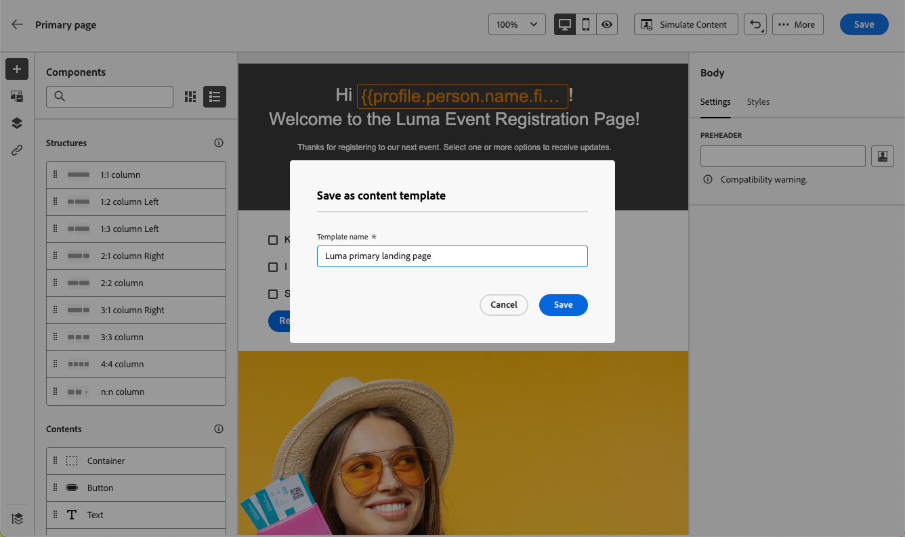

# Werken met sjablonen voor bestemmingspagina&#39;s {#work-with-templates}

## Een pagina opslaan als sjabloon {#save-as-template}

Zodra u uw [ het landen paginainhoud ](lp-content.md) ontwierp, kunt u het voor toekomstig hergebruik bewaren. Volg de onderstaande stappen om dit te doen.

1. Klik op de ellips rechtsboven in het scherm.

1. Selecteer **[!UICONTROL Save as content template]** in de vervolgkeuzelijst.

   

1. Voeg een naam voor deze sjabloon toe.

   

1. Klik op **[!UICONTROL Save]**.

De volgende keer dat u een openingspagina maakt, kunt u deze sjabloon gebruiken om uw inhoud samen te stellen. Leer hoe in de [ sectie ](#use-saved-template) hieronder.

## Een opgeslagen sjabloon gebruiken {#use-saved-template}

1. Open de [ het landen pagina inhoudontwerper ](design-lp.md). De lijst met alle eerder opgeslagen sjablonen wordt weergegeven.

1. U kunt ze **[!UICONTROL By name]** , **[!UICONTROL Last modified]** en **[!UICONTROL Last created]** sorteren.

   

1. Selecteer de gewenste sjabloon in de lijst.

1. Als deze optie is geselecteerd, kunt u met de pijl-rechts en de pijl-links tussen alle opgeslagen sjablonen navigeren.

   

1. Klik op **[!UICONTROL Use this template]**.

1. Bewerk de inhoud naar wens met de ontwerper van de bestemmingspagina.

>[!NOTE]
>
>De primaire paginasjablonen en subpaginasjablonen worden afzonderlijk beheerd. Dit betekent dat u geen sjabloon voor primaire pagina&#39;s kunt gebruiken om een subpagina te maken, en andersom.
