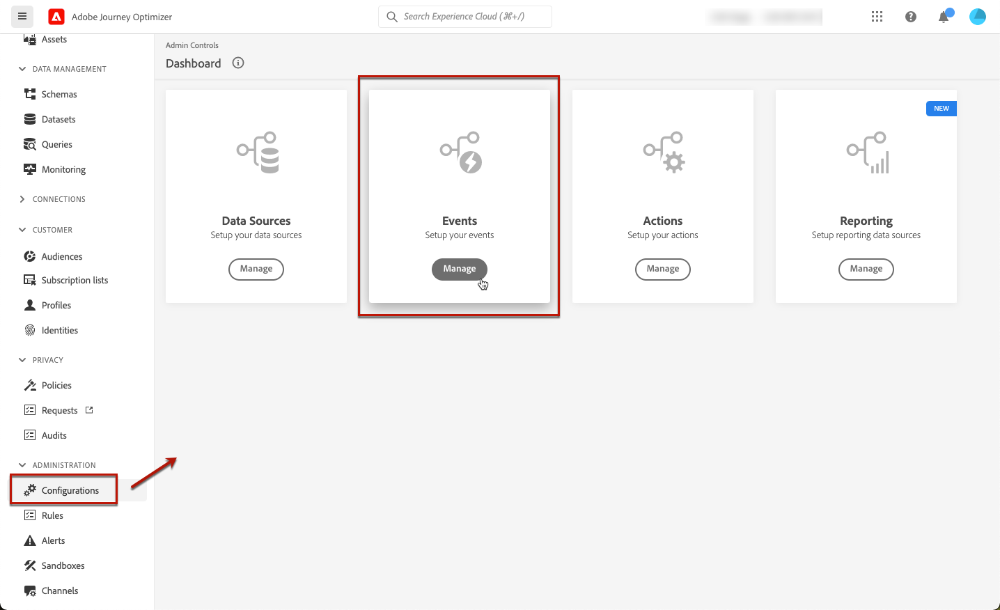
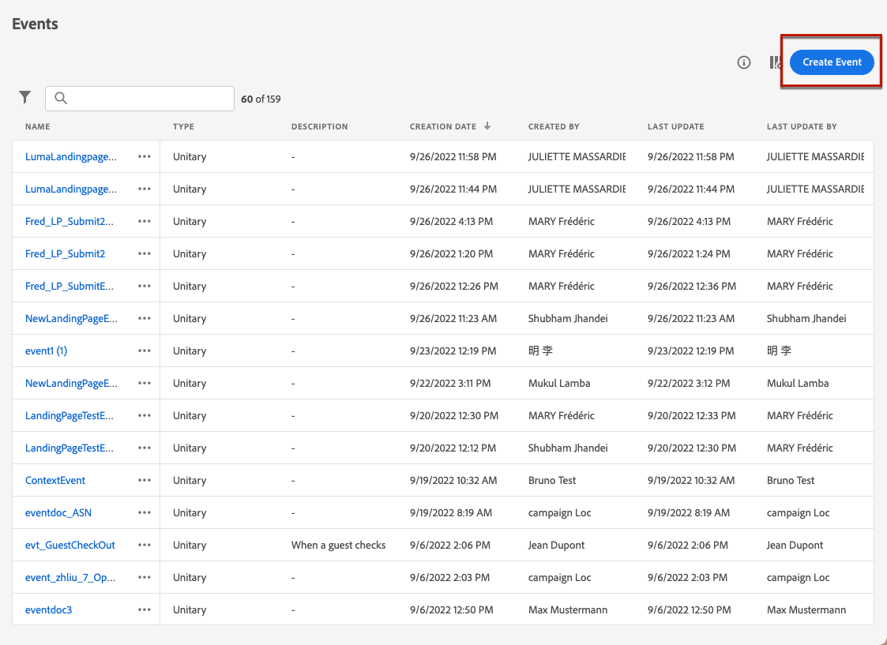

# Gebruiksgevallen van landingspagina {#lp-use-cases}

Hieronder ziet u enkele voorbeelden van het gebruik van [!DNL Journey Optimizer] het landen van pagina&#39;s om uw klanten te hebben binnen of uit van het ontvangen van wat of elk van uw mededelingen kiezen.

## Abonnement op een service {#subscription-to-a-service}

Een van de meest gebruikelijke gebruiksgevallen is het uitnodigen van uw klanten om [abonneren op een service](subscription-list.md) (zoals een nieuwsbrief of een gebeurtenis) door een landingspagina. De belangrijkste stappen worden weergegeven in de onderstaande grafiek:

Stel bijvoorbeeld dat u volgende maand een gebeurtenis organiseert en een registratiecampagne voor een gebeurtenis wilt starten<!--to keep your customers that are interested updated on that event-->. Hiervoor stuurt u een e-mail met een koppeling naar een bestemmingspagina waarmee uw ontvangers zich kunnen registreren voor deze gebeurtenis. De gebruikers die zich registreren, worden toegevoegd aan de abonnementenlijst die u voor dit doel hebt gemaakt.

### Een openingspagina instellen {#set-up-lp}

1. Maak de abonnementenlijst van de gebeurtenisregistratie, waarin de geregistreerde gebruikers worden opgeslagen. Leer hoe u een abonnementenlijst maakt [hier](subscription-list.md#define-subscription-list).

   

1. [Een openingspagina maken](create-lp.md) om uw ontvangers in staat te stellen zich voor uw gebeurtenis te registreren.

   

1. De registratie configureren [primaire landingspagina](create-lp.md#configure-primary-page).

1. Bij het ontwerpen van de [pagina-inhoud plaatsen](design-lp.md), selecteert u de abonnementenlijst die u hebt gemaakt om deze bij te werken met de profielen die het selectievakje voor registratie inschakelen.

   

1. Maak een pagina &#39;Bedankt&#39; die aan de ontvangers wordt weergegeven wanneer ze het registratieformulier verzenden. Leer hoe u landingssubpagina&#39;s kunt configureren [hier](create-lp.md#configure-subpages).

   

1. [Publiceren](create-lp.md#publish) de openingspagina.

1. In een [reis](../building-journeys/journey.md), voegt u een **E-mail** activiteit om verkeer naar de registratie landingspagina te drijven.

   

1. [De e-mail ontwerpen](../messages/get-started-content.md) om aan te geven dat de registratie nu geopend is voor uw gebeurtenis.

1. [Een koppeling invoegen](../design/message-tracking.md#insert-links) in uw berichtinhoud. Selecteren **[!UICONTROL Landing page]** als de **[!UICONTROL Link type]** en kiest u [landingspagina](create-lp.md#configure-primary-page) die u voor registratie hebt gemaakt.

   

   >[!NOTE]
   >
   >Om uw bericht te kunnen verzenden, zorg ervoor de het landen pagina u selecteert nog niet verlopen is. Leer hoe u de vervaldatum kunt bijwerken [in deze sectie](create-lp.md#configure-primary-page).

   Als de ontvangers eenmaal een e-mail hebben ontvangen en op de koppeling naar de bestemmingspagina klikken, worden ze doorgestuurd naar de pagina &#39;Bedankt&#39; en worden ze toegevoegd aan de abonnementenlijst.

### Een bevestigingsbericht verzenden {#send-confirmation-email}

Bovendien kunt u een bevestigingsbericht verzenden naar de ontvangers die zich hebben geregistreerd voor uw gebeurtenis. Hiervoor voert u de volgende stappen uit.

1. Een andere maken [reis](../building-journeys/journey.md). U kunt dit rechtstreeks vanaf de bestemmingspagina doen door op de knop **[!UICONTROL Create journey]** knop. Meer informatie [hier](create-lp.md#configure-primary-page)

   

1. De **[!UICONTROL Events]** categorie en een **[!UICONTROL Segment Qualification]** op uw canvas. Meer informatie [hier](../building-journeys/segment-qualification-events.md)

1. Klik in het dialoogvenster **[!UICONTROL Segment]** en selecteer de abonnementenlijst die u hebt gemaakt.

   

1. Voeg een bevestigingsbericht van uw keuze toe en verzend het door de reis.

   

Alle gebruikers die zich voor uw gebeurtenis hebben geregistreerd, ontvangen het bevestigingsbericht.

<!--The event registration's subscription list tracks the profiles who registered and you can send them targeted event updates.-->

## Afmelden {#opt-out}

Om uw ontvangers in staat te stellen zich af te melden voor uw communicatie, kunt u een koppeling naar een bestemmingspagina opnemen in uw e-mails.

Meer informatie over het beheren van de toestemming van uw ontvangers en waarom dit belangrijk is in [deze sectie](../privacy/opt-out.md).

### Uitschakelen, beheer {#opt-out-management}

Het is een wettelijke vereiste dat ontvangers de mogelijkheid krijgen om zich af te melden voor het ontvangen van communicatie van een merk. Meer informatie over de toepasselijke wetgeving vindt u in het [Documentatie Experience Platform](https://experienceleague.adobe.com/docs/experience-platform/privacy/regulations/overview.html#regulations){target=&quot;_blank&quot;}.

Daarom moet u altijd een **afmelden, koppeling** in elke e-mail die naar ontvangers wordt verzonden:

* Nadat u op deze koppeling hebt geklikt, worden de ontvangers naar een bestemmingspagina geleid, inclusief een knop om te bevestigen dat ze het programma willen afsluiten.
* Als u op de knop Weigeren klikt, worden de profielgegevens bijgewerkt met deze informatie.

### Optie om te weigeren configureren {#configure-opt-out}

Volg onderstaande stappen om de ontvangers van een e-mail in staat te stellen zich af te melden voor uw communicatie via een bestemmingspagina.

1. Maak uw openingspagina. [Meer informatie](create-lp.md)

1. Definieer de primaire pagina. [Meer informatie](create-lp.md#configure-primary-page)

1. [Ontwerp](design-lp.md) de inhoud van de primaire pagina: de landingspagina-specifiek gebruiken **[!UICONTROL Form]** component, een component definiëren **[!UICONTROL Opt-out]** selectievakje en kies voor bijwerken **[!UICONTROL Channel (email)]**: Het profiel dat het vak Weigeren op de bestemmingspagina controleert, wordt uit al uw communicatie verwijderd.

   

   <!--You can also build your own landing page and host it on the third-party system of your choice.-->

1. Een bevestiging toevoegen [subpagina](create-lp.md#configure-subpages) die wordt weergegeven aan de gebruikers die het formulier verzenden.

   

   >[!NOTE]
   >
   >Zorg ervoor dat u naar de subpagina in de primaire pagina&#39;s verwijst **[!UICONTROL Call to action]** van de **[!UICONTROL Form]** component. [Meer informatie](design-lp.md)

1. Zodra u vormde en de inhoud van uw pagina&#39;s bepaalde, [publish](create-lp.md#publish) de openingspagina.

   

1. [Een e-mailbericht maken](../messages/get-started-content.md) tijdens een reis.

1. Selecteer tekst in uw inhoud en [een koppeling invoegen](../design/message-tracking.md#insert-links) gebruiken van de contextafhankelijke werkbalk. U kunt ook een koppeling op een knop gebruiken.

   

1. Selecteren **[!UICONTROL Landing page]** van de **[!UICONTROL Link type]** vervolgkeuzelijst en selecteert u de [landingspagina](create-lp.md#configure-primary-page) die u hebt gemaakt voor het uitschakelen.

   

   >[!NOTE]
   >
   >Om uw bericht te kunnen verzenden, zorg ervoor de het landen pagina u selecteert nog niet verlopen is. Leer hoe u de vervaldatum kunt bijwerken [in deze sectie](create-lp.md#configure-primary-page).

1. Publiceer en voer de reis uit. [Meer informatie](../building-journeys/journey.md).

1. Als een ontvanger op de koppeling voor het opzeggen van het abonnement in de e-mail klikt nadat het bericht is ontvangen, wordt de bestemmingspagina weergegeven.

   

   Indien de ontvanger het vakje aankruist en het formulier verzendt:

   * De ontvanger van het gekozen-uit wordt opnieuw gericht aan het scherm van het bevestigingsbericht.

   * De profielgegevens worden bijgewerkt en zullen geen mededelingen van uw merk tenzij opnieuw geabonneerd ontvangen.

Als u wilt controleren of de keuze van het corresponderende profiel is bijgewerkt, gaat u naar het Experience Platform en opent u het profiel door een naamruimte voor identiteiten en een bijbehorende identiteitswaarde te selecteren. Meer informatie in het dialoogvenster [Documentatie Experience Platform](https://experienceleague.adobe.com/docs/experience-platform/profile/ui/user-guide.html#getting-started){target=&quot;_blank&quot;}.

In de **[!UICONTROL Attributes]** kunt u zien dat de waarde voor **[!UICONTROL choice]** is gewijzigd in **[!UICONTROL no]**.

<!--

### Other ways to opt out

You can also enable your recipients to unsubscribe whithout using landing pages.

* **One-click opt-out**

    You can add a one-click opt-out link into your email content. This will enable your recipients to quickly unsubscribe from your communications, without being redirected to a landing page where they need to confirm opting out. [Learn more](../privacy/opt-out.md#one-click-opt-out-link)

* **Unsubscribe link in header**

    If the recipients' email client supports displaying an unsubscribe link in the email header, emails sent with [!DNL Journey Optimizer] automatically include this link. [Learn more](../privacy/opt-out.md#unsubscribe-header)

////////

## Leverage landing page submission event {#leverage-lp-event}

You can use information that was submitted on a landing page to send communications to your customers. For example, if a user subscribes to a given subscription list, you can leverage that information to send an email recommending other subscription lists to that user.

To do this, you need to create an event containing the landing page submission information and use it in a journey. Follow the steps below.

1. Go to **[!UICONTROL Administration]** > **[!UICONTROL Configurations]**, and in the **[!UICONTROL Events]** section, select **[!UICONTROL Manage]**.

    

1. The list of events displays. Select **[!UICONTROL Create Event]**.

    

1. The event configuration pane opens on the right side of the screen. Configure a rule-based unitary event. [Learn more](../event/about-creating.md)

1. Define the schema: select **[!UICONTROL AJO Email Tracking Experience Event Schema v.1]** (available by default in [!DNL Journey Optimizer]).

    

1. In the **[!UICONTROL Fields]** section, select the following elements:

    * **[!UICONTROL _experience]** > **[!UICONTROL customerJourneyManagement]** > **[!UICONTROL messageInteraction]** > **[!UICONTROL Interaction Type]**
    
    * **[!UICONTROL _experience]** > **[!UICONTROL customerJourneyManagement]** > **[!UICONTROL messageInteraction]** > **[!UICONTROL Landing Page Details]** > **[!UICONTROL Landing Page ID]**

    

1. Click inside the **[!UICONTROL Event ID condition]** field. Using the simple expression editor, define the condition for the **[!UICONTROL Interaction Type]** and **[!UICONTROL Landing Page ID]** fields. This will be used by the system to identify the events that will trigger your journey.

    

    >[!NOTE]
    >
    >To find the landing page ID, you can insert the landing page as a link into an email and select the source code from the contextual toolbar to display the landing page information.
    >
    >

1. Save your changes.

1. Create a [journey](../building-journeys/journey.md). You can do it directly from the landing page by clicking the **[!UICONTROL Create journey]** button. Learn more [here](create-lp.md#configure-primary-page)

    

1. In the journey, unfold the **[!UICONTROL Events]** category and drop the event that you created into the canvas. Learn more [here](../building-journeys/segment-qualification-events.md)

    

1. Unfold the **[!UICONTROL Actions]** category and drop an email action into the canvas.

    

///How do you use the information from the event to send an email to the users? -->
