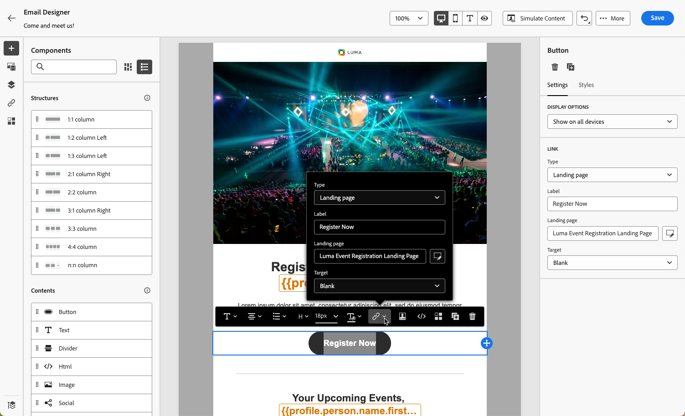
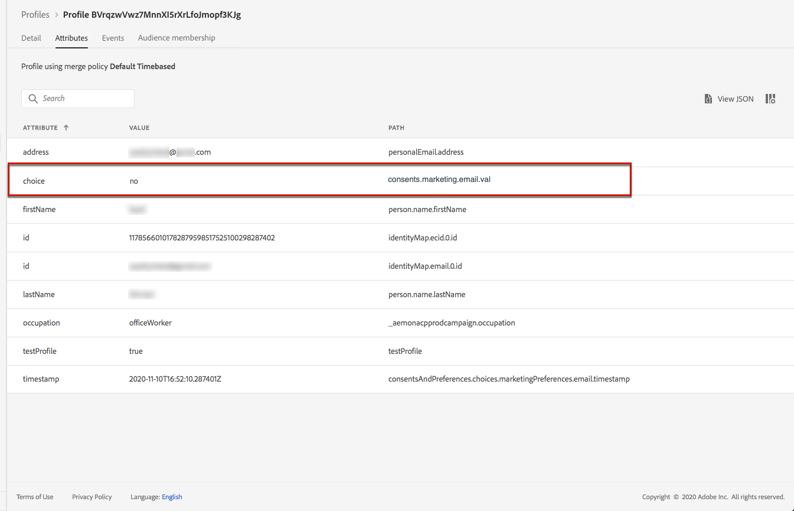
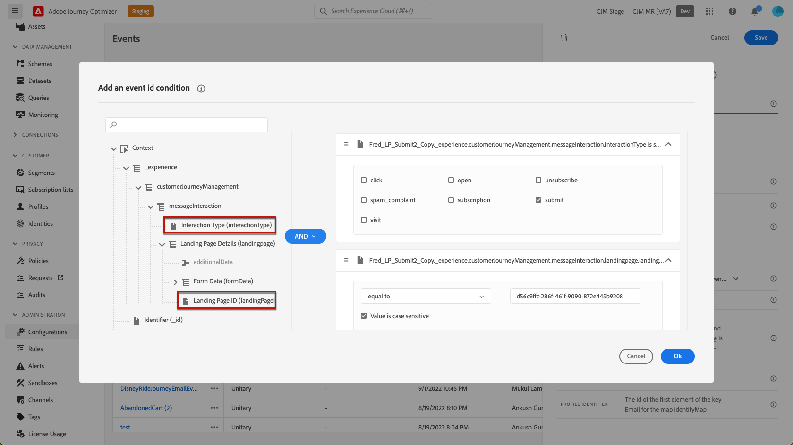

# Gebruiksgevallen van landingspagina {#lp-use-cases}

Hieronder volgen enkele voorbeelden van hoe u [!DNL Journey Optimizer] -bestemmingspagina&#39;s kunt gebruiken om uw klanten de mogelijkheid te geven om enkele of alle communicatie te ontvangen.

## Abonneren op een service {#subscription-to-a-service}

Één van de gemeenschappelijkste gebruiksgevallen bestaat uit het uitnodigen van uw klanten om [&#x200B; aan de dienst &#x200B;](subscription-list.md) (zoals een nieuwsbrief of een gebeurtenis) in te tekenen door een het landen pagina. De belangrijkste stappen worden weergegeven in de onderstaande grafiek:

Bijvoorbeeld, laten wij zeggen u een gebeurtenis organiseert volgende maand en u een campagne van de gebeurtenisregistratie <!--to keep your customers that are interested updated on that event--> wilt lanceren. Hiervoor stuurt u een e-mail met een koppeling naar een bestemmingspagina waarmee uw ontvangers zich kunnen registreren voor deze gebeurtenis. De gebruikers die zich registreren, worden toegevoegd aan de abonnementenlijst die u voor dit doel hebt gemaakt.

### Een openingspagina instellen {#set-up-lp}

Als u een openingspagina wilt instellen voor gebeurtenisregistratie, maakt u een abonnementenlijst, ontwerpt u de openingspagina met een registratieformulier en configureert u de benodigde pagina&#39;s en instellingen. Voer de volgende stappen uit:

1. Maak de abonnementenlijst van de gebeurtenisregistratie, waarin de geregistreerde gebruikers worden opgeslagen. Leer hoe te om een abonnementenlijst [&#x200B; hier &#x200B;](subscription-list.md#define-subscription-list) tot stand te brengen.

   

1. [&#x200B; creeer een het landen pagina &#x200B;](create-lp.md) om uw ontvangers toe te laten om voor uw gebeurtenis te registreren.

   

1. Vorm de registratie [&#x200B; primaire het landen pagina &#x200B;](create-lp.md#configure-primary-page).

1. Wanneer het ontwerpen van [&#x200B; het landen paginacontent &#x200B;](design-lp.md), selecteer de abonnementenlijst die u creeerde om het met de profielen bij te werken die registratiecontrole selecteren.

   

1. Maak een pagina &#39;Bedankt&#39; die aan de ontvangers wordt weergegeven wanneer ze het registratieformulier verzenden. Leer hoe te om het landen subpages [&#x200B; hier &#x200B;](create-lp.md#configure-subpages) te vormen.

   

1. [&#x200B; publiceer &#x200B;](create-lp.md#publish-landing-page) de het landen pagina.

1. In a [&#x200B; reis &#x200B;](../building-journeys/journey.md), voeg een **E-mail** activiteit toe om verkeer aan de registratie het landen pagina te drijven.

   

1. [&#x200B; Ontwerp e-mail &#x200B;](../email/get-started-email-design.md) om aan te kondigen dat de registratie nu voor uw gebeurtenis open is.

1. [&#x200B; Tussenvoegsel een verbinding &#x200B;](../email/message-tracking.md#insert-links) in uw berichtinhoud. Selecteer **[!UICONTROL Landing page]** als **[!UICONTROL Link type]** en kies de [&#x200B; het landen pagina &#x200B;](create-lp.md#configure-primary-page) die u voor registratie creeerde.

   

   >[!NOTE]
   >
   >Om uw bericht te kunnen verzenden, zorg ervoor de het landen pagina u selecteert nog niet verlopen is. Leer hoe te om de vervaldatum [&#x200B; in deze sectie &#x200B;](create-lp.md#configure-primary-page) bij te werken.

   Als de ontvangers eenmaal een e-mail hebben ontvangen en op de koppeling naar de bestemmingspagina klikken, worden ze doorgestuurd naar de pagina &#39;Bedankt&#39; en worden ze toegevoegd aan de abonnementenlijst.

### Een bevestigingsbericht verzenden {#send-confirmation-email}

Bovendien kunt u een bevestigingsbericht verzenden naar de ontvangers die zich hebben geregistreerd voor uw gebeurtenis. Volg de onderstaande stappen om dit te doen.

1. Creeer een andere [&#x200B; reis &#x200B;](../building-journeys/journey.md). U kunt dit rechtstreeks vanaf de openingspagina doen door op de knop **[!UICONTROL Create journey]** te klikken. [Meer informatie](create-lp.md#configure-primary-page)

   

1. Ontvouw de categorie **[!UICONTROL Events]** en zet een **[!UICONTROL Audience Qualification]** -activiteit neer op uw canvas. [Meer informatie](../building-journeys/audience-qualification-events.md)

1. Klik in het veld **[!UICONTROL Audience]** en selecteer de abonnementenlijst die u hebt gemaakt.

   

1. Voeg een bevestigingsbericht van uw keuze toe en verzend het door de reis.

   

Alle gebruikers die zich voor uw gebeurtenis hebben geregistreerd, ontvangen het bevestigingsbericht.

<!--The event registration's subscription list tracks the profiles who registered and you can send them targeted event updates.-->

## Openingspagina voor landen {#opt-out}

Om uw ontvangers in staat te stellen zich af te melden voor uw communicatie, kunt u een koppeling naar een bestemmingspagina opnemen in uw e-mails.

>[!NOTE]
>
>Leer meer over het beheren van de toestemming van uw ontvangers en waarom dit in [&#x200B; deze sectie &#x200B;](../privacy/opt-out.md) belangrijk is.

### Uitschakelen, beheer {#opt-out-management}

Het is een wettelijke vereiste dat ontvangers de mogelijkheid krijgen om zich niet meer te abonneren op het ontvangen van communicatie van een merk. Leer meer over de toepasselijke wetgeving in de [&#x200B; documentatie van Experience Platform &#x200B;](https://experienceleague.adobe.com/docs/experience-platform/privacy/regulations/overview.html#regulations){target="_blank"}.

Daarom moet u altijd een **unsubscribe verbinding** in elke e-mail omvatten die naar ontvangers wordt verzonden:

* Nadat u op deze koppeling hebt geklikt, worden de ontvangers naar een bestemmingspagina geleid, inclusief een knop om te bevestigen dat ze het programma willen afsluiten.
* Als u op de knop Weigeren klikt, worden de profielgegevens bijgewerkt met deze informatie.

### Optie om e-mail te weigeren configureren {#configure-opt-out}

Volg onderstaande stappen om de ontvangers van een e-mail in staat te stellen zich af te melden voor uw communicatie via een bestemmingspagina:

1. Maak uw openingspagina. [Meer informatie](create-lp.md)

1. Definieer de primaire pagina. [Meer informatie](create-lp.md#configure-primary-page)

1. [&#x200B; Ontwerp &#x200B;](design-lp.md) de primaire paginacontent: gebruik de het landen pagina-specifieke **[!UICONTROL Form]** component, bepaal een **[!UICONTROL Opt-out]** checkbox en verkies om **[!UICONTROL Channel (email)]** bij te werken: het profiel dat de opt-out doos op uw het landen pagina controleert zal uit al uw mededelingen worden gekozen.

   

   <!--You can also build your own landing page and host it on the third-party system of your choice.-->

1. Voeg een bevestiging [&#x200B; subpage &#x200B;](create-lp.md#configure-subpages) toe die aan de gebruikers zal worden getoond die de vorm voorleggen.

   

   >[!NOTE]
   >
   >Zorg dat u naar de subpagina verwijst in de sectie **[!UICONTROL Call to action]** van de primaire pagina van de component **[!UICONTROL Form]** . [Meer informatie](design-lp.md)

1. Zodra u vormde en de inhoud van uw pagina&#39;s bepaalde, [&#x200B; publiceer &#x200B;](create-lp.md#publish-landing-page) de het landen pagina.

1. [&#x200B; creeer een e-mailbericht &#x200B;](../email/get-started-email-design.md) in een reis.

1. Selecteer tekst in uw inhoud en [&#x200B; neem een verbinding &#x200B;](../email/message-tracking.md#insert-links) op gebruikend de contextafhankelijke toolbar. U kunt ook een koppeling op een knop gebruiken.

1. Selecteer **[!UICONTROL Landing page]** van de **[!UICONTROL Link type]** drop-down lijst en selecteer de [&#x200B; het landen pagina &#x200B;](create-lp.md#configure-primary-page) die u voor het kiezen uit creeerde.

   

   >[!NOTE]
   >
   >Om uw bericht te kunnen verzenden, zorg ervoor de het landen pagina u selecteert nog niet verlopen is. Leer hoe te om de vervaldatum [&#x200B; in deze sectie &#x200B;](create-lp.md#configure-primary-page) bij te werken.

1. Publiceer en voer de reis uit. [Meer informatie](../building-journeys/journey.md).

1. Als een ontvanger op de koppeling voor het opzeggen van het abonnement in de e-mail klikt nadat het bericht is ontvangen, wordt de bestemmingspagina weergegeven.

   

   Indien de ontvanger het vakje aankruist en het formulier verzendt:

   * De ontvanger van het gekozen-uit wordt opnieuw gericht aan het scherm van het bevestigingsbericht.

   * De profielgegevens worden bijgewerkt en zullen geen mededelingen van uw merk tenzij opnieuw geabonneerd ontvangen.

Als u wilt controleren of de keuze van het corresponderende profiel is bijgewerkt, gaat u naar Experience Platform en opent u het profiel door een naamruimte voor identiteit en een bijbehorende identiteitswaarde te selecteren. Leer meer in de [&#x200B; documentatie van Experience Platform &#x200B;](https://experienceleague.adobe.com/docs/experience-platform/profile/ui/user-guide.html#getting-started){target="_blank"}.

Op het tabblad **[!UICONTROL Attributes]** ziet u dat de waarde voor **[!UICONTROL choice]** is gewijzigd in **[!UICONTROL no]** .

De opt-out informatie wordt opgeslagen in de **Dataset van de Dienst van de Goedkeuring**. [&#x200B; leer meer over datasets &#x200B;](../data/get-started-datasets.md)

>[!NOTE]
>
>Als de fusiemethode voor uw standaard [&#x200B; Adobe Experience Platform &#x200B;](https://experienceleague.adobe.com/docs/experience-platform/profile/home.html?lang=nl){target="_blank"} **[!UICONTROL Profiles]** samenvoegbeleid **[!UICONTROL Dataset Precedence]** is, zorg ervoor om **[!UICONTROL AJO Consent Service Dataset]** toe te laten en aan het in het fusiebeleid voorrang te geven. [Meer informatie](https://experienceleague.adobe.com/docs/experience-platform/profile/merge-policies/ui-guide.html#dataset-precedence-profile){target="_blank"}
>
>Zelfs als er geen batches aan deze gegevensset zijn toegevoegd, zal deze nog steeds de informatie over opt-in/opt-out bevatten.

**zie ook:**

* [Eén klik op Weigeren](../email/email-opt-out.md#one-click-opt-out)
* [Koppeling Weigeren in koptekst van e-mail](../email/email-opt-out.md#unsubscribe-header)

<!--

### Other ways to opt out

You can also enable your recipients to unsubscribe whithout using landing pages.

* **One-click opt-out**

    You can add a one-click opt-out link into your email content. This will enable your recipients to quickly unsubscribe from your communications, without being redirected to a landing page where they need to confirm opting out. [Learn more](../privacy/opt-out.md#opt-out-personalization)

* **Unsubscribe link in header**

    If the recipients' email client supports displaying an unsubscribe link in the email header, emails sent with [!DNL Journey Optimizer] automatically include this link. [Learn more](../email/email-opt-out.md#unsubscribe-header)

////////

## Leverage landing page submission event {#leverage-lp-event}

You can use information that was submitted on a landing page to send communications to your customers. For example, if a user subscribes to a given subscription list, you can leverage that information to send an email recommending other subscription lists to that user.

To do this, you need to create an event containing the landing page submission information and use it in a journey. Follow the steps below.

1. Go to **[!UICONTROL Administration]** > **[!UICONTROL Configurations]**, and in the **[!UICONTROL Events]** section, select **[!UICONTROL Manage]**.

    

1. The list of events displays. Select **[!UICONTROL Create Event]**.

    

1. The event configuration pane opens on the right side of the screen. Configure a rule-based unitary event. [Learn more](../event/about-creating.md)

1. Define the schema: select **[!UICONTROL AJO Email Tracking Experience Event Schema v.1]** (available by default in [!DNL Journey Optimizer]).

    

1. In the **[!UICONTROL Fields]** section, select the following elements:

    * **[!UICONTROL _experience]** > **[!UICONTROL customerJourneyManagement]** > **[!UICONTROL messageInteraction]** > **[!UICONTROL Interaction Type]**
    
    * **[!UICONTROL _experience]** > **[!UICONTROL customerJourneyManagement]** > **[!UICONTROL messageInteraction]** > **[!UICONTROL Landing Page Details]** > **[!UICONTROL Landing Page ID]**

    

1. Click inside the **[!UICONTROL Event ID condition]** field. Using the simple personalization editor, define the condition for the **[!UICONTROL Interaction Type]** and **[!UICONTROL Landing Page ID]** fields. This will be used by the system to identify the events that will trigger your journey.

    

    >[!NOTE]
    >
    >To find the landing page ID, you can insert the landing page as a link into an email and select the source code from the contextual toolbar to display the landing page information.
    >
    >

1. Save your changes.

1. Create a [journey](../building-journeys/journey.md). You can do it directly from the landing page by clicking the **[!UICONTROL Create journey]** button. Learn more [here](create-lp.md#configure-primary-page)

    

1. In the journey, unfold the **[!UICONTROL Events]** category and drop the event that you created into the canvas. Learn more [here](../building-journeys/audience-qualification-events.md)

    

1. Unfold the **[!UICONTROL Actions]** category and drop an email action into the canvas.

    

///How do you use the information from the event to send an email to the users? -->
