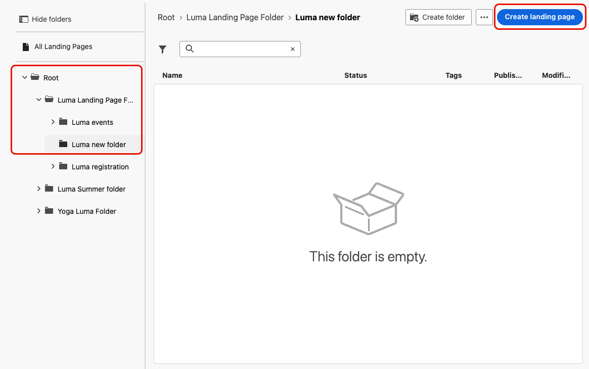

# Uw openingspagina&#39;s beheren {#manage-lp}

## Openingspagina&#39;s openen {#access-landing-pages}

Als u de lijst met openingspagina&#39;s wilt openen, selecteert u **[!UICONTROL Content Management]** > **[!UICONTROL Landing pages]** in het linkermenu.

Alle bestaande bestemmingspagina&#39;s worden getoond.

In het linkerdeelvenster kunt u bestemmingspagina&#39;s in mappen ordenen. Standaard worden alle items weergegeven. Wanneer u een map selecteert, worden alleen de bestemmingspagina&#39;s en mappen weergegeven die in de geselecteerde map zijn opgenomen. [Meer informatie](#folders)

Als u een specifiek item wilt zoeken, typt u een naam in het zoekveld. Wanneer de a [ omslag ](#folders) wordt geselecteerd, is het onderzoek op alle het landen pagina&#39;s of omslagen in het eerste niveau van hiërarchie van die omslag <!--(not nested items)--> van toepassing.

U kunt bestemmingspagina&#39;s filtreren die op hun status, wijzigingsdatum, of markeringen worden gebaseerd.

In deze lijst kunt u op de drie stippen naast een openingspagina klikken en de gewenste actie selecteren:

* Voor [ gepubliceerde ](create-lp.md#publish-landing-page) landende pagina&#39;s, heb toegang tot het [ landende paginarapport ](../reports/lp-report-global-cja.md) en [ laatste 24 uren levend rapport ](../reports/lp-report-live.md).

* **Schrapping** en **unpublish** een het landen pagina. U kunt a [ niet gepubliceerde ](create-lp.md#publish-landing-page) het landen pagina schrappen. Als u het wilt verwijderen, moet u de publicatie eerst ongedaan maken.

  >[!CAUTION]
  >
  >Als u de publicatie van een bestemmingspagina ongedaan maakt waarnaar in een bericht wordt verwezen, wordt de koppeling naar de bestemmingspagina verbroken en krijgen gebruikers een foutpagina als ze ernaar proberen te gaan.

* **dupliceer** om het even welke het landen pagina.

* Bewerk de bijbehorende [ markeringen van een landende pagina ](../start/search-filter-categorize.md#tags).

* Verplaats de openingspagina naar een map. [Meer informatie](#folders)

## Mappen gebruiken om bestemmingspagina&#39;s te beheren {#folders}

>[!CONTEXTUALHELP]
>id="ajo_lp_folders"
>title="Uw openingspagina&#39;s ordenen in mappen"
>abstract="Gebruik mappen om uw bestemmingspagina&#39;s te categoriseren en te beheren op basis van de behoeften van uw organisatie."

Om eenvoudig door uw openingspagina&#39;s te kunnen navigeren, kunt u omslagen gebruiken om hen effectiever in een gestructureerde hiërarchie te organiseren. Hierdoor kunt u de items indelen en beheren op basis van de behoeften van uw organisatie.

1. Klik op de knop **[!UICONTROL All Landing Pages]** om alle items weer te geven die eerder zijn gemaakt zonder de mapgroep.

   

1. Klik op de map **[!UICONTROL Root]** om alle gemaakte mappen weer te geven.

   >[!NOTE]
   >
   >Als u nog geen mappen hebt gemaakt, worden alle bestemmingspagina&#39;s weergegeven.

1. Klik op een willekeurige map in de map **[!UICONTROL Root]** om de inhoud ervan weer te geven.

1. Als u op de map **[!UICONTROL Root]** of een andere map klikt, wordt de knop **[!DNL Create folder]** weergegeven. Selecteer het.

   

1. Typ een naam voor de nieuwe map en klik op **[!UICONTROL Save]** . De nieuwe map wordt weergegeven in de map **[!UICONTROL Root]** of in de map die op dat moment is geselecteerd.

1. U kunt op de knop **[!UICONTROL More actions]** klikken om de map een andere naam te geven of te verwijderen.

   

1. Met de knop **[!UICONTROL More actions]** kunt u ook bestemmingspagina&#39;s naar een andere bestaande map verplaatsen.

1. Nu kunt u naar de map navigeren die u net hebt gemaakt. Elke nieuwe het landen pagina u [ creeert ](create-lp.md#create-landing-page) van hier wordt bewaard in de huidige omslag.

   
