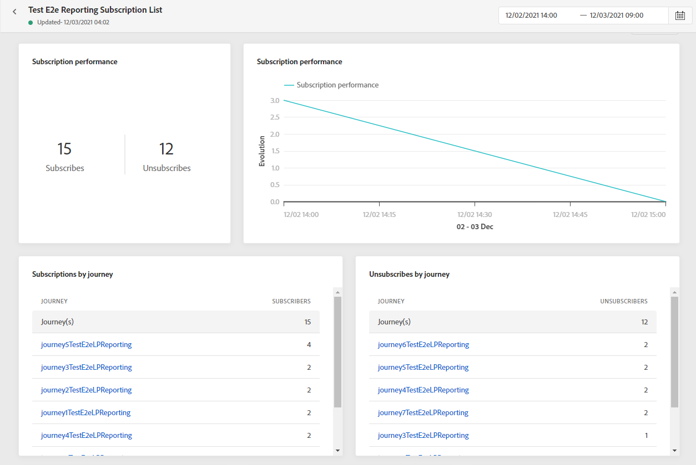

# Abonnementsrapport {#subscription-report}

Het abonnementsrapport bevat details over de activiteiten van uw abonnees. Er zijn twee rapporttypen beschikbaar:

* De **[!UICONTROL Live report]** om de abonnementen en abonnementen van uw leveringen gedurende slechts 24 uur te meten en te visualiseren.

* De **[!UICONTROL Global report]** om de abonnementen en abonnementen van uw leveringen gedurende een bepaalde tijdsperiode te meten en te visualiseren.

Als u uw rapporten wilt openen, selecteert u **Live** of **[!UICONTROL Global report]** in het geavanceerde menu van uw geselecteerde abonnementenlijst.

## Live-rapport voor abonnement {#subscription-live}

De **[!UICONTROL Subscription performance]** KPI&#39;s en de **[!UICONTROL Subscriptions by journey]**/**[!UICONTROL Unsubscribes by journey]** tabellen bevatten de belangrijkste informatie over de betrokkenheid van bezoekers bij uw landingspagina. De tabellen en KPI&#39;s bevatten de beschikbare gegevens met betrekking tot uw bestemmingspagina, zoals:

* **[!UICONTROL Subscribes]**: Totaal aantal abonnementen in de laatste 24 uur.

* **[!UICONTROL Unsubscribes]**: Het totale aantal opnemingen in de laatste 24 uur.

De **[!UICONTROL Subscription performance]** in de grafiek wordt de ontwikkeling van de abonnementen in de afgelopen 24 uur weergegeven .

De **Abonnementen - indeling** en **Abonnement opzeggen - Onderverdeling** de grafieken geven het totale aantal personen aan dat zich in de laatste 24 uur heeft geabonneerd of geabonneerd, afhankelijk van de berichten, de aanlandingspagina&#39;s en de kanalen.

## Globaal rapport voor abonnement {#subscription-global}

De **[!UICONTROL Subscription performance]** KPI&#39;s en de **[!UICONTROL Subscriptions by journey]**/**[!UICONTROL Unsubscribes by journey]** tabellen bevatten de belangrijkste informatie met betrekking tot de betrokkenheid van uw bezoekers bij uw landingspagina. De tabellen en KPI&#39;s bevatten de beschikbare gegevens met betrekking tot uw bestemmingspagina, zoals:

* **[!UICONTROL Subscribes]**: Totaal aantal abonnementen voor de betrokken periode.

* **[!UICONTROL Unsubscribes]**: Het totale aantal aflossingen voor de betrokken periode.

De **[!UICONTROL Subscription performance]** de grafiek geeft de ontwikkeling van de abonnementen voor de betrokken periode weer.

De **Abonnementen - indeling** en **Abonnement opzeggen - Onderverdeling** het totale aantal personen vertegenwoordigen dat zich gedurende de geselecteerde periode heeft geabonneerd of geabonneerd, afhankelijk van de berichten, aanlandingspagina&#39;s en kanalen.

