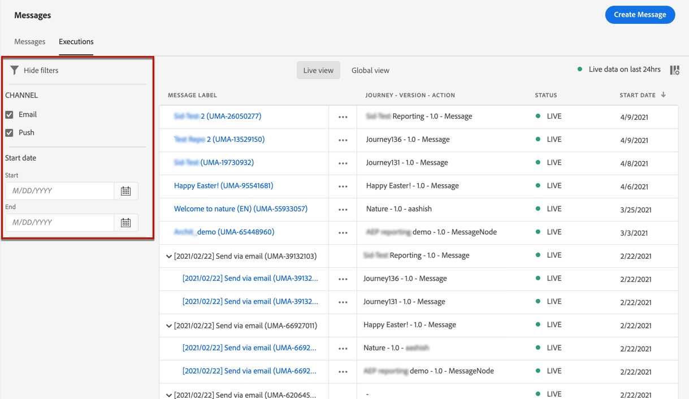

# Berichtcontrole {#monitor-message-execution}

Om ervoor te zorgen dat uw berichten succesvol worden uitgevoerd, verzonden en geleverd, [!DNL Journey Optimizer] biedt mogelijkheden om de berichten te controleren die momenteel worden gepubliceerd en teweeggebracht. U kunt zien hoe uw berichten over reizen uitvoeren <!--and APIs--> in real time vanaf de **[!UICONTROL Executions]** lijst.

Als u toegang wilt krijgen tot deze lijst, klikt u op **[!DNL Journey Optimizer]** homepage, selecteren **[!UICONTROL Messages]** en klik op de knop **[!UICONTROL Executions]** tab.

Dit tabblad bevat twee weergaven: **[!UICONTROL Live view]** en **[!UICONTROL Global view]**.

* De **[!UICONTROL Live view]** tab bevat een **real time overzicht van alle uitgevoerde berichten** geactiveerd door een of meer [reizen](building-journeys/journey.md) **alleen gedurende de laatste 24 uur**.

   

   Deze lijst wordt elke 60 seconden automatisch vernieuwd. Als geen uitvoering in de laatste 24 uren voor een specifiek bericht voorkwam, zullen alle kolommen ongeldige waarden (0) voor dat bericht tonen.

* De **[!UICONTROL Global view]** tab bevat een **overzicht van alle uitgevoerde berichten** geactiveerd door een of meer [reizen](building-journeys/journey.md) **sinds de begindatum van het bericht**.

   

   Deze lijst wordt elke negentig minuten automatisch vernieuwd. De gegevens worden geaggregeerd in de tijd sinds de begindatum van elk bericht.

Als een bericht wordt gepubliceerd maar nog niet door een reis teweeggebracht, het niet vermeld in om het even welke lusjes. Alleen de volgende elementen worden weergegeven:
* Berichten die zijn geactiveerd, maar nog niet zijn gestart (in behandeling).
* Berichten die zijn geactiveerd en die momenteel worden uitgevoerd (bezig).

<!--For multichannel messages, one row per channel is displayed for each message. STILL VALID? looks like NOT-->

>[!NOTE]
>
>Als een bericht in verscheidene reizen is gebruikt, wordt één rij per reis getoond voor elke uitvoering.

<!---->

<!--If a message has been used in several journeys, the **[!UICONTROL Source]** column displays **[!UICONTROL Multiple]**.-->

Standaard worden de berichten vanaf de meest recente uitvoeringsdatum weergegeven. Klik op de knop **[!UICONTROL Filters]** om de berichten te doorzoeken op basis van het kanaal, de begindatum en/of de einddatum.

De <!--**[!UICONTROL Quick action]**-->tweede kolom geeft aan dat de bijbehorende kolom moet worden geopend [message](create-message.md) en de toegang tot [Live rapport](reports/live-report.md) als u zich in **[!UICONTROL Live view]** of de [Algemeen rapport](reports/global-report.md) als u zich in **[!UICONTROL Global view]**.

Voor elke berichtuitvoering wordt een aantal indicatoren weergegeven:

* **[!UICONTROL Message label]**: Berichttitel waarop u hebt gedefinieerd [het bericht maken](create-message.md). De automatisch gegenereerde uitvoerings-id wordt tussen haakjes weergegeven.

   <!--**[!UICONTROL Execution ID]**: Automatically generated identifier.
  **[!UICONTROL Source]**: Name of the journey leveraging that message.-->

* **[!UICONTROL Journey - Version - Action]**: Naam van de reis die het bericht, versie van de reis, en etiket van de actie leveraging het bericht in de reis leveraging.

* **[!UICONTROL Status]**: Status van uitvoering van bericht. <!--List all the possible statuses? For now only Live status? The user cannot stop or cancel the execution. TBC by Fred-->

* **[!UICONTROL Start date]**: Datum en tijdstip waarop het bericht is uitgevoerd vanaf de reis.

* **[!UICONTROL Targeted]**: Aantal doelprofielen voor elke berichtuitvoering.

* **[!UICONTROL Excluded]**: Aantal profielen dat vanwege uitsluitingsregels van het oorspronkelijke doel is uitgesloten.

* **[!UICONTROL Sent]**: Aantal verzonden berichten.

* **[!UICONTROL Delivered]**: Aantal berichten met succes geleverd in de brievenbus van de ontvanger (e-mail) of apparaat (duw) zonder een stuitende of een andere leveringsfout te produceren.

* **[!UICONTROL Bounces]**: Aantal berichten dat niet kan worden geleverd wegens een leveringsmislukking. [Meer informatie over grenzen](suppression-list.md).

* **[!UICONTROL Opens]**: Aantal berichten dat is geopend.

* **[!UICONTROL Clicks]**: Aantal klikken op koppelingen in een e-mailbericht.

   >[!NOTE]
   >
   >Klik bestaat niet voor pushberichten: wanneer een gebruiker op een pushmelding klikt, wordt de app geopend die alleen als een open app kan worden beschouwd.

* **[!UICONTROL Errors]**: Aantal berichten dat niet kan worden verzonden wegens een technische fout.

* **[!UICONTROL Spam complaints]**: Aantal berichten die als spam door ontvangers werden gemerkt. Meer informatie over klachten vindt u in de [Handleiding voor best practices voor levering](https://experienceleague.adobe.com/docs/deliverability-learn/deliverability-best-practice-guide/metrics-for-deliverability/complaints.html#metrics-for-deliverability){target=&quot;_blank&quot;}.

U kunt kiezen welke kolommen in de tabel worden weergegeven. Klik hiertoe op de knop **[!UICONTROL Customize table]** boven op het scherm en selecteer de kolommen die u wilt weergeven.

In **Globale weergave** alleen kunt u kiezen of u de gegevens wilt weergeven als getallen, percentages of beide. Klik op de knop **Gegevensindeling** vervolgkeuzelijst om te schakelen tussen de drie opties.

Als u op elke hyperlink klikt, wordt de bijbehorende overzichtsweergave van het bericht geopend. [Meer informatie over berichten](create-message.md).
