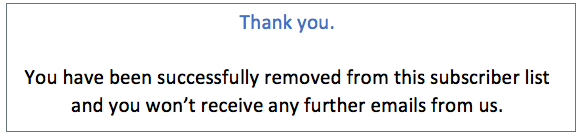

# Weigeren beheren {#consent}

Gebruiken [!DNL Journey Optimizer] om de toestemming van uw ontvangers voor communicatie te volgen en te begrijpen hoe zij met uw merk willen werken door hun voorkeuren en abonnementen te beheren.

Regels zoals de GDPR bepalen dat u aan specifieke vereisten moet voldoen voordat u informatie van de Onderwerpen van Gegevens kunt gebruiken. Bovendien moeten betrokkenen hun toestemming te allen tijde kunnen wijzigen.

**Waarom is het belangrijk?**

* Als u deze voorschriften niet naleeft, brengt u juridische risico&#39;s met zich mee voor uw merk.
* Het helpt u vermijden verzendend ongevraagde mededelingen naar uw ontvangers, die hen zouden kunnen maken uw berichten als spam merken en uw reputatie schaden.

Meer informatie over het beheren van privacy en de toepasselijke regels in het dialoogvenster [Documentatie Experience Platform](https://experienceleague.adobe.com/docs/experience-platform/privacy/home.html){target=&quot;_blank&quot;}.

## Uitschakelen, beheer {#opt-out-management}

Het is een wettelijke vereiste dat ontvangers de mogelijkheid krijgen om zich af te melden voor het ontvangen van communicatie van een merk. Meer informatie over de toepasselijke wetgeving vindt u in het [Documentatie Experience Platform](https://experienceleague.adobe.com/docs/experience-platform/privacy/regulations/overview.html#regulations){target=&quot;_blank&quot;}.

Daarom moet u altijd een **afmelden, koppeling** in elke e-mail die naar ontvangers wordt verzonden:

* Nadat u op deze koppeling hebt geklikt, worden de ontvangers naar een bestemmingspagina geleid, inclusief een knop om te bevestigen dat ze het programma willen afsluiten.
* Nadat u op de knop Weigeren hebt geklikt, wordt een Adobe I/O-aanroep uitgevoerd om de profielgegevens bij te werken met deze gegevens. [Meer informatie hierover](#consent-service-api).

### Koppeling voor annuleren toevoegen {#add-unsubscribe-link}

Voer de onderstaande stappen uit om een koppeling voor afmelden toe te voegen:

1. Bouw uw openingspagina voor abonnementen.

1. De gastheer het op het derdesysteem van uw keus.

1. [Een bericht maken](create-message.md) in [!DNL Journey Optimizer].

1. Selecteer tekst in de inhoud en voeg een koppeling in met behulp van de contextafhankelijke werkbalk.

   

1. Selecteren **[!UICONTROL Unsubscription link]** van de **[!UICONTROL Link type]** vervolgkeuzelijst.

   

1. In de **[!UICONTROL Link]** , plakt u de koppeling naar de bestemmingspagina.

   

1. Klik op **[!UICONTROL Save]**.

1. Sla uw inhoud op en [uw bericht publiceren](publish-manage-message.md).

   >[!NOTE]
   >
   >De URL van de landingspagina van derden bevat drie parameters waarmee de voorkeuren van de profielen via een aanroep van Adobe I/O worden bijgewerkt. &#x200B; [Meer informatie in deze sectie](#consent-service-api).

1. Verzend uw bericht met de verbinding aan uw landende pagina door [reis](../building-journeys/journey.md).

1. Zodra het bericht wordt ontvangen, als de ontvanger de unsubscribe verbinding klikt, wordt uw landende pagina getoond.

   

1. Als de ontvanger op de knop Weigeren klikt op de bestemmingspagina (hier de **Abonnement opzeggen** (knop), worden de profielgegevens bijgewerkt via een [Adobe I/O-oproep](#opt-out-api).

   De ontvanger van de optie-uit wordt dan opnieuw gericht aan een bevestigingsberichtscherm erop wijzend dat het kiezen uit succesvol was.

   

   Dit heeft tot gevolg dat deze gebruiker geen communicatie van uw merk ontvangt, tenzij hij opnieuw een abonnement neemt.

Als u wilt controleren of de keuze van het corresponderende profiel is bijgewerkt, gaat u naar het Experience Platform en opent u het profiel door een naamruimte voor identiteiten en een bijbehorende identiteitswaarde te selecteren. Meer informatie in het dialoogvenster [Documentatie Experience Platform](https://experienceleague.adobe.com/docs/experience-platform/profile/ui/user-guide.html#getting-started){target=&quot;_blank&quot;}.


In de **[!UICONTROL Attributes]** tab, kunt u de waarde zien voor **[!UICONTROL choice]** is gewijzigd in **[!UICONTROL no]**.

### Uitschakelen van API-aanroep {#opt-out-api}

Nadat de ontvanger heeft uitgeschakeld door op de koppeling voor afmelden te klikken, wordt een Adobe I/O API aangeroepen om de voorkeur van het bijbehorende profiel bij te werken.

Deze vraag van de POST van Adobe I/O is als volgt:

Eindpunt: platform.adobe.io/journey/imp/consent/preferences

Parameters query:

* **param**: bevat de gecodeerde lading
* **sig**: handtekening
* **pid**: gecodeerde profiel-id

Deze parameters zijn beschikbaar via de unsubscribe-koppeling die naar de ontvanger is verzonden, bijvoorbeeld de URL waarmee de landingspagina van derden voor een bepaalde ontvanger wordt geopend:


Eisen voor koptekst:

* x-api-key
* x-gw-ims-org-id
* x-sandbox-name
* autorisatie (gebruikerstoken van uw technische account)

Instantie van aanvraag:

```
{
   "marketing": [
       {
            "type": "email",           
            "choice": "no",          
            "scope": "channel"       
        }
    ],
 
}
```

[!DNL Journey Optimizer] gebruikt deze parameters om de keuze van het corresponderende profiel bij te werken.

## Eén klik op Weigeren {#one-click-opt-out}

Omdat veel klanten op zoek zijn naar een eenvoudiger proces om hun abonnement op te zeggen, kunt u ook een link met één muisklik toevoegen aan uw e-mailinhoud. Deze verbinding zal uw ontvangers toelaten om van uw mededelingen snel af te zien, zonder aan een landende pagina worden opnieuw gericht waar zij moeten bevestigen het kiezen uit.

Leer hoe u een koppeling om te weigeren toevoegt aan uw berichtinhoud in [deze sectie](message-tracking.md#one-click-opt-out-link).

Zodra uw bericht door [reis](../building-journeys/journey.md)Als een ontvanger op de koppeling om te weigeren klikt, wordt zijn profiel onmiddellijk uitgeschakeld.

## Koppeling in koptekst opzeggen {#unsubscribe-email}

Als de e-mailclient van de ontvangers ondersteuning biedt voor het weergeven van een niet-geabonneerde koppeling in de e-mailheader, worden e-mails verzonden met [!DNL Journey Optimizer] neemt deze koppeling automatisch op.

De koppeling voor afmelden wordt bijvoorbeeld als volgt weergegeven in Gmail:


Afhankelijk van de e-mailclient heeft het klikken op de koppeling voor het afmelden van abonnementen in de header een van de volgende gevolgen:

* Het corresponderende profiel wordt direct uitgeschakeld en deze keuze wordt in het Experience Platform bijgewerkt. Meer informatie in het dialoogvenster [Documentatie Experience Platform](https://experienceleague.adobe.com/docs/experience-platform/profile/ui/user-guide.html#getting-started){target=&quot;_blank&quot;}.

* Dit heeft hetzelfde effect als klikken op de koppeling Abonnement opzeggen in de e-mailinhoud: de ontvanger wordt omgeleid naar een bestemmingspagina met een knop om te bevestigen dat hij of zij het programma afsluit. Meer informatie over beheer van opt-out in [deze sectie](#opt-out-management).

## Push opt-out-beheer {#push-opt-out-management}

Push-ontvangers kunnen hun abonnement opzeggen via hun apparaten zelf.

Ze kunnen er bijvoorbeeld voor kiezen om meldingen te stoppen wanneer ze worden gedownload of wanneer ze uw app gebruiken. Op dezelfde manier kunnen ze de meldingsinstellingen wijzigen via het mobiele besturingssysteem.
